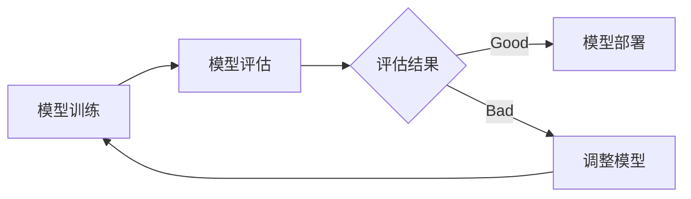

# 模型评估(Model Evaluation)原理与代码实战案例讲解

## 1. 背景介绍
### 1.1 模型评估的重要性
### 1.2 模型评估在机器学习中的作用
### 1.3 模型评估的基本概念

## 2. 核心概念与联系
### 2.1 模型性能指标
#### 2.1.1 准确率(Accuracy)
#### 2.1.2 精确率(Precision)
#### 2.1.3 召回率(Recall)  
#### 2.1.4 F1 Score
#### 2.1.5 ROC曲线与AUC
#### 2.1.6 混淆矩阵(Confusion Matrix)
### 2.2 偏差(Bias)与方差(Variance)
#### 2.2.1 偏差的概念
#### 2.2.2 方差的概念
#### 2.2.3 偏差-方差权衡(Bias-Variance Tradeoff)
### 2.3 过拟合(Overfitting)与欠拟合(Underfitting)
#### 2.3.1 过拟合的概念与危害
#### 2.3.2 欠拟合的概念与危害
#### 2.3.3 如何判断过拟合与欠拟合
### 2.4 交叉验证(Cross Validation) 
#### 2.4.1 交叉验证的概念
#### 2.4.2 K折交叉验证(K-Fold Cross Validation)
#### 2.4.3 留一交叉验证(Leave-One-Out Cross Validation)

## 3. 核心算法原理具体操作步骤
### 3.1 分类模型评估
#### 3.1.1 二分类模型评估步骤
#### 3.1.2 多分类模型评估步骤
### 3.2 回归模型评估  
#### 3.2.1 均方误差(MSE)
#### 3.2.2 均方根误差(RMSE)
#### 3.2.3 平均绝对误差(MAE)
#### 3.2.4 R平方(R-Squared)
### 3.3 聚类模型评估
#### 3.3.1 轮廓系数(Silhouette Coefficient) 
#### 3.3.2 Calinski-Harabasz指数
#### 3.3.3 Davies-Bouldin指数

## 4. 数学模型和公式详细讲解举例说明
### 4.1 分类模型评估指标公式
#### 4.1.1 准确率计算公式与例子
#### 4.1.2 精确率计算公式与例子
#### 4.1.3 召回率计算公式与例子
#### 4.1.4 F1 Score计算公式与例子
### 4.2 ROC曲线与AUC面积计算
#### 4.2.1 ROC曲线的数学原理
#### 4.2.2 AUC面积的计算方法
### 4.3 交叉验证中的数学原理
#### 4.3.1 K折交叉验证的数学推导
#### 4.3.2 留一交叉验证的数学推导

## 5. 项目实践：代码实例和详细解释说明
### 5.1 分类模型评估代码实例
#### 5.1.1 使用sklearn评估分类模型性能
#### 5.1.2 绘制ROC曲线和计算AUC
#### 5.1.3 绘制混淆矩阵
### 5.2 回归模型评估代码实例  
#### 5.2.1 使用sklearn评估回归模型性能
#### 5.2.2 均方误差、均方根误差、平均绝对误差计算
#### 5.2.3 R平方计算
### 5.3 聚类模型评估代码实例
#### 5.3.1 使用sklearn评估聚类模型性能 
#### 5.3.2 轮廓系数计算
#### 5.3.3 Calinski-Harabasz指数和Davies-Bouldin指数计算
### 5.4 交叉验证代码实例
#### 5.4.1 K折交叉验证的代码实现
#### 5.4.2 留一交叉验证的代码实现
#### 5.4.3 嵌套交叉验证的代码实现

## 6. 实际应用场景
### 6.1 模型评估在金融风控中的应用
### 6.2 模型评估在医疗诊断中的应用  
### 6.3 模型评估在推荐系统中的应用
### 6.4 模型评估在自然语言处理中的应用

## 7. 工具和资源推荐
### 7.1 Python机器学习库
#### 7.1.1 Scikit-learn
#### 7.1.2 TensorFlow
#### 7.1.3 PyTorch
### 7.2 模型评估相关工具
#### 7.2.1 Yellowbrick可视化库
#### 7.2.2 PyCM混淆矩阵库
### 7.3 在线学习资源
#### 7.3.1 Coursera机器学习课程
#### 7.3.2 吴恩达深度学习专项课程
#### 7.3.3 Google机器学习速成课程

## 8. 总结：未来发展趋势与挑战
### 8.1 自动机器学习(AutoML)中的模型评估
### 8.2 模型评估与模型可解释性
### 8.3 大数据时代的模型评估挑战
### 8.4 模型评估的研究方向与趋势

## 9. 附录：常见问题与解答
### 9.1 如何选择合适的评估指标？
### 9.2 样本不平衡问题对模型评估的影响？
### 9.3 如何比较不同模型的性能？ 
### 9.4 模型评估中的统计学检验方法有哪些？

模型评估是机器学习和深度学习中一个至关重要的环节。通过合理的评估方法和指标,我们可以客观地衡量模型的性能,发现模型存在的问题,进而不断优化和改进模型。本文将全面深入地探讨模型评估的原理、方法与实践。

首先,我们需要了解模型评估的基本概念和常用指标。对于分类模型,我们通常关注准确率、精确率、召回率、F1 Score等指标,并使用ROC曲线和AUC来评价二分类模型的性能。对于回归模型,我们常用MSE、RMSE、MAE、R平方等指标来衡量预测值与真实值的差异。聚类模型可以用轮廓系数、Calinski-Harabasz指数等来评估聚类效果的好坏。

在理解了这些评估指标的基础上,我们还需要掌握偏差和方差的概念,它们是理解模型泛化能力的关键。高偏差意味着模型过于简单,无法很好地拟合训练数据;高方差意味着模型过于复杂,虽然在训练集上表现良好,但在新数据上泛化能力较差。因此,我们需要权衡偏差和方差,以达到最佳的模型性能。

交叉验证是评估模型泛化能力的重要方法。通过将数据划分为多个互斥的子集,并轮流将其中一个子集作为验证集,其余子集作为训练集,我们可以得到对模型性能较为稳健的估计。K折交叉验证和留一交叉验证是两种常见的交叉验证方法。

在实践中,我们需要根据具体问题选择合适的评估指标和验证方法。以分类模型为例,我们可以使用sklearn提供的模型评估函数,如accuracy_score、precision_score、recall_score等,快速计算各项指标。绘制ROC曲线、混淆矩阵等可视化结果,也有助于我们直观地理解模型的表现。对于回归问题和聚类问题,我们同样可以借助sklearn提供的评估函数和可视化工具进行分析。

模型评估在各个领域都有广泛应用。在金融风控中,我们需要评估模型对违约客户的识别能力;在医疗诊断中,我们要评估模型对疾病的判别准确性;在推荐系统中,我们要度量模型的预测准确性和覆盖率;在自然语言处理中,我们要评价模型对文本分类、情感分析、机器翻译等任务的效果。

除了使用成熟的机器学习库外,我们还可以利用一些专门的评估工具,如用于可视化模型性能的Yellowbrick,用于分析混淆矩阵的PyCM等。在理论学习方面,Coursera、吴恩达深度学习专项、Google机器学习速成课程等都是很好的在线资源。

展望未来,自动机器学习(AutoML)有望进一步简化模型评估的流程,自动搜索最优的评估方案。同时,我们还需要兼顾模型的可解释性,用户不仅关心模型的性能,也关心模型的决策逻辑是否合理、可信。如何在大数据场景下高效评估模型性能,也是一大挑战。此外,模型评估本身的理论基础和方法仍有待进一步完善。

总之,模型评估贯穿机器学习的始终,是一个值得深入研究和不断实践的课题。通过系统地学习模型评估的原理和技术,我们可以建立对模型更全面、更客观的认识,从而设计出性能更优、更可靠的机器学习系统,造福各行各业。

作者：禅与计算机程序设计艺术 / Zen and the Art of Computer Programming