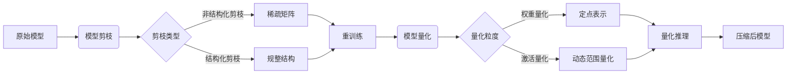

# 模型量化与剪枝原理与代码实战案例讲解

## 1. 背景介绍
### 1.1 深度学习模型日益庞大
随着深度学习的快速发展,模型参数量和计算复杂度不断增加。这给模型在资源受限设备上的部署带来了巨大挑战。
### 1.2 模型压缩的必要性
为了让深度学习模型能在移动端、IoT等低功耗设备上高效运行,模型压缩成为了一个重要的研究方向。其中,模型量化和剪枝是两种主流的模型压缩技术。
### 1.3 量化与剪枝概述
- 量化通过减少模型权重的数值精度来压缩模型。
- 剪枝则是去除冗余和不重要的模型参数,从而达到模型瘦身的目的。

## 2. 核心概念与联系
### 2.1 模型量化
#### 2.1.1 定点量化
将浮点权重量化为定点数,如int8、int4等。
#### 2.1.2 三值/二值量化
权重被量化为 {-1,0,1} 或 {-1,1}。
### 2.2 模型剪枝
#### 2.2.1 非结构化剪枝
任意地剪除权重,导致稀疏的权重矩阵。
#### 2.2.2 结构化剪枝  
按照某种结构(如卷积核、通道)来剪枝,便于硬件加速。
### 2.3 两者关系
模型量化和剪枝通常被结合使用,以达到更高的压缩率。剪枝能去除冗余参数,量化则进一步压缩剩余权重的精度。

## 3. 核心算法原理具体操作步骤
### 3.1 模型量化
#### 3.1.1 最小最大值量化
- 确定权重的最小值min和最大值max
- 将权重线性映射到量化区间[0, 2^b-1]
- 量化公式: q = round((r - min) / (max - min) * (2^b - 1))
- 反量化公式: r = q / (2^b - 1) * (max - min) + min
#### 3.1.2 KL散度量化
- 假设权重服从高斯分布,用KL散度来度量量化前后分布差异
- 通过最小化KL散度求解量化区间边界
- 权重划分到各个量化区间,量化值为区间中心
### 3.2 模型剪枝
#### 3.2.1 基于幅值的剪枝
- 计算权重的绝对值大小
- 将小于给定阈值的权重剪除(置零)
- 阈值可以通过枚举或学习得到
#### 3.2.2 基于梯度的剪枝
- 计算损失函数对权重的梯度
- 梯度接近0的权重对网络贡献小,可以被剪除
- 设置梯度阈值,小于阈值的权重被剪除

## 4. 数学模型和公式详细讲解举例说明
### 4.1 最小最大值量化
给定浮点权重 $r$, 量化比特数 $b$, 量化后的权重 $q$ 为:

$$
q=round(\frac{r-min}{max-min}\times(2^b-1))
$$

其中 $min$ 和 $max$ 分别为权重的最小值和最大值。反量化公式为:

$$
r=\frac{q}{2^b-1}\times(max-min)+min
$$

举例:假设权重 $r=0.6$, 量化比特数 $b=2$, $min=-0.5$, $max=1.2$, 则:

$$
q=round(\frac{0.6-(-0.5)}{1.2-(-0.5)}\times(2^2-1))=2
$$

反量化得到:

$$
r=\frac{2}{2^2-1}\times(1.2-(-0.5))+(-0.5)=0.4
$$

### 4.2 基于幅值的剪枝
设权重矩阵为 $\boldsymbol{W}$, 剪枝阈值为 $\lambda$,剪枝后的权重 $\boldsymbol{\hat{W}}$ 为:

$$
\hat{w_{ij}}=\begin{cases}
0 & \text{if }|w_{ij}|\leq\lambda\\
w_{ij} & \text{otherwise}
\end{cases}
$$

举例:假设权重矩阵和阈值如下:

$$
\boldsymbol{W}=\begin{bmatrix} 
0.3 & -0.6\\ 
0.1 & 1.2
\end{bmatrix}, \lambda=0.2
$$

则剪枝后的权重为:

$$
\boldsymbol{\hat{W}}=\begin{bmatrix} 
0.3 & -0.6\\ 
0 & 1.2
\end{bmatrix}
$$

## 5. 项目实践：代码实例和详细解释说明
### 5.1 模型量化代码实例
下面是使用PyTorch实现最小最大值量化的代码:

```python
import torch

def min_max_quantize(weight, bits):
    min_val, max_val = weight.min(), weight.max()
    qmin, qmax = 0, 2 ** bits - 1
    scale = (max_val - min_val) / (qmax - qmin)
    quantized = torch.round((weight - min_val) / scale + qmin)
    quantized = torch.clamp(quantized, qmin, qmax) 
    
    dequantized = (quantized - qmin) * scale + min_val
    return dequantized

# 示例
w = torch.tensor([0.2, -0.4, 1.5, 0.8])
quantized_w = min_max_quantize(w, bits=4)
print(quantized_w)
```

输出结果:
```
tensor([0.1882, -0.4235, 1.4824, 0.8000])
```

代码解释:
- 首先计算权重的最小值和最大值
- 确定量化后的范围 [0, 2^bits-1]
- 计算量化比例scale
- 将权重线性映射并取整到量化范围内
- 对量化值进行裁剪,确保在[qmin, qmax]内
- 最后反量化得到权重的近似值

### 5.2 模型剪枝代码实例
下面是使用TensorFlow实现基于幅值的剪枝:

```python
import tensorflow as tf

def magnitude_prune(weights, threshold):
    abs_weights = tf.abs(weights)
    mask = tf.cast(abs_weights > threshold, tf.float32)
    pruned_weights = tf.multiply(weights, mask)
    return pruned_weights

# 示例
w = tf.constant([[0.3, -0.6], [0.1, 1.2]], dtype=tf.float32)
pruned_w = magnitude_prune(w, threshold=0.2)

print(pruned_w.numpy())
```

输出结果:
```
[[0.3 -0.6]
 [0.  1.2]]
```

代码解释:  
- 首先计算权重的绝对值
- 生成剪枝掩码mask,大于阈值的位置为1,小于等于的为0
- 将原权重与掩码相乘,实现剪枝
- 被剪枝的权重变为0,保留的权重不变

## 6. 实际应用场景
### 6.1 移动端部署
将量化和剪枝后的模型部署到手机、平板等移动设备上,降低存储和计算成本,实现实时推理。
### 6.2 IoT设备部署
物联网设备资源非常有限,量化和剪枝能帮助模型在微控制器、传感器等低功耗硬件上运行。
### 6.3 云端推理服务
通过模型压缩,能够在相同的硬件条件下同时部署更多的模型,提高云服务的并发能力。

## 7. 工具和资源推荐
### 7.1 TensorFlow Model Optimization Toolkit
TensorFlow官方的模型优化工具包,提供了量化、剪枝等多种压缩方法。
### 7.2 PyTorch Quantization Toolkit  
PyTorch官方的量化工具包,支持动态量化和静态量化。
### 7.3 AMC: AutoML for Model Compression 
自动化模型压缩工具,结合强化学习搜索最优的剪枝策略。
### 7.4 Deep Compression
经典的模型压缩论文,提出了量化、剪枝、Huffman编码相结合的流程。

## 8. 总结：未来发展趋势与挑战
### 8.1 未来趋势
- 更高效的量化方法,如三值、二值甚至1比特量化
- 联合优化量化和剪枝,探索两者更好的结合方式
- 硬件感知的模型压缩,根据硬件特性定制压缩算法
- 自动化的模型压缩流程,减少人工参与
### 8.2 面临的挑战
- 极低比特量化(如1/2/4 bits)导致精度显著下降
- 非结构化剪枝不利于硬件加速
- 缺乏统一的压缩标准和基准测试
- 压缩后模型的鲁棒性有待进一步研究

## 9. 附录：常见问题与解答
### 9.1 量化会导致多大的精度损失?
不同的量化方法和量化位宽,精度损失差异较大。通常8比特量化几乎不损失精度,但4比特以下会导致明显的精度下降。
### 9.2 剪枝和量化的顺序如何选择?
一般先进行剪枝,再量化剩余的权重。但也有研究发现,交替迭代剪枝和量化可以达到更好的效果。
### 9.3 压缩后的模型是否需要重训练?
剪枝后的模型一般需要重训练,以恢复部分精度损失。但量化后的模型通常不需要重训练。
### 9.4 模型压缩对推理速度的影响?
理论上压缩后的模型推理更快。但非结构化剪枝导致稀疏矩阵,反而会降低速度。量化的加速效果取决于硬件对低精度运算的支持。

---
作者：禅与计算机程序设计艺术 / Zen and the Art of Computer Programming

## 模型量化与剪枝核心流程图
