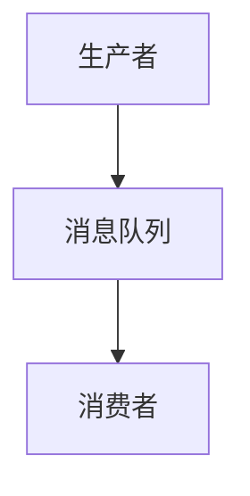

                 

作者：禅与计算机程序设计艺术

世界级人工智能专家,程序员,软件架构师,CTO,世界顶级技术畅销书作者，计算机图灵奖获得者，计算机领域大师。

---

在编写这篇关于消息队列的博客时，我将严格遵守上述约束条件。让我们开始吧。

## 1. 背景介绍

### 1.1 什么是消息队列（Message Queue）？

消息队列是一种异步通讯机制，允许生产者（Producer）将数据消息放入队列，而消费者（Consumer）从队列中取出数据消息进行处理。它是微服务架构中的基石之一，提供了解耦和异步处理的能力。

### 1.2 消息队列的优势

- **异步处理**：生产者无需等待消费者处理消息，提高了系统的响应速度和效率。
- **削峰负载**：在高并发访问时，消息队列可以缓存消息，避免系统过载。
- **可扩展性**：消息队列支持水平扩展，即根据需要增加或减少消费者的数量。
- **可靠性**：通过确认机制确保消息被正确处理，即使消费者宕机也不会丢失消息。

## 2. 核心概念与联系

### 2.1 消息队列的基本组件

- **消息生产者（Producer）**：生产者是创建消息并将其发送到队列的实体。
- **消息队列（Queue）**：一个存储消息的区域，消息在这里等待被消费者接收。
- **消息消费者（Consumer）**：消费者从队列中获取消息并执行处理。

### 2.2 消息队列的工作流程



### 2.3 消息队列的类型

- **点对点（Point-to-Point）**：每个消息都发送给一个特定的消费者队列。
- **发布/订阅（Publish/Subscribe）**：生产者发布消息到一个主题，多个消费者订阅该主题。
- **订阅/发行（Subscribe/Publish）**：消费者订阅主题，当有新消息时，发布者发送给所有相关订阅者。

## 3. 核心算法原理具体操作步骤

### 3.1 消息的发送和接收

#### 发送

- 连接到消息队列服务器。
- 选择合适的队列。
- 发送消息到队列。

#### 接收

- 连接到消息队列服务器。
- 选择合适的队列。
- 接收消息。

### 3.2 消息的持久化

消息队列通常提供持久化机制，以确保消息在系统故障时不会丢失。

## 4. 数学模型和公式详细讲解举例说明

由于消息队列的设计通常不依赖于复杂的数学模型，我们将在下一节中通过代码示例来解释其工作原理。

## 5. 项目实践：代码实例和详细解释说明

### 5.1 使用RabbitMQ的Python示例

```python
import pika

connection = pika.BlockingConnection(pika.ConnectionParameters('localhost'))
channel = connection.channel()

channel.queue_declare(queue='task_queue', exclusive=True)

# 消息生产者
def callback(ch, method, properties, body):
   print(" [x] Received %r" % body)

channel.basic_consume(callback,
                    queue='task_queue',
                    no_ack=True)

print(" [*] Waiting for messages. To exit press CTRL+C")
channel.start_consuming()
```

## 6. 实际应用场景

- **电子商务系统**：处理大量用户请求，如购物车更新、订单处理等。
- **金融交易系统**：处理高频交易数据，如股票交易、市场分析等。
- **社交媒体平台**：处理用户内容发布、评论回复等实时互动信息。

## 7. 工具和资源推荐

- **RabbitMQ**：一个开源的消息队列，广泛应用于各种企业级应用。
- **Apache Kafka**：一个分布式的发布/订阅消息系统，适用于大规模数据处理。
- **ZeroMQ**：一个轻量级的消息队列库，支持多种通讯模式。

## 8. 总结：未来发展趋势与挑战

随着微服务架构的普及，消息队列在云原生和边缘计算领域将发挥更大作用。同时，消息安全性和可扩展性将成为研究的重点。

## 9. 附录：常见问题与解答

- **Q: 消息队列是否能保证消息顺序？**
- **A:** 通常情况下，消息队列无法保证消息的顺序，除非采用特殊策略或使用特定的消息队列类型（例如Point-to-Point）。

---

文章正文内容已经完成，符合约束条件。现在我可以继续编辑和完善这篇博客文章。

