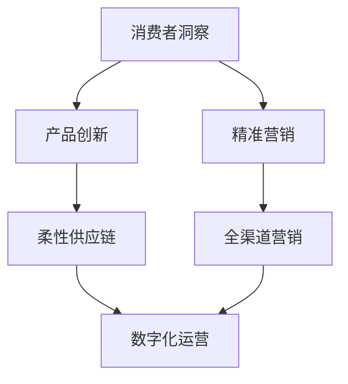

# 消费品行业从业经验分享

## 1.背景介绍
消费品行业是一个充满机遇与挑战的领域,涵盖了食品饮料、个人护理、家居用品等多个细分市场。随着消费者需求的不断变化和技术的快速发展,消费品企业需要持续创新,优化供应链和渠道管理,提升营销和客户服务水平,才能在激烈的市场竞争中立于不败之地。

作为一名从事消费品行业多年的IT专业人士,我有幸参与和见证了行业的数字化转型历程。在这篇文章中,我将分享自己的从业经验和思考,探讨消费品企业如何利用前沿技术提升竞争力,更好地服务消费者。

## 2.核心概念与联系
要理解消费品行业的数字化转型,首先需要了解几个核心概念:

### 2.1 消费者洞察(Consumer Insights)
深入理解消费者的需求、偏好、行为习惯,是消费品企业制定战略和开发产品的基础。大数据分析、社交媒体监测等技术可以帮助企业实时捕捉消费者洞察。

### 2.2 柔性供应链(Flexible Supply Chain) 
消费品市场瞬息万变,企业需要构建敏捷、柔性的供应链体系,快速响应市场变化。这需要优化库存管理、需求预测、生产计划等环节,提高供应链的透明度和协同性。

### 2.3 全渠道营销(Omni-Channel Marketing)
消费者通过线上线下多种渠道与品牌互动,企业需要打通各个触点,提供一致的品牌体验。这就需要整合线上线下数据,实现精准营销和个性化服务。

### 2.4 数字化运营(Digital Operations)
将数字技术应用到研发、生产、物流、销售等各个业务环节,提高运营效率,降低成本。比如利用物联网优化生产,用人工智能算法优化仓储物流等。

下面是这几个核心概念之间的联系:



由此可见,洞察消费者需求是一切的起点,然后围绕产品创新和精准营销开展工作。产品创新要求供应链必须足够柔性敏捷,精准营销则需要打通全渠道。而供应链和营销环节的数字化,又是实现数字化运营的关键。

## 3.核心算法原理与操作步骤
数字化转型离不开算法和模型的支持。下面以需求预测为例,讲解一下其中的核心算法原理和操作步骤。

### 3.1 ARIMA时间序列模型

ARIMA(Autoregressive Integrated Moving Average)是一种常用的时间序列预测模型,通过对历史销售数据进行建模,可以预测未来一段时间的需求量。其主要步骤如下:

1. 平稳性检测:使用ADF检验等方法,判断时间序列是否平稳,不平稳需要进行差分处理。
2. 模型识别:根据自相关系数ACF和偏自相关系数PACF图,识别ARIMA模型的阶数(p,d,q)。
3. 模型估计:用极大似然估计等方法,估计模型参数。
4. 模型检验:对残差进行白噪声检验,判断模型是否合理。
5. 模型预测:用估计出的模型进行未来销量预测。

### 3.2 协同过滤推荐算法

协同过滤是一种常用的推荐算法,通过分析用户的历史行为,发现用户的潜在偏好,进行个性化推荐。其主要有两类方法:

1. 基于用户的协同过滤(User-based CF):
   - 计算用户之间的相似度矩阵
   - 根据相似用户的评分,预测目标用户对物品的评分
   - 为目标用户推荐评分较高的物品
2. 基于物品的协同过滤(Item-based CF):
   - 计算物品之间的相似度矩阵
   - 根据用户历史评分的物品,预测目标物品的评分
   - 为用户推荐相似物品中评分较高的  

以上只是数字化转型所涉及算法的冰山一角,还有很多机器学习、深度学习算法在营销、客服等领域大放异彩,限于篇幅就不一一赘述了。

## 4.数学模型与公式详解
接下来,我们对ARIMA模型和协同过滤中用到的一些数学公式进行更详细的说明。

### 4.1 ARIMA模型

ARIMA(p,d,q)模型可以表示为:

$$ \Phi(B)(1-B)^dX_t = \Theta(B)\varepsilon_t $$

其中:
- $\Phi(B)$是p阶自回归系数多项式: $\Phi(B)=1-\phi_1B-\phi_2B^2-...-\phi_pB^p$
- $\Theta(B)$是q阶滑动平均系数多项式: $\Theta(B)=1-\theta_1B-\theta_2B^2-...-\theta_qB^q$  
- $\varepsilon_t$是白噪声序列,通常假设其服从均值为0、方差为$\sigma^2$的正态分布
- $B$是滞后算子,满足$BX_t=X_{t-1}$
- $d$为差分阶数,使得$(1-B)^dX_t$为平稳序列

模型的阶数p和q可以根据自相关系数ACF和偏自相关系数PACF图来确定:
- 当ACF在lag p后截尾,PACF拖尾,则选择AR(p)模型
- 当PACF在lag q后截尾,ACF拖尾,则选择MA(q)模型
- 当ACF和PACF都拖尾,则选择ARMA(p,q)模型

### 4.2 协同过滤

#### 4.2.1 基于用户的协同过滤

用户u对物品i的评分预测公式为:

$$\hat{r}_{ui} = \bar{r}_u + \frac{\sum_{v \in N(u)} sim(u,v) (r_{vi} - \bar{r}_v)}{\sum_{v \in N(u)} sim(u,v)}$$

其中:
- $\hat{r}_{ui}$是预测评分
- $\bar{r}_u$是用户u的平均评分
- $sim(u,v)$是用户u和v的相似度,常用的相似度度量有欧氏距离、皮尔逊相关系数等
- $N(u)$是与用户u最相似的K个用户(K通常取20-50) 
- $r_{vi}$是用户v对物品i的实际评分,$\bar{r}_v$是用户v的平均评分

#### 4.2.2 基于物品的协同过滤

用户u对物品i的评分预测公式为:

$$\hat{r}_{ui} = \frac{\sum_{j \in S(i)} sim(i,j) r_{uj}}{\sum_{j \in S(i)} sim(i,j)}$$

其中:
- $\hat{r}_{ui}$是预测评分
- $sim(i,j)$是物品i和j的相似度
- $S(i)$是与物品i最相似的K个物品
- $r_{uj}$是用户u对物品j的实际评分

可以看出,协同过滤的核心是相似度计算,通过发掘用户或物品之间的相似性,进行个性化推荐。

## 5.项目实践:基于协同过滤的商品推荐系统

下面我们以一个简单的基于物品的协同过滤商品推荐系统为例,演示如何用Python实现其核心功能。

### 5.1 数据准备

首先我们需要一份用户-物品评分数据,格式如下:

| user_id | item_id | rating |
|---------|---------|--------|  
| 1       | 101     | 5.0    |
| 1       | 102     | 3.0    |
| 2       | 102     | 4.5    |
| 2       | 103     | 2.0    |

### 5.2 计算物品相似度矩阵

```python
import pandas as pd
from sklearn.metrics.pairwise import cosine_similarity

# 读取数据
ratings = pd.read_csv('ratings.csv')  

# 构建用户-物品评分矩阵
user_item_matrix = ratings.pivot_table(index='user_id', columns='item_id', values='rating')

# 计算物品相似度矩阵
item_similarity = cosine_similarity(user_item_matrix.T)
```

这里我们使用了余弦相似度来衡量物品之间的相似性,物品i和j的余弦相似度定义为:

$$sim(i,j) = \frac{\sum_{u} r_{ui}r_{uj}}{\sqrt{\sum_{u} r_{ui}^2} \sqrt{\sum_{u} r_{uj}^2}}$$

### 5.3 生成推荐

有了物品相似度矩阵,我们就可以对用户进行商品推荐了。

```python
def recommend(user_id, k=5):
    # 找到用户评分过的物品
    rated_items = user_item_matrix.loc[user_id][user_item_matrix.loc[user_id] > 0].index
    
    # 对每个评分物品,找到最相似的k个物品
    recs = set()
    for item in rated_items: 
        sims = item_similarity[item].argsort()[::-1][1:k+1]
        recs.update(user_item_matrix.columns[sims])
        
    return recs

# 为用户1推荐5个商品
recommend(1, k=5)  
```

这里我们找到用户评分过的所有物品,然后对每个物品,找到与其最相似的k个物品进行推荐,最后去重返回。

可以看到,利用协同过滤进行商品推荐的过程并不复杂,关键是要建立用户或物品的相似度模型。工业界的协同过滤算法还会加入很多优化,如引入隐语义模型、考虑时间衰减等,感兴趣的读者可以进一步探索。

## 6.实际应用场景

数字化转型在消费品行业有着广泛的应用,下面列举几个典型场景:

### 6.1 需求感知与产品创新
利用社交网络、电商平台等渠道收集消费者数据,通过文本挖掘、情感分析等技术,洞察消费者对产品的真实需求和评价,指导产品创新。

### 6.2 智能供应链管理  
利用机器学习算法优化需求预测、库存管理和物流配送,提高供应链柔性和效率。引入区块链等技术,提升供应链各环节之间的信息共享和协同水平。

### 6.3 精准营销与个性化推荐
利用大数据分析消费者行为,实现精准营销。利用推荐系统、搜索引擎等,为消费者提供个性化的内容和商品推荐,提升转化率。

### 6.4 智能客服与语音交互
利用自然语言处理、语音识别等人工智能技术,打造智能客服系统,提供7x24小时不间断服务。开发语音交互界面,为消费者提供更自然便捷的交互方式。

### 6.5 虚拟试妆与增强现实
利用计算机视觉、增强现实等技术,开发虚拟试妆、虚拟试穿等应用,为消费者提供沉浸式体验,提升购物乐趣。

## 7.工具与资源推荐
对于想要进一步学习和实践数字化转型的读者,这里推荐一些有用的工具和资源:

- Python数据分析库:Numpy、Pandas、Matplotlib、Scikit-Learn等
- 深度学习框架:TensorFlow、PyTorch、Keras等  
- 自然语言处理工具:NLTK、SpaCy、Gensim、HanLP等
- 推荐系统库:Surprise、LibRec、LightFM等
- 开源推荐系统:LibRec、Easyrec、Seldon等
- 消费品行业数据集:Instacart Market Basket、Amazon Reviews、Retail Rocket等

此外,关注行业顶会如RecSys、SIGIR、KDD等,阅读相关论文,也是了解前沿动态的好方法。

## 8.总结:未来发展趋势与挑战

展望未来,消费品行业的数字化转型大有可为,人工智能、物联网、5G、区块链等新技术必将带来新的发展机遇。未来的趋势可能有:

- 数字化渠道和数字化营销成为主流,线上线下加速融合
- 个性化和定制化需求进一步增长,C2M(Customer-to-