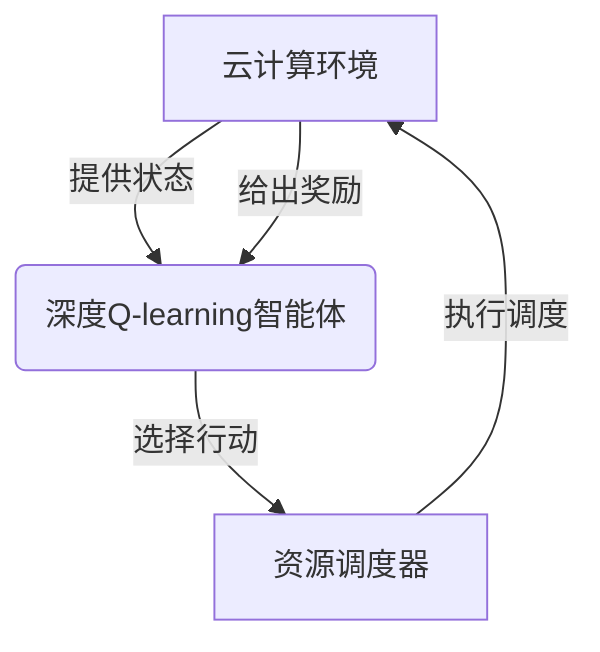

# 深度 Q-learning：在云计算资源调度中的应用

## 1. 背景介绍

### 1.1 云计算的兴起

随着信息技术的快速发展,云计算已经成为当今世界不可或缺的基础设施。云计算允许用户按需获取所需的计算资源,包括CPU、内存、存储和网络等,无需购买和维护昂贵的硬件设备。这种按需付费、高度可扩展的模式极大地提高了资源利用效率,降低了企业的IT成本。

### 1.2 资源调度的重要性

在云计算环境中,有效的资源调度对于提供高质量的服务至关重要。由于用户请求的动态变化和多样性,合理分配有限的资源以满足不同的服务质量需求是一个巨大的挑战。传统的资源调度算法往往局限于特定场景,难以适应复杂动态环境。因此,需要一种更加智能、高效的资源调度方法来优化资源利用并提高用户满意度。

## 2. 核心概念与联系

### 2.1 Q-learning 概述

Q-learning是一种强化学习算法,它允许智能体(Agent)通过与环境的交互来学习如何在给定状态下采取最优行动,以最大化预期的累积奖励。Q-learning的核心思想是使用Q值函数来估计在特定状态下采取某个行动所能获得的长期奖励。

### 2.2 深度学习与 Q-learning 的结合

传统的Q-learning算法存在一些局限性,例如无法处理高维状态空间和连续动作空间。深度学习技术的引入为解决这些问题提供了新的思路。通过使用神经网络来近似Q值函数,深度Q网络(Deep Q-Network, DQN)能够处理复杂的状态和动作空间,并通过经验回放和目标网络等技术提高训练的稳定性和收敛性。

### 2.3 云计算资源调度中的应用

在云计算资源调度场景中,可以将资源调度问题建模为一个马尔可夫决策过程(Markov Decision Process, MDP)。智能体(Agent)是资源调度器,它需要根据当前的系统状态(如资源利用率、任务队列长度等)选择合适的行动(如分配或回收资源)。通过与环境交互并获得奖励反馈(如响应时间、成本等),智能体可以学习到一个优化的资源调度策略。深度Q-learning算法能够有效地处理这种复杂的决策问题,从而提高资源利用效率和服务质量。



## 3. 核心算法原理具体操作步骤

深度Q-learning算法的核心思想是使用深度神经网络来近似Q值函数,并通过与环境交互不断更新网络参数,以学习到最优的行动策略。算法的具体步骤如下:

1. **初始化**
   - 初始化深度Q网络,包括输入层、隐藏层和输出层
   - 初始化经验回放池(Experience Replay Buffer)
   - 初始化目标网络,参数与深度Q网络相同

2. **观察状态并选择行动**
   - 从环境中获取当前状态 $s_t$
   - 使用 $\epsilon$-贪婪策略选择行动 $a_t$
     - 以概率 $\epsilon$ 随机选择一个行动
     - 以概率 $1-\epsilon$ 选择深度Q网络输出的最大Q值对应的行动

3. **执行行动并观察结果**
   - 在环境中执行选择的行动 $a_t$
   - 观察到下一个状态 $s_{t+1}$ 以及获得的奖励 $r_t$

4. **存储经验**
   - 将经验 $(s_t, a_t, r_t, s_{t+1})$ 存储到经验回放池中

5. **从经验回放池中采样数据**
   - 从经验回放池中随机采样一个小批量数据 $D_t$

6. **计算目标Q值**
   - 对于每个样本 $(s, a, r, s')$ 在 $D_t$ 中:
     - 如果 $s'$ 是终止状态,则目标Q值为 $r$
     - 否则,目标Q值为 $r + \gamma \max_{a'} Q(s', a'; \theta^-)$
       - $\gamma$ 是折扣因子
       - $\theta^-$ 是目标网络的参数

7. **更新深度Q网络**
   - 使用采样数据 $D_t$ 和对应的目标Q值,通过梯度下降优化深度Q网络的参数 $\theta$,最小化损失函数:
     $$L(\theta) = \mathbb{E}_{(s, a, r, s') \sim D_t}\left[\left(r + \gamma \max_{a'} Q(s', a'; \theta^-) - Q(s, a; \theta)\right)^2\right]$$

8. **更新目标网络**
   - 每隔一定步数,将深度Q网络的参数复制到目标网络,即 $\theta^- \leftarrow \theta$

9. **回到步骤2,重复训练过程**

通过不断地与环境交互、更新网络参数,深度Q网络最终会收敛到一个近似最优的Q值函数,从而学习到一个优化的资源调度策略。

## 4. 数学模型和公式详细讲解举例说明

在深度Q-learning算法中,我们需要使用神经网络来近似Q值函数 $Q(s, a; \theta)$,其中 $s$ 表示状态, $a$ 表示行动, $\theta$ 是神经网络的参数。

给定一个状态-行动对 $(s, a)$,Q值函数 $Q(s, a; \theta)$ 预测在该状态下采取该行动所能获得的长期累积奖励。我们的目标是通过优化神经网络参数 $\theta$,使得 $Q(s, a; \theta)$ 尽可能接近真实的Q值函数。

为了训练神经网络,我们需要定义一个损失函数,衡量预测的Q值与目标Q值之间的差距。常用的损失函数是平方损失(Mean Squared Error):

$$L(\theta) = \mathbb{E}_{(s, a, r, s') \sim D_t}\left[\left(r + \gamma \max_{a'} Q(s', a'; \theta^-) - Q(s, a; \theta)\right)^2\right]$$

其中:

- $(s, a, r, s')$ 是从经验回放池 $D_t$ 中采样的一个样本,分别表示状态、行动、奖励和下一状态
- $\gamma$ 是折扣因子,用于权衡当前奖励和未来奖励的重要性
- $\max_{a'} Q(s', a'; \theta^-)$ 是目标网络在下一状态 $s'$ 下,所有可能行动的最大Q值
- $Q(s, a; \theta)$ 是当前深度Q网络在状态 $s$ 下,对行动 $a$ 的Q值预测

在每个训练步骤中,我们使用采样的小批量数据 $D_t$ 计算损失函数 $L(\theta)$,然后通过梯度下降算法更新神经网络参数 $\theta$,使得损失函数最小化。

为了提高训练的稳定性和收敛性,深度Q-learning算法引入了两种关键技术:

1. **经验回放(Experience Replay)**

   instead of直接使用最新的经验进行训练,我们将经验存储在一个回放池中,并在训练时从中随机采样小批量数据。这种方法可以破坏经验之间的相关性,提高数据的利用效率,并增加样本的多样性。

2. **目标网络(Target Network)**

   我们维护两个独立的神经网络:深度Q网络和目标网络。目标网络的参数 $\theta^-$ 是深度Q网络参数 $\theta$ 的复制,但更新频率较低。在计算目标Q值时,我们使用目标网络的参数 $\theta^-$,而在更新网络参数时,我们只更新深度Q网络的参数 $\theta$。这种方法可以提高训练的稳定性,避免目标Q值的快速变化导致训练过程发散。

以下是一个简单的例子,说明如何使用深度Q-learning算法解决资源调度问题。假设我们有一个简化的云计算环境,包含 $N$ 个虚拟机(VM)和一个任务队列。每个VM可以处理一个任务,任务到达和完成的时间服从泊松分布。我们的目标是通过动态调整VM的数量,最小化平均响应时间和资源成本。

在这个场景中,我们可以将状态 $s$ 定义为一个向量,包含当前任务队列长度和每个VM的状态(空闲或繁忙)。行动 $a$ 可以是增加一个VM、减少一个VM或不做任何改变。奖励函数 $r$ 可以设计为响应时间的负值减去资源成本。

通过与环境交互并不断更新深度Q网络,智能体可以学习到一个优化的资源调度策略,在响应时间和成本之间达成平衡。例如,当任务队列较长时,智能体可能会增加VM数量以加快响应速度;当队列较短时,智能体可能会减少VM数量以节省成本。

## 5. 项目实践:代码实例和详细解释说明

为了更好地理解深度Q-learning算法在云计算资源调度中的应用,我们提供了一个基于Python和TensorFlow的代码实例。该实例实现了一个简化的云计算环境,并使用深度Q-learning算法进行资源调度。

### 5.1 环境设置

我们首先定义一个`CloudEnv`类,用于模拟云计算环境。该环境包含以下主要组件:

- `num_vms`: 当前虚拟机(VM)的数量
- `task_queue`: 等待处理的任务队列
- `vm_states`: 每个VM的状态(空闲或繁忙)
- `arrival_rate`: 任务到达率
- `service_rate`: 任务服务率

```python
import numpy as np

class CloudEnv:
    def __init__(self, num_vms, arrival_rate, service_rate):
        self.num_vms = num_vms
        self.task_queue = []
        self.vm_states = [0] * num_vms  # 0: idle, 1: busy
        self.arrival_rate = arrival_rate
        self.service_rate = service_rate

    def step(self, action):
        # 实现环境的状态转移和奖励计算
        # ...
        return next_state, reward, done
```

### 5.2 深度Q网络实现

接下来,我们定义一个`DQN`类,用于实现深度Q网络。该网络包含一个输入层、一个或多个隐藏层和一个输出层。输入层的维度对应于环境状态的维度,输出层的维度对应于可能的行动数量。

```python
import tensorflow as tf

class DQN(tf.keras.Model):
    def __init__(self, state_dim, action_dim):
        super(DQN, self).__init__()
        self.dense1 = tf.keras.layers.Dense(64, activation='relu', input_shape=(state_dim,))
        self.dense2 = tf.keras.layers.Dense(64, activation='relu')
        self.output = tf.keras.layers.Dense(action_dim)

    def call(self, state):
        x = self.dense1(state)
        x = self.dense2(x)
        q_values = self.output(x)
        return q_values
```

### 5.3 深度Q-learning算法实现

最后,我们实现深度Q-learning算法的主要逻辑。这包括经验回放池、目标网络更新、训练循环等。

```python
import random
from collections import deque

class DQNAgent:
    def __init__(self, state_dim, action_dim):
        self.state_dim = state_dim
        self.action_dim = action_dim
        self.dqn = DQN(state_dim, action_dim)
        self.target_dqn = DQN(state_dim, action_dim)
        self.replay_buffer = deque(maxlen=10000)
        self.optimizer = tf.keras.optimizers.Adam(lr=0.001)
        self.gamma = 0.99
        self.epsilon = 1.0
        self.epsilon_decay = 0.995
        self.epsilon_min = 0.01

    def get_action(self, state):
        if np.random.rand() < self.epsilon:
            return np.random.choice(self.action_dim)
        else:
            state_tensor = tf.convert_to_tensor([state], dtype=tf.float32)
            q_values = self.dqn(state_tensor)
            return np.argmax(q_values[0])

    def update_replay_buffer(self, state, action, reward, next_state, done):
        self.replay_buffer.append((state, action, reward, next_state,