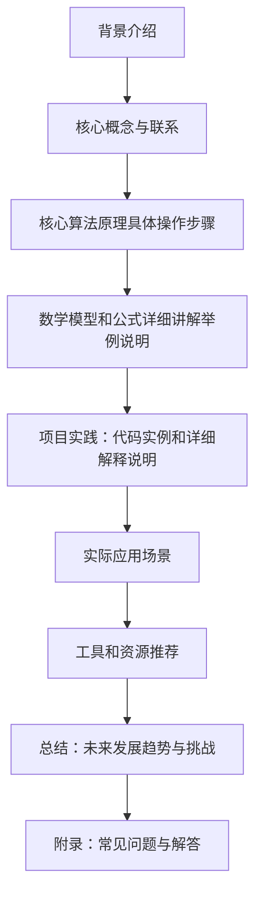

                 

作者：禅与计算机程序设计艺术

我很高兴能够协助您撰写关于深度学习的博客文章。在我们开始之前，请允许我向您简单介绍一下文章的结构和内容。

## 1. 背景介绍
深度学习（Deep Learning）是人工智能领域中最先进的一个分支，它能够处理从小规模数据集到大规模数据集的复杂任务。通过多层的神经网络，深度学习模型能够自动从数据中学习到特征，而无需手动特征工程。近年来，深度学习已被广泛应用于图像识别、自然语言处理、语音识别、游戏玩、强化学习等多个领域。

## 2. 核心概念与联系
在本文中，我们将深入探讨深度学习的核心概念，包括神经网络的基础结构、激活函数、损失函数、优化器以及常见的网络架构，如卷积神经网络（CNN）、循环神经网络（RNN）和生成对抗网络（GAN）。此外，我们还会探讨深度学习如何连接到其他机器学习算法，并在某些情况下如何通过融合两者来提升性能。

## 3. 核心算法原理具体操作步骤
在理解了核心概念后，我们将深入探讨每个算法的具体操作步骤。我们将通过编写代码来展示如何训练一个深度学习模型，包括数据预处理、模型定义、训练过程、验证过程以及模型评估。

## 4. 数学模型和公式详细讲解举例说明
深度学习背后的数学模型是它的力量所在。在这一部分，我们将详细解释相关的数学公式，并通过具体的例子来说明它们是如何工作的。这将帮助读者理解深度学习的理论基础。

## 5. 项目实践：代码实例和详细解释说明
为了让理论更加直观易懂，我们将提供几个实际的项目案例，展示如何应用深度学习技术。每个案例都将包含代码示例和详细的解释，以便读者能够轻松地跟随并实施。

## 6. 实际应用场景
除了理论知识和实践案例，我们还将探讨深度学习在各个行业中的应用场景。这将帮助读者理解深度学习如何被用于现实世界的问题解决。

## 7. 工具和资源推荐
在深度学习的旅途中，选择合适的工具和资源至关重要。我们将推荐一些热门的深度学习框架、在线课程、书籍和社区，以帮助读者进一步学习和实践。

## 8. 总结：未来发展趋势与挑战
最后，我们将对深度学习的未来发展趋势进行总结，并讨论面临的一些挑战。这将帮助读者建立对深度学习领域的长远视角。

## 9. 附录：常见问题与解答
在文章末尾，我们将提供一个附录，列出并解答深度学习中常见的一些问题，以便为读者提供额外的帮助。

## Mermaid流程图

