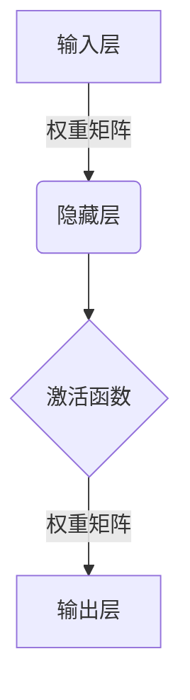
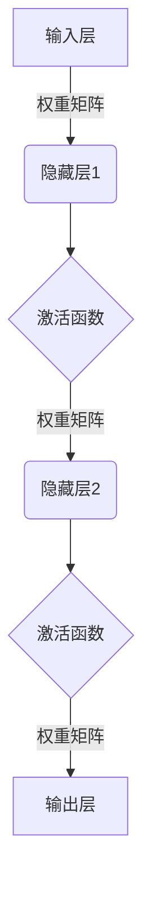
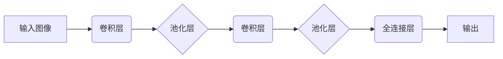
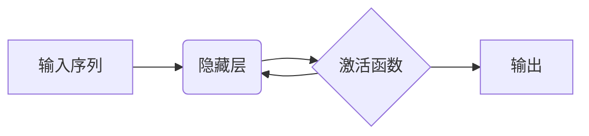
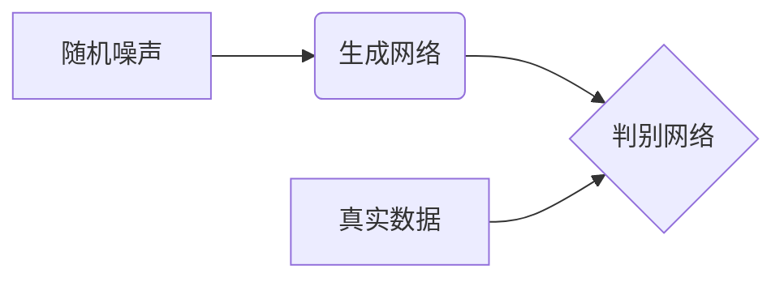

# 深度学习基础原理与代码实战案例讲解

## 1. 背景介绍

### 1.1 什么是深度学习?

深度学习(Deep Learning)是机器学习的一个新兴热门领域,它源于人工神经网络的研究,是一种模仿人脑结构和功能的算法模型。深度学习通过建立多层非线性变换模型对大规模数据进行特征表示学习,从而实现端到端的自动化机器学习。

近年来,深度学习在计算机视觉、自然语言处理、语音识别等领域取得了突破性进展,成为人工智能领域最具影响力的技术之一。其强大的数据驱动能力和自动化特征学习能力,使得机器能够从大量数据中自主发现内在的统计规律,从而解决以往难以用显式编程方式解决的复杂问题。

### 1.2 深度学习的发展历程

深度学习的理论基础可以追溯到20世纪60年代提出的人工神经网络,但由于当时计算能力和数据量的限制,神经网络的发展一直停滞不前。直到21世纪初,大规模数据的积累和GPU计算能力的飞速提升,为深度学习的复兴奠定了基础。

2006年,基于深度置信网络(Deep Belief Network)的深度学习方法首次在小数据集上取得了比传统机器学习方法更优秀的性能。2012年,基于卷积神经网络(Convolutional Neural Network)的深度学习模型在ImageNet大型视觉识别竞赛中大获全胜,从此掀起了深度学习在计算机视觉领域的热潮。

随后,深度学习技术在自然语言处理、语音识别等领域也取得了突破性进展,成为解决这些领域核心问题的利器。如今,无论是科技巨头还是创业公司,都在积极布局深度学习技术,推动人工智能的发展。

## 2. 核心概念与联系

### 2.1 人工神经网络

人工神经网络(Artificial Neural Network)是深度学习的核心模型,它模仿生物神经元的工作原理,通过大量简单的计算单元(神经元)和它们之间的连接(权重)对输入数据进行非线性变换,从而实现对复杂模式的拟合和识别。

神经网络通常由输入层、隐藏层和输出层组成。输入层接收原始数据,隐藏层对数据进行非线性变换提取特征,输出层给出最终的预测结果。在训练过程中,通过调整神经元之间的连接权重,使网络能够从大量示例数据中学习到映射规律。

### 2.2 深度神经网络

深度神经网络(Deep Neural Network)是指包含多个隐藏层的神经网络模型。增加隐藏层的数量可以提高网络对复杂模式的表达能力,但同时也会加大训练的难度和计算量。

深度神经网络能够自动从原始输入数据中学习出多级特征表示,对于解决复杂的人工智能任务具有天然的优势。但由于存在梯度消失、过拟合等问题,需要一些专门的训练技巧来提高模型的性能。

### 2.3 卷积神经网络

卷积神经网络(Convolutional Neural Network, CNN)是一种专门用于处理网格结构数据(如图像、语音、视频等)的深度神经网络。它通过卷积操作和池化操作对局部特征进行提取,从而有效地捕获数据的空间和时间上下文信息。

CNN模型在计算机视觉领域取得了巨大成功,并被广泛应用于图像分类、目标检测、语义分割等任务。此外,CNN也可以推广到自然语言处理、语音识别等领域,处理一维序列数据。

### 2.4 循环神经网络

循环神经网络(Recurrent Neural Network, RNN)是一种专门用于处理序列数据(如文本、语音、时间序列等)的深度神经网络。与传统的前馈神经网络不同,RNN在隐藏层之间引入了循环连接,使得网络能够捕获序列数据中的长期依赖关系。

RNN及其变体(如长短期记忆网络LSTM、门控循环单元GRU等)在自然语言处理、语音识别、机器翻译等领域有着广泛的应用。但由于梯度消失和爆炸问题,传统RNN在捕获长期依赖关系时存在一定困难。

### 2.5 生成对抗网络

生成对抗网络(Generative Adversarial Network, GAN)是一种全新的深度学习架构,由生成网络和判别网络组成。生成网络的目标是从随机噪声中生成逼真的样本数据,而判别网络则需要区分生成的样本和真实数据,两个网络相互对抗、共同进步。

GAN可以被视为一种隐式的概率密度估计模型,在图像生成、语音合成、域适应等领域有着广泛的应用前景。但GAN的训练过程较为不稳定,如何提高其收敛性和生成质量是当前研究的重点。

## 3. 核心算法原理具体操作步骤

### 3.1 前向传播

前向传播(Forward Propagation)是深度神经网络的基本计算过程,它将输入数据通过一系列非线性变换传递到输出层,得到网络的预测结果。具体步骤如下:

1. 将输入数据 $X$ 传入输入层
2. 对于每一个隐藏层 $l$:
    - 计算加权输入 $z^{(l)} = W^{(l)}a^{(l-1)} + b^{(l)}$
    - 通过激活函数 $a^{(l)} = f(z^{(l)})$ 得到该层的激活值
3. 输出层的激活值 $a^{(L)}$ 即为网络的预测输出 $\hat{y}$

其中 $W^{(l)}$ 和 $b^{(l)}$ 分别表示第 $l$ 层的权重矩阵和偏置向量, $a^{(l)}$ 表示第 $l$ 层的激活值, $f$ 是非线性激活函数(如 Sigmoid、ReLU 等)。

### 3.2 反向传播

反向传播(Backpropagation)是深度学习模型的核心训练算法,它通过计算损失函数对网络参数的梯度,并利用优化算法(如梯度下降)不断调整参数,从而使模型在训练数据上的预测性能不断提高。具体步骤如下:

1. 计算损失函数 $J(\theta)$, 其中 $\theta$ 表示网络的所有可训练参数
2. 对每一层 $l$ 计算损失函数关于该层激活值的梯度 $\delta^{(l)} = \frac{\partial J}{\partial z^{(l)}}$
3. 利用链式法则计算损失函数关于该层权重和偏置的梯度:
    $$\frac{\partial J}{\partial W^{(l)}} = \delta^{(l)}(a^{(l-1)})^T$$
    $$\frac{\partial J}{\partial b^{(l)}} = \delta^{(l)}$$
4. 更新该层的权重和偏置:
    $$W^{(l)} \leftarrow W^{(l)} - \alpha \frac{\partial J}{\partial W^{(l)}}$$
    $$b^{(l)} \leftarrow b^{(l)} - \alpha \frac{\partial J}{\partial b^{(l)}}$$
5. 重复步骤2-4,反向传播梯度至前一层,直到输入层为止

其中 $\alpha$ 是学习率,控制每次更新的步长。通过不断迭代该过程,网络的参数就会朝着使损失函数最小化的方向调整。

### 3.3 优化算法

为了提高深度神经网络的训练效率,通常需要采用一些优化算法来替代简单的梯度下降法。常用的优化算法包括:

- **动量法(Momentum)**: 在梯度更新时加入一个动量项,使得参数更新方向不仅考虑当前梯度,还考虑了之前的更新方向。
- **RMSProp**: 通过对梯度进行根均方根归一化,解决不同参数的梯度数值范围差异较大的问题。
- **Adam**: 结合了动量法和RMSProp的优点,是目前最常用的优化算法之一。

此外,还有一些基于二阶导数信息的优化算法,如L-BFGS、共轭梯度法等,它们收敛速度更快,但计算开销也更大。

### 3.4 正则化

为了防止深度神经网络出现过拟合的情况,需要采用一些正则化技术,常用的有:

- **L1/L2正则化**: 在损失函数中加入权重的L1或L2范数惩罚项,使得模型参数值趋向于更小,从而达到降低模型复杂度的目的。
- **Dropout**: 在训练时随机将隐藏层的部分神经元临时移除,这相当于训练了一个子网络的集成,可以有效缓解过拟合。
- **BatchNormalization**: 通过对每一层的输入数据进行归一化处理,加快了模型的收敛速度,并具有一定的正则化效果。
- **数据增广**: 通过一些标签保持的变换(如旋转、平移、缩放等)对训练数据进行增广,提高模型的泛化能力。

除此之外,还有一些提前终止训练、权重衰减等正则化策略,需要根据具体问题选择合适的方法。

## 4. 数学模型和公式详细讲解举例说明

### 4.1 损失函数

损失函数(Loss Function)是衡量深度学习模型预测值与真实值之间差异的指标,在训练过程中需要最小化损失函数的值。常用的损失函数包括:

1. **均方误差(Mean Squared Error, MSE)**: 
   $$J(y, \hat{y}) = \frac{1}{n}\sum_{i=1}^{n}(y_i - \hat{y}_i)^2$$

2. **交叉熵损失(Cross Entropy Loss)**: 
   $$J(y, \hat{y}) = -\frac{1}{n}\sum_{i=1}^{n}[y_i\log\hat{y}_i + (1-y_i)\log(1-\hat{y}_i)]$$

均方误差常用于回归问题,而交叉熵损失则更适用于分类问题。对于多分类问题,交叉熵损失可以扩展为:

$$J(Y, \hat{Y}) = -\frac{1}{n}\sum_{i=1}^{n}\sum_{j=1}^{c}y_{ij}\log\hat{y}_{ij}$$

其中 $c$ 是类别数量, $y_{ij}$ 表示第 $i$ 个样本属于第 $j$ 类的真实标记(0或1), $\hat{y}_{ij}$ 是模型预测的第 $j$ 类概率。

### 4.2 激活函数

激活函数(Activation Function)是深度神经网络中的非线性变换,它赋予了网络拟合复杂函数的能力。常用的激活函数包括:

1. **Sigmoid函数**:
   $$\sigma(x) = \frac{1}{1 + e^{-x}}$$

2. **Tanh函数**: 
   $$\tanh(x) = \frac{e^x - e^{-x}}{e^x + e^{-x}}$$

3. **ReLU函数**:
   $$\text{ReLU}(x) = \max(0, x)$$

Sigmoid和Tanh函数的值域在(0, 1)和(-1, 1)之间,容易出现