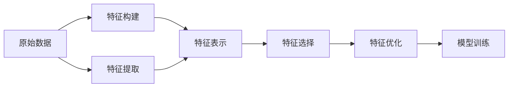

# 特征工程(Feature Engineering)原理与代码实战案例讲解

## 1. 背景介绍

在机器学习和数据挖掘领域,特征工程是一个非常重要且不可或缺的环节。它直接影响着模型的性能表现。可以说,一个优秀的特征工程方案,往往比选择一个多么先进的算法模型更加重要。

### 1.1 什么是特征工程?

简单来说,特征工程就是通过专业背景知识和技巧,将原始数据转换为更能代表预测模型的潜在问题的特征的过程。这一过程包括特征构建、特征提取、特征选择等子过程。目的是最大限度地从原始数据中提取特征以供算法和模型使用。

### 1.2 特征工程的重要性

- 直接影响模型性能:好的特征决定了模型上限,再好的模型也无法从不相关的特征中学到任何信息。

- 有助于提升算法效率:良好的特征工程可以大大降低模型的复杂度,加快模型的训练和预测速度。

- 增强模型的泛化能力:优质的特征可以很好地概括数据的内在规律,有助于模型更好地适应新的、未知的数据。

### 1.3 特征工程的主要步骤

特征工程主要包括以下几个步骤:

1. 特征构建:利用专业知识,根据原始数据构造出新的特征。

2. 特征提取:对原始数据进行变换,生成更具代表性的特征。

3. 特征选择:从众多的候选特征中选择出最具预测能力的特征子集。

4. 特征优化:通过数据变换、尺度调整等方式优化特征,以适应不同的模型。

## 2. 核心概念与联系

在深入探讨特征工程的细节之前,我们有必要先了解一下特征工程中的一些核心概念。

### 2.1 特征类型

根据特征取值的不同,我们通常将特征分为以下几类:

- 数值型特征:特征取值为连续的数字,如年龄、薪资等。

- 类别型特征:特征取值为不连续的类别,如性别、国籍等。

- 时间型特征:特征取值为时间或日期,如生日、入职日期等。

- 文本型特征:特征取值为文本,如简历、商品评论等。

### 2.2 特征表示

为了让算法和模型能够处理特征,我们需要将特征数值化。常见的特征表示方法有:

- 向量表示:将每个特征表示为一个数值向量,如One-Hot编码。

- 树结构表示:将类别型特征转化为树结构,每个叶子节点对应一个类别。

- 图结构表示:用图结构表示特征之间的关联,如知识图谱。

### 2.3 特征选择

当特征维度很高时,我们需要从中选择最具信息量、最具区分度的特征。常用的特征选择方法有:

- 过滤法:基于特征统计指标如方差、相关系数等来选择特征。

- 包裹法:根据目标函数(如预测误差)来选择特征子集。

- 嵌入法:将特征选择看作学习器模型训练过程的一部分,如L1正则化。

### 2.4 特征构建

当原始特征无法很好地描述数据的内在规律时,我们需要利用专业知识构建更加高级的特征。常见的特征构建方法有:

- 多项式组合:用现有特征的高阶多项式项来构造新的特征。

- 分桶离散化:按照某种分割方式将连续特征离散化。

- 特征交叉:将多个特征组合成一个新的特征,捕捉特征间的关联。

下图展示了特征工程各个核心概念之间的关系:



## 3. 核心算法原理具体操作步骤

这一节我们将详细介绍几种常用的特征工程算法的原理和操作步骤。

### 3.1 数据预处理

在进行特征工程之前,我们通常需要对原始数据进行一些预处理操作,如:

1. 数据清洗:去除噪声数据、异常数据等。

2. 缺失值处理:删除缺失值过多的特征,对缺失值进行填充等。

3. 数据归一化:将数值型特征缩放到一个固定区间,如0-1之间。

4. 数据采样:从大规模数据中抽取部分数据作为训练集。

### 3.2 特征构建

#### 3.2.1 多项式特征

多项式特征是利用原始特征的高阶多项式组合来构造新特征的方法。例如,对于特征 $x_1$ 和 $x_2$,我们可以构造一个新的二阶多项式特征:

$$x_3 = x_1^2, x_4 = x_1x_2, x_5 = x_2^2$$

这样可以增加特征的表达能力,捕捉特征间的交互信息。但是阶数不宜太高,否则会引入过拟合风险。

#### 3.2.2 对数特征

有些特征呈现长尾分布,即少数值很大,多数值很小。这种情况下,我们可以对特征取对数,使其分布更加均匀:

$$x_{log} = \log(x+1)$$

取对数可以有效降低特征值的动态范围,提升模型的稳定性。

#### 3.2.3 特征交叉

特征交叉是将多个特征组合成一个新特征的方法。例如,我们可以将"国籍"和"性别"两个特征交叉,得到一个新的特征"国籍_性别",取值为"中国_男","中国_女","美国_男"等。

特征交叉可以捕捉特征之间的关联信息,引入非线性。但是交叉后特征维度会急剧膨胀,需要谨慎使用。

### 3.3 特征编码

#### 3.3.1 One-Hot编码

One-Hot编码用于将类别型特征转换为向量。具体来说,将每个类别都看作一个二元特征,如果样本属于该类别则为1,否则为0。

例如,对于特征"颜色",取值为"红","蓝","绿",用One-Hot编码表示为:

红色: (1,0,0)
蓝色: (0,1,0)
绿色: (0,0,1)

One-Hot编码的优点是简单直观,易于理解和实现。缺点是当类别数很多时,特征维度会急剧膨胀。

#### 3.3.2 序号编码

序号编码用一个从0开始的自然数来表示类别型特征的每个取值。例如:

```
Color = ['red', 'blue', 'green']
Color_encoded = [0, 1, 2] 
```

序号编码的优点是简单且特征维度不会增加。但是引入了类别之间的大小关系,这对某些算法是不合适的。

#### 3.3.3 计数编码

计数编码用类别出现的次数来表示类别型特征。例如,对于"颜色"特征,各类别计数为:

```
red: 10
blue: 6
green: 8
```

则"红","蓝","绿"分别编码为10,6,8。计数编码的思路是,出现次数多的类别可能更重要。

### 3.4 特征选择

#### 3.4.1 方差选择法

方差选择法基于特征的方差来选择特征。假设某个特征在所有样本上几乎不变化,说明该特征可能无法提供什么信息。因此,我们选择方差大于阈值的特征。

步骤如下:

1. 计算各个特征的方差。

2. 根据阈值,选择方差大于阈值的特征。

方差选择法的优点是计算简单,可以快速剔除不相关的特征。缺点是可能误删一些取值稀疏但有用的特征。

#### 3.4.2 相关系数法

相关系数法基于特征与目标变量的相关性来选择特征。我们计算每个特征与目标变量的相关系数,然后选择相关系数高于阈值的特征。

常用的相关系数有:

- Pearson相关系数:衡量两个变量的线性相关性。

- Spearman秩相关系数:衡量两个变量的单调相关性。

相关系数法的优点是能够刻画特征与目标的相关性,缺点是无法发现非线性的关系。

#### 3.4.3 互信息法

互信息(Mutual Information)衡量两个变量的相互依赖性。如果特征X与目标Y的互信息越大,说明X携带了更多关于Y的信息。

互信息的计算公式为:

$$I(X;Y) = \sum_{x \in X} \sum_{y \in Y} p(x,y) \log \frac{p(x,y)}{p(x)p(y)}$$

其中,$p(x,y)$为X和Y的联合概率分布,$p(x)$和$p(y)$分别是X和Y的边缘概率分布。

互信息法能够捕捉特征与目标的任意关系,对非线性的关系很敏感。但其计算较为复杂,需要估计概率分布。

### 3.5 特征降维

当特征维度很高时,我们需要使用降维技术将特征压缩到一个低维空间。常用的降维方法有:

#### 3.5.1 PCA

主成分分析(PCA)通过线性变换将原始特征转换为一组新的特征,使得新特征之间相互独立,且尽可能多地保留原始数据的信息。

PCA的主要步骤如下:

1. 对原始特征进行中心化。

2. 计算特征的协方差矩阵。

3. 对协方差矩阵进行特征值分解。

4. 取最大的k个特征值对应的特征向量,得到降维后的特征。

PCA的优点是可解释性强,降维后的特征往往具有明确的物理意义。缺点是仅考虑了特征的线性关系。

#### 3.5.2 LDA

线性判别分析(LDA)是一种有监督的降维方法。与PCA不同,LDA在进行投影时会利用目标变量的信息,使得投影后的特征尽可能地区分不同类别。

LDA的目标是最大化类间方差,最小化类内方差。其步骤为:

1. 计算类内散度矩阵和类间散度矩阵。

2. 构造优化目标,求解投影矩阵。

3. 用投影矩阵对原始特征进行变换,得到降维后的特征。

LDA能够利用标签信息,使得降维后的特征更利于分类。但其要求数据满足高斯分布,且对样本量要求较高。

## 4. 数学模型和公式详细讲解举例说明

这一节我们将详细讲解特征工程中用到的一些数学模型和公式,并给出具体的例子。

### 4.1 TF-IDF

TF-IDF是一种常用于文本特征提取的算法。它用于评估一个词对于一个文档集或一个语料库中的其中一份文档的重要程度。

TF-IDF由两部分组成:词频(Term Frequency,TF)和逆文档频率(Inverse Document Frequency,IDF)。

- 词频TF(t,d)表示词条t在文档d中出现的频率。

$$TF(t,d) = \frac{n_{t,d}}{\sum_k n_{k,d}}$$

其中,$n_{t,d}$表示t在d中出现的次数,$\sum_k n_{k,d}$表示d中所有词的总数。

- 逆文档频率IDF(t,D)表示包含词条t的文档数与语料库的文档总数的比值的对数。

$$IDF(t,D) = \log \frac{|D|}{|\{d \in D: t \in d\}|}$$

其中,|D|表示语料库中的文档总数,$|\{d \in D: t \in d\}|$表示包含t的文档数。

TF-IDF是TF和IDF的乘积:

$$TFIDF(t,d,D) = TF(t,d) \times IDF(t,D)$$

直观地说,TF-IDF衡量了一个词在文档中的重要性。如果一个词在一篇文档中频繁出现,但在其他文档中很少出现,则认为此词对这篇文档很重要。

举个例子,假设我们有如下两个文档:

```