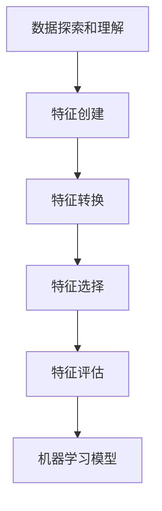

# 特征工程原理与代码实例讲解

## 1.背景介绍

在机器学习和数据挖掘领域中,特征工程是一个至关重要的过程。它涉及从原始数据中提取有用的特征,这些特征对于构建高质量的机器学习模型至关重要。良好的特征工程可以极大地提高模型的性能,而糟糕的特征工程则会导致模型性能下降。

特征工程的目标是从原始数据中提取出对于预测目标最有价值的特征。这些特征应该具有以下特点:

- 相关性(Relevance):特征与预测目标之间应该存在相关关系。
- 非冗余性(Non-redundancy):特征之间应该尽量不相关,以避免冗余信息。
- 可解释性(Interpretability):特征应该具有一定的可解释性,有助于理解模型的决策过程。

特征工程是一个探索性和创造性的过程,需要对数据和问题领域有深入的理解。它通常包括以下几个步骤:

1. 数据探索和理解
2. 特征创建
3. 特征转换
4. 特征选择
5. 特征评估

### Mermaid 流程图

## 2.核心概念与联系

### 2.1 特征类型

特征可以分为不同的类型,每种类型都需要采用不同的处理方式。常见的特征类型包括:

- 数值型特征(Numerical Features):连续的数值,如年龄、身高、温度等。
- 类别型特征(Categorical Features):离散的类别,如颜色、国家、职业等。
- 文本型特征(Text Features):自然语言文本,如新闻报道、产品评论等。
- 图像型特征(Image Features):图像数据,如照片、医学影像等。
- 时序型特征(Time Series Features):随时间变化的数据序列,如股票价格、天气记录等。

### 2.2 特征重要性

在特征工程过程中,需要评估每个特征对于预测目标的重要性。常见的特征重要性评估方法包括:

- 过滤法(Filter Methods):根据特征与目标变量的相关性进行评估,如相关系数、互信息等。
- 包裹法(Wrapper Methods):基于机器学习算法的性能对特征进行评估,如递归特征消除(RFE)。
- 嵌入法(Embedded Methods):将特征选择过程嵌入到机器学习算法中,如决策树、正则化模型等。

### 2.3 特征工程与模型性能

良好的特征工程对于提高机器学习模型的性能至关重要。合适的特征可以:

- 提高模型的准确性和泛化能力。
- 减少模型的复杂度和训练时间。
- 提高模型的可解释性和可信度。

因此,特征工程是机器学习过程中不可或缺的一个环节,它直接影响着模型的最终性能。

## 3.核心算法原理具体操作步骤  

特征工程涉及多种算法和技术,下面将介绍一些常见的特征工程算法原理和具体操作步骤。

### 3.1 数值型特征处理

#### 3.1.1 缺失值处理

缺失值是数据集中常见的问题,需要进行适当的处理。常见的缺失值处理方法包括:

1. 删除缺失值(Deletion):删除包含缺失值的样本或特征。
2. 均值/中位数/众数插补(Mean/Median/Mode Imputation):用特征的均值、中位数或众数替换缺失值。
3. 模型插补(Model-based Imputation):基于其他特征构建模型预测缺失值。
4. 多重插补(Multiple Imputation):多次插补缺失值,然后对结果进行综合。

#### 3.1.2 异常值处理

异常值是指与大多数数据点明显不同的值,它们可能会对模型产生不利影响。常见的异常值处理方法包括:

1. 删除异常值(Outlier Removal):识别并删除异常值。
2. 分位数裁剪(Quantile Clipping):将异常值替换为特定分位数的值。
3. 变换(Transformation):对数据进行对数、平方根等变换,以减小异常值的影响。

#### 3.1.3 标准化

标准化是将数值型特征转换到相似的范围,以避免某些特征由于取值范围较大而对模型产生过大影响。常见的标准化方法包括:

1. 最小-最大标准化(Min-Max Normalization):将特征值缩放到[0,1]范围内。
2. Z-Score标准化(Z-Score Normalization):将特征值标准化为均值为0、标准差为1的分布。
3. 小数定标标准化(Decimal Scaling):将特征值除以一个常数,使其落在特定范围内。

### 3.2 类别型特征处理

#### 3.2.1 One-Hot编码

One-Hot编码是将类别型特征转换为数值型特征的常用方法。它为每个类别创建一个新的二元特征,如果样本属于该类别,则对应特征值为1,否则为0。

#### 3.2.2 标签编码

标签编码是将类别型特征映射为数值型特征的另一种方法。它为每个类别分配一个唯一的数值标签,但需要注意,标签之间的大小关系可能会被模型错误地解释为有序关系。

#### 3.2.3 目标编码

目标编码是一种考虑了类别与目标变量之间关系的编码方法。它将每个类别映射为该类别样本的目标变量的平均值或其他统计量。

#### 3.2.4 词袋模型

对于文本类别型特征,词袋模型(Bag-of-Words)是一种常用的特征提取方法。它将文本表示为词频向量,每个维度对应一个单词,值为该单词在文本中出现的次数。

### 3.3 特征构造

特征构造是从原始特征创建新的更有意义的特征的过程。常见的特征构造方法包括:

1. 特征组合(Feature Combination):将两个或多个现有特征组合成一个新特征,如乘积、比率等。
2. 多项式特征(Polynomial Features):将原始特征的多项式组合作为新特征,如平方项、交互项等。
3. 特征分箱(Feature Binning):将连续特征划分为多个区间,每个区间作为一个新的类别型特征。
4. 特征衍生(Feature Derivation):从现有特征推导出新的更有意义的特征,如统计量、文本长度等。

### 3.4 特征选择

特征选择是从原始特征集中选择一个最优子集的过程,目的是减少特征数量、提高模型性能和可解释性。常见的特征选择方法包括:

1. 过滤法(Filter Methods):基于特征与目标变量的相关性评分进行选择,如相关系数、互信息等。
2. 包裹法(Wrapper Methods):基于机器学习算法的性能对特征进行评估和选择,如递归特征消除(RFE)。
3. 嵌入法(Embedded Methods):将特征选择过程嵌入到机器学习算法中,如LASSO回归、决策树等。

### 3.5 特征降维

特征降维是将高维特征映射到低维空间的过程,目的是减少特征数量、提高计算效率和模型性能。常见的特征降维方法包括:

1. 主成分分析(PCA):将特征投影到最大方差的正交基上,保留最重要的几个主成分作为新特征。
2. 线性判别分析(LDA):将特征投影到最大化类间散度、最小化类内散度的方向上。
3. 独立成分分析(ICA):将特征分解为独立的子成分,每个子成分代表一个潜在的信号源。
4. 自编码器(Autoencoder):利用神经网络自动学习特征的低维表示。

## 4.数学模型和公式详细讲解举例说明

在特征工程中,有许多涉及到数学模型和公式的概念和方法,下面将详细讲解其中的一些重要内容。

### 4.1 相关性度量

相关性度量是评估两个变量之间线性关系强度的统计量,常用于特征重要性评估和特征选择。

#### 4.1.1 皮尔逊相关系数

皮尔逊相关系数(Pearson Correlation Coefficient)用于测量两个连续变量之间的线性相关程度,取值范围为[-1,1]。公式如下:

$$r_{xy} = \frac{\sum_{i=1}^{n}(x_i - \bar{x})(y_i - \bar{y})}{\sqrt{\sum_{i=1}^{n}(x_i - \bar{x})^2}\sqrt{\sum_{i=1}^{n}(y_i - \bar{y})^2}}$$

其中,$ \bar{x} $和$ \bar{y} $分别表示$ x $和$ y $的均值。

#### 4.1.2 斯皮尔曼等级相关系数

斯皮尔曼等级相关系数(Spearman's Rank Correlation Coefficient)用于测量两个有序变量之间的单调关系,公式如下:

$$\rho = 1 - \frac{6\sum_{i=1}^{n}d_i^2}{n(n^2-1)}$$

其中,$ d_i $表示两个变量的等级差,$ n $表示样本数量。

#### 4.1.3 互信息

互信息(Mutual Information)是信息论中的一个概念,用于测量两个随机变量之间的相关性。对于离散变量$ X $和$ Y $,互信息定义为:

$$I(X;Y) = \sum_{x\in X}\sum_{y\in Y}p(x,y)\log\frac{p(x,y)}{p(x)p(y)}$$

其中,$ p(x,y) $是$ X $和$ Y $的联合概率分布,$ p(x) $和$ p(y) $分别是$ X $和$ Y $的边缘概率分布。

### 4.2 距离度量

距离度量是衡量两个数据点之间相似性的一种方式,在异常值检测、聚类分析等领域有广泛应用。

#### 4.2.1 欧几里得距离

欧几里得距离(Euclidean Distance)是最常用的距离度量,它表示两个点在欧几里得空间中的直线距离。对于$ n $维空间中的两个点$ x = (x_1, x_2, \dots, x_n) $和$ y = (y_1, y_2, \dots, y_n) $,欧几里得距离定义为:

$$d(x,y) = \sqrt{\sum_{i=1}^{n}(x_i - y_i)^2}$$

#### 4.2.2 曼哈顿距离

曼哈顿距离(Manhattan Distance)也称为城市街区距离,它表示两个点在每个维度上的绝对差之和。对于$ n $维空间中的两个点$ x $和$ y $,曼哈顿距离定义为:

$$d(x,y) = \sum_{i=1}^{n}|x_i - y_i|$$

#### 4.2.3 余弦相似度

余弦相似度(Cosine Similarity)通常用于测量两个非零向量之间的相似性。对于两个向量$ x $和$ y $,余弦相似度定义为:

$$\text{sim}(x,y) = \frac{x \cdot y}{\|x\|\|y\|} = \frac{\sum_{i=1}^{n}x_iy_i}{\sqrt{\sum_{i=1}^{n}x_i^2}\sqrt{\sum_{i=1}^{n}y_i^2}}$$

余弦相似度的取值范围为[-1,1],值越接近1,表示两个向量越相似。

### 4.3 特征重要性评估

特征重要性评估是特征选择的一个重要步骤,它旨在量化每个特征对预测目标的贡献程度。下面介绍两种常用的特征重要性评估方法。

#### 4.3.1 基于权重的方法

对于一些机器学习模型,如线性回归、逻辑回归等,模型权重本身就可以作为特征重要性的度量。特征的重要性可以由其对应的权重系数的绝对值来衡量。

例如,对于线性回归模型$ y = \beta_0 + \beta_1x_1 + \beta_2x_2 + \dots + \beta_nx_n $,特征$ x_i $的重要性可以用$ |\beta_i| $来表示。

#### 4.3.2 基于树模型的方法

对于决策树、随机森林