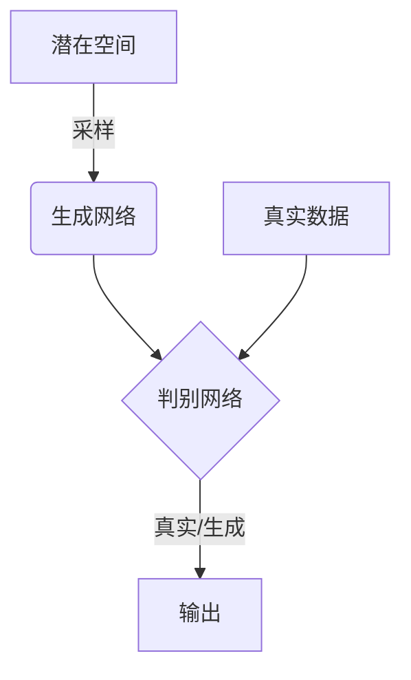

# 生成对抗网络 (Generative Adversarial Network)

## 1.背景介绍

### 1.1 什么是生成式模型?

在机器学习和深度学习领域,模型可以分为两大类:判别式模型(discriminative model)和生成式模型(generative model)。判别式模型的目标是学习将输入数据映射到正确的输出,例如将图像分类为正确的类别。而生成式模型则是学习数据的概率分布,从而能够生成新的数据样本。

生成模型在计算机视觉、自然语言处理、语音识别等领域有着广泛的应用。传统的生成模型包括高斯混合模型(Gaussian Mixture Model, GMM)、隐马尔可夫模型(Hidden Markov Model, HMM)、受限玻尔兹曼机(Restricted Boltzmann Machine, RBM)等。然而,这些传统模型在处理高维数据时存在一些局限性。

### 1.2 生成对抗网络(GAN)的兴起

2014年,伊恩·古德费洛(Ian Goodfellow)等人在论文"Generative Adversarial Networks"中提出了生成对抗网络(Generative Adversarial Network, GAN)的概念,这是一种全新的生成式模型框架。GAN的核心思想是将模型的训练过程视为一个二人对抗博弈的过程,由生成网络(Generator)和判别网络(Discriminator)两个网络组成,相互对抗,最终达到一种动态平衡。

GAN的出现为生成模型带来了新的可能性,在图像生成、语音合成、文本生成等领域展现出了强大的潜力。GAN还可以用于数据增广、图像超分辨率重建、图像翻译等任务。自提出以来,GAN引发了研究人员的广泛关注,也催生了许多新的变种模型。

## 2.核心概念与联系

### 2.1 生成网络和判别网络

生成对抗网络由两个神经网络组成:

1. **生成网络(Generator)**: 生成网络的目标是从一个潜在空间(latent space)中采样,并生成看起来"真实"的数据样本。生成网络通常由上采样(upsampling)层和卷积层组成,将低维的潜在向量映射到高维的数据空间。

2. **判别网络(Discriminator)**: 判别网络的目标是区分生成网络生成的样本和真实数据样本。判别网络通常由卷积层和下采样(downsampling)层组成,将输入数据映射到一个标量输出,表示输入数据是真实样本还是生成样本的概率。

生成网络和判别网络相互对抗,生成网络尝试生成足以欺骗判别网络的"假"样本,而判别网络则努力区分真实样本和生成样本。在这个过程中,两个网络相互学习和提高,最终达到一种动态平衡,使生成网络能够生成高质量的样本。



### 2.2 对抗训练过程

GAN的训练过程可以看作一个二人对抗博弈的过程,生成网络和判别网络相互对抗,最终达到纳什均衡(Nash equilibrium)。具体来说:

1. 生成网络的目标是最小化判别网络将其生成的样本判断为"假"的概率,即最大化欺骗判别网络的能力。
2. 判别网络的目标是最大化正确区分真实样本和生成样本的能力。

这个过程可以用下面的公式表示:

$$\min_G \max_D V(D,G) = \mathbb{E}_{x\sim p_{data}(x)}[\log D(x)] + \mathbb{E}_{z\sim p_z(z)}[\log(1-D(G(z)))]$$

其中,$p_{data}(x)$是真实数据的分布,$p_z(z)$是潜在空间的分布,G是生成网络,D是判别网络。

通过交替优化生成网络和判别网络的目标函数,两个网络相互学习和提高,最终达到一种动态平衡,使生成网络能够生成高质量的样本。

## 3.核心算法原理具体操作步骤 

训练生成对抗网络的核心算法步骤如下:

1. **初始化生成网络和判别网络**。通常使用卷积神经网络作为生成网络和判别网络的基础架构。

2. **加载真实数据集**。准备用于训练的真实数据集,如图像、文本或其他数据。

3. **对抗训练循环**:
   a. **采样噪声向量**。从潜在空间(如高斯分布或均匀分布)中采样一批噪声向量。
   b. **生成假样本**。将噪声向量输入生成网络,生成一批假样本。
   c. **训练判别网络**。将真实样本和生成的假样本输入判别网络,计算判别网络的损失函数,并使用反向传播算法更新判别网络的参数,以提高区分真实和假样本的能力。
   d. **训练生成网络**。固定判别网络的参数,将生成的假样本输入判别网络,计算生成网络的损失函数,并使用反向传播算法更新生成网络的参数,以提高欺骗判别网络的能力。

4. **重复步骤3**,直到达到停止条件(如最大迭代次数或损失函数收敛)。

5. **生成新样本**。使用训练好的生成网络,从潜在空间采样噪声向量,并将其输入生成网络以生成新的样本。

需要注意的是,GAN的训练过程并不稳定,容易出现模式崩溃(mode collapse)、梯度消失/爆炸等问题。因此,研究人员提出了许多改进的GAN变种模型,如WGAN、LSGAN、DRAGAN等,以提高训练稳定性和生成样本质量。

## 4.数学模型和公式详细讲解举例说明

### 4.1 原始GAN的目标函数

在原始GAN论文中,作者使用了最小化Jensen-Shannon divergence作为目标函数:

$$\min_G \max_D V(D,G) = \mathbb{E}_{x\sim p_{data}(x)}[\log D(x)] + \mathbb{E}_{z\sim p_z(z)}[\log(1-D(G(z)))]$$

其中,$p_{data}(x)$是真实数据的分布,$p_z(z)$是潜在空间的分布,G是生成网络,D是判别网络。

这个目标函数可以解释为:

- 判别网络D试图最大化对真实样本的正确分类概率$\mathbb{E}_{x\sim p_{data}(x)}[\log D(x)]$,以及对生成样本的正确分类概率$\mathbb{E}_{z\sim p_z(z)}[\log(1-D(G(z)))]$的总和。
- 生成网络G试图最小化判别网络对生成样本的正确分类概率$\mathbb{E}_{z\sim p_z(z)}[\log(1-D(G(z)))]$,即最大化欺骗判别网络的能力。

这种对抗性的目标函数驱动着生成网络和判别网络相互学习和提高,最终达到一种动态平衡。

### 4.2 WGAN的Wasserstein距离

原始GAN的目标函数存在一些理论上的缺陷,如难以获得足够的梯度信息、训练不稳定等。因此,Arjovsky等人在2017年提出了改进的WGAN(Wasserstein GAN),使用Wasserstein距离(也称为Earth Mover's Distance)作为目标函数:

$$\min_G \max_{D\in\mathcal{D}} \mathbb{E}_{x\sim p_{data}(x)}[D(x)] - \mathbb{E}_{z\sim p_z(z)}[D(G(z))]$$

其中,$\mathcal{D}$是1-Lipschitz连续函数的集合,即满足$\|D(x_1) - D(x_2)\| \leq \|x_1 - x_2\|$的函数集合。

WGAN的目标函数更加稳定,能够提供更有意义的梯度信息,从而提高训练效果。但是,WGAN需要对判别网络的权重进行裁剪,以满足Lipschitz约束,这增加了一定的计算复杂度。

### 4.3 LSGAN的最小二乘损失函数

除了WGAN之外,另一种常见的GAN变种是LSGAN(Least Squares GAN),它使用最小二乘损失函数代替原始GAN的交叉熵损失函数:

$$\min_D V(D) = \frac{1}{2}\mathbb{E}_{x\sim p_{data}(x)}[(D(x)-1)^2] + \frac{1}{2}\mathbb{E}_{z\sim p_z(z)}[D(G(z))^2]$$
$$\min_G V(G) = \frac{1}{2}\mathbb{E}_{z\sim p_z(z)}[(D(G(z))-1)^2]$$

其中,判别网络D试图将真实样本的输出最大化为1,将生成样本的输出最小化为0。生成网络G则试图将生成样本的输出最大化为1,以欺骗判别网络。

LSGAN的优点是更加稳定,并且能够获得更有意义的梯度信息。此外,LSGAN还能够加速训练过程的收敛。

### 4.4 其他GAN变种

除了WGAN和LSGAN之外,还有许多其他的GAN变种模型,如:

- **DRAGAN**(Denoising Feature Matching GAN):使用特征匹配损失函数,提高生成样本的质量和多样性。
- **BEGAN**(Boundary Equilibrium GAN):使用自动编码器的思想,通过映射自编码器的损失函数来训练GAN。
- **CycleGAN**:用于图像到图像的转换任务,通过循环一致性约束实现无监督的图像翻译。
- **ProgressiveGAN**:逐步增加生成图像的分辨率,从低分辨率开始训练,最终生成高分辨率图像。

这些变种模型都在不同程度上改进了原始GAN,以解决训练不稳定、模式崩溃、生成样本质量差等问题,从而提高了GAN在各种任务中的性能。

## 5.项目实践:代码实例和详细解释说明

在这一节,我们将通过一个实际的代码示例,演示如何使用PyTorch构建和训练一个基本的生成对抗网络(GAN)模型。我们将使用MNIST手写数字数据集作为训练数据。

### 5.1 导入所需库

```python
import torch
import torch.nn as nn
import torch.optim as optim
import torchvision
import torchvision.transforms as transforms
import matplotlib.pyplot as plt
import numpy as np
```

### 5.2 加载MNIST数据集

```python
# 设置数据转换
transform = transforms.Compose([
    transforms.ToTensor(),
    transforms.Normalize((0.5,), (0.5,))
])

# 加载MNIST训练集
trainset = torchvision.datasets.MNIST(root='./data', train=True, download=True, transform=transform)
trainloader = torch.utils.data.DataLoader(trainset, batch_size=128, shuffle=True)
```

### 5.3 定义生成网络和判别网络

```python
# 生成网络
class Generator(nn.Module):
    def __init__(self, latent_dim):
        super(Generator, self).__init__()
        self.latent_dim = latent_dim
        
        self.model = nn.Sequential(
            nn.Linear(latent_dim, 256),
            nn.LeakyReLU(0.2, inplace=True),
            nn.Linear(256, 512),
            nn.LeakyReLU(0.2, inplace=True),
            nn.Linear(512, 1 * 28 * 28),
            nn.Tanh()
        )

    def forward(self, z):
        img = self.model(z)
        img = img.view(img.size(0), 1, 28, 28)
        return img

# 判别网络
class Discriminator(nn.Module):
    def __init__(self):
        super(Discriminator, self).__init__()
        
        self.model = nn.Sequential(
            nn.Linear(1 * 28 * 28, 512),
            nn.LeakyReLU(0.2, inplace=True),
            nn.Linear(512, 256),
            nn.LeakyReLU(0.2, inplace=True),
            nn.Linear(256, 1),
            nn.Sigmoid()
        )

    def forward(self, img):
        img_flat = img.view(img.size(0), -1)
        validity = self.model(img_flat)
        return validity
```

### 5.4 初始化生成网络和判别网络

```python
# 初始化权重
def weights_init(m):
    classname = m.__class__.__name__
    if classname.find('