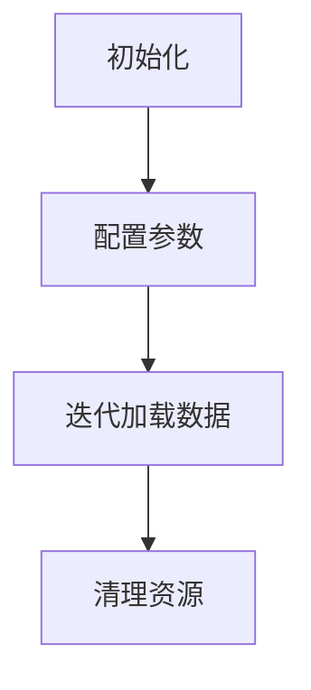

                 

作者：禅与计算机程序设计艺术

在深度学习领域，数据是训练模型的生命线。选择合适的数据加载器是一个至关重要的任务，因为它会直接影响模型的训练效率和性能。在本文中，我们将探讨如何使用`DataLoader`提供的数据来进行训练，以及这一过程中遇到的一些关键考量和技巧。

## 1. 背景介绍
深度学习模型通常需要处理大量的数据集，这些数据集可能包含成千上万的样本，每个样本可能拥有数十甚至数百个特征。由于数据的规模和复杂性，传统的数据处理方法已经无法满足当今模型的需求。此时，`DataLoader`就显得尤为重要，它是PyTorch库中用于数据加载和批次迭代的一个核心组件。

## 2. 核心概念与联系
`DataLoader`的核心功能在于将数据集分割成固定长度的批次，然后按照指定的顺序（默认是随机）对这些批次进行迭代，从而减少了在每次迭代中对数据集的访问时间。此外，`DataLoader`还支持多个worker并行处理，进一步提高了训练的效率。

## 3. 核心算法原理具体操作步骤
使用`DataLoader`进行数据训练通常涉及以下几个步骤：
1. **初始化**：首先，需要创建一个`DataLoader`实例，并指定数据集对象。
2. **配置参数**：根据需要配置批次大小、shuffle（是否打乱数据）、num_workers（并行处理的数量）等参数。
3. **迭代加载数据**：通过`for`循环遍历`DataLoader`对象，获取每个epoch的数据批次，并执行训练操作。
4. **清理资源**：在迭代结束后，确保释放掉相关的资源，以避免内存泄露。



## 4. 数学模型和公式详细讲解举例说明
在深度学习训练中，数学模型往往是基于梯度下降法或其变种。`DataLoader`通过迭代加载数据批次，为这些算法提供了稳定的数据流，帮助模型更快地收敛。具体的数学模型和公式在各种教材和论文中有详细描述，但在实践中，了解这些模型如何与`DataLoader`协同工作是至关重要的。

## 5. 项目实践：代码实例和详细解释说明
现在，让我们通过一个简单的项目实践来演示如何使用`DataLoader`。

```python
from torch.utils.data import DataLoader, TensorDataset
import torch

# 假设我们有以下数据
x = torch.tensor([[0, 0], [1, 1], [2, 2]]) # 输入特征
y = torch.tensor([[0], [1], [0]])         # 输出标签

# 创建一个TensorDataset对象
dataset = TensorDataset(x, y)

# 创建一个DataLoader实例，批次大小为2
dataloader = DataLoader(dataset, batch_size=2)

# 遍历DataLoader
for batch in dataloader:
   x_batch, y_batch = batch
   print(f"Batch x: {x_batch}")
   print(f"Batch y: {y_batch}")
```

## 6. 实际应用场景
`DataLoader`不仅限于图像识别和自然语言处理等领域，它也广泛应用于各类数据分析和机器学习任务。无论是处理大规模的文本数据集，还是进行高精度的预测模型训练，`DataLoader`都能提供必要的支持。

## 7. 工具和资源推荐
- `torch`: PyTorch官方库，提供完整的`DataLoader`实现和示例。
- `pytorch-geometric`: 对于图形学习，提供了扩展的`DataLoader`功能。
- `huggingface`: 对于自然语言处理，提供了丰富的预训练模型和数据处理工具。

## 8. 总结：未来发展趋势与挑战
随着数据规模的不断增长和计算能力的提升，`DataLoader`在深度学习框架中的作用将会越来越重要。未来的研究可能会聚焦于如何进一步优化数据加载过程，包括更高效的并行处理策略和动态数据调整机制。

## 9. 附录：常见问题与解答
### 问题1：`DataLoader`的性能如何？
答案：`DataLoader`的性能取决于多种因素，包括硬件配置、数据集大小和批次大小等。通常情况下，使用`DataLoader`能够显著提升训练速度。

### 问题2：`DataLoader`是线程安全的吗？
答案：是的，`DataLoader`是线程安全的，但是需要注意的是，如果使用多个worker进行数据加载，可能会导致额外的内存消耗。

以上就是关于如何使用`DataLoader`提供的数据进行训练的全部内容。希望这篇文章对你有所启发，并且能够帮助你在深度学习项目中更高效地利用数据。如果你有任何疑问或者想要深入讨论，请随时留言。

---
作者：禅与计算机程序设计艺术 / Zen and the Art of Computer Programming

