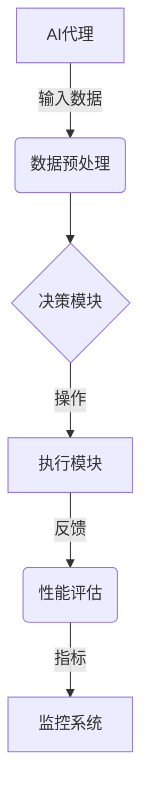
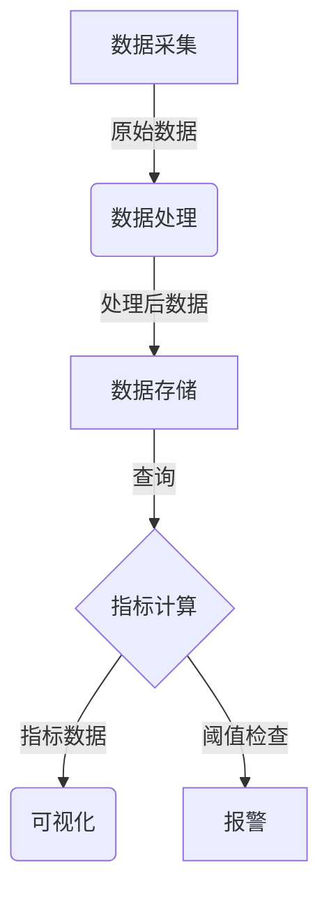

# 监控AI代理工作流：性能指标与分析

## 1.背景介绍

### 1.1 人工智能系统的复杂性

随着人工智能(AI)系统在各个领域的广泛应用,监控和分析AI代理的工作流程变得越来越重要。AI系统通常由多个组件和模块组成,这些组件和模块相互交互协作以完成复杂的任务。由于AI系统的复杂性,监控和分析其工作流程面临着许多挑战。

### 1.2 监控的重要性

监控AI代理工作流程可以帮助我们了解系统的运行状况、识别潜在问题并及时采取纠正措施。有效的监控不仅可以提高系统的可靠性和稳定性,还可以优化资源利用率,提高整体性能。此外,监控数据对于系统优化、故障排查和问题诊断也至关重要。

## 2.核心概念与联系  

### 2.1 AI代理

AI代理是指在特定环境中感知和行动的自主实体。它能够从环境中获取信息(感知),并根据这些信息做出决策和执行相应的操作(行动)。AI代理可以是软件程序、机器人或其他智能系统。

### 2.2 工作流程

工作流程描述了AI代理在完成特定任务时所经历的一系列步骤和状态转换。它包括数据输入、处理、决策和输出等环节。监控AI代理的工作流程有助于全面了解系统的运行情况。

### 2.3 性能指标

性能指标是衡量AI系统性能的一组量化标准。常见的性能指标包括:

- 准确性(Accuracy)
- 精确率(Precision)
- 召回率(Recall)
- F1分数(F1 Score)
- 延迟(Latency)
- 吞吐量(Throughput)
- 资源利用率(Resource Utilization)

选择合适的性能指标对于评估和优化AI系统至关重要。

### 2.4 监控系统

监控系统是一种专门用于收集、存储和分析AI代理工作流程数据的软件或平台。它通常包括数据采集、指标计算、可视化和警报等功能模块。



## 3.核心算法原理具体操作步骤

### 3.1 数据采集

监控系统的第一步是从AI代理的各个组件中采集相关数据。这些数据可以包括:

- 日志文件
- 指标和计数器
- 事件和追踪
- 请求和响应数据

数据采集可以通过多种方式实现,例如日志文件分析、代码插桩(Instrumentation)、网络嗅探等。

### 3.2 数据处理和存储

采集到的原始数据通常需要进行预处理和转换,以便后续的分析和可视化。常见的处理步骤包括:

- 数据清洗和格式化
- 数据聚合和采样
- 数据标准化和特征提取

处理后的数据将被存储在时序数据库、NoSQL数据库或其他存储系统中,以便后续查询和分析。

### 3.3 指标计算

根据监控目标和AI系统的特点,需要定义和计算一组性能指标。这些指标通常由原始数据经过一系列转换和计算得到。例如,计算模型准确率需要对预测结果和真实标签进行比较。

$$
Accuracy = \frac{TP + TN}{TP + TN + FP + FN}
$$

其中,TP(True Positive)、TN(True Negative)、FP(False Positive)和FN(False Negative)分别表示真正例、真反例、假正例和假反例的数量。

### 3.4 可视化和报警

将计算得到的指标以图表、仪表盘或其他可视化形式呈现,有助于快速了解系统的运行状况。同时,可以设置阈值并基于指标触发相应的报警,以便及时发现和处理异常情况。



## 4.数学模型和公式详细讲解举例说明

在监控AI代理工作流程中,常常需要使用一些数学模型和公式来计算性能指标。以下是一些常见的数学模型和公式,以及它们的详细讲解和使用示例。

### 4.1 混淆矩阵(Confusion Matrix)

混淆矩阵是一种用于评估分类模型性能的工具。它将预测结果与真实标签进行对比,并统计出四种情况的数量:真正例(TP)、真反例(TN)、假正例(FP)和假反例(FN)。

$$
\begin{array}{c|c|c}
  \textbf{预测} & \textbf{正例} & \textbf{反例} \\
\hline
\textbf{正例} & TP & FP \\
\hline
\textbf{反例} & FN & TN \\
\end{array}
$$

基于混淆矩阵,我们可以计算出多种性能指标,如准确率、精确率、召回率等。

**示例:**假设一个二分类问题的混淆矩阵如下:

$$
\begin{array}{c|c|c}
   & \textbf{正例} & \textbf{反例} \\
\hline
\textbf{正例} & 80 & 20 \\
\hline
\textbf{反例} & 15 & 85 \\
\end{array}
$$

则准确率为:

$$
Accuracy = \frac{80 + 85}{80 + 20 + 15 + 85} = 0.825
$$

精确率为:

$$
Precision = \frac{80}{80 + 20} = 0.8
$$

召回率为:

$$
Recall = \frac{80}{80 + 15} = 0.842
$$

### 4.2 ROC曲线和AUC

ROC(Receiver Operating Characteristic)曲线是一种评估二分类模型性能的图形工具。它显示了不同阈值下真正率(TPR)和假正率(FPR)之间的关系。

$$
TPR = \frac{TP}{TP + FN}, \quad FPR = \frac{FP}{FP + TN}
$$

AUC(Area Under the Curve)是ROC曲线下的面积,它综合考虑了不同阈值下的性能,是一种常用的模型评估指标。

**示例:**下图展示了一个ROC曲线和AUC的计算过程。

```python
import numpy as np
from sklearn.metrics import roc_curve, auc

y_true = np.array([0, 0, 1, 1])
y_score = np.array([0.1, 0.4, 0.35, 0.8])

fpr, tpr, thresholds = roc_curve(y_true, y_score)
roc_auc = auc(fpr, tpr)

print(f'AUC: {roc_auc:.2f}')
```

```
AUC: 0.75
```

### 4.3 均方根误差(RMSE)

均方根误差(Root Mean Squared Error, RMSE)是一种常用于评估回归模型性能的指标。它测量预测值与真实值之间的平均误差程度。

$$
RMSE = \sqrt{\frac{1}{n}\sum_{i=1}^{n}(y_i - \hat{y}_i)^2}
$$

其中,$y_i$是真实值,$\hat{y}_i$是预测值,n是样本数量。RMSE的值越小,模型的性能越好。

**示例:**假设一个回归问题的真实值和预测值分别为:

```python
y_true = [3.0, -0.5, 2.0, 7.0]
y_pred = [2.5, 0.0, 2.1, 6.8]

from sklearn.metrics import mean_squared_error

mse = mean_squared_error(y_true, y_pred)
rmse = np.sqrt(mse)

print(f'RMSE: {rmse:.2f}')
```

```
RMSE: 0.49
```

### 4.4 互信息(Mutual Information)

互信息是一种衡量两个随机变量相关性的指标,常用于特征选择和数据压缩等领域。对于离散随机变量X和Y,互信息定义为:

$$
I(X;Y) = \sum_{x \in X}\sum_{y \in Y}p(x,y)\log\frac{p(x,y)}{p(x)p(y)}
$$

其中,p(x,y)是X和Y的联合概率分布,p(x)和p(y)分别是X和Y的边缘概率分布。

**示例:**计算两个离散随机变量X和Y的互信息。

```python
import numpy as np

x = np.array([0, 0, 1, 1, 1])
y = np.array([0, 1, 0, 1, 1])

def entropy(p):
    return -np.sum(p * np.log2(p))

def mutual_info(x, y):
    px = np.bincount(x) / len(x)
    py = np.bincount(y) / len(y)
    
    pxy = np.array([[np.sum(x == i and y == j for x, y in zip(x, y)) / len(x) 
                     for j in np.bincount(y)[1:]] 
                    for i in np.bincount(x)[1:]])
    
    H_x = entropy(px)
    H_y = entropy(py)
    H_xy = entropy(pxy.ravel())
    
    return H_x + H_y - H_xy

mi = mutual_info(x, y)
print(f'Mutual Information: {mi:.2f}')
```

```
Mutual Information: 0.35
```

## 5.项目实践：代码实例和详细解释说明

为了更好地理解如何监控AI代理工作流程,我们将通过一个实际项目来演示相关的代码实现。在这个项目中,我们将构建一个简单的监控系统,用于收集和分析一个文本分类AI代理的性能指标。

### 5.1 项目概述

我们将使用Python和一些流行的开源库(如scikit-learn、Prometheus、Grafana等)来实现这个监控系统。系统的主要组件包括:

- 文本分类AI代理
- 数据采集模块
- 指标计算模块
- 可视化和报警模块

### 5.2 文本分类AI代理

我们将使用scikit-learn库中的朴素贝叶斯分类器作为示例AI代理,对一些文本数据进行分类。

```python
from sklearn.naive_bayes import MultinomialNB
from sklearn.feature_extraction.text import CountVectorizer
from sklearn.metrics import accuracy_score, precision_score, recall_score

# 加载数据
X_train = [...] # 训练数据
y_train = [...] # 训练标签
X_test = [...] # 测试数据
y_test = [...] # 测试标签

# 特征提取
vectorizer = CountVectorizer()
X_train_vec = vectorizer.fit_transform(X_train)
X_test_vec = vectorizer.transform(X_test)

# 训练模型
clf = MultinomialNB()
clf.fit(X_train_vec, y_train)

# 预测
y_pred = clf.predict(X_test_vec)

# 计算性能指标
accuracy = accuracy_score(y_test, y_pred)
precision = precision_score(y_test, y_pred)
recall = recall_score(y_test, y_pred)

print(f'Accuracy: {accuracy:.2f}')
print(f'Precision: {precision:.2f}')
print(f'Recall: {recall:.2f}')
```

### 5.3 数据采集模块

我们将使用Prometheus作为监控系统的数据采集组件。Prometheus是一个开源的时序数据库和监控系统,它可以从各种来源(如应用程序、系统、数据库等)采集指标数据。

我们需要在AI代理的代码中添加一些instrumentations,以便将性能指标暴露给Prometheus。这里我们使用Prometheus的Python客户端库`prometheus_client`。

```python
from prometheus_client import start_http_server, Counter, Gauge

# 启动Prometheus指标暴露服务
start_http_server(8000)

# 定义指标
requests_total = Counter('requests_total', 'Total number of requests')
accuracy = Gauge('accuracy', 'Model accuracy')
precision = Gauge('precision', 'Model precision')
recall = Gauge('recall', 'Model recall')

# 更新指标
def update_metrics(y_true, y_pred):
    requests_total.inc()
    accuracy.set(accuracy_score(y_true, y_pred))
    precision.set(precision_score(y_true, y_pred))
    recall.set(recall_score(y_true, y_pred))

# 在AI代理的预测函数中调用update_metrics
y_pred = clf.predict(X_test_vec)
update_metrics(y_test, y_pred)
```

现在,Prometheus可以