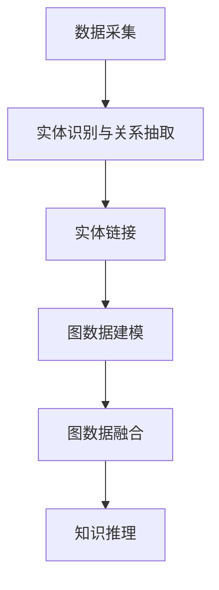
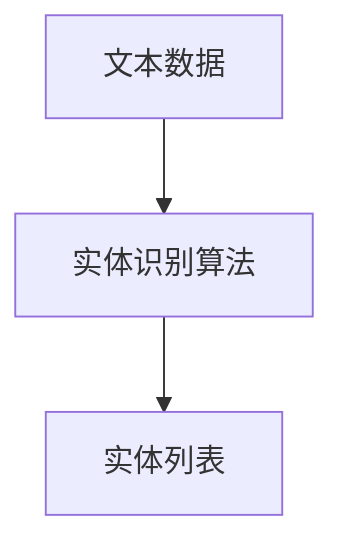
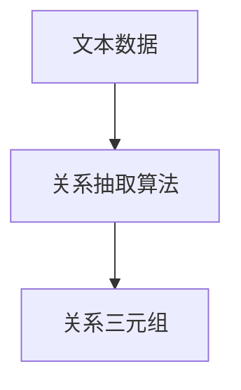
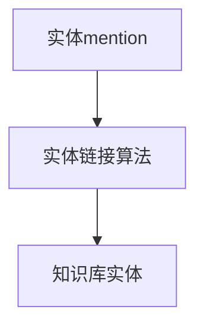

# 知识图谱 原理与代码实例讲解

## 1.背景介绍

### 1.1 什么是知识图谱

知识图谱(Knowledge Graph)是一种结构化的知识库,它以图的形式表示实体之间的关系。知识图谱由实体(Entity)和关系(Relation)两个基本元素组成,实体表示现实世界中的概念、事物或者对象,关系则描述实体之间的语义联系。

知识图谱通过将知识以结构化的形式存储,使得机器能够更好地理解和推理知识,从而为人工智能系统提供强大的知识支持。

### 1.2 知识图谱的应用

知识图谱在诸多领域都有广泛的应用,例如:

- 搜索引擎:提高搜索质量和相关性
- 问答系统:提供更准确的答案
- 推荐系统:基于知识进行个性化推荐
- 知识管理:有效组织和管理企业知识资产
- 数据集成:整合来自多个异构数据源的信息

### 1.3 知识图谱构建过程

构建知识图谱通常包括以下几个主要步骤:

1. 数据采集:从各种结构化和非结构化数据源收集相关数据
2. 实体识别与关系抽取:识别文本中的实体和关系
3. 实体链接:将识别出的实体链接到已有的知识库中
4. 图数据建模:将抽取的知识按照图数据模型进行组织和存储
5. 图数据融合:整合多个知识源,去除冗余和噪音数据
6. 知识推理:基于已有知识进行推理,发现新的知识

## 2.核心概念与联系

### 2.1 实体(Entity)

实体是知识图谱中最基本的构造单元,它表示现实世界中的概念、事物或对象。实体通常由一个唯一标识符(URI)来标识,并具有若干属性描述其特征。

例如,"北京"可以是一个实体,其属性包括:
- 类型:城市
- 人口:2170万
- 面积:16410平方公里

### 2.2 关系(Relation)

关系用于描述实体之间的语义联系。关系通常由一个谓词(Predicate)表示,连接主语实体(Subject)和宾语实体(Object)。

例如:
- 主语实体:"北京"
- 谓词:"首都"
- 宾语实体:"中国"

组成三元组(Triple)表示"北京是中国的首都"这一事实。

### 2.3 本体(Ontology)

本体定义了知识图谱中实体和关系的概念模型,包括类(Class)、属性(Property)、实例(Instance)等。本体为知识图谱提供了统一的概念框架和语义约束。

例如,本体可以定义"城市"是一个类,具有"人口"和"面积"两个数据属性,以及"首都"这一对象属性指向"国家"类。

## 3.核心算法原理具体操作步骤

### 3.1 实体识别

实体识别是从非结构化文本中识别出实体的过程。常用的算法有:

1. **基于规则的方法**:使用一系列的模式规则和词典来匹配实体
2. **基于统计学习的方法**:使用监督或无监督的机器学习算法训练模型识别实体
3. **基于深度学习的方法**:使用神经网络模型,如LSTM、BiLSTM等捕捉上下文语义信息

#### 3.1.1 基于规则的实体识别

规则方法通常包括以下步骤:

1. 构建词典:收集待识别实体类型的种子词典
2. 设计模式规则:根据实体的语法和语义特征设计正则表达式等规则
3. 基于词典和规则进行匹配:在文本中应用词典查找和模式匹配

例如,识别人名可以使用姓氏词典和"姓+名"的模式规则。

#### 3.1.2 基于统计学习的实体识别

统计学习方法通常包括:

1. 标注训练数据:人工标注一定量的文本数据作为训练集
2. 特征工程:提取文本的字符、词性、语法等特征作为模型输入
3. 训练分类模型:使用监督学习算法(如最大熵、条件随机场等)训练模型
4. 应用模型进行预测:将训练好的模型应用于新的文本进行实体识别

#### 3.1.3 基于深度学习的实体识别

深度学习方法利用神经网络自动学习文本的语义特征表示,主要步骤为:

1. 数据预处理:文本分词、构建词向量等
2. 模型构建:设计神经网络模型,如BiLSTM+CRF等
3. 模型训练:使用标注数据训练神经网络模型
4. 模型预测:将训练好的模型应用于新文本进行实体识别

### 3.2 关系抽取

关系抽取是从文本中识别出实体之间的语义关系的过程。常见的算法包括:

1. **基于模板的方法**:使用一系列的模板规则来匹配文本模式
2. **基于统计学习的方法**:使用监督或半监督的机器学习算法训练关系分类模型
3. **基于深度学习的方法**:使用神经网络模型捕捉上下文语义信息

#### 3.2.1 基于模板的关系抽取

模板方法通常包括以下步骤:

1. 构建模板库:根据关系的语义模式设计模板规则
2. 基于模板进行匹配:在文本中应用模板规则进行关系抽取

例如,识别"出生地"关系可以使用"X出生于Y"的模板规则。

#### 3.2.2 基于统计学习的关系抽取

统计学习方法通常包括:

1. 标注训练数据:人工标注一定量的文本数据作为训练集
2. 特征工程:提取文本的词性、语法依赖等特征作为模型输入
3. 训练分类模型:使用监督或半监督算法(如核方法、多示例学习等)训练模型
4. 应用模型进行预测:将训练好的模型应用于新的文本进行关系抽取

#### 3.2.3 基于深度学习的关系抽取

深度学习方法利用神经网络自动学习文本的语义特征表示,主要步骤为:

1. 数据预处理:文本分词、构建词向量等
2. 模型构建:设计神经网络模型,如CNN、LSTM等
3. 模型训练:使用标注数据训练神经网络模型
4. 模型预测:将训练好的模型应用于新文本进行关系抽取

### 3.3 实体链接

实体链接是将识别出的实体链接到已有知识库中的过程,确定实体的唯一标识符。主要算法包括:

1. **基于字符串相似度的方法**:计算实体mention字符串与知识库中实体名称的相似度
2. **基于语境相似度的方法**:利用实体在文本中的上下文信息与知识库中实体描述的相似度
3. **基于图结构的方法**:在知识图谱中寻找最优实体链接组合
4. **基于深度学习的方法**:使用神经网络模型学习实体mention与知识库实体的语义相似性

#### 3.3.1 基于字符串相似度的实体链接

该方法通过计算实体mention字符串与知识库中实体名称的相似度,选取最高分作为链接目标。常用的相似度计算方法有:

- 编辑距离(Edit Distance)
- Jaro-Winkler距离
- 字符串内核(String Kernel)

#### 3.3.2 基于语境相似度的实体链接

该方法利用实体在文本中的上下文信息,计算与知识库中实体描述的相似度,选取最高分作为链接目标。常用方法有:

- 词袋模型(Bag-of-Words)
- 主题模型(Topic Model)
- 嵌入表示(Embedding)

#### 3.3.3 基于图结构的实体链接

该方法将实体链接问题建模为在知识图谱中寻找最优实体链接组合的过程,常用的图算法有:

- 排序模型(Ranking Model)
- 随机游走(Random Walk)
- 基于路径等价的方法(Path Equivalence)

#### 3.3.4 基于深度学习的实体链接

该方法使用神经网络模型自动学习实体mention与知识库实体的语义相似性,主要步骤包括:

1. 数据预处理:构建实体mention与知识库实体的训练数据对
2. 模型构建:设计神经网络模型,如LSTM+Attention等
3. 模型训练:使用训练数据对训练神经网络模型
4. 模型预测:将训练好的模型应用于新的实体mention进行链接

## 4.数学模型和公式详细讲解举例说明

### 4.1 编辑距离(Edit Distance)

编辑距离是计算两个字符串之间相似度的一种方法,它表示将一个字符串转换为另一个字符串所需的最小编辑操作次数。常见的编辑操作包括:

- 插入一个字符
- 删除一个字符 
- 替换一个字符

编辑距离的计算公式如下:

$$
ED(s_1,s_2)=\begin{cases}
0 & \text{if }s_1=s_2=\empty\\
|s_1| & \text{if }s_2=\empty\\
|s_2| & \text{if }s_1=\empty\\
\min\begin{cases}
ED(s_1[0...|s_1|-2],s_2)+1\\
ED(s_1,s_2[0...|s_2|-2])+1\\
ED(s_1[0...|s_1|-2],s_2[0...|s_2|-2])+(s_1[|s_1|-1]\neq s_2[|s_2|-1])
\end{cases} & \text{otherwise}
\end{cases}
$$

其中$s_1$和$s_2$表示两个字符串,$|s|$表示字符串$s$的长度。

例如,计算"book"与"brook"的编辑距离:

1. 将"book"转换为"brook",需要替换一个字符"o"为"r",编辑距离为1
2. 将"brook"转换为"book",需要替换一个字符"r"为"o",编辑距离为1

因此,"book"与"brook"的编辑距离为1。

### 4.2 TF-IDF

TF-IDF(Term Frequency-Inverse Document Frequency)是一种常用的文本特征表示方法,用于计算一个词对于文档集或语料库的重要程度。

TF(Term Frequency)表示词在文档中出现的频率,IDF(Inverse Document Frequency)表示词在整个语料库中的普遍重要性程度。

一个词的TF-IDF权重计算公式如下:

$$
\text{tfidf}(t,d,D) = \text{tf}(t,d) \times \text{idf}(t,D)
$$

其中:

- $\text{tf}(t,d)$表示词$t$在文档$d$中的词频
- $\text{idf}(t,D)$表示词$t$在语料库$D$中的逆文档频率

词频$\text{tf}(t,d)$可以使用原始计数、二值计数或增强计数等方式计算。

逆文档频率$\text{idf}(t,D)$的计算公式为:

$$
\text{idf}(t,D) = \log\frac{|D|}{|\{d\in D:t\in d\}|}
$$

其中$|D|$表示语料库中文档的总数,$|\{d\in D:t\in d\}|$表示包含词$t$的文档数量。

TF-IDF能够很好地平衡词在文档中的重要性和在语料库中的普遍性,被广泛应用于信息检索、文本挖掘等领域。

### 4.3 Word2Vec

Wor