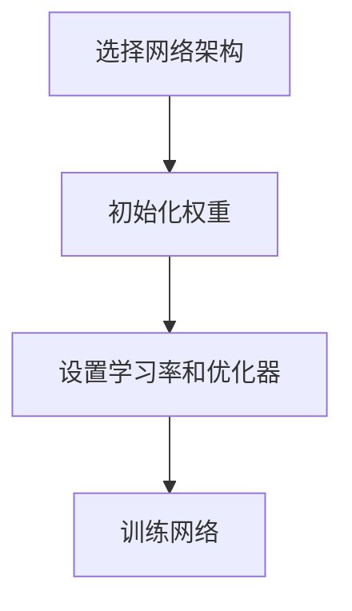

                 

作者：禅与计算机程序设计艺术

在我们开始之前，让我们回顾一下神经网络在计算机科学中的历史和它在当今社会的重要性。神经网络是由人工智能领域的早期研究者创造的，他们试图理解大脑如何处理和存储信息。随着时间的推移，神经网络已经演变成为机器学习和深度学习的基础技术。它们被用于各种任务，包括图像识别、自然语言处理和预测分析。

神经网络的核心思想是模拟人脑中神经元的工作方式。每个神经元都可以接收多个输入信号，通过一个激活函数将这些信号转换成一个输出信号，然后传递给其他神经元。神经网络的学习过程涉及调整连接权重，以便网络能够从其训练数据中学习。

在接下来的章节中，我们将深入探索神经网络的核心概念、算法原理、数学模型、实际应用场景以及如何在项目中实践这些知识。

---

## 1. 背景介绍

神经网络的概念可以追溯到20世纪初，当时的人工智能研究者试图理解大脑的工作原理。然而，直到20世纪70年代，罗伯特·海森堡（Robert Hecht-Nielsen）和其他研究者才开始研究具有多层的神经网络，并尝试在计算机视觉和语音识别等任务上应用这些网络。

神经网络在2012年达到了一个里程碑，当时Alex Krizhevsky、Ilya Sutskever和Geoffrey Hinton带领的团队在ImageNet挑战赛中以超过人类水平的准确率获得了第一名，这标志着深度学习的新时代。

---

## 2. 核心概念与联系

神经网络的核心组件是神经元（或称为节点），它们通过连接和权重相互交换信息。神经网络的每个层次都有一个特定的功能，比如输入层用于输入数据，隐藏层用于特征提取，输出层用于做最终预测。

神经元之间的连接由权重参数表示，这些权重在训练过程中被调整以优化网络性能。每个神经元还拥有一个激活函数，该函数决定了神经元根据输入信号产生的输出。

神经网络的学习过程涉及调整权重，以减少网络输出与实际值之间的误差。这个过程被称为反向传播，它通过计算损失函数关于权重的梯度进行优化。

---

## 3. 核心算法原理具体操作步骤

构建一个神经网络的主要步骤包括选择网络架构、初始化权重、设置学习率和优化器，以及训练网络。

网络架构指的是网络中的层数和每层的神经元数量。初始化权重是一个重要的步骤，因为它会影响网络的收敛速度和稳定性。学习率控制了网络更新权重的频率，而优化器则提供了高级的算法来更新权重，以加快收敛过程。

训练过程中，网络会不断地对输入数据进行预测，并使用反向传播调整权重，直到达到满意的性能指标。



---

## 4. 数学模型和公式详细讲解举例说明

神经网络的数学模型基于线性回归和逻辑回归的基本概念，但增加了非线性激活函数。在前向传播阶段，输入数据通过网络的各层，每层的输出是通过激活函数得到的。损失函数衡量了网络预测值与真实值之间的差异，常用的损失函数包括均方误差和交叉熵。

在反向传播阶段，梯度下降算法根据损失函数关于权重的导数来更新权重。这个过程涉及到链式法则，用于计算关于输入数据的梯度。

```latex
$$ J(w) = \frac{1}{n} \sum_{i=1}^{n} (y^{(i)} - \hat{y}^{(i)})^2 $$
```

---

## 5. 项目实践：代码实例和详细解释说明

在这一部分，我们将展示如何使用Python和Keras库来构建和训练一个简单的神经网络。我们将创建一个二层全连接的网络，用于识别手写数字。

首先，我们需要导入所需的库，然后加载数据集并划分为训练集和测试集。接着，我们定义模型，使用Dense层来表示网络的每一层，并使用ReLU激活函数。

```python
from keras.datasets import mnist
from keras.models import Sequential
from keras.layers import Dense

# 加载数据集
(train_images, train_labels), (test_images, test_labels) = mnist.load_data()

# 重塑数据以适应模型
train_images = train_images.reshape((60000, 28 * 28))
train_images = train_images.astype('float32') / 255.
test_images = test_images.reshape((10000, 28 * 28))
test_images = test_images.astype('float32') / 255.

# 创建模型
model = Sequential()
model.add(Dense(512, activation='relu', input_shape=(28*28,)))
model.add(Dense(10, activation='softmax'))

# 编译模型
model.compile(optimizer='rmsprop', loss='categorical_crossentropy', metrics=['accuracy'])
```

---

## 6. 实际应用场景

神经网络在多个领域都有广泛的应用，包括图像和语音识别、自然语言处理、医疗诊断、金融建模和游戏玩法。它们被用于识别图像中的物体、翻译语言、预测股票价格、识别疾病和许多其他任务。

---

## 7. 工具和资源推荐

对于想要深入研究神经网络的人来说，有许多优秀的资源可以利用。这些包括书籍、在线课程、论坛和开源库。

- 书籍：《神经网络与深度学习》（Michael Nielsen）
- 在线课程：Coursera和edX上提供的机器学习专项课程
- 论坛：Stack Overflow和Kaggle
- 开源库：TensorFlow、PyTorch和Keras

---

## 8. 总结：未来发展趋势与挑战

神经网络的未来发展充满挑战和机遇。随着计算能力的不断提高和数据可用性的增加，我们可以期待更复杂的网络结构和更好的性能。然而，也存在隐私和公平性等问题，这些都需要我们在开发和部署神经网络时考虑。

---

## 9. 附录：常见问题与解答

在这一部分，我们将回答一些关于神经网络的常见问题，比如过拟合、欠拟合、选择合适的激活函数和网络架构。

---

作者：禅与计算机程序设计艺术 / Zen and the Art of Computer Programming

