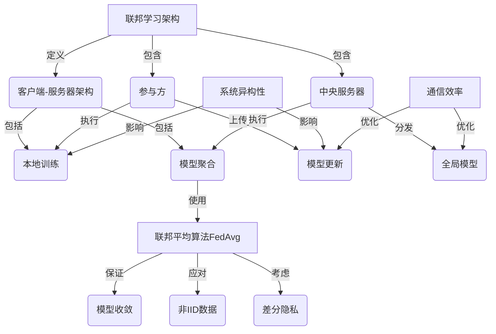

# 联邦学习(Federated Learning) - 原理与代码实例讲解

## 1. 背景介绍

### 1.1 大数据时代的隐私保护挑战

在当今大数据时代,数据被视为新的"石油",是推动人工智能和机器学习算法发展的关键燃料。然而,随着数据量的激增和数据类型的多样化,如何在保护个人隐私的同时,有效利用这些分散的数据资源,已经成为一个亟待解决的难题。

传统的集中式机器学习方法要求将所有训练数据集中在一个中心服务器上进行模型训练,这不仅存在数据隐私泄露的风险,而且由于数据孤岛的存在,也无法充分利用分散在不同机构和设备中的数据资源。因此,我们亟需一种新的机器学习范式,能够在不共享原始数据的前提下,利用多方分散的数据进行协同建模。

### 1.2 联邦学习(Federated Learning)的兴起

为了解决上述隐私保护与数据利用的矛盾,谷歌人工智能研究院于2016年提出了联邦学习(Federated Learning)的概念。联邦学习是一种全新的分布式机器学习范式,它允许多个参与方在不共享原始数据的情况下,共同训练出一个全局模型。

在联邦学习中,每个参与方只需在本地训练自己的数据子集,然后将本地模型的更新梯度或参数上传到一个中央服务器。中央服务器将所有参与方的模型更新进行聚合,得到一个新的全局模型,并将其分发给所有参与方,用于下一轮的本地训练。通过这种方式,联邦学习实现了模型而非数据的共享,从而保护了数据隐私,同时也充分利用了分散的数据资源。

## 2. 核心概念与联系

联邦学习涉及多个核心概念,包括联邦学习架构、联邦平均算法(FedAvg)、差分隐私、系统异构性和通信效率等,这些概念相互关联,共同构建了联邦学习的理论基础和实践框架。

### 2.1 联邦学习架构

联邦学习采用了一种分布式的客户端-服务器架构。在这种架构中,存在多个参与方(客户端)和一个中央服务器。每个参与方都拥有自己的本地数据集,并在本地进行模型训练。训练完成后,参与方将本地模型的更新梯度或参数上传到中央服务器。中央服务器则负责聚合所有参与方的模型更新,得到一个新的全局模型,并将其分发给所有参与方,用于下一轮的本地训练。

### 2.2 联邦平均算法(FedAvg)

联邦平均算法(FedAvg)是联邦学习中最广为人知的模型聚合算法。它的基本思想是,在每一轮迭代中,中央服务器从参与方那里收集本地模型的更新,然后对这些更新进行加权平均,得到一个新的全局模型。

FedAvg算法不仅保证了模型的收敛性,而且还能够很好地应对非独立同分布(Non-IID)数据的挑战。由于每个参与方的本地数据可能存在分布偏差,直接对模型进行平均聚合可能会导致模型性能下降。FedAvg通过在每个参与方上进行多轮本地训练,使得本地模型在一定程度上收敛到相似的区域,从而缓解了非IID数据带来的影响。

### 2.3 差分隐私

差分隐私是一种用于量化隐私保护程度的数学概念。在联邦学习中,差分隐私通常被应用于模型聚合过程,以防止单个参与方的数据对全局模型产生过大的影响,从而泄露隐私信息。

常见的差分隐私机制包括高斯噪声机制和拉普拉斯噪声机制等。这些机制通过在模型更新中引入一定程度的噪声,来掩盖个体数据对模型的影响,从而实现隐私保护。

### 2.4 系统异构性

在实际应用中,参与联邦学习的客户端设备通常存在着硬件、操作系统、网络条件等方面的异构性。这种异构性可能导致参与方之间的计算能力、通信延迟和带宽等存在显著差异,进而影响联邦学习的效率和性能。

为了应对系统异构性带来的挑战,联邦学习需要采取一些策略,如异步通信、自适应参数设置、客户端选择和资源分配等,以确保整个系统的稳定性和可扩展性。

### 2.5 通信效率

由于联邦学习涉及大量的模型参数传输,因此通信效率对于整个系统的性能至关重要。降低通信开销不仅可以节省带宽和能源,还能缩短训练时间,提高系统的响应速度。

常见的通信优化策略包括模型压缩、梯度压缩、延迟更新和分布式聚合等。这些策略旨在减小模型参数的传输大小,或者减少参与方与中央服务器之间的通信次数,从而提高通信效率。

## 3. 核心算法原理具体操作步骤

联邦学习的核心算法是联邦平均算法(FedAvg),它定义了参与方和中央服务器之间的交互过程,以及模型聚合的具体方式。下面我们将详细介绍FedAvg算法的原理和操作步骤。

### 3.1 FedAvg算法原理

FedAvg算法的基本思想是,在每一轮迭代中,中央服务器从参与方那里收集本地模型的更新,然后对这些更新进行加权平均,得到一个新的全局模型。具体来说,算法分为以下几个步骤:

1. **本地训练**: 每个参与方在本地数据集上进行多轮梯度下降,得到一个本地模型更新。
2. **模型上传**: 参与方将本地模型更新上传到中央服务器。
3. **模型聚合**: 中央服务器对所有参与方的模型更新进行加权平均,得到一个新的全局模型。
4. **模型分发**: 中央服务器将新的全局模型分发给所有参与方。
5. **迭代继续**: 参与方使用新的全局模型作为初始模型,进行下一轮的本地训练。

在模型聚合阶段,FedAvg算法使用了一种加权平均的方式,其中每个参与方的权重取决于其本地数据集的大小。具体来说,如果第k个参与方的本地数据集大小为n_k,总数据量为n,那么该参与方在模型聚合中的权重为n_k/n。

### 3.2 FedAvg算法步骤

下面是FedAvg算法的具体操作步骤:

1. **初始化**: 中央服务器初始化一个全局模型参数$\theta_0$,并将其分发给所有参与方。
2. **本地训练**: 对于每个参与方k,执行以下操作:
   a. 将全局模型参数$\theta_0$作为初始模型。
   b. 在本地数据集$D_k$上进行E轮梯度下降,得到本地模型更新$\Delta\theta_k$。
3. **模型上传**: 每个参与方k将本地模型更新$\Delta\theta_k$上传到中央服务器。
4. **模型聚合**: 中央服务器对所有参与方的模型更新进行加权平均,得到新的全局模型参数$\theta_{t+1}$:

$$\theta_{t+1} = \theta_t - \eta \sum_{k=1}^{K} \frac{n_k}{n} \Delta\theta_k$$

其中,$\eta$是学习率,n_k是第k个参与方的本地数据集大小,n是总数据量。
5. **模型分发**: 中央服务器将新的全局模型参数$\theta_{t+1}$分发给所有参与方。
6. **迭代继续**: 如果未达到停止条件,则返回步骤2,进行下一轮迭代。

需要注意的是,在实际应用中,FedAvg算法还需要考虑一些额外的因素,如参与方的选择策略、差分隐私机制的引入、异步通信等,以提高算法的鲁棒性和效率。

## 4. 数学模型和公式详细讲解举例说明

在联邦学习中,数学模型和公式起着至关重要的作用,它们不仅描述了算法的理论基础,还为算法的设计和分析提供了坚实的依据。下面我们将详细讲解一些核心的数学模型和公式,并通过具体的例子加深理解。

### 4.1 联邦学习的目标函数

在联邦学习中,我们的目标是在保护数据隐私的同时,找到一个能够很好地拟合所有参与方数据的全局模型。这可以被形式化为一个经验风险最小化问题:

$$\min_\theta F(\theta) = \sum_{k=1}^{K} \frac{n_k}{n} F_k(\theta)$$

其中,$\theta$表示模型参数,K是参与方的总数,n_k是第k个参与方的本地数据集大小,n是总数据量,F_k(\theta)是第k个参与方的本地损失函数。

我们的目标是找到一个$\theta$,使得总体损失函数F(\theta)最小化。由于每个参与方只能访问自己的本地数据,因此无法直接优化总体损失函数。联邦学习通过迭代地优化每个参与方的本地损失函数,并在中央服务器进行模型聚合,来逼近总体最优解。

### 4.2 FedAvg算法的收敛性分析

FedAvg算法的收敛性是一个重要的理论问题,它保证了算法在一定条件下能够收敛到一个最优解或者一个临界点。下面我们将介绍FedAvg算法的收敛性分析。

假设每个参与方的本地损失函数F_k(\theta)是连续可微的,并且存在一个全局最小值$\theta^*$,使得$F(\theta^*) = \min_\theta F(\theta)$。我们further假设每个参与方在本地训练时使用的是梯度下降算法,并且学习率$\eta$满足一定条件。

在这些假设下,FedAvg算法的收敛性可以被证明。具体来说,如果算法运行足够多的迭代次数T,那么最终的模型参数$\theta_T$将收敛到一个$\epsilon$邻域内,即:

$$F(\theta_T) - F(\theta^*) \leq \epsilon$$

其中,$\epsilon$是一个任意小的正数。

这个结果表明,通过不断地进行本地训练和模型聚合,FedAvg算法最终能够找到一个接近全局最优解的模型。需要注意的是,收敛性分析中的一些假设(如连续可微性、全局最小值存在等)在实际应用中可能不一定成立,因此算法的实际表现可能会有所偏差。

### 4.3 差分隐私机制

为了保护参与方的数据隐私,联邦学习通常会引入差分隐私机制。差分隐私是一种量化隐私保护程度的数学概念,它要求算法的输出对于相邻数据集(只有一个记录不同)的影响是有限的。

常见的差分隐私机制包括拉普拉斯机制和高斯机制等。以拉普拉斯机制为例,它通过在模型更新中加入一个拉普拉斯噪声,来掩盖个体数据对模型的影响。具体来说,如果我们要保护一个函数f的$\epsilon