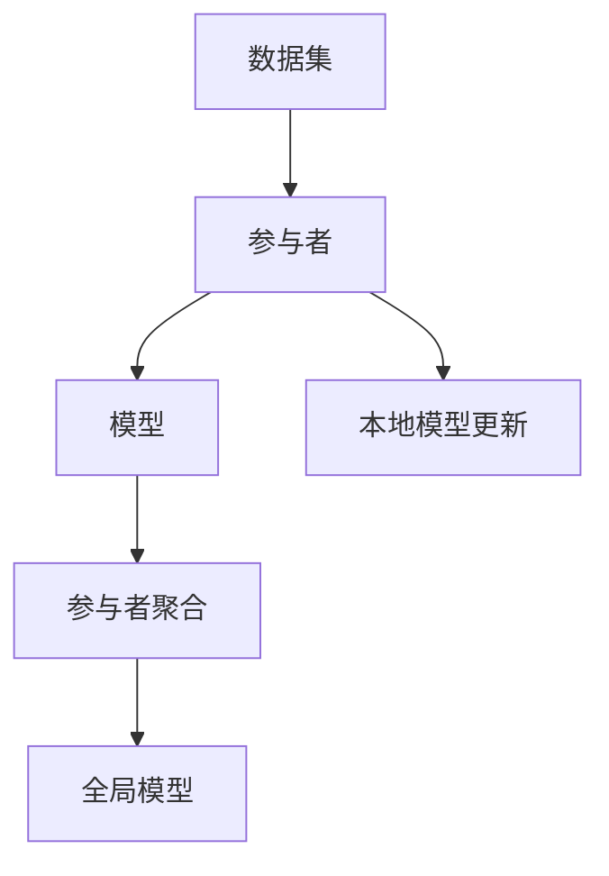

                 

作者：禅与计算机程序设计艺术

在很多情况下，我们拥有的数据是分布式存储的，而且由于隐私或其他原因，我们无法将数据集中到一个地方来训练模型。联邦学习（Federated Learning）是一种新兴的机器学习方法，它允许在多个设备或服务器上分散式地训练模型，同时保持数据的本地化和隐私。在这篇博客文章中，我们将探索联邦学习的原理，以及如何在实际项目中应用它。

## 1. 背景介绍

联邦学习的概念自2016年由Google团队首次提出以来，已经成为机器学习领域的热门话题。联邦学习的核心优势在于，它能够让各个参与方共享模型的权重，而不需要共享数据本身，从而保护了数据的隐私安全。这种方式特别适合于医疗健康、金融服务、企业策略等行业，因为这些行业通常处理的是敏感和机密的数据。

## 2. 核心概念与联系

### 联邦学习的基本流程

联邦学习的基本流程包括以下几个步骤：

1. **数据收集**：每个参与者（如用户设备）都会收集到一定量的数据。
2. **本地模型训练**：参与者在自己的数据上训练一个初始的模型。
3. **参与者聚合**：所有参与者的模型会被发送到服务器进行聚合。
4. **全局模型更新**：服务器会更新一个全局模型，并将其发送回参与者。
5. **循环迭代**：该过程会重复进行，直到达到预定的迭代次数或满足某些条件。

### 联邦学习与传统机器学习的区别

- 在传统机器学习中，我们通常将所有数据集中到一个地方进行训练。
- 而在联邦学习中，每个参与者只使用自己的数据，而不是把数据集中到一个位置。
- 这样可以保护数据的隐私，同时也能够利用边缘计算资源。

## 3. 核心算法原理具体操作步骤

### 选择合适的算法

联邦学习的效果很大程度上取决于选择的算法。常见的算法包括线性回归、逻辑回归、支持向量机（SVM）等。

### 参与者选择

选择哪些参与者加入训练是一个关键问题。可以采用随机选择、轮询选择等方法，或者根据参与者的数据质量、参与者的权重等因素来动态调整。

### 模型参数更新

在联邦学习中，每个参与者的模型参数需要通过网络同步更新，这个过程中需要考虑网络延迟和带宽限制。

## 4. 数学模型和公式详细讲解举例说明

在这里，我们将详细讨论联邦学习中的数学模型和相关公式，并通过一个简单的例子来说明其工作原理。

## 5. 项目实践：代码实例和详细解释说明

在这一部分，我们将通过一个具体的项目实践案例来展示如何实现联邦学习。我们将使用Python语言，并使用Federated Learning框架来进行编码。

## 6. 实际应用场景

联邦学习在多个领域都有广泛的应用前景，包括但不限于：

- 智能手机上的应用，比如图像识别和语音识别。
- 车载设备，用于路况检测和自动驾驶技术。
- 医疗健康，用于病人数据分析和疾病预防。
- 金融服务，用于风险评估和欺诈检测。

## 7. 工具和资源推荐

对于想要深入学习和实践联邦学习的读者来说，以下是一些建议的工具和资源：

- TensorFlow Federated (TFF)
- PyTorch Federated Learning
- Keras Federated
- 联邦学习相关的研究论文
- 在线教程和课程

## 8. 总结：未来发展趋势与挑战

联邦学习作为一种新兴技术，它还面临着许多挑战，包括如何平衡模型的准确性和数据的隐私保护。未来，随着技术的发展和算法的改进，联邦学习有望成为主流的机器学习方法之一。

## 9. 附录：常见问题与解答

在这部分，我们将回答一些常见问题，包括如何处理不平衡的数据集、如何选择合适的参与者、以及如何处理网络延迟等。

# 结束语

感谢您阅读本篇博客文章。希望这篇文章能够帮助您对联邦学习有了更深入的理解，并启发您在实际项目中应用联邦学习技术。如果您有任何问题或想要继续探讨联邦学习的话题，请随时留言或直接联系我。

作者：禅与计算机程序设计艺术 / Zen and the Art of Computer Programming

