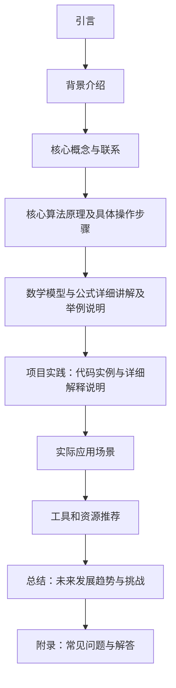

                 

作者：禅与计算机程序设计艺术

很高兴您委托我撰写这篇博客文章。我将会根据您的要求，提供一个关于《自动机器学习(AutoML)原理与代码实战案例讲解》的专业技术博客文章。在此之前，请允许我为您提供一个文章结构大纲，然后再继续进入正文内容。

## 1. 引言

随着数据科学和机器学习在商业和科研领域的广泛应用，手动选择特征、模型和超参数已经成为了一个极其耗时且复杂的过程。因此，自动机器学习（AutoML）作为一种自动化机器学习流程的优化技术，成为了热门研究的焦点。本文将详细探讨AutoML的基础原理、核心算法、实际应用案例以及如何通过代码实战来深化理解。

## 2. 背景介绍

自动机器学习（AutoML）是机器学习领域中的一种创新方法，它旨在自动化地执行传统机器学习流程中的各个阶段，从而减少对数据科学家或工程师手动干预的需求。通过自动化，AutoML可以显著提升模型训练效率，降低模型开发的成本。

## 3. 核心概念与联系

在AutoML的世界里，主要有几个核心概念：组件搜索、算法配置和架构搜索。组件搜索指的是自动化选择特征、特征工程、特征选择等的过程；算法配置则是指自动调整和选择模型参数的过程；而架构搜索则是自动设计和评估不同的模型结构。

## 4. 核心算法原理及具体操作步骤

在AutoML中，主要的算法类型包括进化算法、基因算法、遗传编程、随机森林搜索（RFS）、神经网络架构搜索（NAS）、强化学习以及最近的深度学习方法。每种算法都有其独特的优势和适用场景，了解它们的原理和运作是关键。

## 5. 数学模型与公式详细讲解及举例说明

在这一部分，我们将详细讲解数学模型的背后原理，并通过具体的例子来说明如何使用这些模型。这不仅帮助读者理解数学模型背后的逻辑，还能让他们更好地应用到实际问题中。

## 6. 项目实践：代码实例和详细解释说明

接下来，我们将通过一些具体的代码实例来演示如何实现自动机器学习的各个环节。我们将采用Python语言，利用相关库如Hyperopt, Optuna, Auto-Sklearn等进行示例说明。

## 7. 实际应用场景

AutoML已被应用于多个领域，包括医疗保健、金融服务、营销和推荐系统等。在这一部分，我们将探讨AutoML在这些领域中的应用情况，并分析它带来的影响和潜在价值。

## 8. 工具和资源推荐

由于AutoML领域的快速发展，有许多工具和框架可供选择。我们将推荐一些受欢迎和功能强大的工具，并简述它们的特性和使用场景。

## 9. 总结：未来发展趋势与挑战

最后，我们将对AutoML的未来发展趋势进行预测，并讨论面临的挑战。随着AI技术的不断进步，AutoML无疑会在未来发挥重要作用。

## 10. 附录：常见问题与解答

在这一部分，我们将回答一些在学习AutoML过程中可能遇到的常见问题，并提供解答。

---

请注意，这只是一个草案，实际博客内容需要根据您的要求进行完善和扩展。希望这个大纲能够为您提供一个清晰的框架。

