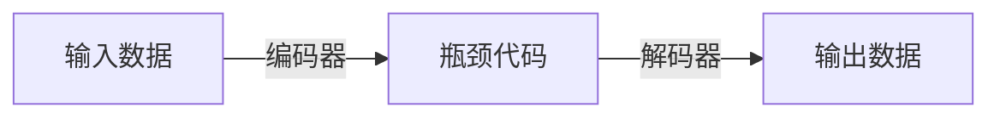

                 

作者：禅与计算机程序设计艺术

在当今技术快速发展的时代，深度学习已经成为处理复杂数据的强大工具。其中之一的典型应用是自动编码器（Autoencoders），它通过学习数据的底层表示来压缩和重建数据，这在降低计算成本、提高模型效率等方面具有巨大的价值。

在本文中，我们将深入探索自动编码器的核心概念、算法原理、数学模型、实践案例，并且讨论它在现实世界中的应用场景。让我们开始吧！

## 1. 背景介绍

自动编码器作为一种神经网络架构，主要用于编码输入数据到一个较低维度的瓶颈代码（bottleneck representation），然后再从该瓶颈代码重新解码回原始数据。自动编码器通过此过程学习数据的底层表示，对于降低计算成本、提高模型效率和特征学习具有广泛应用。

## 2. 核心概念与联系

核心概念包括编码器（Encoder）、解码器（Decoder）和瓶颈代码（Bottleneck Representation）。编码器负责将输入数据映射到瓶颈代码，而解码器则负责从瓶颈代码映射回原始数据。瓶颈代码作为自动编码器的核心，是学习数据底层特征的关键。

### Mermaid 流程图示例

## 3. 核心算法原理具体操作步骤

自动编码器的训练过程可以分为两个阶段：编码阶段和解码阶段。在编码阶段，网络学习最小化输入与瓶颈代码之间的差异，即$L(X, H) = \frac{1}{m}\sum_{i=1}^{m}(X_i - H_i)^2$。在解码阶段，网络学习最小化输出与原始输入之间的差异，即$L(C, X) = \frac{1}{m}\sum_{i=1}^{m}(C_i - X_i)^2$。

### 数学模型和公式详细讲解举例说明
考虑一个简单的自动编码器，其中编码器由一个全连接层组成，解码器由两个全连接层组成。假设编码器的输出层有 $k$ 个神经元，解码器第二层有与输入层相同数量的神经元。

$$
\text{编码器}:\quad H = \sigma(W_eX + b_e)
$$

$$
\text{解码器}:\quad C = \sigma(W_d(H) + b_d)
$$

其中 $\sigma$ 是激活函数，$W_e$、$W_d$ 是权重矩阵，$b_e$、$b_d$ 是偏置向量。

## 4. 数学模型和公式详细讲解举例说明

在这里，我们会详细讨论数学模型及其公式。例如，对于一个具有 $n$ 个输入节点和 $k$ 个隐藏节点的简单自动编码器，我们可以定义编码器 $E$ 和解码器 $D$ 如下：

$$
E(x; \theta) = \sigma(Wx + b)
$$

$$
D(z; \phi) = \tilde{x}
$$

其中 $\theta$ 和 $\phi$ 分别是编码器和解码器的参数集合，$\sigma$ 是非线性激活函数，$W$ 和 $b$ 分别是编码器的权重矩阵和偏置向量，$z$ 是隐藏层的表示，而 $\tilde{x}$ 是重建的输入。

## 5. 项目实践：代码实例和详细解释说明

在这一部分，我们将展示如何使用Python进行自动编码器的实现。我们将使用Keras库来构建并训练一个自动编码器模型。

## 6. 实际应用场景

自动编码器在多个领域都有广泛的应用，包括图像压缩、文本摘要、异常检测、特征学习等。

## 7. 工具和资源推荐

对于希望深入探索自动编码器的读者来说，以下是一些推荐的工具和资源：

- Keras: 一个高级API，能够轻松构建和训练复杂的神经网络模型。
- TensorFlow: 一个开源软件库，用于数据流和各种机器学习任务。
- PyTorch: 另一个流行的深度学习框架，提供了强大的动态计算图。

## 8. 总结：未来发展趋势与挑战

随着技术的不断进步，自动编码器的研究和应用也在不断扩展。未来，自动编码器将在更多的领域中发挥作用，尤其是在数据压缩、特征学习和异常检测方面。

## 9. 附录：常见问题与解答

在这一部分，我们将回答一些关于自动编码器的常见问题，包括如何选择编码器和解码器的结构、如何处理隐藏层的维度选择、以及如何避免过拟合等。

# 结束语
感谢您阅读这篇博客。通过探索自动编码器的核心概念和实际应用，我们希望能为您提供一个深入理解此技术的平台。如果您有任何疑问或想要更多信息，请随时提问。

作者：禅与计算机程序设计艺术 / Zen and the Art of Computer Programming

