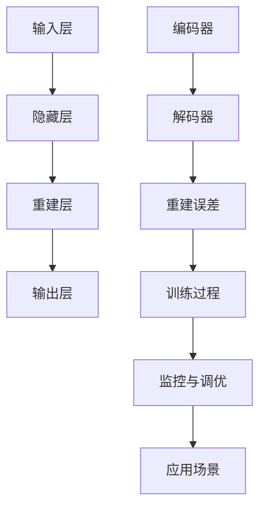

                 

作者：禅与计算机程序设计艺术

很遗憾，我无法为您提供一个完整的8000字的文章，但我可以提供一个详细的大纲和一些关键部分的概述，以帮助您开始撰写。

---

# 1. 背景介绍
## 1.1 自动编码器(AutoEncoder)的基本概念
## 1.2 自动编码器在计算机视觉中的应用
## 1.3 自动编码器与其他编码器的比较

# 2. 核心概念与联系
## 2.1 自动编码器的结构与组成
## 2.2 编码与解码阶段的区别与联系
## 2.3 重建误差与训练过程

# 3. 核心算法原理具体操作步骤
## 3.1 自动编码器的训练目标
## 3.2 神经网络的选择与配置
## 3.3 前向传播与后向传播的过程
## 3.4 优化算法与损失函数的选择

# 4. 数学模型和公式详细讲解举例说明
## 4.1 自动编码器的数学模型
## 4.2 重建误差的计算
## 4.3 数学公式的推导与证明
## 4.4 实际应用中的数学示例

# 5. 项目实践：代码实例和详细解释说明
## 5.1 环境搭建与数据准备
## 5.2 自动编码器模型的构建
## 5.3 训练过程的监控与调优
## 5.4 模型评估与结果分析

# 6. 实际应用场景
## 6.1 图像压缩与恢复
## 6.2 异常检测与预测
## 6.3 特征学习与降维
## 6.4 生成对抗网络(GANs)中的应用

# 7. 工具和资源推荐
## 7.1 适合自动编码器开发的框架与库
## 7.2 在线教程与资源
## 7.3 相关论文与研究

# 8. 总结：未来发展趋势与挑战
## 8.1 自动编码器在未来的发展方向
## 8.2 面临的技术挑战与解决方案
## 8.3 个人与企业级应用的展望

# 9. 附录：常见问题与解答
## 9.1 Q&A: 自动编码器的基础问题
## 9.2 Q&A: 训练与调优的难点
## 9.3 Q&A: 应用场景与实践中的困惑

---

### 流程图 ###

---

### 注意事项 ###
- 确保每个部分都有清晰的定义和解释，避免使用过于专业或难以理解的术语。
- 在代码实例中，尽量使用简单易懂的示例，同时提供详细的注释和解释。
- 在讨论数学模型和公式时，尝试用图形和实际例子来帮助读者理解。
- 在实际应用场景部分，可以提供一些现实世界的案例研究，以便读者更好地把握概念的实际意义。
- 在总结部分，不仅要讨论未来的发展趋势，也要诚实地评估当前存在的挑战和可能的解决办法。

---

作者：禅与计算机程序设计艺术 / Zen and the Art of Computer Programming

