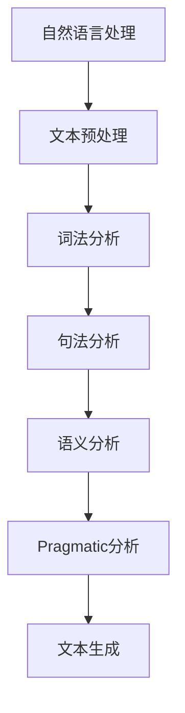
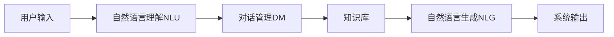
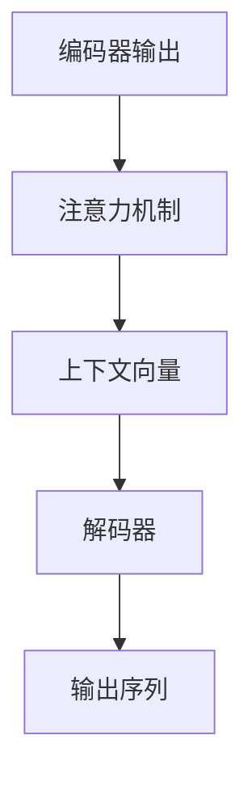
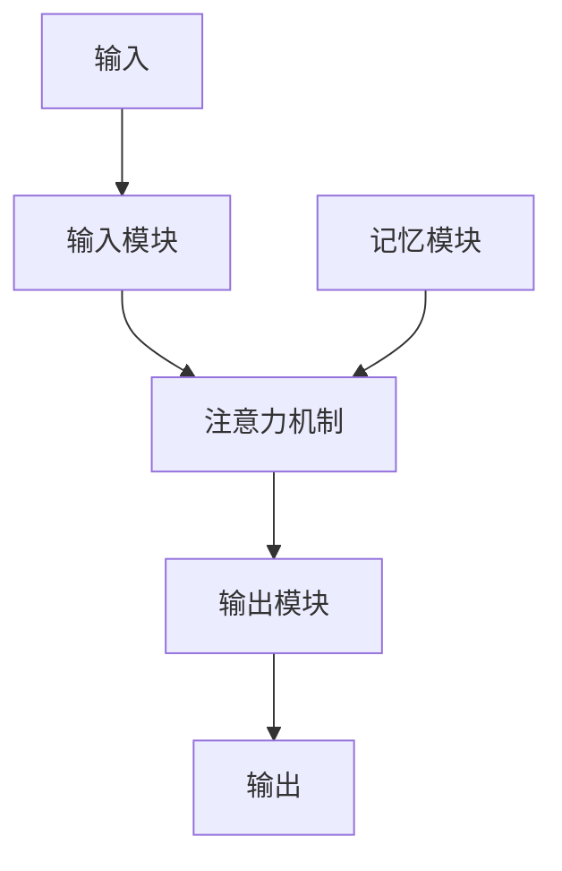
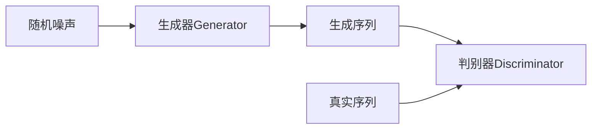

# 自然语言交互与对话系统原理与代码实战案例讲解

## 1. 背景介绍

### 1.1 自然语言处理的重要性

在当今信息时代,人机交互已经成为一种必不可少的技术。随着人工智能(AI)和自然语言处理(NLP)技术的不断发展,自然语言交互系统逐渐成为各大科技公司的研究热点。自然语言交互系统旨在让人类能够以自然语言(如英语、中文等)与计算机进行自然交流,实现无缝沟通。

### 1.2 对话系统的应用场景

自然语言对话系统在诸多领域都有广泛的应用,例如:

- 智能助手(Siri、Alexa、小米小爱同学等)
- 客户服务机器人
- 问答系统
- 语音识别与语音合成
- 机器翻译
- 信息检索与知识图谱构建

### 1.3 对话系统的挑战

尽管自然语言处理技术取得了长足进步,但构建一个人机自然对话系统仍然面临诸多挑战:

- 语义理解难度大
- 上下文信息的把握
- 知识库的构建和引入
- 自然语言的复杂多变性
- 开放域对话的生成

## 2. 核心概念与联系

### 2.1 自然语言处理(NLP)

自然语言处理是人工智能的一个分支,旨在使计算机能够理解和生成自然语言。它包括以下几个关键步骤:

1. 文本预处理
2. 词法分析
3. 句法分析
4. 语义分析
5. pragmatic分析
6. 文本生成



### 2.2 对话系统架构

一个典型的对话系统架构包括以下几个模块:

1. 自然语言理解(NLU)
2. 对话管理(DM)
3. 自然语言生成(NLG)
4. 知识库



### 2.3 核心算法

对话系统涉及多种核心算法,包括但不限于:

- 序列到序列模型(seq2seq)
- 注意力机制(Attention Mechanism)
- 记忆网络(Memory Network)
- 生成式对抗网络(GAN)

## 3. 核心算法原理具体操作步骤  

### 3.1 序列到序列模型(Seq2Seq)

序列到序列模型是构建对话系统的核心算法之一,它可以将一个序列(如用户输入的自然语言)映射到另一个序列(如系统的自然语言回复)。该模型通常由两部分组成:编码器(Encoder)和解码器(Decoder)。


1. **编码器(Encoder)步骤**:
    - 将输入序列(如用户输入的自然语言)转换为词向量序列
    - 使用RNN(循环神经网络)或Transformer等模型对词向量序列进行编码
    - 得到上下文向量(context vector),表示输入序列的语义信息

2. **解码器(Decoder)步骤**:
    - 使用上下文向量和先前生成的词作为输入
    - 通过RNN或Transformer预测下一个词
    - 重复上一步,直到生成完整序列(如系统回复)

### 3.2 注意力机制(Attention Mechanism)

注意力机制是seq2seq模型的一个重要改进,它允许模型在生成每个词时,专注于输入序列的不同部分。这有助于捕捉长距离依赖关系,提高模型性能。



1. 计算注意力权重向量
2. 使用注意力权重向量对编码器输出进行加权求和,得到上下文向量
3. 将上下文向量连同当前隐藏状态,输入到解码器生成下一个词

### 3.3 记忆网络(Memory Network)

记忆网络是一种将外部知识库与seq2seq模型相结合的架构,可用于构建基于知识的对话系统。它由以下几个关键组件组成:

1. **输入模块**: 对输入进行编码
2. **记忆模块**: 存储知识库信息
3. **注意力机制**: 从记忆模块中选取相关信息
4. **输出模块**: 生成最终输出



记忆网络的工作流程:

1. 输入模块将输入(如用户查询)编码为向量表示
2. 注意力机制根据输入向量,从记忆模块(知识库)中选取相关信息
3. 输出模块将注意力加权的记忆信息与输入向量结合,生成最终输出

### 3.4 生成式对抗网络(GAN)

生成式对抗网络是一种用于生成自然语言的有前景方法。它由两个对抗模型组成:生成器(Generator)和判别器(Discriminator)。



1. **生成器(Generator)步骤**:
    - 输入随机噪声
    - 生成看似真实的序列(如自然语言回复)
    - 目标是欺骗判别器

2. **判别器(Discriminator)步骤**:
    - 输入生成器生成的序列和真实序列
    - 判断输入序列是真是假
    - 目标是正确区分真假

生成器和判别器相互对抗,最终达到生成器生成的序列无法被判别器区分的状态。

## 4. 数学模型和公式详细讲解举例说明

### 4.1 Word Embedding

Word Embedding是将单词映射到连续向量空间的技术,常用的方法有Word2Vec、GloVe等。它是自然语言处理的基础,可以捕捉单词之间的语义关系。

对于一个单词 $w_i$,它的词向量表示为 $\vec{v}_{w_i} \in \mathbb{R}^d$,其中 $d$ 是词向量的维度。

Word2Vec 使用两种模型学习词向量:

1. **Skip-gram 模型**

$$\max_{\theta} \frac{1}{T}\sum_{t=1}^{T}\sum_{-c \leq j \leq c, j \neq 0} \log P(w_{t+j}|w_t; \theta)$$

其中 $c$ 是上下文窗口大小, $\theta$ 是模型参数。目标是最大化给定中心词 $w_t$ 时,预测上下文词 $w_{t+j}$ 的条件概率。

2. **连续词袋模型(CBOW)** 

$$\max_{\theta} \frac{1}{T}\sum_{t=1}^{T}\log P(w_t|w_{t-c}, ..., w_{t-1}, w_{t+1}, ..., w_{t+c}; \theta)$$

目标是最大化给定上下文词时,预测中心词 $w_t$ 的条件概率。

### 4.2 注意力机制(Attention Mechanism)

注意力机制是seq2seq模型的关键改进,它允许模型在生成每个目标词时,专注于源序列的不同部分。

对于一个长度为 $T_x$ 的源序列 $\boldsymbol{x} = (x_1, x_2, ..., x_{T_x})$ 和一个部分生成的目标序列 $\boldsymbol{y} = (y_1, y_2, ..., y_{T_y'})$,注意力权重 $\alpha_{t,t'}$ 表示生成目标词 $y_{t'}$ 时对源词 $x_t$ 的关注程度,计算如下:

$$\alpha_{t,t'} = \frac{\exp(e_{t,t'})}{\sum_{k=1}^{T_x} \exp(e_{t,k})}$$

其中 $e_{t,t'}$ 是注意力能量函数,常用的有加性注意力、点积注意力等。

最后,上下文向量 $c_{t'}$ 是所有源词的加权和:

$$c_{t'} = \sum_{t=1}^{T_x} \alpha_{t,t'} \boldsymbol{h}_t$$

其中 $\boldsymbol{h}_t$ 是源序列在位置 $t$ 的编码器隐藏状态。

上下文向量 $c_{t'}$ 将与当前解码器隐藏状态结合,预测下一个目标词 $y_{t'+1}$。

### 4.3 记忆网络(Memory Network)

记忆网络是一种将外部知识库与seq2seq模型相结合的架构。其核心思想是使用注意力机制从知识库中选取相关信息,辅助生成最终输出。

假设有一个知识库 $\mathcal{K} = \{\boldsymbol{k}_1, \boldsymbol{k}_2, ..., \boldsymbol{k}_N\}$,其中每个 $\boldsymbol{k}_i$ 是一个知识表示向量。给定一个查询向量 $\boldsymbol{q}$,我们需要从知识库中选取相关信息,生成回复向量 $\boldsymbol{r}$。

注意力权重 $\alpha_i$ 表示查询向量 $\boldsymbol{q}$ 与知识向量 $\boldsymbol{k}_i$ 的相关性:

$$\alpha_i = \text{softmax}(\boldsymbol{q}^\top \boldsymbol{k}_i)$$

然后,知识库的输出向量 $\boldsymbol{o}$ 是所有知识向量的加权和:

$$\boldsymbol{o} = \sum_{i=1}^N \alpha_i \boldsymbol{k}_i$$

最后,回复向量 $\boldsymbol{r}$ 由查询向量 $\boldsymbol{q}$ 和知识库输出向量 $\boldsymbol{o}$ 共同决定:

$$\boldsymbol{r} = f(\boldsymbol{q}, \boldsymbol{o})$$

其中 $f$ 可以是前馈神经网络、RNN等模型。

## 5. 项目实践: 代码实例和详细解释说明

在这一部分,我们将通过一个基于 PyTorch 的 Seq2Seq 对话系统示例,来展示如何将上述理论付诸实践。完整代码可在 GitHub 上获取: [https://github.com/zhangyzz/Chatbot-Seq2Seq](https://github.com/zhangyzz/Chatbot-Seq2Seq)

### 5.1 数据预处理

```python
# 加载数据
with open('cornell_movie_dialogs_corpus/movie_lines.txt', encoding='utf-8', errors='ignore') as f:
    lines = f.readlines()

# 构建对话对
convs = []
for line in lines:
    parts = line.strip().split(' +++$+++ ')
    if len(parts) == 5:
        conv = [parts[4].strip()] # 对话
        convs.append(conv)

# 构建词汇表
word2id = {'