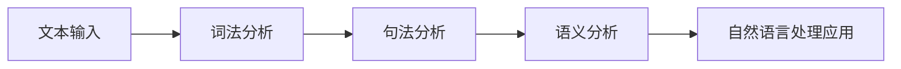

# 自然语言处理(Natural Language Processing)原理与代码实战案例讲解

## 1. 背景介绍
### 1.1 自然语言处理的定义与发展历程
#### 1.1.1 自然语言处理的定义
自然语言处理(Natural Language Processing, NLP)是人工智能(Artificial Intelligence, AI)的一个重要分支,旨在让计算机能够理解、处理和生成人类语言。它涉及语言学、计算机科学、数学等多个学科领域的交叉融合。

自然语言处理的主要目标是让计算机能够像人一样理解和使用自然语言进行交流。这包括理解语言的语法结构、语义含义,以及语言在不同场景下的应用。通过自然语言处理技术,我们可以实现人机交互、信息检索、机器翻译、情感分析等多种应用。

#### 1.1.2 自然语言处理的发展历程
自然语言处理的研究可以追溯到20世纪50年代。早期的研究主要集中在语言的形式化表示和基于规则的处理方法。随着计算机技术的发展和大数据时代的到来,自然语言处理进入了一个快速发展的阶段。

近年来,深度学习技术的兴起为自然语言处理带来了革命性的变化。基于深度学习的方法,如循环神经网络(RNN)、长短期记忆网络(LSTM)、注意力机制(Attention Mechanism)等,极大地提高了自然语言处理的性能和效果。

### 1.2 自然语言处理的应用场景
#### 1.2.1 智能客服与对话系统
自然语言处理技术可以用于构建智能客服和对话系统。通过理解用户的问题和意图,系统可以给出相应的回答和服务,提高客户服务的效率和质量。

#### 1.2.2 信息检索与搜索引擎  
自然语言处理技术在信息检索和搜索引擎中发挥着重要作用。通过对文本内容进行分析和理解,搜索引擎可以更准确地匹配用户的查询,提供相关的搜索结果。

#### 1.2.3 机器翻译
机器翻译是自然语言处理的一个重要应用。通过对源语言进行分析和理解,再将其转换为目标语言,机器翻译系统可以实现不同语言之间的自动翻译。

#### 1.2.4 情感分析与舆情监测
自然语言处理技术可以用于情感分析和舆情监测。通过分析文本中表达的情感倾向和观点,可以了解用户对产品、服务或事件的看法,为决策提供参考。

## 2. 核心概念与联系
### 2.1 词法分析
#### 2.1.1 分词(Tokenization)
分词是将连续的文本划分为独立的词汇单元(token)的过程。在中文中,分词是一个具有挑战性的任务,因为中文文本没有明显的词边界。常见的分词方法包括基于字典的分词、统计机器学习分词等。

#### 2.1.2 词性标注(Part-of-Speech Tagging)
词性标注是为每个词汇单元分配词性标签(如名词、动词、形容词等)的过程。词性信息对于理解词汇在句子中的语法功能和语义角色非常重要。常见的词性标注方法包括基于规则的方法和统计机器学习方法。

### 2.2 句法分析
#### 2.2.1 成分句法分析(Constituent Parsing) 
成分句法分析是将句子划分为语法成分(如名词短语、动词短语等)并构建句法树的过程。句法树表示了句子的层次结构和语法关系。常见的成分句法分析方法包括基于规则的方法和统计机器学习方法。

#### 2.2.2 依存句法分析(Dependency Parsing)
依存句法分析是分析句子中词汇之间的依存关系,构建依存树的过程。依存树表示了词汇之间的支配和修饰关系。常见的依存句法分析方法包括基于转移的方法和基于图的方法。

### 2.3 语义分析 
#### 2.3.1 命名实体识别(Named Entity Recognition)
命名实体识别是从文本中识别出命名实体(如人名、地名、机构名等)并确定其类型的任务。命名实体识别对于信息提取、知识图谱构建等应用非常重要。常见的命名实体识别方法包括基于规则的方法和统计机器学习方法。

#### 2.3.2 语义角色标注(Semantic Role Labeling)
语义角色标注是识别句子中的语义角色(如施事、受事、时间、地点等)并将其与句子中的成分对应起来的任务。语义角色信息对于理解句子的深层语义结构非常重要。常见的语义角色标注方法包括基于规则的方法和统计机器学习方法。

### 2.4 核心概念之间的联系
自然语言处理的各个核心概念之间存在着紧密的联系。词法分析是句法分析和语义分析的基础,句法分析的结果可以为语义分析提供重要的结构信息。同时,语义分析也可以反过来帮助改进句法分析的效果。这些概念相互依存、相互促进,共同构成了自然语言处理的核心内容。

下面是自然语言处理核心概念之间联系的 Mermaid 流程图:

## 3. 核心算法原理具体操作步骤
### 3.1 基于统计机器学习的方法
#### 3.1.1 隐马尔可夫模型(Hidden Markov Model, HMM)
隐马尔可夫模型是一种常用的统计机器学习模型,广泛应用于词性标注、命名实体识别等任务。HMM 的基本思想是将问题建模为一个生成式模型,通过观察序列和隐藏状态序列的联合概率分布来描述问题。

HMM 的具体操作步骤如下:
1. 定义隐藏状态集合和观察符号集合。
2. 定义状态转移概率矩阵和观察概率矩阵。
3. 使用前向-后向算法计算观察序列的概率。
4. 使用 Viterbi 算法求解最优隐藏状态序列。
5. 使用 Baum-Welch 算法进行参数估计和模型训练。

#### 3.1.2 条件随机场(Conditional Random Field, CRF)
条件随机场是另一种常用的统计机器学习模型,特别适用于序列标注任务,如词性标注、命名实体识别等。CRF 是一种判别式模型,直接对条件概率进行建模,考虑了观察序列和标签序列之间的复杂依赖关系。

CRF 的具体操作步骤如下:
1. 定义特征函数,刻画观察序列和标签序列之间的关系。
2. 定义 CRF 模型的条件概率分布。
3. 使用前向-后向算法计算归一化因子。
4. 使用 Viterbi 算法求解最优标签序列。
5. 使用梯度下降等优化算法进行参数估计和模型训练。

### 3.2 基于深度学习的方法
#### 3.2.1 循环神经网络(Recurrent Neural Network, RNN)
循环神经网络是一种适用于处理序列数据的深度学习模型。RNN 通过引入循环连接,使得网络能够捕捉序列数据中的长距离依赖关系。常见的 RNN 变体包括 LSTM 和 GRU,它们通过引入门控机制来缓解梯度消失和梯度爆炸问题。

RNN 的具体操作步骤如下:
1. 将输入序列映射为词向量表示。
2. 通过循环连接,逐步更新隐藏状态。
3. 根据任务的不同,在每个时间步或最后一个时间步进行输出。
4. 使用反向传播算法计算梯度并更新模型参数。

#### 3.2.2 卷积神经网络(Convolutional Neural Network, CNN)
卷积神经网络最初用于图像处理领域,但也被成功应用于自然语言处理任务。CNN 通过卷积操作和池化操作,能够捕捉文本中的局部特征和语义信息。

CNN 在自然语言处理中的具体操作步骤如下:
1. 将文本转换为词向量表示。
2. 使用一维卷积对词向量进行卷积操作,提取局部特征。
3. 使用池化操作对卷积结果进行降维和特征聚合。
4. 将池化结果传递给全连接层进行分类或预测。
5. 使用反向传播算法计算梯度并更新模型参数。

#### 3.2.3 注意力机制(Attention Mechanism)
注意力机制是一种用于提高模型性能和可解释性的技术。它通过引入注意力权重,使模型能够关注输入序列中的重要部分,并在进行预测时有选择地利用这些信息。

注意力机制的具体操作步骤如下:
1. 计算查询向量(query)、键向量(key)和值向量(value)。
2. 计算查询向量和键向量之间的相似度得分。
3. 对相似度得分进行归一化,得到注意力权重。
4. 使用注意力权重对值向量进行加权求和,得到注意力输出。
5. 将注意力输出与原始输入进行融合,得到最终的表示。

## 4. 数学模型和公式详细讲解举例说明
### 4.1 隐马尔可夫模型(HMM)
隐马尔可夫模型由以下几个部分组成:
- 状态集合 $S=\{s_1,s_2,\dots,s_N\}$,其中 $N$ 是状态的数量。
- 观察符号集合 $O=\{o_1,o_2,\dots,o_M\}$,其中 $M$ 是观察符号的数量。
- 状态转移概率矩阵 $A=[a_{ij}]_{N\times N}$,其中 $a_{ij}=P(s_j|s_i)$ 表示从状态 $s_i$ 转移到状态 $s_j$ 的概率。
- 观察概率矩阵 $B=[b_j(k)]_{N\times M}$,其中 $b_j(k)=P(o_k|s_j)$ 表示在状态 $s_j$ 下生成观察符号 $o_k$ 的概率。
- 初始状态概率向量 $\pi=[\pi_i]_{1\times N}$,其中 $\pi_i=P(s_i)$ 表示初始时刻处于状态 $s_i$ 的概率。

HMM 的三个基本问题:
1. 评估问题:给定模型 $\lambda=(A,B,\pi)$ 和观察序列 $O=\{o_1,o_2,\dots,o_T\}$,计算观察序列的概率 $P(O|\lambda)$。
2. 解码问题:给定模型 $\lambda=(A,B,\pi)$ 和观察序列 $O=\{o_1,o_2,\dots,o_T\}$,求最可能的隐藏状态序列 $I=\{i_1,i_2,\dots,i_T\}$。
3. 学习问题:给定观察序列 $O=\{o_1,o_2,\dots,o_T\}$,估计模型参数 $\lambda=(A,B,\pi)$ 使得 $P(O|\lambda)$ 最大。

前向-后向算法用于解决评估问题,其中前向概率 $\alpha_t(i)$ 和后向概率 $\beta_t(i)$ 的计算公式如下:

$$
\alpha_t(i) = P(o_1,o_2,\dots,o_t,i_t=s_i|\lambda)
$$

$$
\beta_t(i) = P(o_{t+1},o_{t+2},\dots,o_T|i_t=s_i,\lambda)
$$

Viterbi 算法用于解决解码问题,其中 Viterbi 变量 $\delta_t(i)$ 的计算公式如下:

$$
\delta_t(i) = \max_{i_1,i_2,\dots,i_{t-1}} P(i_1,i_2,\dots,i_{t-1},i_t=s_i,o_1,o_2,\dots,o_t|\lambda)
$$

Baum-Welch 算法用于解决学习问题,通过迭代的方式估计模型参数,使得观察