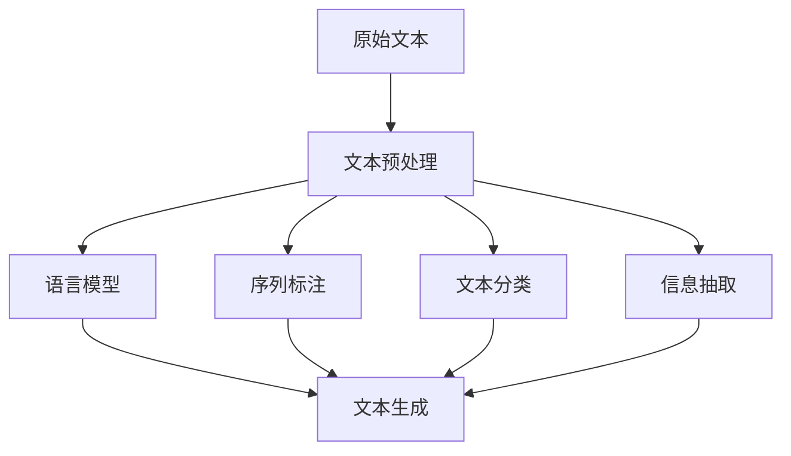
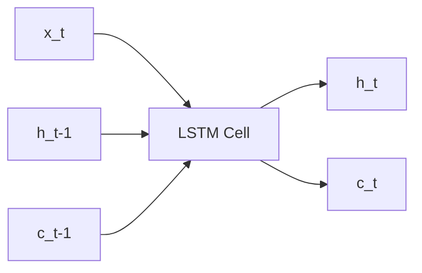
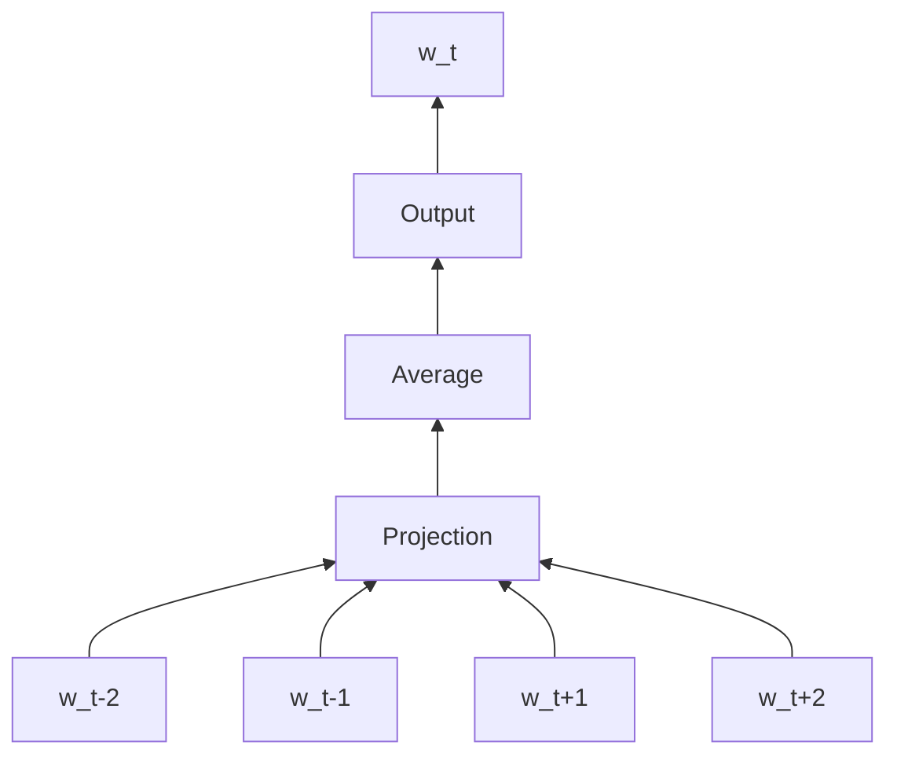
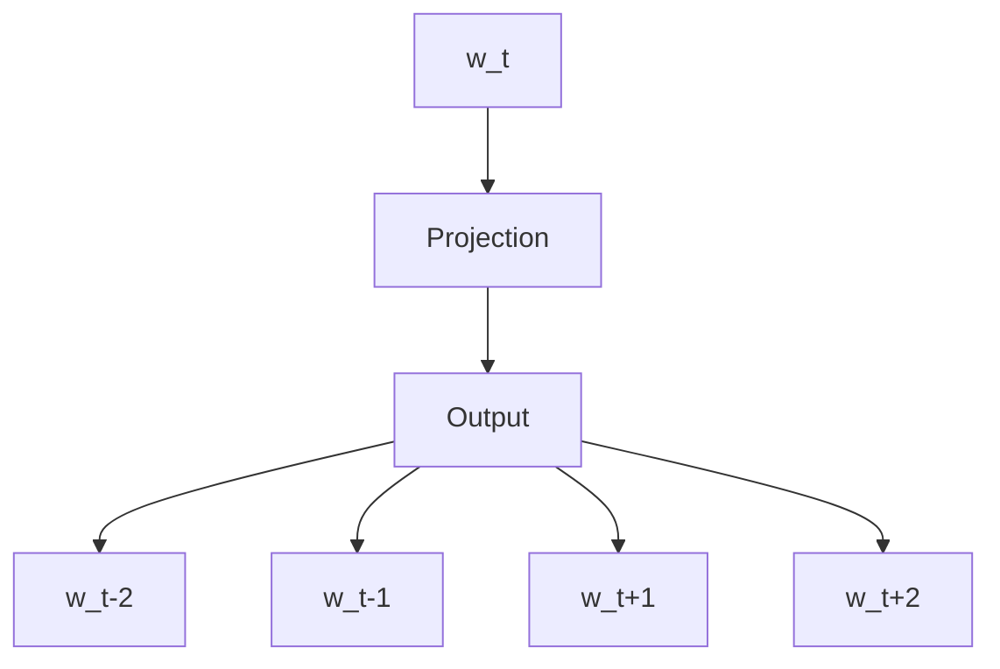

# 自然语言处理NLP原理与代码实例讲解

## 1. 背景介绍
### 1.1 什么是自然语言处理
自然语言处理(Natural Language Processing,NLP)是人工智能(Artificial Intelligence, AI)的一个重要分支,旨在赋予计算机理解、生成和处理人类语言的能力。它涉及计算机科学、语言学、数学等多个学科领域的交叉融合。

### 1.2 自然语言处理的发展历程
自然语言处理的研究可以追溯到20世纪50年代,经历了基于规则、统计学习和深度学习三个主要阶段:

- 20世纪50年代到80年代,以基于规则的方法为主,利用语言学知识构建复杂的规则系统。代表系统有ELIZA、SHRDLU等。
- 20世纪80年代到2010年,统计学习方法崛起,通过从大规模语料库中学习统计规律进行NLP任务。代表模型有HMM、CRF等。 
- 2010年至今,深度学习方法大放异彩,利用神经网络从海量数据中自动学习特征,在机器翻译、问答系统、情感分析等任务上取得了突破性进展。代表模型有RNN、CNN、Transformer等。

### 1.3 自然语言处理的应用场景
NLP在现实生活中有着广泛的应用,典型场景包括:

- 机器翻译:谷歌翻译、百度翻译等
- 智能客服:阿里小蜜、京东JIMI等
- 语音助手:苹果Siri、小米小爱同学等  
- 舆情监控:政务舆情监测、企业声誉管理等
- 知识图谱:谷歌知识图谱、微软Satori等
- 医疗健康:医疗记录信息抽取、临床决策支持等

随着人工智能技术的不断发展,NLP将在更多领域发挥重要作用,为人类生活带来更多便利。

## 2. 核心概念与联系
### 2.1 文本预处理
将原始文本转化为适合算法模型处理的格式化数据,通常包括:

- 分词:将连续的文本切分成独立的词语
- 去除停用词:过滤掉常见的虚词、标点等无意义词语
- 词形还原:将词语归一化为原形,如复数、时态还原
- 文本表示:将词语转化为数值向量,常见方法有one-hot、word2vec等

### 2.2 语言模型 
用于刻画语言中词语组合规律的概率模型,常见类型有:

- N-gram:基于(n-1)阶马尔可夫假设,利用前n-1个词预测第n个词
- 神经语言模型:用神经网络学习词语间的复杂依赖关系,代表模型有NNLM、RNNLM等

语言模型是许多NLP任务的基础,如机器翻译、语音识别、文本生成等。

### 2.3 序列标注
为输入序列中的每个元素分配一个类别标签,常见任务有:

- 词性标注:判断每个词的词性,如名词、动词等
- 命名实体识别:识别文本中的实体,如人名、地名、机构名等
- 语义角色标注:判断词语在句子中的语义角色,如施事、受事等

常用模型有HMM、CRF、BiLSTM-CRF等。

### 2.4 文本分类
将整段文本划分到预定义的类别,如:

- 情感分析:判断文本的情感倾向,如正面、负面、中性
- 主题分类:判断文本的主题类别,如体育、娱乐、财经等
- 意图识别:判断文本的意图,如查询、指令等

常用方法有朴素贝叶斯、SVM、FastText、TextCNN等。

### 2.5 信息抽取
从非结构化文本中提取结构化信息,代表任务有:

- 关系抽取:从文本中抽取实体间的关系,如A公司收购B公司
- 事件抽取:从文本中抽取事件及其论元,如地震事件的时间、地点、震级等
- 观点抽取:抽取文本中的观点对象、观点词、情感倾向等

常用方法有基于规则、基于特征、基于深度学习的方法。

### 2.6 文本生成
自动生成自然流畅、语义连贯的文本,常见任务有:

- 机器翻译:将一种语言的文本翻译成另一种语言
- 文本摘要:从长文本中提取关键信息,生成简短摘要 
- 对话生成:根据上下文自动生成恰当的对话回复

传统的方法以统计机器翻译为代表,当前主流方法是基于Encoder-Decoder框架的神经网络模型,如Seq2Seq、Transformer等。

### 2.7 主要概念之间的关系
下图展示了上述主要概念在NLP任务中的关系:

从原始文本出发,经过文本预处理变成结构化数据。在此基础上,可以训练语言模型、进行序列标注、文本分类和信息抽取。这些中间结果可以作为文本生成任务的输入,帮助生成更加自然、流畅、符合语义的文本。

## 3. 核心算法原理具体操作步骤
本节以LSTM(Long Short-Term Memory)为例,介绍序列标注任务的核心算法原理和操作步骤。LSTM是一种特殊的RNN(Recurrent Neural Network),常用于处理序列数据。

### 3.1 LSTM的网络结构
LSTM的基本结构是循环神经网络,包含输入门、遗忘门、输出门三种门控机制,可以有效缓解RNN中的梯度消失问题。其网络结构如下:

其中,x_t是t时刻的输入,h_t和c_t分别是t时刻的隐藏状态和记忆细胞状态,是LSTM的核心。三种门控机制的计算公式为:

- 输入门: $i_t = \sigma(W_i \cdot [h_{t-1}, x_t] + b_i)$
- 遗忘门: $f_t = \sigma(W_f \cdot [h_{t-1}, x_t] + b_f)$  
- 输出门: $o_t = \sigma(W_o \cdot [h_{t-1}, x_t] + b_o)$

$\tilde{C_t} = \tanh(W_C \cdot [h_{t-1}, x_t] + b_C)$ 

记忆细胞状态和隐藏状态的更新公式为:

$C_t = f_t * C_{t-1} + i_t * \tilde{C_t}$

$h_t = o_t * \tanh(C_t)$

### 3.2 基于LSTM的序列标注步骤

以命名实体识别任务为例,介绍基于LSTM的序列标注具体步骤:

- 输入表示:将词语转化为词向量,常用的词嵌入模型有word2vec、glove等 

- LSTM编码:使用双向LSTM对输入序列进行编码,捕捉词语前后的上下文信息。公式为:

$\overrightarrow{h_t}=LSTM(x_t, \overrightarrow{h_{t-1}}) $

$\overleftarrow{h_t}=LSTM(x_t, \overleftarrow{h_{t+1}})$

$h_t=[\overrightarrow{h_t}, \overleftarrow{h_t}]$

- CRF解码:在LSTM的隐藏层输出上添加一层CRF层,学习标签之间的转移规律,进行序列标注。常用的标注策略有BIOES(Begin、Inside、Outside、End、Single)。

CRF层的得分函数为: $s(X,y)=\sum_{i=0}^n P_{i,y_i} + \sum_{i=1}^n A_{y_{i-1},y_i}$ 

其中,P_{i,y_i}是LSTM第i个节点输出类别为y_i的非归一化概率,A_{y_{i-1},y_i}是标签y_{i-1}到y_i的转移概率。

预测时,使用Viterbi算法求得分函数的最大值对应的标注序列: $y^* = \arg \max_{y} s(X,y)$

- 训练:使用反向传播和梯度下降算法训练模型参数,优化目标是最大化训练集上的对数似然函数:

$L(\theta)= \sum_{i=1}^N \log p(y_i|x_i;\theta)$

其中,$\theta$是模型参数,N是训练样本数。

- 预测:使用训练好的模型对新的输入序列进行标注。

以上是基于LSTM的序列标注任务的主要步骤。通过词嵌入表示输入、LSTM编码学习上下文信息、CRF解码学习标签约束,再经过端到端的训练,即可构建一个高效的序列标注模型。该方法广泛应用于命名实体识别、词性标注、语义角色标注等任务。

## 4. 数学模型和公式详细讲解举例说明
本节以word2vec词嵌入模型为例,详细讲解其数学原理。word2vec可以将词语映射为稠密的实值向量,捕捉词语之间的语义关系。它包含两种模型:CBOW(Continuous Bag-of-Words)和Skip-gram。

### 4.1 CBOW模型
CBOW模型的目标是根据上下文词语来预测中心词。其网络结构如下:

假设词表大小为V,词向量维度为N,上下文窗口大小为C。对于第t个词w_t,其上下文词语为$w_{t-C},...,w_{t-1},w_{t+1},...,w_{t+C}$。

输入层到投影层的权重矩阵为$W \in \mathbb{R}^{V \times N}$,投影层到输出层的权重矩阵为$W' \in \mathbb{R}^{N \times V}$。

对于上下文词语$w_i(i \in [t-C,t+C], i \neq t)$,其one-hot向量为$x_i \in \mathbb{R}^V$,词向量为$v_i=W^T x_i \in \mathbb{R}^N$。

将上下文词语的词向量取平均得到投影层的输出:$h=\frac{1}{2C}\sum_{i=t-C,i \neq t}^{t+C} v_i$

输出层是一个softmax回归,以h为输入预测中心词w_t:

$p(w_t|w_{t-C},...,w_{t-1},w_{t+1},...,w_{t+C})=\text{softmax}(W'^T h)$

模型的优化目标是最小化负对数似然函数:

$J=-\log p(w_t|w_{t-C},...,w_{t-1},w_{t+1},...,w_{t+C})$

$=-\log \frac{\exp(W'^T_{\cdot w_t} h)}{\sum_{i=1}^V \exp(W'^T_{\cdot i} h)}$

使用随机梯度下降法对$W$和$W'$进行更新,迭代多轮直至收敛。

### 4.2 Skip-gram模型 
Skip-gram模型与CBOW相反,它的目标是根据中心词来预测上下文词语。网络结构如下:

对于中心词w_t,其one-hot向量为$x \in \mathbb{R}^V$,词向量为$v=W^T x \in \mathbb{R}^N$。

输出层是C个softmax回归,分别预测上下文词语$w_{t-C},...,w_{t-1},w_{t+1},...,w_{t+C}$:

$p(w_{t+j}|w_t)=\text{softmax}(W'^T_j v), j \in [-C,-1] \cup [1,C]$

模型的优化目标是最大化上下文词语的联合概率: