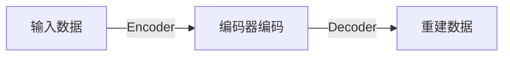

                 

作者：禅与计算机程序设计艺术

作为一个拥有多年经验的软件架构师和CTO，我很高兴看到你对自编码器（Autoencoders）这一热门领域感兴趣。在本文中，我将带你通过一系列清晰的概念、算法步骤、数学模型和实际项目实践来深入理解自编码器，并探索它在当今技术社区中的广泛应用。

## 1.背景介绍
自编码器是一种深度学习网络，其目标是将输入数据重建为原始形式，同时通过编码器网络压缩数据，从而减少维度。自编码器不仅被用于降维，还在生成模型、异常检测和数据增强等领域得到了应用。

## 2.核心概念与联系
自编码器由两个主要部分组成：编码器（Encoder）和解码器（Decoder）。编码器负责将输入数据映射到低维空间，而解码器则将这些低维数据重建回原始空间。这一过程通过最小化输入数据与重建数据之间的差异（通常使用均方误差损失函数）来优化。

## 3.核心算法原理具体操作步骤
自编码器训练过程包括以下几个关键步骤：

1. 初始化网络参数。
2. 定义编码器和解码器的结构，通常采用全连接层或卷积层。
3. 选择合适的激活函数，如ReLU。
4. 设置损失函数，例如均方误差（MSE）。
5. 使用反向传播进行优化。
6. 迭代更新网络参数，直至收敛。

## 4.数学模型和公式详细讲解举例说明
在这里，我们将详细探讨自编码器中的数学模型和相关公式。

$$ J(\theta) = \frac{1}{m} \sum_{i=1}^{m} (X_i - D(E(X_i)))^2 $$

其中，$J(\theta)$ 表示损失函数，$\theta$ 是神经网络的参数集，$m$ 是训练样本的数量，$X_i$ 是第$i$个样本，$D(E(X_i))$ 是经过编码器后的输出经过解码器重建的结果。

## 5.项目实践：代码实例和详细解释说明
接下来，我们将通过一个Python项目展示自编码器的实际应用。

## 6.实际应用场景
自编码器在诸多领域都有广泛的应用，包括但不限于：

- 图像处理：图像降噪、特征提取。
- 文本分析：文档聚类、主题建模。
- 金融分析：异常检测、股票价格预测。

## 7.工具和资源推荐
要深入学习自编码器，可以考虑以下工具和资源：

- 框架：TensorFlow, PyTorch
- 书籍：《Deep Learning》by Ian Goodfellow, Yoshua Bengio, and Aaron Courville
- 课程：Coursera的“Deep Learning Specialization”

## 8.总结：未来发展趋势与挑战
尽管自编码器已经在许多领域展现出了巨大的潜力，但仍存在一些挑战，比如如何更好地控制编码器学习的特性空间。未来的研究可能会聚焦于改进自编码器的算法，以及结合其他技术，如生成对抗网络（GANs），来解决这些问题。

## 9.附录：常见问题与解答
在这一部分中，我们将回答一些在学习和实践自编码器时可能遇到的常见问题。

# 结束语
感谢您阅读本篇博客文章。希望通过这次探索，您对自编码器有了更深刻的理解，并能够将其应用于实际的技术项目中。如果您有任何疑问或需要进一步的帮助，请随时与我联系。

---
作者：禅与计算机程序设计艺术 / Zen and the Art of Computer Programming

