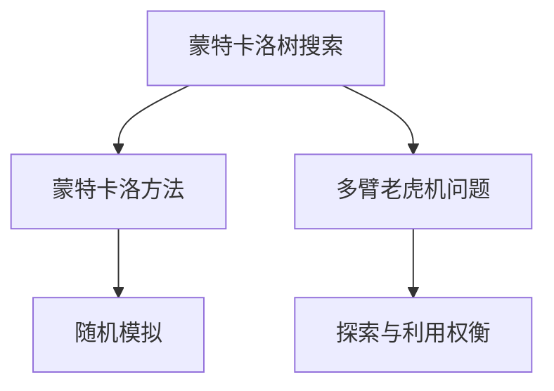
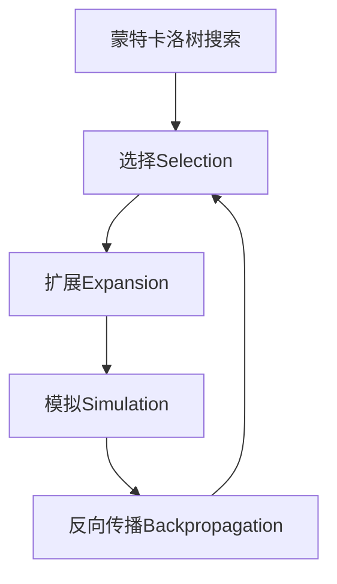
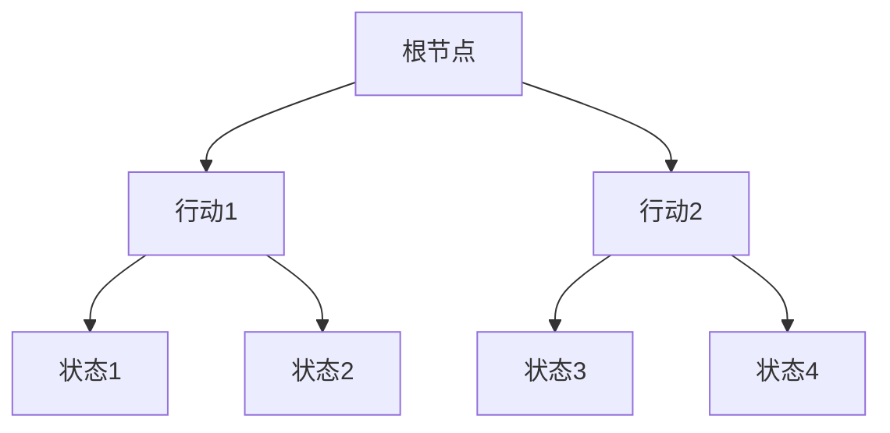
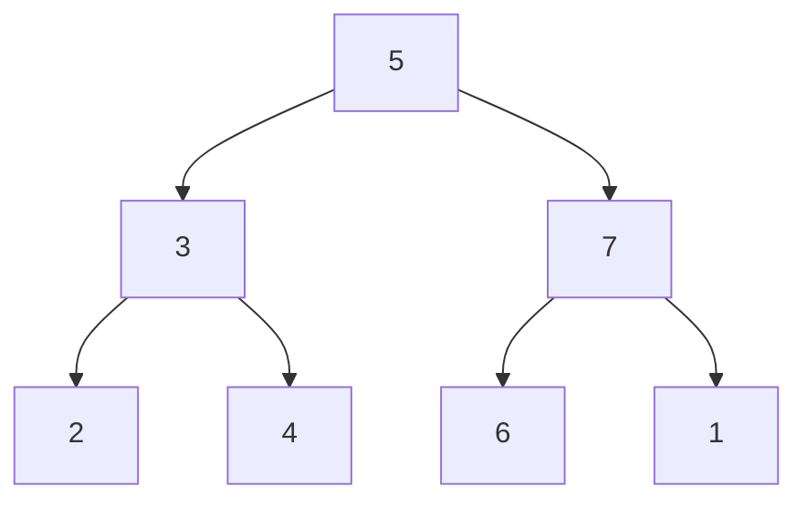

# 蒙特卡洛树搜索(Monte Carlo Tree Search) - 原理与代码实例讲解

## 1. 背景介绍

蒙特卡洛树搜索(Monte Carlo Tree Search, MCTS)是一种基于随机采样的决策过程，被广泛应用于游戏人工智能、规划和优化等领域。它通过在游戏树中进行有策略的随机模拟,逐步构建一个更准确的评估函数,从而找到最佳的行动策略。MCTS算法在计算机围棋、国际象棋和游戏人工智能等领域取得了巨大的成功。

### 1.1 传统搜索算法的局限性

在游戏人工智能领域,传统的搜索算法如深度优先搜索、广度优先搜索和A*算法等,通常会遇到以下挑战:

- **组合爆炸问题**: 随着搜索深度的增加,需要探索的状态空间呈指数级增长,计算量快速膨胀。
- **缺乏有效的评估函数**: 对于复杂的游戏,很难设计出一个准确的评估函数来估计每个状态的价值。
- **难以处理信息不完备的情况**: 在很多实际应用中,我们无法获取完整的信息,传统算法难以应对这种情况。

### 1.2 蒙特卡洛树搜索的优势

相比传统算法,蒙特卡洛树搜索具有以下优势:

- **高效利用计算资源**: 通过有策略的随机模拟,MCTS能够快速探索可能的行动序列,避免耗费大量计算资源在无效的搜索路径上。
- **在线学习评估函数**: MCTS不需要预先定义评估函数,而是通过不断的模拟来逐步改进评估函数,适应复杂的状态空间。
- **处理信息不完备的能力**: MCTS可以通过随机模拟来估计缺失信息对最终结果的影响,从而更好地应对信息不完备的情况。

## 2. 核心概念与联系

### 2.1 蒙特卡洛方法

蒙特卡洛方法是一种通过重复随机抽样来获得数值结果的计算方法。它的核心思想是使用随机数来模拟某种随机过程,并根据大量实验结果的统计规律来估计所求解的问题。

蒙特卡洛树搜索算法借鉴了蒙特卡洛方法的思想,通过在游戏树上进行大量随机模拟,来估计每个状态的价值,从而指导搜索方向。

### 2.2 多臂老虎机问题

多臂老虎机(Multi-Armed Bandit)问题是一个经典的探索与利用权衡(Exploration-Exploitation Tradeoff)问题。在这个问题中,我们需要在多个不同的选择(臂)之间进行决策,每个选择都有不同的收益分布。我们需要在探索新的选择(获取更多信息)和利用已知的最佳选择(获取最大收益)之间进行权衡。

MCTS算法中的UCB(Upper Confidence Bound)公式就是借鉴了多臂老虎机问题中的思想,在选择下一步行动时,需要平衡探索新的行动路径和利用已知的最佳路径。



## 3. 核心算法原理具体操作步骤

蒙特卡洛树搜索算法主要包括四个步骤:选择(Selection)、扩展(Expansion)、模拟(Simulation)和反向传播(Backpropagation)。这四个步骤循环进行,直到达到预定的计算资源限制或找到满意的解。



### 3.1 选择(Selection)

在选择阶段,从根节点开始,根据一定的策略选择下一步要遍历的节点,直到到达一个未被充分探索的节点。常用的选择策略是UCB(Upper Confidence Bound)公式:

$$
UCB = \frac{Q(s,a)}{N(s,a)} + c \sqrt{\frac{2\ln N(s)}{N(s,a)}}
$$

其中:

- $Q(s,a)$是状态$s$执行行动$a$后的价值估计
- $N(s,a)$是状态$s$执行行动$a$的模拟次数
- $N(s)$是状态$s$的总模拟次数
- $c$是一个调节探索与利用权衡的常数

UCB公式平衡了利用已知的最佳行动($Q(s,a)/N(s,a)$项)和探索新的未知行动($\sqrt{2\ln N(s)/N(s,a)}$项)。

### 3.2 扩展(Expansion)

当选择阶段到达一个未被充分探索的节点时,进入扩展阶段。在这个阶段,我们从当前节点创建一个或多个子节点,代表可能的后续行动。新创建的子节点被添加到游戏树中,为后续的模拟做准备。

### 3.3 模拟(Simulation)

在模拟阶段,从扩展得到的新节点开始,执行一个随机的模拟,直到达到终止条件(如游戏结束或达到最大模拟深度)。这个过程通常使用一个快速且简单的策略,例如随机游戏。模拟的结果被用于更新游戏树中相应节点的统计信息。

### 3.4 反向传播(Backpropagation)

在反向传播阶段,模拟的结果从叶节点开始,沿着模拟路径向上传播,更新每个经过节点的统计信息。通常,我们会更新节点的访问次数$N(s,a)$和价值估计$Q(s,a)$。价值估计可以是简单的模拟结果,也可以是一个更复杂的评估函数。

经过多次选择、扩展、模拟和反向传播,游戏树逐渐被构建,节点的统计信息也越来越准确。最终,我们可以选择根节点的子节点中具有最大价值估计的行动作为最佳行动。

## 4. 数学模型和公式详细讲解举例说明

### 4.1 UCB公式

UCB(Upper Confidence Bound)公式是蒙特卡洛树搜索算法中用于选择下一步行动的关键公式。它平衡了利用已知的最佳行动和探索新的未知行动之间的权衡。

$$
UCB = \frac{Q(s,a)}{N(s,a)} + c \sqrt{\frac{2\ln N(s)}{N(s,a)}}
$$

- $Q(s,a)$是状态$s$执行行动$a$后的价值估计,通常是模拟结果的平均值。
- $N(s,a)$是状态$s$执行行动$a$的模拟次数。
- $N(s)$是状态$s$的总模拟次数。
- $c$是一个调节探索与利用权衡的常数,通常取值在$\sqrt{2}$附近。

UCB公式由两部分组成:

1. $\frac{Q(s,a)}{N(s,a)}$: 这部分代表了利用已知的最佳行动。如果一个行动的价值估计很高,且被模拟的次数也很多,那么这个行动就很有可能是最佳选择。

2. $c \sqrt{\frac{2\ln N(s)}{N(s,a)}}$: 这部分代表了探索新的未知行动。如果一个行动被模拟的次数很少,那么它的价值估计可能不太准确,需要继续探索。$\sqrt{2\ln N(s)}$项随着总模拟次数的增加而增长,这样可以确保在模拟次数足够多时,探索项的影响逐渐减小。

通过UCB公式,MCTS算法可以在利用已知的最佳行动和探索新的未知行动之间达到平衡,从而逐步改进游戏树的评估,找到最优解。

### 4.2 UCB公式举例说明

假设我们正在玩一个简单的游戏,游戏树如下所示:



现在我们在根节点A,需要决定选择行动1还是行动2。假设当前的统计信息如下:

- 行动1被模拟了10次,平均得分为0.6,即$Q(A,1)=0.6, N(A,1)=10$。
- 行动2被模拟了5次,平均得分为0.8,即$Q(A,2)=0.8, N(A,2)=5$。
- 根节点A的总模拟次数为15,即$N(A)=15$。
- 我们取$c=\sqrt{2}$。

那么,对于行动1,它的UCB值为:

$$
UCB(A,1) = \frac{0.6}{10} + \sqrt{2} \sqrt{\frac{2\ln 15}{10}} \approx 0.6 + 0.48 = 1.08
$$

对于行动2,它的UCB值为:

$$
UCB(A,2) = \frac{0.8}{5} + \sqrt{2} \sqrt{\frac{2\ln 15}{5}} \approx 0.8 + 0.97 = 1.77
$$

由于行动2的UCB值更大,因此我们选择行动2作为下一步行动。

在这个例子中,虽然行动1的平均得分更低,但由于它被模拟的次数更多,所以它的价值估计更加可靠。而行动2的平均得分更高,但由于模拟次数较少,它的价值估计还不太准确,需要继续探索。UCB公式通过权衡这两个因素,选择了行动2作为下一步行动。

通过不断地选择、扩展、模拟和反向传播,MCTS算法可以逐步改进每个行动的价值估计,最终找到最优解。

## 5. 项目实践: 代码实例和详细解释说明

为了更好地理解蒙特卡洛树搜索算法,我们将通过一个简单的示例项目来实现它。在这个项目中,我们将构建一个简单的二叉树游戏,并使用MCTS算法来找到从根节点到叶节点的最大权重路径。

### 5.1 游戏规则

我们定义一个二叉树游戏如下:

- 树由一个根节点和若干个子节点组成,每个节点都有一个权重值。
- 从根节点开始,可以选择向左子节点或向右子节点移动。
- 目标是找到从根节点到叶节点的路径,使得路径上所有节点的权重之和最大。

例如,下面是一个简单的二叉树:



在这个二叉树中,最大权重路径是`5 -> 7 -> 6`,权重之和为18。

### 5.2 代码实现

我们将使用Python来实现MCTS算法,代码如下:

```python
import random
import math

class Node:
    def __init__(self, value, left=None, right=None):
        self.value = value
        self.left = left
        self.right = right
        self.visits = 0
        self.score = 0

def monte_carlo_tree_search(root, iterations):
    for _ in range(iterations):
        node = root
        path = []
        while node.left is not None or node.right is not None:
            path.append(node)
            if node.left is None:
                node = node.right
            elif node.right is None:
                node = node.left
            else:
                node = select_child(node)
        path.append(node)
        score = sum(node.value for node in path)
        backpropagate(path, score)
    return select_best_child(root)

def select_child(node):
    total_visits = node.left.visits + node.right.visits
    if total_visits == 0:
        return random.choice([node.left, node.right])
    ucb_left = node.left.score / node.left.visits + math.sqrt(2 * math.log(total_visits) / node.left.visits)
    ucb_right = node.right.score / node.right.visits + math.sqrt(2 * math.log(total_visits) / node.right.visits)
    if ucb_left >= ucb_right:
        return node.left
    else:
        return