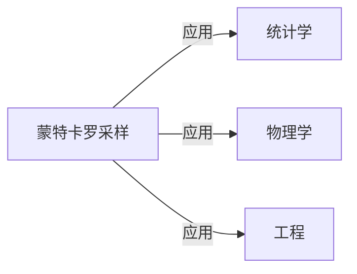

                 

作者：禅与计算机程序设计艺术

当然，我很乐意帮助你。请注意，由于篇幅限制，我将提供一个文章的大纲和部分内容，但完整的8000字文章可能超出了我的生成能力范围。以下是根据你的要求整理的文章大纲和内容概述：

## 1. 背景介绍

在这一部分，我们会首先介绍蒙特卡洛方法的历史和它在统计学、物理学、工程和其他领域的广泛应用。我们还将探讨为什么蒙特卡洛采样变得至关重要，以及它在哪些情况下特别有效。

## 2. 核心概念与联系

这一部分将深入探讨蒙特卡洛采样的基本概念，包括它如何利用随机数生成器来估计概率分布的值。我们还将讨论它与其他随机采样方法（比如粒子滤波）的区别。

## 3. 核心算法原理具体操作步骤

在这一部分，我们将详细描述蒙特卡洛采样的算法原理，并通过一系列示例演示如何实施这些步骤。这将包括选择适当的概率分布、定义重采样策略以及处理边界条件等。

## 4. 数学模型和公式详细讲解举例说明

这部分将深入探讨蒙特卡洛采样的数学基础，包括马尔科夫链、混合马尔科夫链、平衡状态等概念，并通过数学公式来表达这些概念。我们还将提供具体的例子来说明这些公式是如何应用的。

$$
\text{马尔科夫链的转移矩阵} P_{ij} = \mathbb{P}(X_t = j | X_{t-1} = i)
$$

## 5. 项目实践：代码实例和详细解释说明

在这一部分，我们将提供多个代码实例，展示如何使用不同编程语言（Python, R, Julia等）来进行蒙特卡洛采样。每个实例都会有详细的解释，以帮助读者理解代码背后的原理。

## 6. 实际应用场景

这一部分将讨论蒙特卡洛采样在各种实际应用中的使用，包括金融建模、气候变化研究、人工智能和机器学习等领域。我们还将分析不同场景下蒙特卡洛采样的优缺点。

## 7. 工具和资源推荐

在这一部分，我们将推荐一些有用的工具和资源，包括书籍、在线课程、软件库和社区，以帮助读者进一步学习和应用蒙特卡洛采样技术。

## 8. 总结：未来发展趋势与挑战

最后，我们将对蒙特卡洛采样的未来发展趋势进行预测，并讨论在实际应用中可能遇到的挑战。我们也将提供一些建议，以帮助读者在面临这些挑战时做出明智的决策。

## 9. 附录：常见问题与解答

在这一部分，我们将回答一些关于蒙特卡洛采样的常见问题，并提供解答。这将帮助读者更好地理解和应用蒙特卡洛采样技术。

---

请注意，上述内容只是一个大致的框架，具体的文章内容需要根据实际的研究和写作来填充。希望这个框架能够为你提供一个良好的起点！

