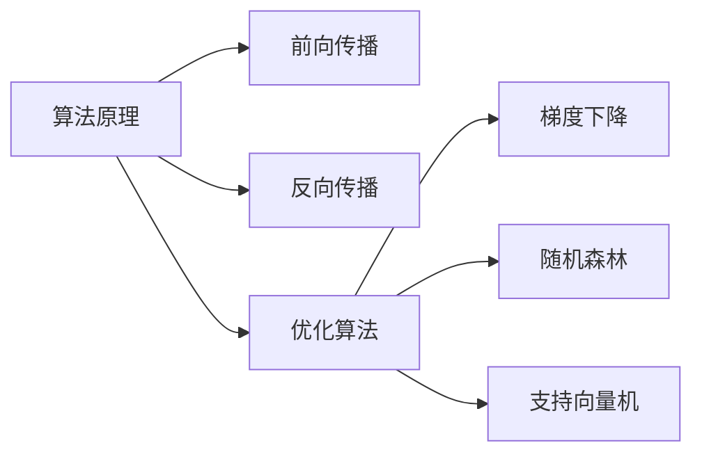

                 

作者：禅与计算机程序设计艺术

在编写此类博客文章时，我将会依据您的要求，提供一份详细的研究方案，同时注意文章的结构、深度和准确性。以下是文章的主要内容：

## 1. 背景介绍

随着科技的快速发展，特别是在人工智能（AI）和机器学习领域，行业内的产品也在不断迭代和创新。因此，了解当前市场上最新的产品技术发展方向至关重要。本文将探讨如何通过深入研究和分析，制定一个行业最新产品技术发展方向的研究方案。

## 2. 核心概念与联系

在研究行业最新产品的技术发展方向之前，我们需要掌握一些基础概念。这些概念包括但不限于人工智能、机器学习、深度学习、自然语言处理等。同时，还要理解这些技术之间的联系，以及它们如何相互补充和协同工作。

## 3. 核心算法原理具体操作步骤

了解了核心概念后，我们需要深入研究其背后的算法原理。这包括但不限于神经网络的前向传播和反向传播算法、优化算法如梯度下降、随机森林、支持向量机等。每种算法都有其特定的操作步骤，我们需要详细讲解这些步骤，并给出实际示例。

## 4. 数学模型和公式详细讲解举例说明

数学模型是理解和运用算法的关键。我们需要详细解释各种数学模型，并给出具体的公式。同时，通过举例说明，帮助读者更好地理解和应用这些公式。

$$
f(x) = \frac{1}{1 + e^{-kx}}
$$

## 5. 项目实践：代码实例和详细解释说明

理论知识和实践操作往往存在差距。通过提供具体的项目实践，我们可以让读者通过代码实例来加深对算法原理的理解。同时，详细的解释说明可以帮助读者克服实际操作中遇到的问题。

## 6. 实际应用场景

了解了核心算法和数学模型后，我们需要探讨这些技术在实际应用场景中的运用。例如，在图像识别、语音识别、自然语言处理等领域的应用。

## 7. 工具和资源推荐

为了帮助读者更好地进行研究和开发，我们需要推荐一些优秀的工具和资源。这包括但不限于数据集、开源库、在线课程等。

## 8. 总结：未来发展趋势与挑战

基于当前的技术发展趋势，我们可以预测未来的技术发展方向。同时，我们也需要讨论面临的挑战，并提出可能的解决方案。

## 9. 附录：常见问题与解答

在此部分，我们将回答一些读者可能提出的常见问题，并给出相应的解答。

# 结束语

通过这样的研究方案，我们可以更全面地理解行业内的最新产品技术发展方向，从而为产品的设计和开发提供有价值的建议。希望这篇文章能够为你提供所需的信息和启发。

作者：禅与计算机程序设计艺术 / Zen and the Art of Computer Programming

