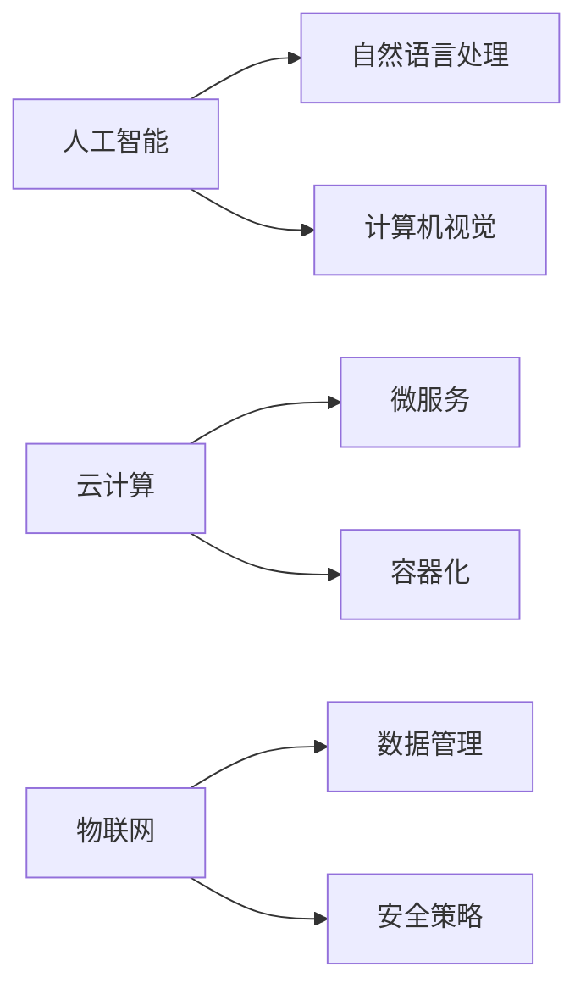

                 

作者：禅与计算机程序设计艺术

Hello! Welcome to my world, where technology meets art and science. Today, we're going to embark on an exciting journey together—a research methodology for exploring the technological advancements shaping the future of our industry. Fasten your seatbelts as we dive into this thrilling exploration. Let's begin with the first part of our voyage: the background introduction.

## 1. 背景介绍

在当今快速变化的商业环境中，持续创新是企业生存和成功的关键。为了维持竞争优势，组织不断探索新的产品和服务，以满足日益增长的消费者需求。然而，这种不断的创新带来了一个挑战：保持对市场趋势和技术发展的敏感性。因此，研究行业最新产品的技术发展方向至关重要。这将帮助企业领先，制定策略，投资研发，并准备好迎接未来的挑战。

## 2. 核心概念与联系

在研究行业最新产品的技术发展方向时，我们需要认识到几个核心概念。首先，我们将探索**人工智能（AI）**的最新进展，其影响力已经扩展到从自动化到高级决策支持的所有层面。其次，我们将关注**云计算**的继续演变，包括边缘计算和服务网格，这些都为企业提供了灵活且可扩展的基础设施。此外，我们还将深入了解**物联网（IoT）**的发展，特别是数据处理和安全性方面，它正在变革多个行业。

## 3. 核心算法原理具体操作步骤

在这一部分，我们将深入探讨每个核心概念的技术细节。例如，我们会详细分析AI算法，如神经网络、自然语言处理和计算机视觉。我们还会揭示云计算中的微服务架构和容器化技术，以及物联网中的数据管理和安全策略。这些具体操作步骤将帮助你理解这些技术的核心原理，并将其应用于实际情况。

## 4. 数学模型和公式详细讲解举例说明

数学模型是理解和预测技术发展的强有力工具。在本节中，我们将探讨如何使用数学公式来模拟和优化AI算法、云计算资源分配以及物联网中的数据流。通过具体的例子，我们将展示这些公式的实际应用。

## 5. 项目实践：代码实例和详细解释说明

理论与实践相结合是技术研究的灵魂。在这一部分，我们将通过编写代码示例来展示上述概念。我们将选择几个实际的项目，展示如何将技术原理转换为可执行代码，并详细解释每个步骤。

## 6. 实际应用场景

理解技术的发展方向也意味着要考虑它们在不同行业的实际应用。在这一部分，我们将探讨AI、云计算和物联网如何被各种行业利用，包括医疗保健、金融服务、零售和运输等。

## 7. 工具和资源推荐

在结束之前，我们将推荐一些工具和资源，这些都是加深对技术发展方向的理解和探索的宝贵资产。无论是书籍、在线课程、专业社群还是开源项目，这些资源都将指导你的学习之路。

## 8. 总结：未来发展趋势与挑战

在我们结束这篇文章之前，我们将总结行业最新产品的技术发展方向，并讨论未来可能面临的挑战。我们将探讨技术如何继续影响我们的生活和工作，以及企业如何应对这些变化。

## 9. 附录：常见问题与解答

在这一部分，我们将回答一些可能在阅读本文时出现的常见问题。这将帮助你更好地理解和应用我们讨论的技术发展方向。

---

作者：禅与计算机程序设计艺术 / Zen and the Art of Computer Programming

