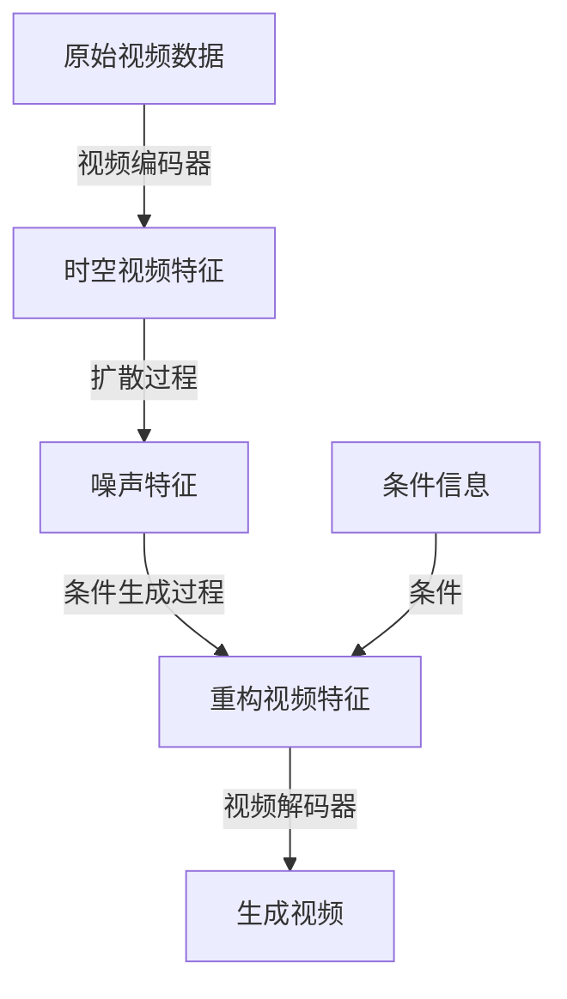

# 视频扩散Video Diffusion原理与代码实例讲解

## 1.背景介绍

### 1.1 什么是视频扩散

视频扩散(Video Diffusion)是一种新兴的人工智能技术,它利用扩散模型(Diffusion Models)在视频数据上进行生成和处理任务。扩散模型最初被用于生成高质量的静态图像,而视频扩散则将这一概念扩展到了时序视频数据领域。

视频扩散模型能够学习视频数据的时空特征,从而实现诸如视频生成、视频插值、视频超分辨率等多种应用。它为视频领域带来了全新的人工智能能力,有望推动视频处理技术的发展。

### 1.2 视频扩散的重要性

随着视频数据在互联网、娱乐、监控等领域的爆炸式增长,高效处理和利用视频数据变得越来越重要。传统的视频处理方法往往基于手工设计的特征和规则,难以充分挖掘视频数据中蕴含的丰富信息。

视频扩散作为一种全新的数据驱动方法,能够直接从大量视频数据中自动学习有效的表示,从而实现更加智能和高效的视频处理。它为视频领域带来了前所未有的人工智能能力,在诸多应用场景中展现出巨大的潜力。

## 2.核心概念与联系

### 2.1 扩散模型概述

扩散模型(Diffusion Models)是一种基于逆向扩散过程的生成模型,它通过学习从纯噪声到真实数据的转换过程,从而实现数据的生成。与生成对抗网络(GAN)和变分自动编码器(VAE)等其他生成模型不同,扩散模型采用了一种全新的建模思路,展现出优秀的性能和创新的应用前景。

扩散模型的基本思想是,将真实数据视为一个清晰的信号,然后通过添加高斯噪声,逐步破坏这个信号,直到最终得到纯噪声。在训练过程中,模型学习从噪声中恢复出原始信号的过程。生成新数据时,模型从纯噪声开始,通过迭代地去噪,最终生成所需的数据样本。

### 2.2 从图像扩散到视频扩散

最初的扩散模型主要应用于生成高质量的静态图像,取得了非常优秀的效果。但是,对于时序数据如视频,单纯地将图像扩散模型应用于每一帧是不够的,因为这种做法无法捕捉视频中的动态信息和帧与帧之间的时序相关性。

为了解决这一问题,视频扩散模型被提出,它在扩散过程中不仅考虑了单帧的像素信息,还显式地建模了视频的时序特征。通过学习视频数据的时空结构,视频扩散模型能够生成更加自然流畅的视频序列,为视频领域带来全新的人工智能能力。

### 2.3 视频扩散模型架构

虽然具体的模型架构可能有所不同,但大多数视频扩散模型都包含以下几个关键组件:

1. **视频编码器(Video Encoder)**: 将原始视频数据编码为适当的时空特征表示。
2. **扩散过程(Diffusion Process)**: 对视频特征进行逐步扩散,将其转化为噪声。
3. **条件生成过程(Conditional Generation Process)**: 根据条件(如文本提示、部分视频帧等),从噪声中重构出目标视频。
4. **视频解码器(Video Decoder)**: 将重构的视频特征解码为像素级的视频帧序列。

通过端到端的训练,这些组件能够协同工作,实现视频生成、插值、超分辨率等多种视频处理任务。

## 3.核心算法原理具体操作步骤

虽然不同的视频扩散模型可能在具体实现上有所区别,但它们都遵循一个基本的算法框架。以下是视频扩散模型的核心算法原理和具体操作步骤:

### 3.1 前向扩散过程

1. **初始化**: 从原始视频数据 $x_0$ 开始。
2. **逐步扩散**:
   - 对于每个时间步 $t = 1, 2, ..., T$:
     - 从高斯分布 $\mathcal{N}(0, \sqrt{\beta_t})$ 中采样噪声 $\epsilon_t$。
     - 计算扩散后的视频特征 $x_t = \sqrt{1 - \beta_t} x_{t-1} + \sqrt{\beta_t} \epsilon_t$。
   - 最终得到纯噪声 $x_T$。

上述过程可以用以下公式表示:

$$
q(x_t|x_{t-1}) = \mathcal{N}(x_t; \sqrt{1 - \beta_t} x_{t-1}, \beta_t\mathbf{I})
$$

其中 $\beta_1, \beta_2, ..., \beta_T$ 是预定义的方差系数,控制噪声的强度。

### 3.2 逆向生成过程

1. **初始化**: 从纯噪声 $x_T$ 开始。
2. **逐步去噪**:
   - 对于每个时间步 $t = T, T-1, ..., 1$:
     - 使用神经网络 $\epsilon_\theta(x_t, t)$ 预测噪声 $\epsilon_t$。
     - 计算去噪后的视频特征 $\tilde{x}_{t-1} = \frac{1}{\sqrt{1-\beta_t}}(x_t - \frac{\beta_t}{\sqrt{1-\bar{\beta}_t}}\epsilon_\theta(x_t, t))$。
   - 最终得到生成的视频特征 $\tilde{x}_0$。

上述过程可以用以下公式表示:

$$
p_\theta(x_{t-1}|x_t) = \mathcal{N}(x_{t-1}; \tilde{\mu}_t(x_t, t), \tilde{\beta}_t)
$$

其中 $\tilde{\mu}_t(x_t, t) = \frac{1}{\sqrt{1-\beta_t}}(x_t - \frac{\beta_t}{\sqrt{1-\bar{\beta}_t}}\epsilon_\theta(x_t, t))$, $\tilde{\beta}_t = \frac{1-\bar{\beta}_t}{1-\beta_t}\beta_t$, $\bar{\beta}_t = \prod_{s=1}^t \beta_s$。

### 3.3 条件生成

在许多应用场景中,我们希望根据一些条件信息(如文本提示、部分视频帧等)来生成目标视频。这可以通过将条件信息融入到生成过程中来实现。

具体地,在每个时间步的去噪过程中,神经网络 $\epsilon_\theta(x_t, t, c)$ 不仅取决于当前的视频特征 $x_t$ 和时间步 $t$,还取决于条件信息 $c$。通过学习条件信息和视频特征之间的关系,模型能够根据给定的条件生成所需的视频。

### 3.4 训练目标

视频扩散模型的训练目标是最小化每个时间步的噪声预测误差,即最小化以下损失函数:

$$
\mathcal{L} = \mathbb{E}_{t, x_0} \big[\|\epsilon - \epsilon_\theta(x_t, t, c)\|^2_2\big]
$$

其中 $x_0$ 是原始视频数据, $x_t$ 是通过前向扩散过程得到的扩散后的视频特征, $\epsilon$ 是对应的真实噪声, $\epsilon_\theta(x_t, t, c)$ 是模型预测的噪声。

通过最小化这个损失函数,模型能够学习从噪声中恢复出原始视频数据的映射,从而实现视频生成和处理任务。

## 4.数学模型和公式详细讲解举例说明

### 4.1 扩散过程的数学模型

视频扩散模型的核心思想是通过逐步添加噪声,将原始视频数据转换为纯噪声,然后在生成过程中学习从噪声中恢复出原始视频。这个过程可以用一个马尔可夫链来建模。

设 $x_0$ 为原始视频数据, $x_1, x_2, ..., x_T$ 为逐步扩散后的视频特征, 其中 $x_T$ 是纯噪声。我们定义从 $x_{t-1}$ 到 $x_t$ 的转移概率为:

$$
q(x_t|x_{t-1}) = \mathcal{N}(x_t; \sqrt{1 - \beta_t} x_{t-1}, \beta_t\mathbf{I})
$$

其中 $\beta_1, \beta_2, ..., \beta_T$ 是预定义的方差系数,控制噪声的强度。当 $\beta_t$ 较小时,噪声的强度较弱;当 $\beta_t$ 较大时,噪声的强度较强。

通过上述马尔可夫链,我们可以从原始视频数据 $x_0$ 出发,逐步添加噪声,最终得到纯噪声 $x_T$。这个过程被称为前向扩散过程(Forward Diffusion Process)。

### 4.2 生成过程的数学模型

在生成过程中,我们希望从纯噪声 $x_T$ 出发,逐步去噪,最终得到生成的视频数据 $\tilde{x}_0$。这个过程可以用另一个马尔可夫链来建模。

设 $\tilde{x}_0, \tilde{x}_1, ..., \tilde{x}_T$ 为生成过程中的视频特征序列,我们定义从 $\tilde{x}_t$ 到 $\tilde{x}_{t-1}$ 的转移概率为:

$$
p_\theta(x_{t-1}|x_t) = \mathcal{N}(x_{t-1}; \tilde{\mu}_t(x_t, t), \tilde{\beta}_t)
$$

其中 $\tilde{\mu}_t(x_t, t)$ 和 $\tilde{\beta}_t$ 是通过神经网络 $\epsilon_\theta(x_t, t)$ 预测的均值和方差:

$$
\tilde{\mu}_t(x_t, t) = \frac{1}{\sqrt{1-\beta_t}}(x_t - \frac{\beta_t}{\sqrt{1-\bar{\beta}_t}}\epsilon_\theta(x_t, t))
$$

$$
\tilde{\beta}_t = \frac{1-\bar{\beta}_t}{1-\beta_t}\beta_t, \quad \bar{\beta}_t = \prod_{s=1}^t \beta_s
$$

通过上述马尔可夫链,我们可以从纯噪声 $x_T$ 出发,逐步去噪,最终得到生成的视频数据 $\tilde{x}_0$。这个过程被称为逆向生成过程(Reverse Generation Process)。

### 4.3 条件生成的数学模型

在许多应用场景中,我们希望根据一些条件信息(如文本提示、部分视频帧等)来生成目标视频。这可以通过将条件信息融入到生成过程中来实现。

具体地,在每个时间步的去噪过程中,神经网络 $\epsilon_\theta(x_t, t, c)$ 不仅取决于当前的视频特征 $x_t$ 和时间步 $t$,还取决于条件信息 $c$。通过学习条件信息和视频特征之间的关系,模型能够根据给定的条件生成所需的视频。

在条件生成的情况下,生成过程的转移概率可以写为:

$$
p_\theta(x_{t-1}|x_t, c) = \mathcal{N}(x_{t-1}; \tilde{\mu}_t(x_t, t, c), \tilde{\beta}_t)
$$

其中 $\tilde{\mu}_t(x_t, t, c) = \frac{1}{\sqrt{1-\beta_t}}(x_t - \frac{\beta_t}{\sqrt{1-\bar{\beta}_t}}\epsilon_\theta(x_t, t, c))$。

通过将条件信息 $c$ 融入到神经网络 $\epsilon_\theta(x_t, t, c)$ 中,模型能够学习条件信息和视频特征之间的映射关系,从而实现条件生成任务。

### 4.4 训练目标

视频扩散模型的训练目标是最小化每个时间步的噪声预测误差,即最小化以下损失函