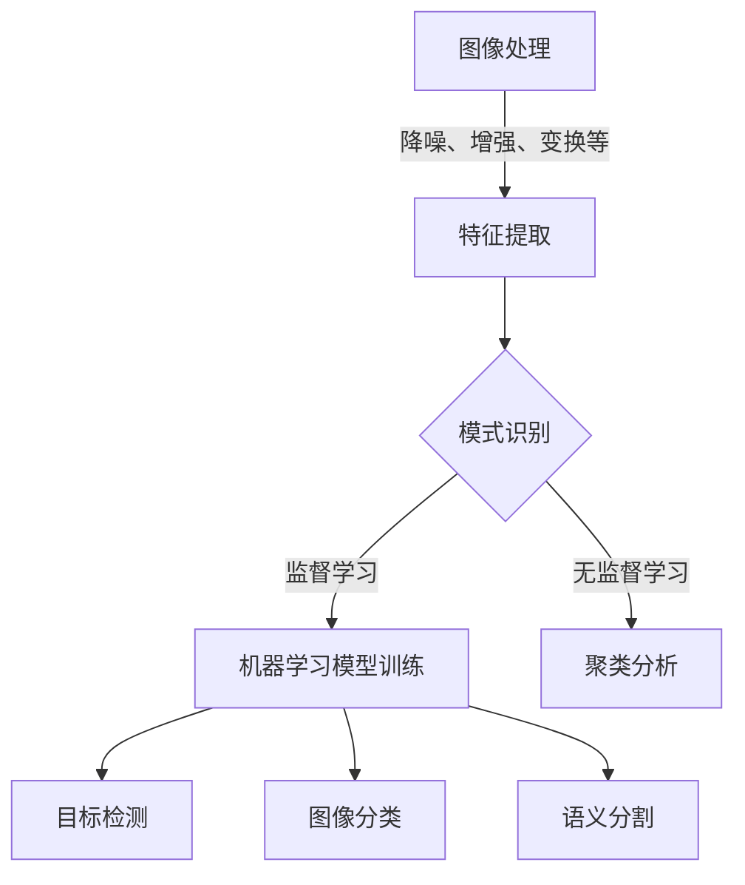

# 计算机视觉 (Computer Vision) 原理与代码实例讲解

## 1.背景介绍

### 1.1 什么是计算机视觉?

计算机视觉(Computer Vision)是一门研究如何使计算机能够获取、处理、分析和理解数字图像或视频数据的科学与技术。它涉及多个领域,包括图像处理、模式识别、机器学习、计算几何等。计算机视觉的目标是使机器能够像人类一样从图像或视频中获取有意义的信息。

### 1.2 计算机视觉的应用

计算机视觉技术已广泛应用于多个领域,包括:

- **自动驾驶**: 通过处理来自摄像头的图像数据,实现障碍物检测、车道线检测、交通标志识别等功能。
- **机器人视觉**: 机器人通过视觉系统感知环境,实现导航、目标识别、抓取等任务。
- **人脸识别**: 在安防、社交媒体等场景下识别人脸。
- **医疗影像分析**: 辅助医生诊断疾病,如CT、MRI等医学图像分析。
- **工业自动化检测**: 在生产线上进行缺陷检测、产品分拣等。
- **增强现实(AR)和虚拟现实(VR)**: 实现物体识别和三维重建。

### 1.3 计算机视觉的挑战

尽管计算机视觉技术取得了长足进步,但仍面临诸多挑战:

- **视觉信息的复杂性**: 图像和视频包含大量信息,需要复杂的算法来提取有用的特征。
- **光照、遮挡等条件变化**: 不同环境条件会影响图像质量,增加了识别难度。
- **实时性要求**: 某些应用场景(如自动驾驶)需要实时处理视觉数据。
- **大规模数据处理能力**: 训练深度学习模型需要大量标注数据和计算资源。

## 2.核心概念与联系

计算机视觉涉及多个核心概念,包括图像处理、特征提取、模式识别、机器学习等,这些概念相互关联、环环相扣。



### 2.1 图像处理

图像处理是对图像进行预处理的过程,包括降噪、增强、几何变换等操作,目的是提高图像质量,为后续特征提取和模式识别奠定基础。

### 2.2 特征提取

特征提取是从图像中提取有意义的信息,例如边缘、角点、纹理等,这些信息对于后续的模式识别至关重要。常用的特征提取算法包括SIFT、HOG、LBP等。

### 2.3 模式识别

模式识别是根据提取的特征,将图像或目标分类到预定义的类别中。根据是否使用监督学习,可分为监督模式识别和无监督模式识别。

在监督模式识别中,需要使用标注好的训练数据,训练机器学习模型(如支持向量机、决策树、神经网络等)进行分类。而无监督模式识别则通过聚类分析等方法发现数据内在的模式和结构。

### 2.4 机器学习

机器学习在计算机视觉中扮演着重要角色。通过使用大量标注数据训练深度神经网络模型,可以实现目标检测、图像分类、语义分割等高级视觉任务。常用的深度学习模型包括卷积神经网络(CNN)、循环神经网络(RNN)等。

## 3.核心算法原理具体操作步骤

计算机视觉涉及多种核心算法,这些算法在实现目标检测、图像分类等任务中扮演着关键角色。本节将介绍几种核心算法的原理和具体操作步骤。

### 3.1 卷积神经网络(CNN)

卷积神经网络是深度学习中最成功的模型之一,在计算机视觉任务中得到了广泛应用。CNN由卷积层、池化层和全连接层组成,能够自动从图像中学习特征表示。

CNN的工作原理如下:

1. **卷积层**: 使用多个卷积核(kernel)在输入图像上滑动,提取不同的特征。
2. **激活层**: 通过非线性激活函数(如ReLU)增加网络的表达能力。
3. **池化层**: 对特征图进行下采样,减少数据量,提高模型的鲁棒性。
4. **全连接层**: 将提取的特征映射到最终的输出,如分类或回归。

CNN的训练过程包括以下步骤:

1. 准备标注好的训练数据集。
2. 定义CNN模型结构,包括卷积层、池化层和全连接层的参数。
3. 初始化模型权重。
4. 通过反向传播算法和优化器(如SGD、Adam等)更新模型权重。
5. 在验证集上评估模型性能,根据需要调整超参数。
6. 在测试集上测试模型的泛化能力。

CNN已在图像分类、目标检测、语义分割等任务中取得了卓越表现,如AlexNet、VGGNet、ResNet、Inception等模型。

### 3.2 You Only Look Once (YOLO)

YOLO是一种流行的目标检测算法,它将目标检测任务视为回归问题,直接从图像像素预测边界框和类别概率。YOLO的优点是速度快,能够实时处理视频流。

YOLO算法的具体步骤如下:

1. 将输入图像划分为S×S个网格单元。
2. 对于每个网格单元,预测B个边界框及其置信度,以及C个类别概率。
3. 在测试阶段,对于每个边界框,计算其置信度和类别概率的乘积,选取得分最高的边界框作为最终检测结果。

YOLO的核心思想是将目标检测任务转化为回归问题,通过端到端的训练获得更快的预测速度。然而,YOLO在检测小目标和密集目标时表现不佳,后续版本如YOLOv2、YOLOv3、YOLOv4等对原始算法进行了改进。

### 3.3 Mask R-CNN

Mask R-CNN是一种用于实例分割的算法,它在Faster R-CNN的基础上增加了一个分支,用于预测目标的像素级别掩码(mask)。Mask R-CNN能够同时实现目标检测和实例分割。

Mask R-CNN的工作流程如下:

1. 使用区域建议网络(RPN)生成候选边界框。
2. 通过RoIAlign层从特征图中提取对应的特征。
3. 将提取的特征输入到三个并行的全连接层,分别预测类别、边界框和掩码。
4. 在测试阶段,对每个检测到的目标,输出其类别、边界框和像素级别的掩码。

Mask R-CNN的优点是能够实现精确的实例分割,但其缺点是速度较慢,无法满足实时性要求。Mask R-CNN广泛应用于医疗影像分析、自动驾驶等领域。

## 4.数学模型和公式详细讲解举例说明

计算机视觉中涉及多种数学模型和公式,这些模型和公式为算法提供了理论基础。本节将介绍几种常用的数学模型和公式。

### 4.1 卷积运算

卷积运算是卷积神经网络的核心操作,它通过滤波器(kernel)在输入特征图上滑动,提取局部特征。二维卷积的数学表达式如下:

$$
S(i,j) = (I*K)(i,j) = \sum_{m}\sum_{n}I(i+m,j+n)K(m,n)
$$

其中,$$I$$表示输入特征图,$$K$$表示卷积核,$$S$$表示输出特征图。卷积核在输入特征图上滑动,对每个位置进行点乘和操作,得到输出特征图的像素值。

通过设置不同的卷积核大小、步长和填充方式,可以提取不同尺度和类型的特征。例如,使用3×3的小卷积核可以提取低级特征(如边缘和纹理),而使用较大的卷积核则可以捕获更高级的语义信息。

### 4.2 非线性激活函数

在卷积神经网络中,通常在卷积层之后使用非线性激活函数,增加网络的表达能力。常用的激活函数包括Sigmoid、Tanh和ReLU(整流线性单元)。

ReLU函数的数学表达式如下:

$$
f(x) = \max(0, x)
$$

ReLU函数的优点是计算简单、收敛快,并且能够有效缓解梯度消失问题。然而,ReLU函数也存在"死亡神经元"的问题,即当输入为负值时,神经元将永远不会被激活。

为了解决ReLU函数的缺陷,研究人员提出了多种变体,如Leaky ReLU、PReLU等。这些变体通过对负值输入赋予一个较小的非零梯度,避免了"死亡神经元"问题。

### 4.3 交叉熵损失函数

在分类任务中,常用的损失函数是交叉熵损失函数。对于二分类问题,交叉熵损失函数的数学表达式如下:

$$
L = -\frac{1}{N}\sum_{i=1}^{N}[y_i\log(p_i) + (1-y_i)\log(1-p_i)]
$$

其中,$$N$$表示样本数量,$$y_i$$表示第$$i$$个样本的真实标签(0或1),$$p_i$$表示模型预测的概率。

对于多分类问题,交叉熵损失函数的表达式为:

$$
L = -\frac{1}{N}\sum_{i=1}^{N}\sum_{j=1}^{C}y_{ij}\log(p_{ij})
$$

其中,$$C$$表示类别数量,$$y_{ij}$$表示第$$i$$个样本属于第$$j$$类的真实标签(0或1),$$p_{ij}$$表示模型预测第$$i$$个样本属于第$$j$$类的概率。

在训练过程中,通过优化器(如SGD、Adam等)最小化损失函数,从而使模型的预测结果逐渐接近真实标签。

### 4.4 非最大值抑制(NMS)

在目标检测任务中,常常会出现多个边界框重叠的情况。非最大值抑制(NMS)是一种后处理技术,用于消除重叠的冗余边界框。

NMS的工作原理如下:

1. 对所有边界框按置信度排序。
2. 选取置信度最高的边界框作为初始框。
3. 计算其余边界框与初始框的重叠程度(通常使用交并比IOU)。
4. 移除与初始框重叠程度较高的边界框。
5. 对剩余边界框重复步骤2-4,直到所有边界框都被处理。

通过NMS,可以保留置信度最高的边界框,同时消除重叠的冗余框,从而提高目标检测的精度。

## 5.项目实践:代码实例和详细解释说明

为了加深对计算机视觉原理的理解,本节将提供一些代码实例,并对关键步骤进行详细解释。这些代码实例使用Python和流行的计算机视觉库OpenCV和PyTorch实现。

### 5.1 图像处理

```python
import cv2

# 读取图像
image = cv2.imread('example.jpg')

# 灰度化
gray = cv2.cvtColor(image, cv2.COLOR_BGR2GRAY)

# 高斯滤波降噪
blur = cv2.GaussianBlur(gray, (5, 5), 0)

# 边缘检测
edges = cv2.Canny(blur, 100, 200)

# 显示结果
cv2.imshow('Original', image)
cv2.imshow('Edges', edges)
cv2.waitKey(0)
cv2.destroyAllWindows()
```

上述代码示例展示了一些基本的图像处理操作,包括读取图像、灰度化、高斯滤波降噪和边缘检测。这些操作为后续的特征提取和模式识别奠定了基础。

- `cv2.imread()`用于读取图像文件。
- `cv2.cvtColor()`用于将图像转换为灰度格式,便于后续处理。