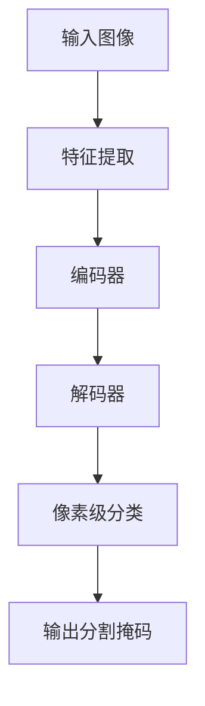

# 语义分割(Semantic Segmentation)原理与代码实战案例讲解

## 1. 背景介绍

### 1.1 什么是语义分割?

语义分割(Semantic Segmentation)是计算机视觉和深度学习领域的一个重要任务,旨在将图像中的每个像素点分配一个与其语义类别相对应的标签。与图像分类任务不同,语义分割需要对图像中的每个像素进行分类,从而实现对图像中不同对象的精确分割和识别。

语义分割在许多领域都有广泛的应用,例如:

- **自动驾驶**: 精确识别道路、行人、车辆、交通标志等对象,为自动驾驶系统提供关键信息。
- **医疗影像分析**: 分割肿瘤、器官等区域,辅助医生诊断和治疗。
- **机器人视觉**: 识别不同物体,为机器人抓取、导航等操作提供指引。
- **增强现实(AR)**: 准确理解场景,实现虚拟物体与真实环境的无缝融合。

随着深度学习技术的不断发展,语义分割的性能也在持续提升,但仍然面临着一些挑战,如对小目标、透视畸变等情况的处理能力有待提高。

### 1.2 语义分割的发展历程

早期的语义分割方法主要基于传统的计算机视觉技术,如阈值分割、边缘检测、区域生长等。这些方法通常需要手工设计特征,且对噪声、遮挡等情况不太鲁棒。

近年来,随着深度学习技术的兴起,基于卷积神经网络(CNN)的语义分割方法取得了巨大进展。典型的里程碑式模型包括:

- **FCN(Fully Convolutional Networks)**: 第一个将分类网络(如VGGNet、AlexNet)转化为全卷积网络,实现端到端的像素级预测。
- **U-Net**: 引入encoder-decoder结构和skip连接,显著提升了分割精度,尤其在医学图像分割领域表现出色。
- **DeepLab系列**: 通过空洞卷积(Atrous Convolution)和编码器-解码器结构,实现了对小目标的高精度分割。
- **Mask R-CNN**: 将实例分割(Instance Segmentation)任务统一到目标检测框架中,能同时输出目标边界框和像素级掩码。

总的来说,语义分割技术正在不断发展和完善,在各个领域发挥着越来越重要的作用。

## 2. 核心概念与联系

语义分割涉及到多个核心概念,下面我们将逐一介绍并阐明它们之间的关系。

### 2.1 像素级分类

语义分割的核心任务是对图像中的每个像素进行分类,将其分配到对应的语义类别(如人、车、树木等)。这个过程可以看作是将图像级分类任务扩展到像素级别。

与图像级分类任务相比,像素级分类面临着更大的挑战,需要同时捕捉图像的全局上下文信息和局部细节特征。

### 2.2 编码器-解码器架构

为了实现高精度的像素级分类,大多数语义分割模型采用了编码器-解码器(Encoder-Decoder)架构。

- **编码器(Encoder)**: 通常由卷积神经网络(如VGGNet、ResNet等)构成,用于从输入图像中提取特征,捕捉语义和上下文信息。编码器会逐层降低特征图的分辨率,但增加了感受野和语义信息的丰富度。

- **解码器(Decoder)**: 负责将编码器输出的低分辨率特征图逐步上采样,恢复到输入图像的原始分辨率,同时融合来自编码器的高分辨率特征,以保留精细的边缘和细节信息。

编码器-解码器架构的关键在于如何有效地融合不同尺度的特征,平衡语义信息和细节信息。这通常通过引入skip连接或注意力机制等方式来实现。

### 2.3 损失函数

语义分割任务的损失函数需要衡量预测的像素级标签与真实标签之间的差异。常用的损失函数包括:

- **交叉熵损失(Cross Entropy Loss)**: 计算每个像素的预测概率与真实标签之间的交叉熵损失,然后对所有像素求和。
- **Dice损失(Dice Loss)**: 基于Dice系数,衡量预测掩码与真实掩码之间的重合程度。
- **Focal Loss**: 通过加权处理难以分类的样本,解决样本不平衡问题。
- **Lovász-Softmax Loss**: 基于Lovász扩展,直接优化平均交并比(mIoU)指标。

除了上述常见损失函数外,还可以根据具体任务和数据特点设计定制化的损失函数,以提高模型的性能和泛化能力。

### 2.4 评估指标

评估语义分割模型的性能通常使用以下指标:

- **像素准确率(Pixel Accuracy)**: 正确分类的像素数与总像素数之比。
- **平均精度(Mean Accuracy)**: 对每个类别的像素准确率取平均。
- **交并比(IoU)**: 预测掩码与真实掩码的交集与并集之比,衡量分割质量。
- **平均交并比(mIoU)**: 对所有类别的IoU取平均,是语义分割任务的主要评估指标之一。

除了上述指标外,还可以根据具体应用场景设计其他评估指标,如边缘评估指标、实例分割指标等。

通过对这些核心概念的理解,我们可以更好地把握语义分割任务的本质,为后续的算法原理和实践奠定基础。

## 3. 核心算法原理具体操作步骤

在介绍具体的算法原理之前,我们先来看一下语义分割任务的基本流程:

上图展示了语义分割任务的基本流程,包括特征提取、编码、解码和像素级分类等步骤。接下来,我们将详细介绍一些核心算法的原理和操作步骤。

### 3.1 全卷积网络(FCN)

全卷积网络(Fully Convolutional Networks, FCN)是语义分割领域的开山之作,由Jonathan Long等人在2015年提出。FCN的核心思想是将传统的卷积神经网络(如VGGNet、AlexNet)转化为全卷积网络,实现端到端的像素级预测。

FCN的具体操作步骤如下:

1. **特征提取**: 使用预训练的卷积神经网络(如VGGNet)作为编码器,从输入图像中提取特征。
2. **去除全连接层**: 移除原始网络的全连接层,保留卷积层和池化层。
3. **上采样**: 通过反卷积(Deconvolution)或双线性插值等方式,将编码器输出的特征图逐步上采样至原始输入图像的分辨率。
4. **像素级分类**: 对上采样后的特征图进行像素级分类,输出每个像素所属的语义类别。
5. **损失计算**: 使用交叉熵损失函数计算预测结果与真实标签之间的差异,并通过反向传播优化网络参数。

FCN的优点在于简单高效,可以直接利用预训练的分类网络进行转移学习。但它也存在一些局限性,如对小目标和细节的捕捉能力较差、上采样过程可能引入artifacts等。

### 3.2 U-Net

U-Net是一种广为人知的编码器-解码器架构,由Olaf Ronneberger等人在2015年提出,主要用于医学图像分割任务。U-Net的核心思想是通过skip连接(Skip Connections)融合不同尺度的特征,提高分割精度。

U-Net的具体操作步骤如下:

1. **编码器(Encoder)**: 使用卷积层和最大池化层逐步提取特征,并降低特征图的分辨率。编码器的输出捕捉了图像的语义和上下文信息。
2. **解码器(Decoder)**: 使用反卷积(Deconvolution)层逐步上采样特征图,恢复到原始输入图像的分辨率。
3. **Skip连接**: 在每个解码器层,将相应尺度的编码器特征图与解码器特征图进行拼接,融合高分辨率的细节信息和低分辨率的语义信息。
4. **像素级分类**: 在最后一层,对融合后的特征图进行像素级分类,输出每个像素所属的语义类别。
5. **损失计算**: 使用适当的损失函数(如交叉熵损失或Dice损失)计算预测结果与真实标签之间的差异,并通过反向传播优化网络参数。

U-Net的优点在于能够很好地捕捉图像的细节信息,尤其在医学图像分割任务上表现出色。但它也存在一些局限性,如对大型数据集的泛化能力有待提高、对不同尺度目标的处理能力不均衡等。

### 3.3 DeepLab系列

DeepLab系列是谷歌大脑团队在语义分割领域的重要工作,旨在提高对小目标和细节的分割精度。DeepLab系列包括DeepLabv1、DeepLabv2、DeepLabv3和DeepLabv3+等版本,每个版本都在前一版本的基础上进行了改进和优化。

以DeepLabv3+为例,其核心操作步骤如下:

1. **编码器**: 使用深度残差网络(ResNet)作为编码器,从输入图像中提取特征。
2. **空洞卷积(Atrous Convolution)**: 在ResNet的最后几层卷积层中引入空洞卷积,增大感受野,捕捉更大范围的上下文信息。
3. **ASPP(Atrous Spatial Pyramid Pooling)**: 通过并行应用多个不同采样率的空洞卷积,融合多尺度的特征信息。
4. **解码器**: 使用简单的双线性插值进行上采样,恢复到原始输入图像的分辨率。
5. **编码器-解码器融合**: 将解码器输出的低级特征与编码器的相应尺度特征进行融合,捕捉细节信息。
6. **像素级分类**: 对融合后的特征图进行像素级分类,输出每个像素所属的语义类别。
7. **损失计算**: 使用交叉熵损失函数计算预测结果与真实标签之间的差异,并通过反向传播优化网络参数。

DeepLab系列的优点在于通过空洞卷积和ASPP等技术,能够有效地捕捉不同尺度的语义信息,提高对小目标和细节的分割精度。但它也存在一些局限性,如对透视畸变和遮挡等情况的处理能力还有待提高。

### 3.4 Mask R-CNN

Mask R-CNN是一种将实例分割(Instance Segmentation)任务统一到目标检测框架中的方法,由Facebook AI研究院在2017年提出。它能够同时输出目标边界框和像素级掩码,实现对单个目标实例的精确分割。

Mask R-CNN的具体操作步骤如下:

1. **Region Proposal Network(RPN)**: 生成一组候选边界框(Region Proposals),用于定位可能包含目标的区域。
2. **ROI Pooling**: 对每个候选边界框内的特征图进行ROI Pooling操作,提取固定大小的特征向量。
3. **并行预测头**: 包含三个并行的预测头,分别用于分类、边界框回归和掩码预测。
4. **分类和边界框回归**: 对每个候选边界框,预测其所属类别和精确的边界框坐标。
5. **掩码预测**: 对每个候选边界框,预测一个与之对应的二值掩码,表示目标实例在该边界框内的像素级分割结果。
6. **损失计算**: 使用多任务损失函数,综合考虑分类损失、边界框回归损失和掩码损失,并通过反向传播优化网络参数。

Mask R-CNN的优点在于能够同时实现目标检测和实例分割,对单个目标实例的分割精度较高。但它也存在一些局限性,如对遮挡和透视畸变的处理能力有待提高,对小目标的分割精度也不够理想。

通过上述几种核