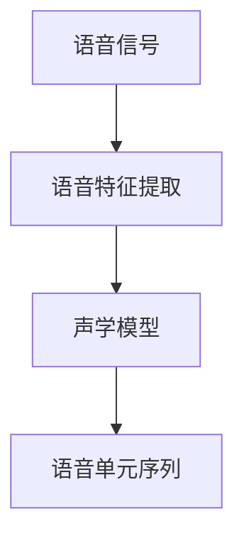
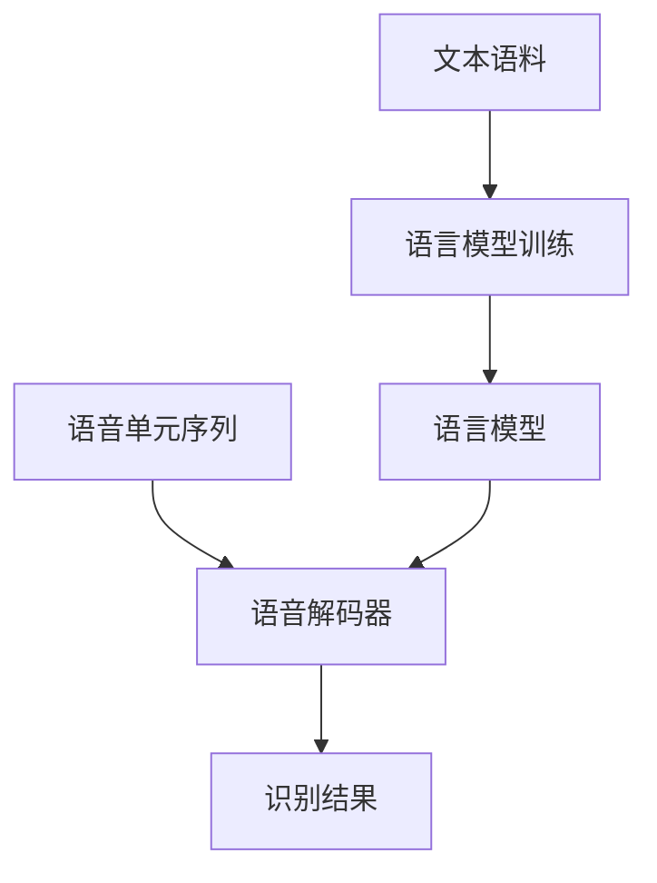

# 语音识别 原理与代码实例讲解

## 1.背景介绍

语音识别技术是一种将人类语音转换为相应文本或命令的过程,它是人工智能和自然语言处理领域的一个重要分支。随着科技的不断进步,语音识别技术已经广泛应用于智能手机、智能家居、汽车导航等多个领域,极大地提高了人机交互的便利性。

语音识别系统通常由以下几个关键模块组成:

1. **语音采集模块**: 使用麦克风或其他音频输入设备采集语音信号。
2. **语音前端处理模块**: 对采集到的语音信号进行预处理,包括端点检测、降噪、语音分段等。
3. **声学模型模块**: 将预处理后的语音特征向量转换为对应的语音单元序列。
4. **语言模型模块**: 根据语言的统计规律,估算语音单元序列的概率,从而提高识别精度。
5. **语音解码模块**: 综合声学模型和语言模型的结果,输出最终的识别文本或命令。

### 语音识别的应用场景

1. **智能语音助手**: 如苹果的 Siri、谷歌助手、亚马逊的 Alexa 等,可以通过语音与用户进行自然交互,执行查询、控制家电等操作。
2. **语音输入法**: 通过语音直接输入文字,大大提高了输入效率。
3. **车载语音控制系统**: 驾驶员可以通过语音控制导航、音乐等车载设备,实现安全无障碍操作。
4. **会议记录系统**: 自动将会议语音转录为文字记录,提高工作效率。
5. **无障碍辅助**: 帮助视障人士与计算机交互,提高生活质量。

## 2.核心概念与联系

语音识别系统涉及多个关键概念,包括声学模型、语言模型、语音解码等,这些概念相互关联,共同决定了识别系统的性能。

### 声学模型

声学模型的作用是将语音特征向量转换为对应的语音单元序列,通常采用隐马尔可夫模型(HMM)或深度神经网络模型(DNN/CNN/RNN)来建模。声学模型需要从大量语音数据中学习语音单元(如音素)与语音特征之间的映射关系。

### 语言模型

语言模型的作用是估算语音单元序列的概率,从而提高识别精度。常用的语言模型包括 N-gram 模型、基于规则的语法模型、神经网络语言模型等。语言模型需要从大量文本语料中学习单词或语句的统计规律。

### 语音解码

语音解码器的作用是综合声学模型和语言模型的结果,输出最终的识别文本或命令。常用的解码算法包括 Viterbi 算法、束搜索算法等。解码器需要权衡声学模型和语言模型的权重,以获得最优的识别结果。

这三个核心概念相互关联、相互影响。声学模型和语言模型共同为解码器提供必要的信息,而解码器则根据这些信息输出最终的识别结果。

## 3.核心算法原理具体操作步骤

语音识别系统的核心算法包括声学模型算法、语言模型算法和解码算法,下面将详细介绍这些算法的原理和具体操作步骤。

### 3.1 声学模型算法

声学模型的主要任务是建立语音特征向量与语音单元(如音素)之间的映射关系。常用的声学模型包括高斯混合模型(GMM-HMM)和深度神经网络模型(DNN/CNN/RNN)。

#### 3.1.1 GMM-HMM 声学模型

高斯混合模型隐马尔可夫模型(GMM-HMM)是传统的声学模型,它将语音信号建模为一个隐马尔可夫状态序列,每个状态由一个高斯混合模型(GMM)来描述其概率密度函数。GMM-HMM 声学模型的训练过程包括以下步骤:

1. **语音数据预处理**: 对原始语音数据进行预加重、分帧、加窗等预处理,提取语音特征向量序列。
2. **初始化 HMM 模型参数**: 对每个语音单元(如音素)初始化一个 HMM 模型,包括初始状态概率、状态转移概率和观测概率(GMM)参数。
3. **模型训练**: 使用 Baum-Welch 算法(前向-后向算法)迭代训练 HMM 模型参数,使模型对训练数据的似然概率最大化。
4. **模型评估**: 在测试集上评估训练好的模型,计算识别精度等指标。

#### 3.1.2 深度神经网络声学模型

近年来,深度神经网络模型(DNN/CNN/RNN)在语音识别领域取得了巨大成功,逐渐取代了传统的 GMM-HMM 模型。深度神经网络能够自动从大量语音数据中学习到更加复杂的特征表示,提高了声学建模的性能。

深度神经网络声学模型的训练过程包括以下步骤:

1. **语音数据预处理**: 与 GMM-HMM 模型类似,需要对原始语音数据进行预处理,提取语音特征向量序列。
2. **网络模型构建**: 根据任务需求,构建合适的深度神经网络结构,如 DNN、CNN、RNN 等。
3. **模型训练**: 使用随机梯度下降等优化算法,在训练集上迭代训练网络模型参数,使模型对训练数据的交叉熵损失最小化。
4. **模型评估**: 在测试集上评估训练好的模型,计算识别精度等指标。

### 3.2 语言模型算法

语言模型的主要任务是估算语音单元序列的概率,从而提高识别精度。常用的语言模型包括 N-gram 模型、基于规则的语法模型和神经网络语言模型。

#### 3.2.1 N-gram 语言模型

N-gram 语言模型是基于统计学习的传统语言模型,它根据 N 个连续单词的历史来预测下一个单词的概率。N-gram 模型的训练过程包括以下步骤:

1. **文本语料预处理**: 对原始文本语料进行分词、去除停用词等预处理。
2. **N-gram 计数**: 统计语料中所有 N-gram 的出现次数。
3. **平滑处理**: 由于语料有限,会存在未见 N-gram 的情况,需要使用平滑技术(如加法平滑、回退平滑等)估算未见 N-gram 的概率。
4. **模型评估**: 在测试集上评估训练好的模型,计算困惑度等指标。

#### 3.2.2 神经网络语言模型

与声学模型类似,神经网络语言模型也能够自动从大量文本数据中学习到更加复杂的语言模式,提高了语言建模的性能。常用的神经网络语言模型包括基于 RNN 的模型(如 LSTM、GRU)和基于 Transformer 的模型。

神经网络语言模型的训练过程包括以下步骤:

1. **文本语料预处理**: 对原始文本语料进行分词、构建词表等预处理。
2. **网络模型构建**: 根据任务需求,构建合适的神经网络结构,如 RNN、Transformer 等。
3. **模型训练**: 使用随机梯度下降等优化算法,在训练集上迭代训练网络模型参数,使模型对训练数据的交叉熵损失最小化。
4. **模型评估**: 在测试集上评估训练好的模型,计算困惑度等指标。

### 3.3 语音解码算法

语音解码器的作用是综合声学模型和语言模型的结果,输出最终的识别文本或命令。常用的解码算法包括 Viterbi 算法、束搜索算法等。

#### 3.3.1 Viterbi 算法

Viterbi 算法是一种动态规划算法,它可以在隐马尔可夫模型中找到最可能的状态序列。在语音识别中,Viterbi 算法用于寻找最大化声学模型和语言模型联合概率的单词序列。

Viterbi 算法的具体步骤如下:

1. **初始化**: 计算初始时刻每个状态的概率。
2. **递推**: 对每个时刻的每个状态,计算从前一时刻各个状态转移过来的概率,取最大值作为该状态的概率,并记录最优路径。
3. **终止**: 在最后一个时刻,找到概率最大的状态,并回溯得到最优路径。
4. **输出结果**: 将最优路径对应的单词序列作为识别结果输出。

#### 3.3.2 束搜索算法

束搜索算法是一种启发式搜索算法,它通过剪枝策略来控制搜索空间的大小,从而提高解码效率。在语音识别中,束搜索算法用于在声学模型和语言模型的联合概率空间中搜索最优单词序列。

束搜索算法的具体步骤如下:

1. **初始化**: 将空串作为初始假设,计算其声学模型和语言模型的联合概率。
2. **扩展**: 对每个假设,根据声学模型和语言模型的概率,生成新的假设序列。
3. **剪枝**: 根据预设的束宽(beam width)和剪枝策略,保留概率最大的 N 个假设,剩余假设被剪枝。
4. **终止**: 当达到预设的终止条件(如最大长度)时,停止搜索。
5. **输出结果**: 将概率最大的假设作为识别结果输出。

束搜索算法通过剪枝策略大大减小了搜索空间,提高了解码效率,但也可能导致搜索过程跳过了最优解。因此,束宽的选择需要权衡效率和精度。

## 4.数学模型和公式详细讲解举例说明

语音识别系统中的数学模型和公式是整个系统的理论基础,下面将详细讲解其中的核心模型和公式。

### 4.1 隐马尔可夫模型 (HMM)

隐马尔可夫模型是声学建模中常用的统计模型,它将语音信号建模为一个隐马尔可夫状态序列。HMM 由以下三个基本元素组成:

- 初始状态概率向量 $\pi = \{\pi_i\}$,表示初始时刻处于状态 $i$ 的概率。
- 状态转移概率矩阵 $A = \{a_{ij}\}$,表示从状态 $i$ 转移到状态 $j$ 的概率。
- 观测概率矩阵 $B = \{b_j(k)\}$,表示在状态 $j$ 时观测到特征向量 $k$ 的概率。

对于一个观测序列 $O = \{o_1, o_2, \cdots, o_T\}$,HMM 的核心问题是求解最优状态序列 $Q = \{q_1, q_2, \cdots, q_T\}$,使得观测序列的概率 $P(O|Q, \lambda)$ 最大,其中 $\lambda = (\pi, A, B)$ 表示 HMM 的参数集合。

这个问题可以通过 Viterbi 算法求解,Viterbi 算法的递推公式如下:

$$
\delta_t(j) = \max_{1 \leq i \leq N} \left[ \delta_{t-1}(i)a_{ij} \right] b_j(o_t)
$$

其中 $\delta_t(j)$ 表示在时刻 $t$ 处于状态 $j$ 的最大概率,通过动态规划可以求解出最优路径。

### 4.2 高斯混合模型 (GMM)

在 HMM 中,观测概率矩阵 $B$ 通常使用高斯混合模型 (GMM) 来建模。GMM 假设观测数据服从多个高斯分布的混合,它的概率密度函数为:

$$
p(x|\lambda) = \sum