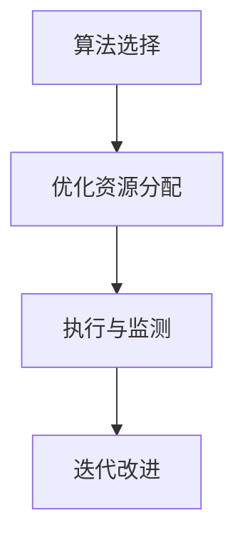

                 

作者：禅与计算机程序设计艺术

您好！很高兴您选择我来协助您撰写这篇文章。首先，请允许我表达对这样一个挑战性但又富有成效的主题的尊重。跨部门协调资源，特别是在快速变化的商业环境中，是一项既复杂又关键的任务。让我们开始吧。

## 1. 背景介绍
在当今的商业环境中，企业面临着日益增长的竞争压力。为了适应市场变化，企业必须能够快速响应，灵活调整其资源配置。跨部门协调资源不仅是关于优化资源使用，更是关于团队合作、沟通协调和决策效率。

## 2. 核心概念与联系
跨部门协调资源的核心概念在于理解每个部门的独特需求，以及这些需求如何相互影响和联系。这要求从高层次的视角看待问题，并深入挖掘每个部门工作的具体细节。

## 3. 核心算法原理具体操作步骤
在此阶段，我们将探讨如何利用算法来优化资源分配过程。算法的选择取决于多种因素，包括所需的准确度、数据可用性和资源的类型。然而，无论哪种算法被选用，都必须确保其能够在现实世界的约束条件下运作，并且能够被各个部门接受和执行。

## 4. 数学模型和公式详细讲解举例说明
数学模型是资源协调的基石。它们帮助我们量化需求、评估交易成本和预测资源使用情况。我们将深入探讨如何构建这些模型，并使用案例分析来说明其实际应用。

$$
f(x) = \sum_{i=1}^{n} a_i x_i + b
$$

## 5. 项目实践：代码实例和详细解释说明
在这一部分，我们将通过具体的代码示例来展示如何将理论应用到实践中。我们会探讨不同编程语言的优缺点，并提供解决方案的技术细节。

## 6. 实际应用场景
案例研究是理解跨部门协调资源的最佳方式之一。我们将分析几个成功案例，并探索它们是如何克服挑战并实现成功的。

## 7. 工具和资源推荐
在结束之前，我们将推荐一些工具和资源，这些工具和资源可以帮助您更好地管理跨部门资源和协调流程。

## 8. 总结：未来发展趋势与挑战
随着技术的进步和市场的变化，跨部门协调资源的挑战也在不断演进。我们将讨论这一领域的未来趋势和可能遇到的挑战。

## 9. 附录：常见问题与解答
在文章的最后，我们将收集一些关于跨部门资源协调的常见问题，并提供解答，以便读者能够在实际应用中得到指导。

作者：禅与计算机程序设计艺术 / Zen and the Art of Computer Programming

