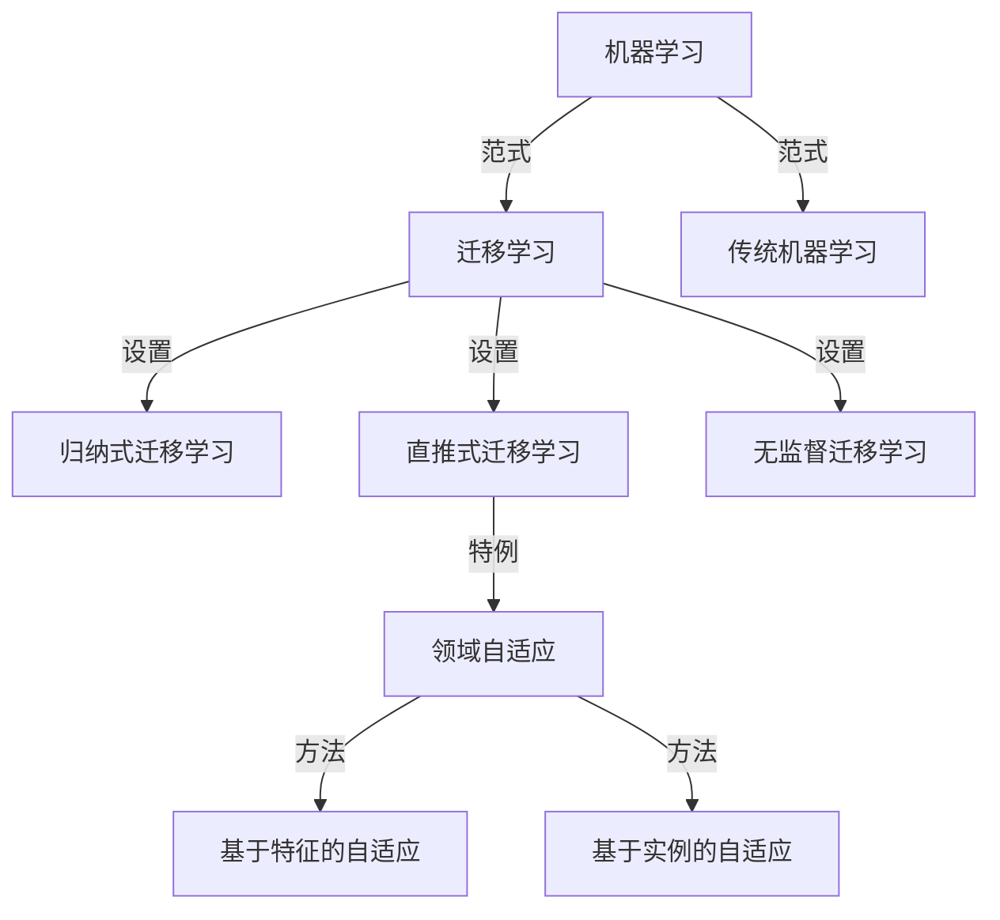

# 迁移学习与领域自适应原理与代码实战案例讲解

## 1. 背景介绍
### 1.1 什么是迁移学习与领域自适应
#### 1.1.1 迁移学习的定义
迁移学习(Transfer Learning)是指利用已有的知识来学习新的但相关的知识,从而提高学习效率和效果的机器学习方法。其核心思想是,通过在源领域学到的知识来辅助目标领域的学习任务,达到提升学习性能的目的。

#### 1.1.2 领域自适应的定义
领域自适应(Domain Adaptation)是迁移学习的一个重要分支,指的是在源领域和目标领域数据分布不一致的情况下,如何将在源领域学习到的知识迁移到目标领域,使得模型能够很好地适应新的领域。领域自适应的目标是最小化源领域和目标领域之间的差异,从而使得在源领域上训练的模型能够很好地泛化到目标领域。

### 1.2 迁移学习与领域自适应的研究意义
#### 1.2.1 缓解标注数据缺乏问题
在很多现实应用中,目标领域的标注数据往往非常稀缺和昂贵,直接在目标领域训练模型的效果往往不佳。迁移学习可以利用源领域的丰富标注数据来辅助目标领域的学习,在很大程度上缓解了目标领域标注数据缺乏的问题。

#### 1.2.2 提高模型泛化能力
机器学习模型往往容易过拟合,泛化能力较差。通过在不同领域间进行知识迁移,可以让模型学到更加鲁棒和一般化的特征表示,从而大大提升模型的泛化能力,增强模型的实用价值。

#### 1.2.3 加速模型学习速度
从头开始训练一个复杂模型往往需要大量的时间和计算资源。迁移学习可以利用在其他相关领域已经训练好的模型作为初始化,在此基础上进行微调,从而大大加快模型的学习速度,节省计算资源。

### 1.3 迁移学习与领域自适应的应用场景
迁移学习和领域自适应在很多领域都有广泛应用,比如:
- 计算机视觉:物体检测、图像分类、语义分割等
- 自然语言处理:情感分析、命名实体识别、机器翻译等  
- 语音识别:说话人自适应、环境噪声适应等
- 推荐系统:跨域推荐、冷启动问题等

## 2. 核心概念与联系
### 2.1 基本概念
#### 2.1.1 域(Domain)
域由两部分组成:特征空间和边缘概率分布。如果两个域的特征空间或边缘概率分布不同,则称这两个域不同。

#### 2.1.2 任务(Task) 
一个域 D 和一个学习任务 T 共同定义了一个领域。如果两个领域的域或任务不同,则它们对应着不同的领域。

#### 2.1.3 源领域(Source Domain)
源领域是指一个有标签数据的领域,transfer learning 中源领域的知识可用于学习目标领域的知识。通常用 Ds 表示。

#### 2.1.4 目标领域(Target Domain)  
目标领域是指我们希望进行学习的领域,在该领域中没有足够的标签数据用于我们学习目的。通常用 Dt 表示。

### 2.2 迁移学习分类
根据源领域和目标领域的特点,迁移学习可分为以下三类:

#### 2.2.1 归纳式迁移学习(Inductive Transfer Learning)
源领域和目标领域的任务不同,需要利用源领域的知识来帮助目标领域的学习。如利用图像分类模型来帮助目标检测任务。

#### 2.2.2 直推式迁移学习(Transductive Transfer Learning) 
源领域和目标领域的任务相同,但是它们的域不同。目标是利用有标签的源域数据和无标签的目标域数据来学习目标域的分类器。如跨数据集的文本分类。

#### 2.2.3 无监督迁移学习(Unsupervised Transfer Learning)
源领域和目标领域均没有标签数据。利用源领域的无标签数据来辅助目标领域的无监督学习,如聚类、降维等。

### 2.3 领域自适应
领域自适应是直推式迁移学习的一种特殊情况。其目标是学习一个分类器f:X→Y,使其能够很好地适应目标域数据,尽管源域和目标域的数据分布不一致。

根据适应过程中是否利用目标域的无标签数据,领域自适应可分为以下两类:

#### 2.3.1 基于特征的自适应方法
仅利用源域的有标签数据,学习一个特征变换,将源域和目标域的数据映射到一个共同的特征空间,使得它们的分布尽可能接近。代表方法有TCA、JDA等。

#### 2.3.2 基于实例的自适应方法
利用源域有标签数据和目标域无标签数据,通过对源域样本赋予权重或对抗学习的方式来最小化源域和目标域的分布差异。代表方法有KMM、DANN等。

### 2.4 核心概念之间的关系

从上图可以看出,迁移学习是机器学习的一种学习范式,与传统的机器学习范式不同。而领域自适应是直推式迁移学习的一个特例和研究热点。基于特征和基于实例的方法是领域自适应的两大类主流方法。

## 3. 核心算法原理具体操作步骤
本节将重点介绍几种经典的领域自适应算法的原理和实现步骤。

### 3.1 TCA (Transfer Component Analysis)
TCA是一种无监督的特征学习方法,通过最小化源域和目标域的分布差异,学习一个共享的子空间。

#### 3.1.1 算法原理
- 令 Xs 和 Xt 分别表示源域和目标域的特征矩阵,Ds 和 Dt 分别表示它们的域矩阵。
- 定义最大均值差异 (MMD) 作为两个分布差异的度量:
$$
\text{MMD}(\mathcal{D}_s, \mathcal{D}_t) = \left\| \frac{1}{n_s} \sum_{i=1}^{n_s} \phi(x_i^s) - \frac{1}{n_t} \sum_{i=1}^{n_t} \phi(x_i^t) \right\|_{\mathcal{H}}^2
$$
- 其中 $\phi(\cdot)$ 将原始特征映射到再生核希尔伯特空间(RKHS)。
- 定义映射矩阵 W,优化目标为:
$$
\min_{W} \text{MMD}(W^T X_s, W^T X_t) + \mu \|W\|_F^2
$$
- 其中 $\mu$ 为正则化参数。求解上式可得最优的特征变换矩阵 W。

#### 3.1.2 算法步骤
1. 计算源域和目标域的核矩阵 $K_s, K_t$。
2. 计算 MMD 矩阵: 
$$
M = \left[ \begin{matrix}
\frac{1}{n_s^2} \mathbf{1}_{n_s \times n_s} & -\frac{1}{n_s n_t} \mathbf{1}_{n_s \times n_t} \\
-\frac{1}{n_s n_t} \mathbf{1}_{n_t \times n_s} & \frac{1}{n_t^2} \mathbf{1}_{n_t \times n_t}
\end{matrix} \right]
$$
3. 构造目标矩阵:
$$
\mathbf{K} = \left[ \begin{matrix}
\mathbf{K}_s & \mathbf{0} \\
\mathbf{0} & \mathbf{K}_t
\end{matrix} \right]
$$
4. 特征分解:
$$
(\mathbf{K} + \mu \mathbf{I})^{-1} \mathbf{K} \mathbf{M} \mathbf{K} \mathbf{a} = \lambda \mathbf{a}
$$
5. 取前 k 个最大特征值对应的特征向量构成变换矩阵 W。
6. 输出变换后的特征 $\mathbf{Z} = \mathbf{K} \mathbf{W}$。

### 3.2 JDA (Joint Distribution Adaptation)
JDA在TCA的基础上,不仅最小化了边缘分布差异,还最小化了类条件分布差异,是一种更加精细的自适应方法。

#### 3.2.1 算法原理
- 类似TCA,JDA也是在再生核希尔伯特空间中最小化MMD。
- 不同的是,JDA不仅最小化了边缘分布的MMD,还最小化了类条件分布的MMD:

$$
\begin{aligned}
\min_{W} & \text{MMD}(W^T X_s, W^T X_t) \\
& + \sum_{c=1}^C \text{MMD}(W^T X_s^{(c)}, W^T X_t^{(c)}) + \mu \|W\|_F^2
\end{aligned}
$$

- 其中 $X_s^{(c)}, X_t^{(c)}$ 分别表示源域和目标域中类别 c 的样本。
- 由于目标域样本没有标签,JDA采用迭代的思路,交替地更新类别标签和特征变换。

#### 3.2.2 算法步骤
1. 初始化目标域的伪标签 $\hat{y}_t$。
2. 重复直到收敛:
   1. 计算 MMD 矩阵 M0(边缘分布)和 Mc(类条件分布,c=1,2,...,C)。
   2. 构造目标矩阵:
   $$
   \mathbf{J} = \mathbf{M}_0 + \sum_{c=1}^C \mathbf{M}_c
   $$
   3. 特征分解:
   $$
   (\mathbf{K} + \mu \mathbf{I})^{-1} \mathbf{K} \mathbf{J} \mathbf{K} \mathbf{a} = \lambda \mathbf{a}
   $$
   4. 取前 k 个最大特征值对应的特征向量构成变换矩阵 W。
   5. 输出变换后的特征 $\mathbf{Z} = \mathbf{K} \mathbf{W}$。
   6. 在 Z 上训练分类器,并用其预测目标域样本的伪标签 $\hat{y}_t$。
3. 输出最终的特征变换矩阵 W 和目标域预测标签。

### 3.3 DANN (Domain-Adversarial Neural Network)  
DANN利用对抗学习的思想,通过学习领域无关的特征表示来最小化源域和目标域的分布差异,是深度领域自适应的代表方法。

#### 3.3.1 算法原理
- DANN由三部分组成:特征提取器 Gf、标签预测器 Gy 和领域判别器 Gd。
- 特征提取器 Gf 将输入映射为特征表示,标签预测器 Gy 利用特征进行标签预测,领域判别器 Gd 则判断特征来自源域还是目标域。
- DANN的训练目标是最小化标签预测误差,同时最大化领域判别误差:
$$
\begin{aligned}
\min_{G_f, G_y} \max_{G_d} & \mathcal{L}_y(G_f, G_y) - \lambda \mathcal{L}_d(G_f, G_d) \\
\mathcal{L}_y(G_f, G_y) &= \mathbb{E}_{(x,y) \sim D_s} L_y(G_y(G_f(x)), y) \\  
\mathcal{L}_d(G_f, G_d) &= \mathbb{E}_{x \sim D_s} \log G_d(G_f(x)) \\ &+ \mathbb{E}_{x \sim D_t} \log (1-G_d(G