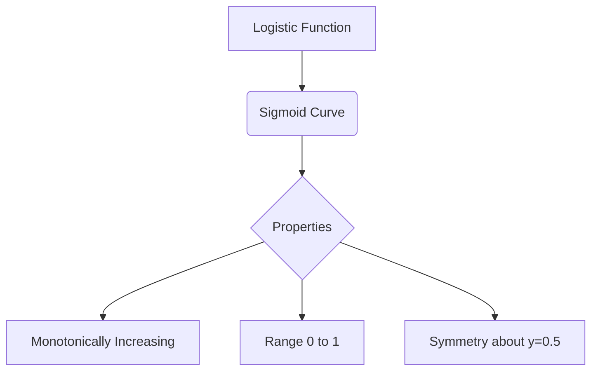
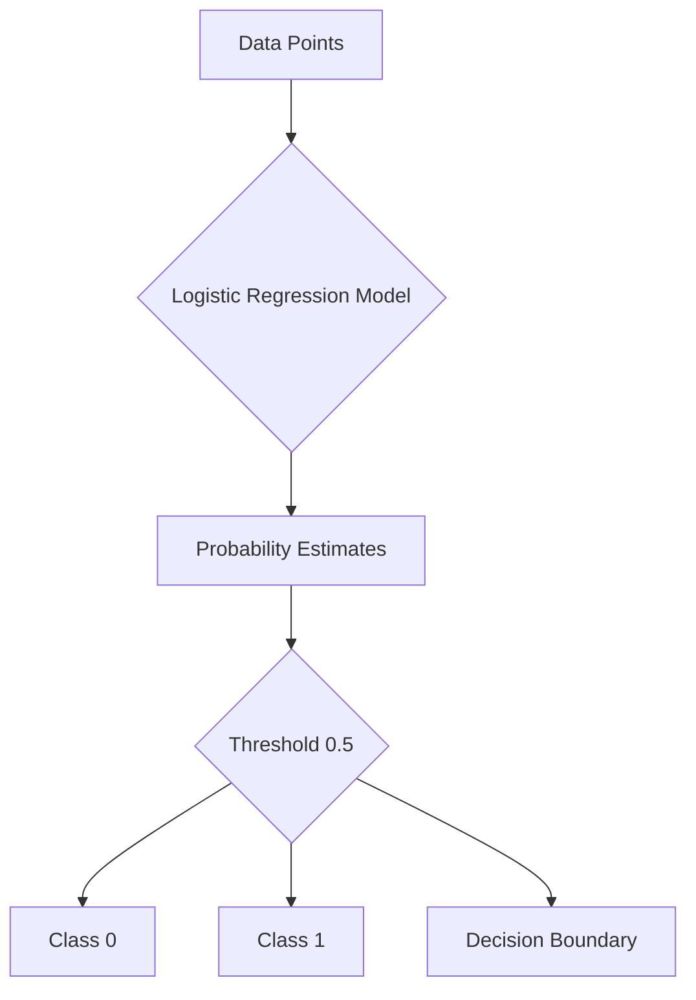

# 逻辑回归原理与代码实例讲解

## 1.背景介绍

### 1.1 什么是逻辑回归

逻辑回归(Logistic Regression)是一种广泛使用的机器学习算法,主要用于解决二分类问题。它基于概率估计模型,通过对数据特征进行学习训练,得到一个最优的逻辑回归模型,从而可以对新的数据进行分类预测。

逻辑回归的主要应用场景包括:

- 疾病检测(患病/未患病)
- 信用评分(违约/未违约)
- 广告点击预测(点击/未点击)
- 垃圾邮件过滤(垃圾/非垃圾)
- 等等

### 1.2 为什么选择逻辑回归

相比其他分类算法,逻辑回归具有以下优势:

- 简单易学,模型可解释性强
- 无需先验知识,可直接从数据中学习规律
- 计算代价低,模型训练和预测都高效
- 防止过拟合的能力较强,对缺失数据不太敏感
- 分类时可以给出概率值,方便阈值调整

### 1.3 逻辑回归与线性回归的区别

线性回归用于解决回归问题,预测的是一个连续的数值。而逻辑回归用于解决分类问题,预测的是一个离散的类别。

另外,线性回归对自变量没有范围要求,而逻辑回归的输出结果是介于0和1之间。

## 2.核心概念与联系 

### 2.1 逻辑斯蒂分布

逻辑回归的核心是通过对数据特征进行线性组合,将其输入到逻辑斯蒂分布(Logistic Distribution)中,从而得到一个介于0和1之间的概率值,作为样本属于正例的概率估计。

逻辑斯蒂分布的函数形式为:

$$
f(x) = \frac{1}{1+e^{-x}}
$$

其函数图像如下:



可以看出,逻辑斯蒂分布是一种S形的曲线,具有以下特点:

- 单调递增
- 值域在0到1之间
- 对于y=0.5为对称轴

这使得逻辑斯蒂分布非常适合于二分类问题。

### 2.2 概率估计

在逻辑回归中,我们将数据特征进行线性组合,得到一个叫做对数几率(log-odds)的值,即:

$$
\text{log-odds} = \beta_0 + \beta_1x_1 + \beta_2x_2 + ... + \beta_nx_n
$$

其中,β为模型参数,x为数据特征。

然后将对数几率代入逻辑斯蒂分布函数中,就可以得到样本属于正例的概率估计值:

$$
P(y=1|x) = \frac{1}{1+e^{-(\beta_0 + \beta_1x_1 + ... + \beta_nx_n)}}
$$

我们的目标就是通过学习训练,找到最优的模型参数β,使得概率估计值与真实标签值之间的误差最小化。

### 2.3 决策边界

对于给定的数据样本,我们可以计算出它属于正例的概率估计值。通过设置一个阈值(通常为0.5),就可以将其分到0类或1类。

所有使得概率估计值等于阈值的数据样本的集合,就构成了逻辑回归模型的决策边界。



## 3.核心算法原理具体操作步骤

逻辑回归的核心算法步骤如下:

### 3.1 数据预处理

- 缺失值处理
- 类别特征编码(如One-Hot编码)
- 特征归一化

### 3.2 定义模型和损失函数

- 模型定义为线性函数与逻辑斯蒂分布的组合
- 损失函数通常使用交叉熵损失

### 3.3 优化算法训练模型

- 常用的优化算法有梯度下降、L-BFGS等
- 目标是最小化损失函数,得到最优模型参数

### 3.4 模型评估

- 常用的评估指标有准确率、精确率、召回率、F1等
- 可使用K折交叉验证评估模型泛化能力

### 3.5 模型调优

- 可调节正则化参数,防止过拟合
- 可尝试不同的特征组合
- 可使用网格搜索等方法优化超参数

### 3.6 模型应用

- 使用训练好的模型对新数据进行预测
- 可设置不同的阈值,平衡正负例的权重

## 4.数学模型和公式详细讲解举例说明

### 4.1 逻辑回归模型形式

逻辑回归模型可以表示为:

$$
P(y=1|x) = \frac{1}{1+e^{-(\beta_0 + \beta_1x_1 + ... + \beta_nx_n)}}
$$

其中:

- $y$是二分类目标变量,取值0或1
- $x$是特征向量$(x_1, x_2, ..., x_n)$  
- $\beta$是模型参数向量$(\beta_0, \beta_1, ..., \beta_n)$

我们的目标是找到最优的模型参数$\beta$,使得对于任意给定的特征向量$x$,上式可以给出正确的概率估计值。

### 4.2 损失函数 - 交叉熵损失

为了训练逻辑回归模型,我们需要定义一个损失函数,用于衡量模型预测值与真实值之间的差距。

常用的损失函数是交叉熵损失(Cross Entropy Loss),对于二分类问题,它可以表示为:

$$
J(\beta) = -\frac{1}{m}\sum_{i=1}^m[y^{(i)}\log(h_\beta(x^{(i)})) + (1-y^{(i)})\log(1-h_\beta(x^{(i)}))]
$$

其中:

- $m$是训练样本数量
- $y^{(i)}$是第$i$个样本的真实标签,取值0或1
- $h_\beta(x^{(i)})$是模型对第$i$个样本的预测概率值
- 目标是最小化损失函数$J(\beta)$,从而得到最优模型参数$\beta$

### 4.3 优化算法 - 梯度下降法

为了最小化损失函数,我们可以使用梯度下降法(Gradient Descent)来迭代更新模型参数。

对于单个训练样本$(x^{(i)}, y^{(i)})$,参数$\beta_j$的梯度可以计算为:

$$
\frac{\partial J(\beta)}{\partial\beta_j} = (h_\beta(x^{(i)}) - y^{(i)})x_j^{(i)}
$$

然后,我们对所有训练样本求平均梯度,并使用学习率$\alpha$对参数进行更新:

$$
\beta_j := \beta_j - \alpha\frac{1}{m}\sum_{i=1}^m(h_\beta(x^{(i)}) - y^{(i)})x_j^{(i)}
$$

重复上述过程,直到损失函数收敛为止,就可以得到最优的模型参数。

### 4.4 实例解析

假设我们有一个二分类数据集,其中包含两个特征$x_1$和$x_2$,以及对应的标签$y$。我们希望训练一个逻辑回归模型,对新数据进行分类预测。

首先,我们可以将特征数据标准化,使其均值为0,方差为1。然后初始化模型参数$\beta_0, \beta_1, \beta_2$为0。

对于每个训练样本$(x_1^{(i)}, x_2^{(i)}, y^{(i)})$,我们计算:

$$
z^{(i)} = \beta_0 + \beta_1x_1^{(i)} + \beta_2x_2^{(i)}\\
h_\beta(x^{(i)}) = \frac{1}{1+e^{-z^{(i)}}}
$$

其中$h_\beta(x^{(i)})$就是模型对该样本的预测概率值。

接下来,我们计算损失函数的梯度:

$$
\frac{\partial J(\beta)}{\partial\beta_0} = \frac{1}{m}\sum_{i=1}^m(h_\beta(x^{(i)}) - y^{(i)})\\
\frac{\partial J(\beta)}{\partial\beta_1} = \frac{1}{m}\sum_{i=1}^m(h_\beta(x^{(i)}) - y^{(i)})x_1^{(i)}\\
\frac{\partial J(\beta)}{\partial\beta_2} = \frac{1}{m}\sum_{i=1}^m(h_\beta(x^{(i)}) - y^{(i)})x_2^{(i)}
$$

根据梯度下降法,我们使用学习率$\alpha$对参数进行更新:

$$
\beta_0 := \beta_0 - \alpha\frac{\partial J(\beta)}{\partial\beta_0}\\
\beta_1 := \beta_1 - \alpha\frac{\partial J(\beta)}{\partial\beta_1}\\
\beta_2 := \beta_2 - \alpha\frac{\partial J(\beta)}{\partial\beta_2}
$$

重复上述过程,直到损失函数收敛为止,我们就得到了最优的逻辑回归模型。

对于新的数据样本$(x_1, x_2)$,我们可以计算出属于正例的概率估计值:

$$
P(y=1|x_1, x_2) = \frac{1}{1+e^{-(\beta_0 + \beta_1x_1 + \beta_2x_2)}}
$$

通过设置一个阈值(通常为0.5),就可以将其分到0类或1类。

## 5.项目实践:代码实例和详细解释说明

以下是使用Python和Scikit-Learn库实现逻辑回归的代码示例,并对关键步骤进行了详细注释说明。

```python
# 导入所需库
import numpy as np
from sklearn.linear_model import LogisticRegression
from sklearn.datasets import make_blobs
from sklearn.model_selection import train_test_split
from sklearn.metrics import accuracy_score, classification_report

# 生成模拟二分类数据集
X, y = make_blobs(n_samples=1000, centers=2, n_features=2, random_state=1)

# 拆分训练集和测试集
X_train, X_test, y_train, y_test = train_test_split(X, y, test_size=0.2, random_state=42)

# 创建逻辑回归模型实例
logreg = LogisticRegression()

# 使用训练数据拟合模型
logreg.fit(X_train, y_train)

# 对测试集进行预测
y_pred = logreg.predict(X_test)

# 评估模型性能
print('Accuracy: {:.2f}'.format(accuracy_score(y_test, y_pred)))
print(classification_report(y_test, y_pred))

# 查看模型参数
print('Intercept: {}'.format(logreg.intercept_))
print('Coefficients: {}'.format(logreg.coef_))
```

代码解释:

1. 首先导入所需的Python库,包括Numpy、Scikit-Learn等。
2. 使用`make_blobs`函数生成一个模拟的二分类数据集,包含1000个样本,2个特征。
3. 将数据集拆分为训练集和测试集,测试集占20%。
4. 创建一个`LogisticRegression`类的实例,这是Scikit-Learn库中逻辑回归模型的实现。
5. 使用训练集数据`X_train`和`y_train`拟合逻辑回归模型。
6. 对测试集数据`X_test`进行预测,得到预测标签`y_pred`。
7. 使用`accuracy_score`函数计算模型在测试集上的准确率。
8. 使用`classification_report`函数输出更详细的分类指标,包括精确率、召回率和F1分数。
9. 最后打印出模型的参数,包括截距项`intercept_`和特征权重系数`coef_`。

运行上述代码,你将得到类似如下的输出:

```
Accuracy: 0.97
              precision    recall  f1-score   support

           0       0.98      0.97      0.97        99
           1       0.97      0.98      0.97       101

    accuracy                           0.97       200
   macro avg       0.97      0.97      0