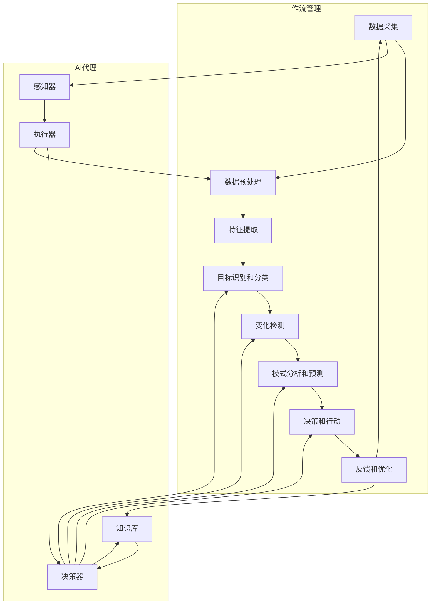

# 遥感数据处理的AI代理工作流技术

## 1.背景介绍

### 1.1 遥感数据的重要性

在当今时代,遥感数据在众多领域扮演着至关重要的角色。它为我们提供了关于地球表面特征和环境变化的宝贵信息,对于自然资源管理、气候变化监测、城市规划、农业发展等方面具有重大意义。随着卫星和航空遥感技术的不断进步,我们能够获取更高分辨率、更广范围的遥感数据,但同时也面临着海量数据处理和分析的巨大挑战。

### 1.2 传统遥感数据处理方法的局限性

传统的遥感数据处理方法主要依赖于人工干预和专业知识,存在效率低下、成本高昂、可扩展性差等问题。人工解译和分析遥感数据不仅耗时耗力,而且容易受到主观因素的影响,难以保证结果的一致性和准确性。此外,随着遥感数据量的激增,人工处理方式已经无法满足实时性和高效性的要求。

### 1.3 AI技术在遥感数据处理中的应用前景

近年来,人工智能(AI)技术在遥感数据处理领域得到了广泛应用,展现出巨大的潜力。AI算法能够自动化地从海量遥感数据中提取有价值的信息,并进行智能分析和决策。通过机器学习和深度学习等技术,AI系统可以自主识别和分类地物目标,检测变化,预测趋势,从而大幅提高数据处理的效率和准确性。

AI代理工作流技术正是将AI技术与遥感数据处理相结合的一种创新方式。它旨在构建自动化、智能化的数据处理流程,实现端到端的遥感数据管理和分析,为各行业提供高效、可靠的决策支持。

## 2.核心概念与联系

### 2.1 AI代理

AI代理是指具有一定自主性和智能的软件实体,能够感知环境、做出决策并执行相应的行为。在遥感数据处理领域,AI代理可以被视为一种智能助手,负责接收遥感数据、进行处理和分析,并根据预设目标和规则做出相应的决策和行动。

AI代理通常由以下几个核心组件构成:

1. **感知器(Sensor)**: 用于从环境中获取信息和数据,在遥感数据处理中即为接收遥感影像数据。
2. **决策器(Decision Maker)**: 根据感知器获取的信息、预设目标和规则,做出相应的决策。
3. **执行器(Actuator)**: 根据决策器的指令执行相应的行为,如对遥感数据进行预处理、分类、变化检测等操作。
4. **知识库(Knowledge Base)**: 存储AI代理所需的各种知识和规则,如地物目标特征、分类算法、处理流程等。

### 2.2 工作流技术

工作流(Workflow)是指将一系列相关的任务按照特定的顺序和规则组织起来,以实现某个目标的过程。工作流技术旨在自动化和优化这个过程,提高效率和可重复性。

在遥感数据处理中,工作流技术可以将各个处理步骤(如数据预处理、特征提取、分类、变化检测等)组织成一个有序的流程,并通过AI代理自动执行和管理这个流程。工作流技术还可以实现流程的可视化、监控和调度,方便进行流程优化和故障排查。

### 2.3 AI代理工作流

AI代理工作流技术将AI代理和工作流技术相结合,构建了一种智能化的遥感数据处理流程。在这种流程中,AI代理扮演着核心角色,负责感知遥感数据、做出决策并执行相应的处理任务。而工作流技术则负责协调和管理整个处理流程,确保各个步骤按照预定的顺序和规则执行。

AI代理工作流技术的优势在于:

1. **自动化**: 通过AI代理实现端到端的自动化处理,减少人工干预。
2. **智能化**: 利用AI算法进行智能分析和决策,提高处理质量和效率。
3. **可扩展性**: 工作流技术使得流程可以灵活扩展和调整,适应不同的应用场景。
4. **可重复性**: 工作流确保了处理流程的一致性和可重复性,便于标准化和质量控制。
5. **可视化**: 工作流技术提供了流程可视化和监控功能,方便管理和优化。

## 3.核心算法原理具体操作步骤

AI代理工作流技术的核心算法原理可以概括为以下几个步骤:

1. **数据采集**: 通过遥感传感器(如卫星、无人机等)采集原始遥感数据,如影像、激光点云等。

2. **数据预处理**: 对原始数据进行校正、配准、拼接等预处理操作,以提高数据质量和一致性。这一步骤通常由AI代理的执行器根据预设规则自动完成。

3. **特征提取**: 从预处理后的数据中提取有用的特征,如光谱特征、纹理特征、形状特征等。这一步骤可以利用机器学习算法(如卷积神经网络)自动完成。

4. **目标识别和分类**: 基于提取的特征,使用分类算法(如支持向量机、随机森林等)对地物目标进行识别和分类。这是AI代理决策器的核心功能之一。

5. **变化检测**: 通过对时间序列的遥感数据进行比对,检测出地物目标的变化情况,如植被覆盖变化、城市扩张等。变化检测算法(如图像分割、变化矢量分析等)可以被集成到AI代理中。

6. **模式分析和预测**: 基于历史数据,利用机器学习模型(如时间序列分析、深度学习等)分析地物目标的演变模式,并预测未来的发展趋势。

7. **决策和行动**: AI代理根据分析结果,结合预设目标和规则,做出相应的决策,并通过执行器执行相应的行动,如发出警报、调整监测策略等。

8. **反馈和优化**: 通过监控流程执行情况并收集反馈,对AI代理的知识库、决策规则和处理流程进行持续优化,以提高整体性能。

在整个过程中,工作流技术负责协调和管理各个步骤的执行顺序和依赖关系,确保流程的高效运行。同时,AI代理的各个组件(感知器、决策器、执行器、知识库)通过工作流技术进行无缝集成,实现智能化的端到端遥感数据处理。

## 4.数学模型和公式详细讲解举例说明

在AI代理工作流技术中,数学模型和公式扮演着重要角色,为各个环节提供理论基础和计算支持。以下是一些常用的数学模型和公式,以及它们在遥感数据处理中的应用:

### 4.1 图像预处理

#### 4.1.1 辐射校正

辐射校正是将原始遥感影像数据转换为真实的物理辐射量或反射率值的过程。常用的辐射校正模型包括:

$$L_\lambda = \frac{L_{max\lambda} - L_{min\lambda}}{Q_{cal\lambda}} \times (Q_{cal\lambda} - Q_{cal\lambda min}) + L_{min\lambda}$$

其中:
- $L_\lambda$: 波段$\lambda$的辐射亮度值
- $Q_{cal\lambda}$: 波段$\lambda$的校正后的数字值
- $L_{max\lambda}$和$L_{min\lambda}$: 波段$\lambda$的最大和最小辐射亮度值
- $Q_{cal\lambda min}$: 波段$\lambda$的最小数字值

#### 4.1.2 大气校正

大气校正是消除大气的影响,将遥感影像转换为地面反射率值。常用的大气校正模型包括6S模型、MODTRAN模型等。以6S模型为例,其核心公式为:

$$\rho_{toa} = \frac{\pi \times L_{toa}}{E_0 \times \cos(\theta_s) \times T_v}$$

其中:
- $\rho_{toa}$: 对地观测值(TOA反射率)
- $L_{toa}$: 卫星传感器接收到的辐射值
- $E_0$: 太阳辐照度
- $\theta_s$: 太阳入射角
- $T_v$: 大气上行透射率

### 4.2 特征提取

#### 4.2.1 光谱特征

光谱特征是指对象在不同波段的反射或发射特性,常用于目标识别和分类。例如,可以计算出归一化植被指数(NDVI):

$$NDVI = \frac{NIR - RED}{NIR + RED}$$

其中NIR和RED分别代表近红外和红光波段的反射率。NDVI值越高,植被覆盖度越高。

#### 4.2.2 纹理特征

纹理特征描述了影像上像素值的空间分布模式,对于识别人工目标和自然目标具有重要意义。常用的纹理特征提取方法包括灰度共生矩阵(GLCM)、小波变换等。以GLCM为例,可以计算出对比度、熵、同质性等纹理指标:

$$Contrast = \sum_{i,j=0}^{N-1} |i-j|^2 \times p(i,j)$$

$$Entropy = -\sum_{i,j=0}^{N-1} p(i,j) \times \log(p(i,j))$$

其中$p(i,j)$表示GLCM矩阵中$(i,j)$元素的值。

### 4.3 目标分类

目标分类是将遥感影像上的像素或对象归类到预定义的类别中。常用的分类算法包括最大似然法、支持向量机(SVM)、随机森林等。以SVM为例,其基本思想是在高维特征空间中寻找一个最优超平面,将不同类别的样本分开。对于线性可分的情况,超平面方程为:

$$w^T x + b = 0$$

其中$w$是权重向量,$b$是偏置项。SVM的目标是最大化两类样本到超平面的距离,即:

$$\max\limits_{w,b} \frac{1}{\|w\|} \quad s.t. \quad y_i(w^T x_i + b) \geq 1, i=1,2,...,n$$

对于非线性情况,可以引入核函数$K(x_i, x_j)$将样本映射到高维空间。

### 4.4 变化检测

变化检测是通过对比不同时期的遥感影像,识别出地物目标的变化情况。常用的变化检测方法包括像素对比法、后向最大似然法、变化矢量分析法等。以变化矢量分析法为例,其基本思想是将两个时相的多波段影像看作高维空间中的两个向量,计算它们的方向和幅度差异:

$$\vec{CV} = \sqrt{\sum_{i=1}^{n}(X_i^{t_2} - X_i^{t_1})^2}$$

$$\theta = \arccos\left(\frac{\sum_{i=1}^{n}X_i^{t_1}X_i^{t_2}}{\sqrt{\sum_{i=1}^{n}(X_i^{t_1})^2}\sqrt{\sum_{i=1}^{n}(X_i^{t_2})^2}}\right)$$

其中$\vec{CV}$表示变化矢量的幅度,$\theta$表示变化矢量的方向。根据$\vec{CV}$和$\theta$的值,可以判断像素是否发生变化,以及变化的类型和程度。

### 4.5 模式分析和预测

模式分析和预测是通过对历史数据进行分析,发现潜在的规律和趋势,并对未