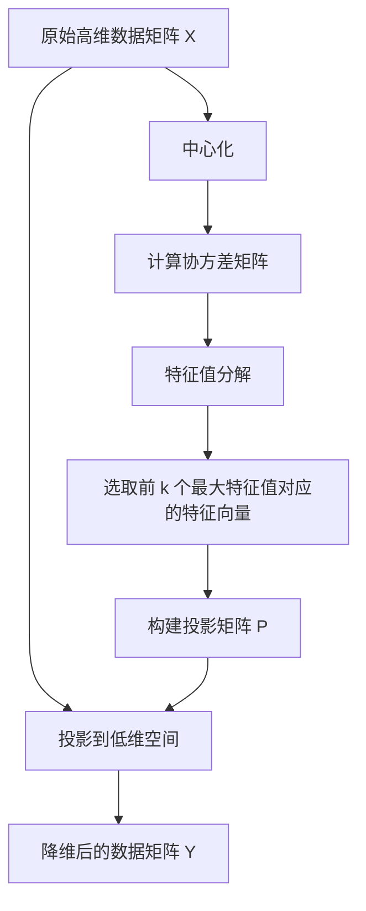
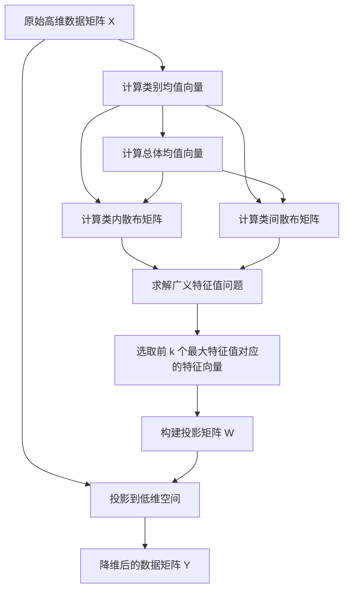
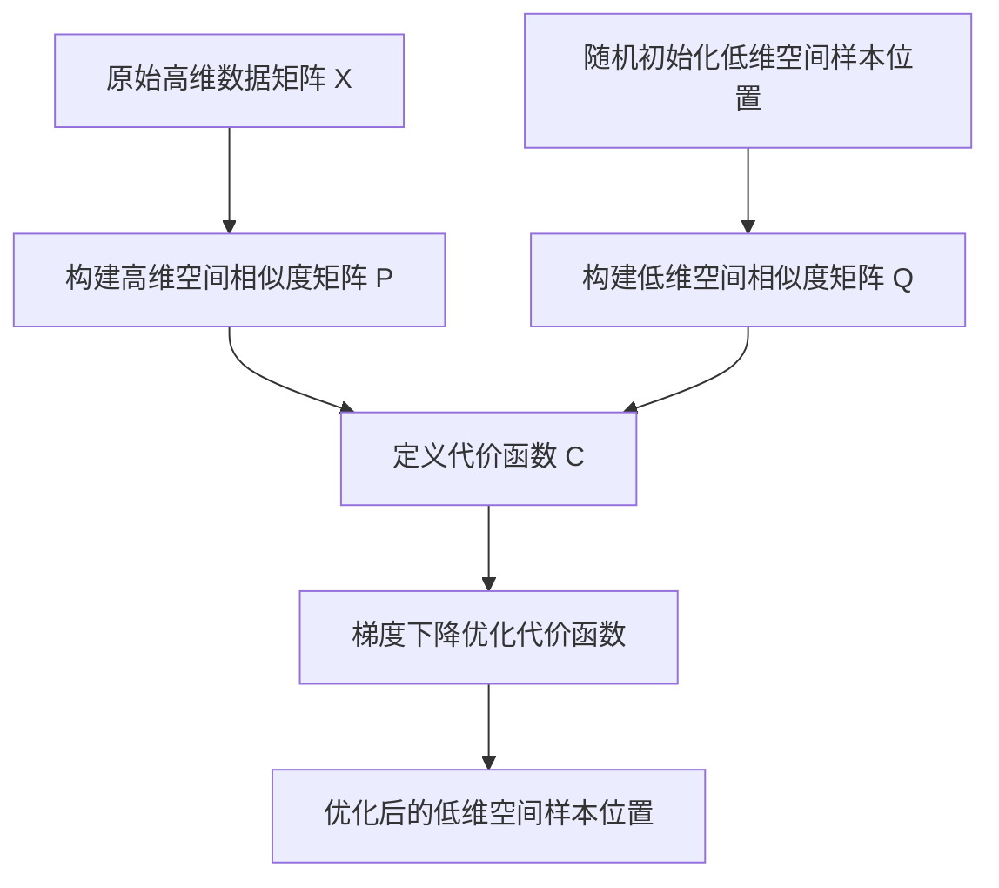

# 降维算法 原理与代码实例讲解

## 1. 背景介绍

在数据分析和机器学习领域中,我们经常会遇到高维数据集的情况。高维数据不仅会增加计算复杂度,还可能导致维数灾难(Curse of Dimensionality)的问题。降维技术的出现旨在解决这一难题,通过将高维数据映射到低维空间,从而简化数据的表示,提高分析效率。

降维算法广泛应用于数据可视化、数据压缩、特征选择和提取等领域。常见的降维算法包括主成分分析(PCA)、线性判别分析(LDA)、等式核映射(Isomap)、局部线性嵌入(LLE)、t-分布随机邻域嵌入(t-SNE)等。本文将重点介绍其中的PCA、LDA和t-SNE三种经典算法。

## 2. 核心概念与联系

### 2.1 数据矩阵

在讨论降维算法之前,我们需要先了解数据矩阵的概念。假设有 $m$ 个样本,每个样本有 $n$ 个特征,那么我们可以用一个 $m \times n$ 的矩阵 $X$ 来表示整个数据集:

$$
X = \begin{bmatrix}
x_{11} & x_{12} & \cdots & x_{1n} \\
x_{21} & x_{22} & \cdots & x_{2n} \\
\vdots & \vdots & \ddots & \vdots \\
x_{m1} & x_{m2} & \cdots & x_{mn}
\end{bmatrix}
$$

其中,每一行代表一个样本,每一列代表一个特征。

### 2.2 距离度量

在进行降维时,我们需要定义样本之间的距离或相似度。常用的距离度量包括欧几里得距离、曼哈顿距离、余弦相似度等。选择合适的距离度量对降维算法的效果有很大影响。

### 2.3 核心思想

降维算法的核心思想是找到一个低维的表示空间,使得原始高维数据在该空间中的投影能够尽可能保留数据的本质结构和特征。不同的算法采用不同的策略来实现这一目标。

## 3. 核心算法原理具体操作步骤

### 3.1 主成分分析(PCA)

#### 3.1.1 原理

PCA是一种线性无监督降维技术,它通过正交变换将原始数据投影到一个新的坐标系中,使得投影后的数据具有最大方差。具体步骤如下:

1. 对数据矩阵 $X$ 进行中心化,即将每个特征的均值减去,得到中心化矩阵 $\tilde{X}$。
2. 计算矩阵 $\tilde{X}$ 的协方差矩阵 $\Sigma$。
3. 对协方差矩阵 $\Sigma$ 进行特征值分解,得到特征值 $\lambda_1, \lambda_2, \cdots, \lambda_n$ 和对应的特征向量 $v_1, v_2, \cdots, v_n$。
4. 选取前 $k$ 个最大的特征值对应的特征向量,构成投影矩阵 $P$。
5. 将原始数据 $X$ 投影到低维空间,得到降维后的数据 $Y = \tilde{X}P$。

其中,前 $k$ 个主成分所对应的特征向量即为投影矩阵 $P$ 的列向量。通过将原始数据投影到由这些特征向量构成的低维空间,我们可以获得最大化方差的低维表示。



#### 3.1.2 代码实例

下面是使用Python中的scikit-learn库实现PCA降维的代码示例:

```python
from sklearn.decomposition import PCA

# 假设X是原始高维数据矩阵
pca = PCA(n_components=2)  # 将数据降维到2维
X_pca = pca.fit_transform(X)  # 获得降维后的数据
```

### 3.2 线性判别分析(LDA)

#### 3.2.1 原理

LDA是一种监督式降维技术,它旨在找到一个投影空间,使得同类样本投影点之间的距离尽可能小,异类样本投影点之间的距离尽可能大。具体步骤如下:

1. 计算每个类别的均值向量 $\mu_i$。
2. 计算总体均值向量 $\mu$。
3. 计算类内散布矩阵 $S_w = \sum_{i=1}^c \sum_{x \in X_i} (x - \mu_i)(x - \mu_i)^T$。
4. 计算类间散布矩阵 $S_b = \sum_{i=1}^c n_i(\mu_i - \mu)(\mu_i - \mu)^T$。
5. 求解广义特征值问题 $S_b w = \lambda S_w w$,得到特征值 $\lambda_1, \lambda_2, \cdots, \lambda_n$ 和对应的特征向量 $w_1, w_2, \cdots, w_n$。
6. 选取前 $k$ 个最大的特征值对应的特征向量,构成投影矩阵 $W$。
7. 将原始数据 $X$ 投影到低维空间,得到降维后的数据 $Y = XW$。

其中,前 $k$ 个最大特征值对应的特征向量即为投影矩阵 $W$ 的列向量。通过将原始数据投影到由这些特征向量构成的低维空间,我们可以获得最大化类内紧凑性和类间可分性的低维表示。



#### 3.2.2 代码实例

下面是使用Python中的scikit-learn库实现LDA降维的代码示例:

```python
from sklearn.discriminant_analysis import LinearDiscriminantAnalysis as LDA

# 假设X是原始高维数据矩阵,y是样本标签
lda = LDA(n_components=2)  # 将数据降维到2维
X_lda = lda.fit_transform(X, y)  # 获得降维后的数据
```

### 3.3 t-SNE

#### 3.3.1 原理

t-SNE是一种非线性降维技术,它旨在保持高维空间中样本之间的相对距离关系。具体步骤如下:

1. 构建高维空间中样本的相似度矩阵 $P$,其中 $p_{ij}$ 表示样本 $i$ 和样本 $j$ 之间的相似度。
2. 在低维空间中随机初始化样本的位置。
3. 构建低维空间中样本的相似度矩阵 $Q$,其中 $q_{ij}$ 表示样本 $i$ 和样本 $j$ 在低维空间中的相似度。
4. 定义代价函数 $C = KL(P || Q) = \sum_{i \neq j} p_{ij} \log \frac{p_{ij}}{q_{ij}}$,其中 $KL$ 表示Kullback-Leibler散度。
5. 使用梯度下降法最小化代价函数 $C$,从而优化低维空间中样本的位置。

t-SNE算法的关键在于构建高维和低维空间中的相似度矩阵。高维空间中的相似度矩阵通常采用高斯分布或者Student-t分布来计算。低维空间中的相似度矩阵则采用Student-t分布,这使得t-SNE能够更好地保持样本之间的局部和全局结构。



#### 3.3.2 代码实例

下面是使用Python中的scikit-learn库实现t-SNE降维的代码示例:

```python
from sklearn.manifold import TSNE

# 假设X是原始高维数据矩阵
tsne = TSNE(n_components=2, perplexity=30, n_iter=1000)  # 将数据降维到2维
X_tsne = tsne.fit_transform(X)  # 获得降维后的数据
```

其中,`perplexity`参数控制了高维空间中相似度矩阵的熵值,`n_iter`参数控制了梯度下降的迭代次数。

## 4. 数学模型和公式详细讲解举例说明

在上一节中,我们介绍了三种经典的降维算法的原理和实现步骤。现在,我们将更深入地探讨它们的数学模型和公式,并通过具体的例子来说明。

### 4.1 PCA数学模型

PCA的核心思想是找到一个新的坐标系,使得在这个坐标系中,数据的方差最大化。具体来说,我们希望找到一个投影矩阵 $P$,使得投影后的数据 $Y = XP$ 的方差最大。

我们定义投影后数据的散布矩阵为:

$$
\begin{aligned}
S_Y &= \frac{1}{m} \sum_{i=1}^m (y_i - \bar{y})(y_i - \bar{y})^T \\
    &= \frac{1}{m} \sum_{i=1}^m (Xp_i - \bar{Xp_i})(Xp_i - \bar{Xp_i})^T \\
    &= \frac{1}{m} \sum_{i=1}^m Xp_ip_i^TX^T \\
    &= P^T \left( \frac{1}{m} \sum_{i=1}^m XX^T \right) P \\
    &= P^T \Sigma P
\end{aligned}
$$

其中,$ \Sigma = \frac{1}{m} \sum_{i=1}^m XX^T $ 是数据矩阵 $X$ 的协方差矩阵。

为了使投影后数据的方差最大化,我们需要最大化 $\text{tr}(S_Y) = \text{tr}(P^T\Sigma P)$,其中 $\text{tr}(\cdot)$ 表示矩阵的迹。由于 $P$ 是一个正交矩阵,我们可以将约束条件写为 $P^TP = I$。

这个最优化问题可以通过拉格朗日乘数法求解,得到 $P$ 的列向量就是 $\Sigma$ 的特征向量,对应的特征值就是投影后数据的方差。因此,我们可以选取对应于最大 $k$ 个特征值的特征向量作为投影矩阵 $P$,从而获得最大化方差的低维表示。

让我们通过一个简单的二维数据集来说明PCA的过程。

```python
import numpy as np
import matplotlib.pyplot as plt
from sklearn.decomposition import PCA

# 生成二维数据集
mean = [0, 0]
cov = [[1, 0], [0, 0.1]]
X = np.random.multivariate_normal(mean, cov, 100)

# 可视化原始数据
plt.scatter(X[:, 0], X[:, 1])
plt.axis('equal')
plt.show()

# 应用PCA降维
pca = PCA(n_components=1)
X_pca = pca.fit_transform(X)

# 可视化降维后的数据
plt.scatter(X_pca[:, 0], np.zeros(len(X_pca)))
plt.axis('equal')
plt.show()
```

在这个例子中,我们首先生成了一个二维高斯分布的数据集。然后,我们使用PCA将数据降维到一维空间。可以看到,降维后的数据保留了原始数据的主要结构和方向。

### 4.2 LDA数学模型

LDA的目标是找到一个投影空间,使得同类样本投影点之间的距离尽可能小,异类样本投影点之间