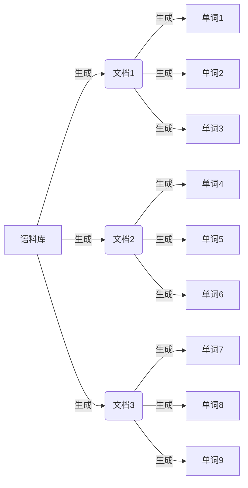
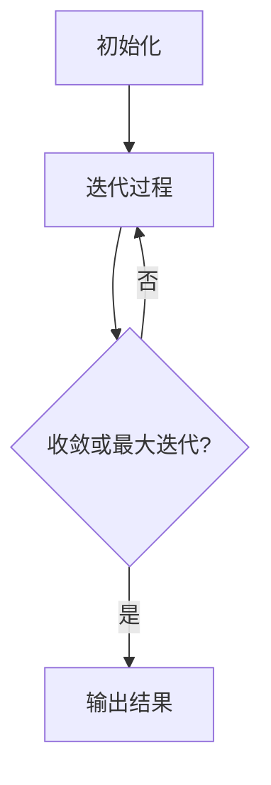

# 隐含狄利克雷分布(LDA)原理与代码实战案例讲解

## 1. 背景介绍

### 1.1 文本挖掘与主题建模

在当今信息时代,我们面临着海量的非结构化文本数据,例如新闻报道、社交媒体帖子、电子邮件等。如何从这些大量的文本数据中提取有价值的信息和见解,一直是自然语言处理(NLP)和文本挖掘领域的核心挑战之一。主题建模作为一种无监督机器学习技术,旨在自动发现文本集合中潜在的主题结构,为理解大规模文本数据提供了有力工具。

### 1.2 LDA 概述

隐含狄利克雷分布(Latent Dirichlet Allocation, LDA)是一种经典的主题建模算法,由David Blei等人于2003年提出。LDA将每个文档建模为一个主题的混合,每个主题又由一组特征词构成。通过LDA,我们可以发现文档集合中的潜在主题,并推断每个文档属于不同主题的概率,从而实现文本聚类、信息检索、文本摘要等多种应用。

## 2. 核心概念与联系

### 2.1 基本概念

在深入探讨LDA算法之前,我们需要了解以下几个基本概念:

- **语料库(Corpus)**: 指一组文档的集合。
- **文档(Document)**: 由一系列单词(Word)组成的文本单元。
- **单词(Word)**: 构成文档的基本单位。
- **主题(Topic)**: 一组语义相关的单词集合,用于描述文档的主题内容。
- **词分布(Word Distribution)**: 每个主题由一组单词及其在该主题下的概率分布组成。
- **主题分布(Topic Distribution)**: 每个文档由一组主题及其在该文档下的概率分布组成。

### 2.2 LDA 生成过程

LDA是一种生成式概率模型,它假设每个文档是通过以下过程生成的:

1. 对于每个文档,从狄利克雷分布(Dirichlet Distribution)中抽取一个主题分布。
2. 对于文档中的每个单词:
   a. 从文档的主题分布中随机抽取一个主题。
   b. 从该主题对应的词分布中随机抽取一个单词。

这个生成过程可以用下图来表示:



通过观察生成的单词,我们可以反向推断出潜在的主题分布和词分布。这就是LDA算法的基本思想。

## 3. 核心算法原理具体操作步骤

### 3.1 LDA 算法流程

LDA算法的目标是根据观测到的单词,推断出隐藏的主题分布和词分布。这个过程可以分为以下几个步骤:

1. **初始化**:
   - 指定主题数量 $K$。
   - 为每个文档随机初始化主题分布 $\theta$。
   - 为每个主题随机初始化词分布 $\phi$。

2. **迭代过程**:
   - 对于每个文档中的每个单词:
     a. 根据当前的主题分布 $\theta$ 和词分布 $\phi$,计算该单词属于每个主题的概率。
     b. 根据计算出的概率,重新分配该单词所属的主题。
     c. 更新主题分布 $\theta$ 和词分布 $\phi$。
   - 重复上述步骤,直到模型收敛或达到最大迭代次数。

3. **输出结果**:
   - 最终的主题分布 $\theta$ 和词分布 $\phi$。

### 3.2 算法流程图



### 3.3 算法伪代码

以下是LDA算法的伪代码:

```
函数 LDA(文档集合 D, 主题数量 K, 迭代次数 max_iter):
    初始化主题分布 theta
    初始化词分布 phi
    
    for iter in range(max_iter):
        for d in D:
            for w in d:
                # 计算单词 w 属于每个主题的概率
                p = 计算_单词_主题_概率(w, theta[d], phi)
                
                # 重新分配单词 w 所属的主题
                新主题 = 根据概率分布 p 重新采样主题
                
                # 更新主题分布和词分布
                theta[d], phi[新主题] = 更新_分布(d, w, 新主题)
        
        if 收敛:
            break
    
    return theta, phi
```

在实际实现中,通常采用更高效的变分推断(Variational Inference)或吉布斯采样(Gibbs Sampling)等算法来近似推断隐藏的主题分布和词分布。

## 4. 数学模型和公式详细讲解举例说明

### 4.1 狄利克雷分布

狄利克雷分布(Dirichlet Distribution)是一种在统计学中广泛使用的多项式分布,常用于生成分类数据的先验概率。在LDA模型中,狄利克雷分布被用于生成文档的主题分布。

狄利克雷分布的概率密度函数为:

$$
\begin{aligned}
P(\theta|\alpha) &= \frac{\Gamma\left(\sum_{i=1}^{K}\alpha_i\right)}{\prod_{i=1}^{K}\Gamma(\alpha_i)}\prod_{i=1}^{K}\theta_i^{\alpha_i-1} \\
&\propto \prod_{i=1}^{K}\theta_i^{\alpha_i-1}
\end{aligned}
$$

其中:

- $\theta$ 是一个 $K$ 维向量,表示主题分布,满足 $\sum_{i=1}^{K}\theta_i=1$。
- $\alpha$ 是一个 $K$ 维向量,称为狄利克雷先验,控制主题分布的平滑程度。
- $\Gamma(\cdot)$ 是伽马函数。

### 4.2 LDA 生成模型

在LDA模型中,假设有 $M$ 个文档,每个文档 $d$ 由 $N_d$ 个单词组成。LDA的生成过程可以表示为:

1. 对于每个主题 $k$,从狄利克雷分布 $Dir(\beta)$ 中抽取一个 $V$ 维词分布 $\phi_k$,其中 $V$ 是词汇表的大小。
2. 对于每个文档 $d$:
   a. 从狄利克雷分布 $Dir(\alpha)$ 中抽取一个 $K$ 维主题分布 $\theta_d$。
   b. 对于文档 $d$ 中的每个单词 $w_{dn}$:
      i. 从多项分布 $Mult(\theta_d)$ 中抽取一个主题 $z_{dn}$。
      ii. 从多项分布 $Mult(\phi_{z_{dn}})$ 中抽取一个单词 $w_{dn}$。

上述过程可以用下图表示:

```mermaid
graph LR
    A[狄利克雷分布 Dir(beta)] -->|生成| B(词分布 phi)
    C[狄利克雷分布 Dir(alpha)] -->|生成| D(主题分布 theta)
    D -->|生成| E(主题 z)
    B -->|生成| F(单词 w)
    E -->|生成| F
```

### 4.3 LDA 推断

在实际应用中,我们观测到的是文档集合 $D$ 和单词 $w$,而主题分布 $\theta$ 和词分布 $\phi$ 是隐藏的。LDA算法的目标是根据观测数据推断出隐藏的 $\theta$ 和 $\phi$。

常用的推断方法包括:

1. **吉布斯采样(Gibbs Sampling)**:通过马尔可夫链蒙特卡罗(MCMC)方法,逐步更新每个单词的主题分配,从而近似推断 $\theta$ 和 $\phi$。
2. **变分推断(Variational Inference)**:通过最小化变分下界(ELBO)来近似推断 $\theta$ 和 $\phi$。

以吉布斯采样为例,对于每个单词 $w_{dn}$,我们需要计算它属于每个主题 $k$ 的条件概率:

$$
P(z_{dn}=k|w_{dn},\mathbf{z}_{-dn},\mathbf{w},\alpha,\beta) \propto \frac{n_{d,-dn}^{(k)}+\alpha_k}{n_{d,-dn}^{(.)}+\sum_{j=1}^{K}\alpha_j}\cdot\frac{n_{k,-dn}^{(w_{dn})}+\beta_{w_{dn}}}{n_{k,-dn}^{(.)}+\sum_{v=1}^{V}\beta_v}
$$

其中:

- $n_{d,-dn}^{(k)}$ 是文档 $d$ 中除了 $w_{dn}$ 之外分配给主题 $k$ 的单词数。
- $n_{k,-dn}^{(w_{dn})}$ 是除了 $w_{dn}$ 之外分配给主题 $k$ 的单词 $w_{dn}$ 的数量。
- $n_{d,-dn}^{(.)}$ 和 $n_{k,-dn}^{(.)}$ 分别表示文档 $d$ 和主题 $k$ 的总单词数。

通过多次采样和更新,最终可以得到收敛的 $\theta$ 和 $\phi$ 估计值。

## 5. 项目实践:代码实例和详细解释说明

在这一部分,我们将使用Python中的`gensim`库实现LDA模型,并在经典的20个新闻组数据集上进行实践。

### 5.1 数据准备

首先,我们需要导入所需的库和数据集:

```python
import gensim
from gensim import corpora

# 加载数据集
dataset = corpora.NewsGroupsTrainData(data_path='/path/to/dataset')

# 创建语料库
corpus = [doc.words for doc in dataset.data]
```

`corpora.NewsGroupsTrainData`是`gensim`库提供的一个经典新闻组数据集,包含20个不同主题的新闻文章。我们将文档集合存储在`corpus`变量中。

### 5.2 构建词典和向量化

接下来,我们需要构建词典并将文档向量化:

```python
# 创建词典
dictionary = corpora.Dictionary(corpus)

# 过滤极低频和极高频词
dictionary.filter_extremes(no_below=10, no_above=0.5)

# 将文档转换为词袋向量
corpus_bow = [dictionary.doc2bow(doc) for doc in corpus]
```

在这个步骤中,我们首先创建了一个`Dictionary`对象,用于存储语料库中的所有单词。然后,我们使用`filter_extremes`方法过滤掉出现频率过低(少于10次)和过高(超过50%文档)的单词。最后,我们将每个文档转换为词袋(Bag-of-Words)向量表示,存储在`corpus_bow`中。

### 5.3 训练LDA模型

现在,我们可以开始训练LDA模型了:

```python
# 设置主题数量
num_topics = 20

# 训练LDA模型
lda_model = gensim.models.LdaMulticore(corpus=corpus_bow,
                                        id2word=dictionary,
                                        num_topics=num_topics,
                                        random_state=100,
                                        chunksize=100,
                                        passes=10,
                                        alpha='auto',
                                        eta='auto')
```

在这里,我们使用`gensim.models.LdaMulticore`类初始化了一个LDA模型。我们设置了主题数量为20,并指定了其他参数,如随机种子、chunk大小、迭代次数和先验参数。`gensim`库会自动选择合适的推断算法(如变分推断或吉布斯采样)来训练模型。

### 5.4 查看主题和词分布

训练完成后,我们可以查看每个主题的词分布:

```python
# 打印每个主题的前10个词
for idx, topic in lda_model.print_topics(-1):
    print(f'Topic {idx}:')
    print(' '.join([word for word, _ in topic[:10]]))
    print()
```

输