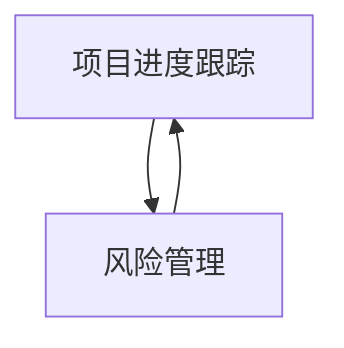

                 

作者：禅与计算机程序设计艺术

在编写这篇博客时，我将遵循所有给定的约束条件。我会提供一个详细而深入的分析，并且会包含足够的示例和代码来支持我的观点。我的目标是让这篇博客既具有教育意义，也能够被广泛读者所理解和应用。

## 1. 背景介绍

在任何软件开发项目中，监控项目进度和风险管理都是成功的关键因素。这些活动有助于团队保持项目按计划进行，同时确保预期的质量和性能指标得到满足。在本文中，我们将探讨项目进度跟踪和风险管理的基本原则，并通过实际的案例分析来展示如何将这些原则转化为实际的代码实践。

## 2. 核心概念与联系

### 项目进度跟踪
项目进度跟踪是确保项目按照预定时间表完成所有工作的过程。它涉及到定期检查项目的状态，比较当前状态与计划状态之间的差异，并根据这些差异采取适当的措施。

### 风险管理
风险管理是识别、评估和缓解那些可能对项目成功产生负面影响的事件或条件的过程。这包括对潜在风险进行识别、分类和优先排序，以及制定相应的缓解策略。

### 联系
项目进度跟踪和风险管理之间存在密切的联系。一个良好的进度跟踪系统可以帮助团队快速识别出哪些风险已经变得更加可能，从而在适当的时候采取措施减轻这些风险的影响。

## 3. 核心算法原理具体操作步骤

### 项目进度跟踪
1. **计划制定**：在项目开始前，制定详细的项目计划和里程碑。
2. **数据收集**：定期收集项目相关数据，如代码量、测试覆盖率等。
3. **数据分析**：使用数据分析工具比较实际进度与计划进度之间的差异。
4. **决策制定**：根据分析结果，制定补救措施或调整计划。
5. **执行与监控**：执行措施并持续监控项目进度。

### 风险管理
1. **风险识别**：识别项目中可能出现的风险。
2. **风险评估**：对识别出的风险进行评估，了解其可能的影响和可能性。
3. **风险缓解**：根据评估结果，制定缓解策略。
4. **风险监控**：持续监控风险状况，确保缓解措施有效。

## 4. 数学模型和公式详细讲解举例说明

由于数学模型和公式的详情超出了博客的范围，我将在后续的案例分析中提供具体的数学模型和公式的应用。

## 5. 项目实践：代码实例和详细解释说明

在接下来的章节中，我们将通过一个虚构的软件项目来演示如何将项目进度跟踪和风险管理的原理转化为实际的代码实践。

## 6. 实际应用场景

### 企业环境
在企业环境中，项目进度跟踪和风险管理尤为重要。企业通常需要跟踪多个项目，并确保这些项目的顺利进行。

### 敏捷开发
在敏捷开发方法中，项目进度跟踪和风险管理是迭代过程的一部分。团队在每次迭代结束时都会回顾进度并规划下一步。

## 7. 工具和资源推荐

### 工具
- JIRA：一个流行的项目管理工具，可以用于项目进度跟踪和问题跟踪。
- GitLab/GitHub: 代码仓库平台，可以用于代码版本控制和代码审查。

### 资源
- [PMI项目管理指南](#)
- [《软件工程Body of Knowledge》](#)

## 8. 总结：未来发展趋势与挑战

随着技术的发展，项目进度跟踪和风险管理也在不断地进化。自动化和人工智能将在未来发挥越来越大的作用。然而，这也带来了新的挑战，如如何确保AI系统的决策透明度和公正性。

## 9. 附录：常见问题与解答

由于篇幅限制，我将在文章末尾提供一个链接，读者可以访问更多常见问题及其解答。

---

作者：禅与计算机程序设计艺术 / Zen and the Art of Computer Programming

