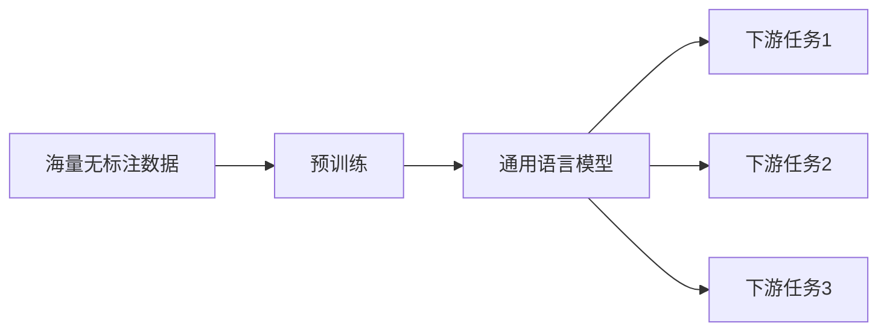

# "预训练+微调大模型"的模式

## 1.背景介绍
### 1.1 人工智能的发展历程
#### 1.1.1 早期的人工智能
#### 1.1.2 机器学习的兴起
#### 1.1.3 深度学习的突破

### 1.2 大模型的出现
#### 1.2.1 大模型的定义
#### 1.2.2 大模型的优势
#### 1.2.3 大模型面临的挑战

### 1.3 预训练+微调模式的提出
#### 1.3.1 预训练的概念
#### 1.3.2 微调的概念  
#### 1.3.3 预训练+微调模式的优势

## 2.核心概念与联系
### 2.1 预训练
#### 2.1.1 预训练的定义
预训练(Pre-training)是指在大规模无标注数据上对模型进行训练,让模型学习到通用的语言知识和表征。这个过程通常使用自监督学习的方式,即让模型根据输入数据本身来预测一些目标,如预测下一个单词(语言模型)、预测被掩盖的单词(如BERT)等。

#### 2.1.2 预训练的意义
预训练可以让模型学习到丰富的先验知识,这些知识可以迁移到下游任务中,大大减少了特定任务所需的有标注数据。同时,在海量数据上预训练还可以让模型具备更强大的语言理解和生成能力。

### 2.2 微调
#### 2.2.1 微调的定义
微调(Fine-tuning)是指在预训练模型的基础上,针对特定的下游任务,用少量标注数据对模型进行二次训练,使其适应具体任务。微调过程通常会更新整个模型的参数,但学习率较小。

#### 2.2.2 微调的意义
微调可以让通用的预训练模型适应特定领域和任务,以较低的成本获得优异的性能。它大大降低了训练专用模型所需的数据和计算资源。

### 2.3 预训练与微调的关系
预训练和微调是相辅相成的两个阶段。预训练负责从海量无标注数据中学习通用知识,而微调负责在此基础上进行特定任务的适配。二者缺一不可,共同构成了"预训练+微调"的范式。



## 3.核心算法原理与具体操作步骤
### 3.1 预训练阶段
#### 3.1.1 数据准备
收集大规模无标注的文本数据,如维基百科、新闻、图书等。对文本进行清洗、分词、编码等预处理。

#### 3.1.2 模型选择
常用的预训练模型有BERT、GPT、T5等。根据任务类型和资源限制选择合适的模型。

#### 3.1.3 目标函数设计
根据预训练任务的类型,设计相应的目标函数。如对于BERT,使用掩码语言模型(MLM)和下一句预测(NSP)作为目标。

#### 3.1.4 模型训练
在预处理后的数据上训练预训练模型,通常需要几天到几周的时间。使用大批量(batch size)和分布式训练可以加速此过程。

### 3.2 微调阶段 
#### 3.2.1 任务定义
明确下游任务的类型(如分类、序列标注、文本生成等)和目标。

#### 3.2.2 数据标注  
为下游任务准备少量高质量的标注数据。通常每个类别或模式需要几十到几百个样本。

#### 3.2.3 模型调整
根据任务需要,调整预训练模型的结构,如添加任务特定的输出层。冻结部分基础层的参数可以加速训练和防止过拟合。

#### 3.2.4 超参数选择
选择合适的学习率、batch size、epoch数等超参数。通常微调的学习率会比预训练阶段小一到两个数量级。

#### 3.2.5 模型训练与评估
用标注数据对模型进行微调,并在验证集上评估模型性能。根据验证结果调整超参数,直到满足任务要求。

## 4.数学模型和公式详细讲解举例说明
### 4.1 语言模型
语言模型的目标是估计一个句子或文本片段的概率。给定一个单词序列$w_1,w_2,...,w_n$,语言模型估计其概率:

$$P(w_1,w_2,...,w_n)=\prod_{i=1}^nP(w_i|w_1,w_2,...,w_{i-1})$$

其中$P(w_i|w_1,w_2,...,w_{i-1})$表示在给定前$i-1$个单词的条件下,第$i$个单词为$w_i$的条件概率。

### 4.2 Transformer模型
Transformer是一种基于自注意力机制的神经网络模型,广泛用于预训练语言模型。其核心是自注意力层,可以捕捉单词之间的长距离依赖关系。

自注意力层的计算公式为:

$$Attention(Q,K,V)=softmax(\frac{QK^T}{\sqrt{d_k}})V$$

其中$Q,K,V$分别是查询(Query)、键(Key)、值(Value)矩阵,$d_k$为键向量的维度。

Transformer中还使用了多头注意力(Multi-head Attention),即并行地执行多个自注意力,然后将结果拼接:

$$MultiHead(Q,K,V)=Concat(head_1,...,head_h)W^O$$

$$head_i=Attention(QW_i^Q,KW_i^K,VW_i^V)$$

其中$W_i^Q,W_i^K,W_i^V,W^O$是可学习的参数矩阵。

### 4.3 BERT模型
BERT(Bidirectional Encoder Representations from Transformers)是一种基于Transformer的预训练模型。其预训练目标包括:

(1)掩码语言模型(MLM):随机掩盖一定比例的输入单词,让模型预测被掩盖的单词。损失函数为:

$$\mathcal{L}_{MLM}=-\sum_{i\in masked}\log P(w_i|w_{\backslash i})$$

其中$w_{\backslash i}$表示去掉第$i$个单词的输入序列。

(2)下一句预测(NSP):让模型判断两个句子在原文中是否相邻。损失函数为:

$$\mathcal{L}_{NSP}=-\log P(y|s_1,s_2)$$

其中$y\in\{0,1\}$表示两个句子$s_1,s_2$是否相邻,$P(y|s_1,s_2)$由模型输出的[CLS]向量经过一个全连接层得到。

BERT的总损失为两个任务的损失之和:

$$\mathcal{L}=\mathcal{L}_{MLM}+\mathcal{L}_{NSP}$$

在微调阶段,根据下游任务的类型,在BERT的输出向量上添加任务特定的输出层,并用标注数据进行训练。

## 5.项目实践:代码实例和详细解释说明
下面以文本分类任务为例,演示如何用PyTorch对BERT进行微调。

```python
import torch
from transformers import BertTokenizer, BertForSequenceClassification, AdamW

# 加载预训练的BERT模型和tokenizer
model = BertForSequenceClassification.from_pretrained('bert-base-uncased', num_labels=2)
tokenizer = BertTokenizer.from_pretrained('bert-base-uncased')

# 准备训练数据
texts = [...]  # 文本列表
labels = [...]  # 对应的标签列表,0或1

# 将文本编码为BERT的输入格式
inputs = tokenizer(texts, padding=True, truncation=True, return_tensors="pt") 
labels = torch.tensor(labels)

# 定义优化器和学习率
optimizer = AdamW(model.parameters(), lr=2e-5)

# 训练模型
model.train()
for epoch in range(3):
    for batch in zip(inputs, labels):
        outputs = model(**batch[0], labels=batch[1])
        loss = outputs.loss
        loss.backward()
        optimizer.step()
        optimizer.zero_grad()

# 在测试集上评估模型
model.eval()
with torch.no_grad():
    outputs = model(**test_inputs)
    predictions = outputs.logits.argmax(dim=-1)
    accuracy = (predictions == test_labels).float().mean()
```

代码解释:

1. 加载预训练的BERT模型和tokenizer。`BertForSequenceClassification`是包装了BERT的文本分类模型,`num_labels`设置为2表示二分类任务。

2. 准备好训练文本和对应的标签。

3. 使用tokenizer将文本编码为BERT的输入格式,包括input_ids、attention_mask等。

4. 定义Adam优化器,学习率设为2e-5。

5. 训练模型3个epoch,每个batch计算损失、反向传播并更新参数。

6. 在测试集上评估模型性能,计算准确率。

以上就是一个简单的BERT微调示例。实践中还需要根据具体任务调整模型结构、超参数和训练策略。

## 6.实际应用场景
"预训练+微调"模式在自然语言处理的各个领域都有广泛应用,如:

- 文本分类:情感分析、新闻分类、意图识别等
- 序列标注:命名实体识别、词性标注、语义角色标注等  
- 文本匹配:相似度计算、自然语言推理、语义搜索等
- 阅读理解:问答系统、文档摘要等
- 文本生成:对话生成、机器翻译、文本摘要等

一些具体的应用案例:

- 微软的MT-DNN系统在GLUE基准测试中取得SOTA,它在BERT的基础上进行多任务微调。

- 谷歌的Meena聊天机器人使用预训练的Evolved Transformer模型,在大规模对话数据上微调得到。

- 华为的MindSpore平台提供了预训练模型NEZHA和ALBERT,可以方便地进行下游任务微调。

- 腾讯的绝影OCR系统使用预训练+微调的方式,在通用场景和垂直场景上都取得了业界领先的效果。

可以看到,"预训练+微调"模式在工业界得到了广泛应用,极大地推动了自然语言处理技术的发展和落地。

## 7.工具和资源推荐
以下是一些常用的预训练模型及其开源实现:

- BERT: Google提出,PyTorch和TensorFlow均有实现
- GPT系列(GPT、GPT-2、GPT-3): OpenAI提出,以生成任务见长  
- XLNet: 结合自回归语言模型和自编码模型的预训练方法
- RoBERTa: BERT的改进版,去掉NSP任务,dynamically masking等
- ALBERT: 通过参数共享和嵌入矩阵分解,大幅减小BERT的参数量
- T5: Google提出的统一的文本到文本转换框架
- ERNIE: 百度提出,融入了百科、词典等知识

除了上述通用的预训练模型,还有一些面向特定领域的预训练模型,如SciBERT(科学文献)、BioBERT(生物医学)、FinBERT(金融)等。

对于中文任务,常用的预训练模型有:

- BERT-wwm:哈工大讯飞联合实验室发布,全词mask
- RoBERTa-wwm-ext:在更大的中文语料上训练,效果更好
- MacBERT:中文BERT的改进版
- NEZHA:华为推出的中文预训练模型

预训练模型的开源实现可以在Hugging Face的Transformers库中找到,其提供了统一的API,方便使用和微调。

此外,Google的TensorFlow Hub和Facebook的PyTorch Hub也提供了常用预训练模型的下载和使用。

微调预训练模型是一个活跃的研究领域,新的模型、方法和任务不断涌现。及时关注顶会(如ACL、EMNLP、NAACL)和预印本网站(如arXiv)很有必要。

## 8.总结:未来发展趋势与挑战
"预训练+微调"模式已经成为自然语言处理的重要范式,极大地推动了该领域的发展。展望未来,这一模式还有以下一些发展趋势和挑战:

### 8.1 模型的进一步增大
以GPT-3为代表,预训练模型的参数量正在逼近万亿量级。超大规模模型可以学习到更丰富的知识,具备更强的语言理解和生成能力。但同时,