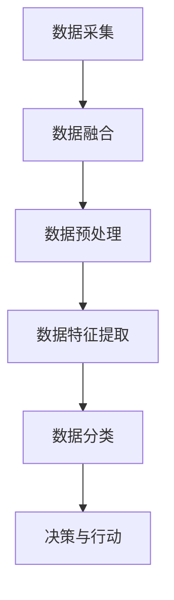

## 背景介绍

人工智能代理（AI Agent）是人工智能领域的一个重要概念，它是通过计算机程序实现的人工智能系统的一种。AI Agent 具有感知、理解、决策和行动等功能，可以自动完成各种任务，如语音识别、图像识别、自然语言处理等。近年来，AI Agent 的应用范围不断拓展，已经涉及到医疗、金融、制造业等各个领域。

## 核心概念与联系

AI Agent 的多模态感知与处理能力是其核心概念之一。多模态感知是指AI Agent 能够通过不同类型的感知设备（如摄像头、麦克风、激光雷达等）获取不同类型的数据（如图像、声音、位置等），并将这些数据融合到一个统一的表示中。多模态处理是指AI Agent 对这些多模态数据进行处理、分析、理解，并根据需要进行决策和行动。

## 核心算法原理具体操作步骤

AI Agent 的多模态感知与处理能力可以通过以下几个关键步骤实现：

1. 数据采集：使用不同类型的感知设备获取多模态数据。

2. 数据融合：将多模态数据进行融合，生成统一的表示。

3. 数据预处理：对融合后的数据进行预处理，包括数据清洗、数据归一化等。

4. 数据特征提取：从预处理后的数据中提取有意义的特征。

5. 数据分类：将提取的特征进行分类，生成预测结果。

6. 决策与行动：根据预测结果进行决策和行动。

## 数学模型和公式详细讲解举例说明

AI Agent 的多模态处理过程中，常常需要使用到数学模型和公式。例如，在数据融合过程中，可以使用线性组合模型来将多模态数据进行融合。公式如下：

$$
F(x) = \sum_{i=1}^{n} w_{i} \cdot G_{i}(x)
$$

其中，$F(x)$ 是融合后的表示，$w_{i}$ 是权重系数，$G_{i}(x)$ 是第 $i$ 类数据的表示。

## 项目实践：代码实例和详细解释说明

为了帮助读者更好地理解 AI Agent 的多模态感知与处理能力，我们提供一个项目实例。这个实例是一个基于深度学习的图像和声音融合系统，主要包括以下几个部分：

1. 数据采集：使用摄像头和麦克风获取图像和声音数据。

2. 数据融合：使用线性组合模型将图像和声音数据进行融合。

3. 数据预处理：对融合后的数据进行清洗和归一化。

4. 数据特征提取：使用卷积神经网络（CNN）提取图像特征，使用循环神经网络（RNN）提取声音特征。

5. 数据分类：将提取的特征进行分类，生成预测结果。

6. 决策与行动：根据预测结果进行决策和行动。

## 实际应用场景

AI Agent 的多模态感知与处理能力在许多实际应用场景中得到了广泛应用，如：

1. 医疗领域：用于辅助诊断，结合图像和声音数据进行病理诊断。

2.金融领域：用于风险评估，结合图像和声音数据进行信用评估。

3.制造业领域：用于质量控制，结合图像和声音数据进行产品质量检测。

4.智能家居领域：用于智能控制，结合图像和声音数据进行家庭自动化管理。

## 工具和资源推荐

为了帮助读者更好地了解 AI Agent 的多模态感知与处理能力，我们推荐以下几个工具和资源：

1. TensorFlow：一个开源的深度学习框架，可以用于实现 AI Agent 的多模态处理能力。

2. Keras：一个高级神经网络 API，基于 TensorFlow 实现，可以简化 AI Agent 的多模态处理过程。

3. PyTorch：一个动态计算图的开源深度学习框架，可以用于实现 AI Agent 的多模态处理能力。

4. OpenCV：一个开源的计算机视觉库，可以用于实现 AI Agent 的图像处理能力。

5. Librosa：一个开源的音频处理库，可以用于实现 AI Agent 的声音处理能力。

## 总结：未来发展趋势与挑战

AI Agent 的多模态感知与处理能力在未来将会得到进一步发展和优化。随着计算能力的不断提升和数据量的不断增加，AI Agent 将会在更多领域得到应用。然而，AI Agent 的多模态感知与处理能力也面临着一定的挑战，如数据安全性、算法复杂性、模型泛化能力等。未来，AI Agent 的研究和应用将会继续推动人工智能技术的发展。

## 附录：常见问题与解答

1. AI Agent 是什么？

AI Agent 是人工智能领域的一个重要概念，它是通过计算机程序实现的人工智能系统的一种。AI Agent 具有感知、理解、决策和行动等功能，可以自动完成各种任务，如语音识别、图像识别、自然语言处理等。

2. 多模态感知与处理能力是什么？

多模态感知是指AI Agent 能够通过不同类型的感知设备（如摄像头、麦克风、激光雷达等）获取不同类型的数据（如图像、声音、位置等），并将这些数据融合到一个统一的表示中。多模态处理是指AI Agent 对这些多模态数据进行处理、分析、理解，并根据需要进行决策和行动。

3. AI Agent 的多模态感知与处理能力有哪些应用场景？

AI Agent 的多模态感知与处理能力在许多实际应用场景中得到了广泛应用，如医疗、金融、制造业等各个领域。例如，用于辅助诊断，结合图像和声音数据进行病理诊断；用于风险评估，结合图像和声音数据进行信用评估；用于质量控制，结合图像和声音数据进行产品质量检测等。

4. 如何学习 AI Agent 的多模态感知与处理能力？

学习 AI Agent 的多模态感知与处理能力，可以从以下几个方面入手：

1. 学习相关的理论知识，如深度学习、计算机视觉、音频处理等。

2. 学习相关的工具和技术，如 TensorFlow、Keras、PyTorch 等深度学习框架；OpenCV、Librosa 等计算机视觉和音频处理库。

3. 参加实践性强的课程和项目，如深度学习课程、计算机视觉项目等。

4. 参加相关的论坛和社区，如 TensorFlow 官方论坛、Keras 官方论坛等。

5. 多模态感知与处理能力的 Mermaid 流程图如下：

注意：Mermaid 流程节点中不要有括号、逗号等特殊字符。

作者：禅与计算机程序设计艺术 / Zen and the Art of Computer Programming