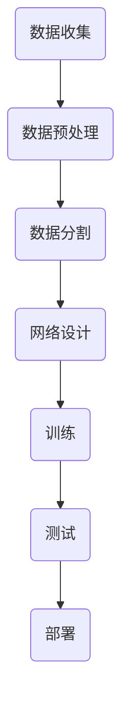

## 1. 背景介绍

随着全球能源系统的不断发展，电力预测对于电力行业具有重要意义。在过去，电力预测主要依赖于经验法则和统计方法。然而，随着人工智能（AI）和深度学习（DL）技术的发展，电力预测领域也开始了新的探索。

深度学习是一种监督学习技术，通过使用大量数据来学习特定的任务。它可以自动从数据中学习特征，并使用这些特征来预测未知数据。深度学习算法在许多领域都有应用，包括图像识别、自然语言处理和机器学习等。

在本文中，我们将讨论如何使用深度学习算法进行电力预测，以及如何在实际应用中实现这些算法。

## 2. 核心概念与联系

在深度学习中，核心概念包括神经网络、激活函数和损失函数等。神经网络是由多个节点组成的层次结构，它可以学习输入数据的特征。激活函数用于将神经网络的输出进行非线性变换，损失函数用于评估神经网络的性能。

深度学习在电力预测中的应用主要包括两类：时间序列预测和异常检测。时间序列预测涉及预测未来的电力需求，异常检测涉及识别可能影响电力系统的异常事件。

## 3. 核心算法原理具体操作步骤

深度学习算法的核心原理是通过训练神经网络来学习输入数据的特征。以下是一个典型的深度学习算法的操作步骤：

1. 数据收集：收集历史电力数据，并对数据进行预处理，包括去噪、归一化和填充缺失值等。
2. 数据分割：将数据划分为训练集和测试集，用于训练和评估神经网络。
3. 网络设计：设计神经网络的结构，包括输入层、隐藏层和输出层，以及激活函数和损失函数等。
4. 训练：使用训练数据训练神经网络，通过调整权重和偏置来最小化损失函数。
5. 测试：使用测试数据评估神经网络的性能，包括预测准确率和误差等。
6. 部署：将训练好的神经网络部署到实际应用中，用于进行电力预测和异常检测。

## 4. 数学模型和公式详细讲解举例说明

在深度学习中，常见的数学模型包括多层感知机（MLP）、循环神经网络（RNN）和卷积神经网络（CNN）等。以下是一个简单的多层感知机的数学公式：

$$
y = \sigma(Wx + b)
$$

其中，$y$是输出，$x$是输入，$W$是权重矩阵，$b$是偏置，$\sigma$是激活函数。

## 5. 项目实践：代码实例和详细解释说明

在本节中，我们将使用Python和Keras库来实现一个简单的深度学习电力预测模型。以下是一个简单的代码实例：

```python
import numpy as np
from keras.models import Sequential
from keras.layers import Dense
from sklearn.model_selection import train_test_split

# 数据预处理
X, y = ... # 读取数据并进行预处理
X_train, X_test, y_train, y_test = train_test_split(X, y, test_size=0.2)

# 网络设计
model = Sequential()
model.add(Dense(64, activation='relu', input_dim=X.shape[1]))
model.add(Dense(32, activation='relu'))
model.add(Dense(1, activation='linear'))

# 编译
model.compile(optimizer='adam', loss='mse')

# 训练
model.fit(X_train, y_train, epochs=100, batch_size=32)

# 预测
y_pred = model.predict(X_test)
```

## 6. 实际应用场景

深度学习算法在电力预测领域有多种实际应用，包括电力需求预测、风力发电预测、电力价格预测等。以下是一个电力需求预测的实际应用场景：



## 7. 工具和资源推荐

在深度学习电力预测领域，有许多工具和资源可以帮助我们进行研究和实践。以下是一些推荐的工具和资源：

1. Python：Python是一种广泛使用的编程语言，在深度学习领域有许多库和工具。
2. Keras：Keras是一个高级神经网络库，提供了简单易用的接口，可以快速构建和训练深度学习模型。
3. TensorFlow：TensorFlow是一个开源的深度学习框架，提供了丰富的工具和功能，支持多种深度学习算法。
4. Scikit-learn：Scikit-learn是一个Python机器学习库，提供了许多常用的机器学习算法和工具。

## 8. 总结：未来发展趋势与挑战

深度学习算法在电力预测领域具有广泛的应用前景。随着数据量和计算能力的不断增加，深度学习算法将继续在电力预测领域发挥重要作用。然而，深度学习算法也面临着一些挑战，包括数据质量、模型复杂性和计算资源等。

## 9. 附录：常见问题与解答

在本文中，我们讨论了如何使用深度学习算法进行电力预测，并提供了一些实际应用场景和工具资源。然而，在深度学习电力预测领域还有许多值得探讨的问题。以下是一些常见的问题和解答：

1. **数据质量如何影响深度学习电力预测的性能？**

   数据质量是深度学习电力预测的关键因素。高质量的数据可以帮助神经网络学习更好的特征，从而提高预测性能。因此，在进行深度学习电力预测时，需要确保数据质量，并进行适当的预处理。

2. **深度学习电力预测的模型复杂性如何影响计算资源？**

   深度学习电力预测的模型复杂性可能会影响计算资源。更复杂的模型可能需要更多的计算资源，包括内存和处理器等。因此，在进行深度学习电力预测时，需要权衡模型复杂性和计算资源。

3. **如何选择适合深度学习电力预测的算法？**

   选择适合深度学习电力预测的算法需要根据具体的应用场景和数据特点。常见的深度学习算法包括多层感知机（MLP）、循环神经网络（RNN）和卷积神经网络（CNN）等。需要根据具体情况选择合适的算法，并进行适当的调整。

作者：禅与计算机程序设计艺术 / Zen and the Art of Computer Programming