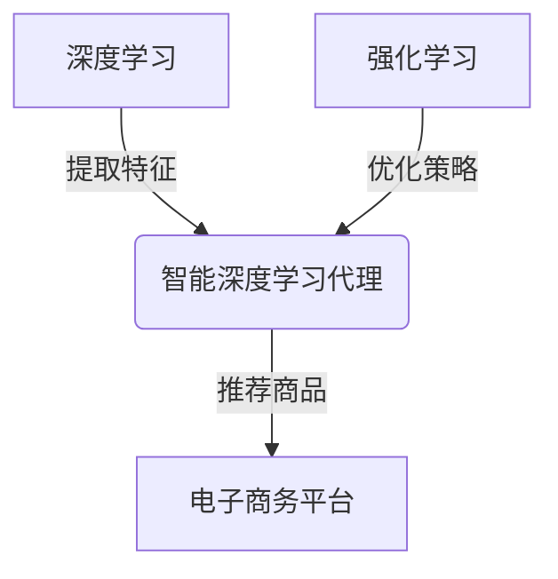

# AI人工智能深度学习算法：智能深度学习代理在电子商务中的应用策略

## 1.背景介绍

### 1.1 电子商务的快速发展

随着互联网和移动互联网技术的飞速发展,电子商务已经成为当今商业活动中不可或缺的重要组成部分。根据统计数据显示,2022年全球电子商务市场规模已经超过5万亿美元,预计未来几年将保持10%以上的年增长率。电子商务的蓬勃发展,为企业带来了巨大的商机,同时也带来了激烈的竞争。

### 1.2 个性化推荐系统的重要性

在电子商务领域,个性化推荐系统扮演着至关重要的角色。由于网络上商品种类繁多,消费者很容易在海量信息中迷失方向。个性化推荐系统能够根据用户的浏览记录、购买历史等数据,为用户推荐感兴趣的商品,提高用户体验,增加购买转化率。优秀的推荐系统已成为电商平台吸引和留存用户的关键因素。

### 1.3 人工智能在推荐系统中的应用

传统的推荐系统主要基于协同过滤、内容过滤等算法,但存在冷启动、数据稀疏等问题。近年来,人工智能尤其是深度学习技术在推荐系统领域取得了突破性进展。深度学习能够从海量数据中自动学习特征表示,捕捉复杂的用户偏好模式,极大提高了推荐系统的精准度。智能深度学习代理作为新兴的人工智能技术,在电子商务推荐系统中展现出巨大的应用潜力。

## 2.核心概念与联系

### 2.1 深度学习

深度学习(Deep Learning)是机器学习的一个新的领域,它模仿人脑的机制来解释数据,例如图像、声音和文本。深度学习能够通过神经网络自动从数据中学习特征,无需人工设计特征提取器。常见的深度学习模型包括卷积神经网络(CNN)、循环神经网络(RNN)、长短期记忆网络(LSTM)等。

### 2.2 强化学习

强化学习(Reinforcement Learning)是机器学习的一个重要分支,它通过与环境的交互来学习策略,使代理能够在特定情况下采取最优行动,从而最大化预期的累积奖励。强化学习的核心思想是"试错"和"奖惩"机制,代理通过不断尝试和获得反馈来优化决策。

### 2.3 智能代理

智能代理(Intelligent Agent)是一种自主的软件实体,能够感知环境,并根据预定义的知识和策略作出合理的行为,以实现特定目标。在电子商务推荐系统中,智能代理扮演着用户代理的角色,根据用户的偏好和行为,推荐最合适的商品。

### 2.4 深度强化学习

深度强化学习(Deep Reinforcement Learning)是将深度学习与强化学习相结合的技术,它利用深度神经网络来近似强化学习中的策略或者值函数,从而解决传统强化学习在高维状态空间和动作空间下的困难。深度强化学习代理能够通过与环境的交互,自主学习最优策略,在复杂环境中表现出超人的能力。



## 3.核心算法原理具体操作步骤

智能深度学习代理在电子商务推荐系统中的应用,主要涉及以下几个核心步骤:

1. **状态表示**
   将用户的历史行为(如浏览记录、购买记录等)和商品信息转化为状态向量,作为智能代理的输入。可以使用Word2Vec等技术对文本数据进行向量化表示。

2. **策略网络**
   使用深度神经网络(如DQN、Actor-Critic等)作为策略网络,输入为状态向量,输出为每个商品的推荐分数(动作值)。策略网络需要通过与环境交互进行训练,以学习到最优策略。

3. **奖励函数设计**
   设计合理的奖励函数是强化学习的关键。可以根据用户对推荐商品的反馈(点击、购买等)给予正向奖励,对于不感兴趣的商品给予负向奖励。奖励函数直接影响代理的学习目标。

4. **与环境交互**
   智能代理根据当前状态,利用策略网络输出每个商品的推荐分数,并选择分数最高的商品进行推荐。然后观察用户的反馈,获得奖励信号,并将状态-动作-奖励的数据存储在经验池中。

5. **经验回放和网络训练**
   从经验池中采样数据进行小批量训练,使用时序差分目标(TD-target)更新策略网络参数,使网络输出的动作值逼近期望的累积奖励。

6. **探索与利用**
   在实际应用中,需要在探索(选择次优动作以获取新经验)和利用(选择当前最优动作)之间寻求平衡,以避免过早收敛到次优策略。常用的方法有ε-greedy策略和软更新策略。

通过上述步骤,智能深度学习代理可以逐步优化推荐策略,为用户推荐感兴趣的商品,提高电商平台的转化率和用户体验。

## 4.数学模型和公式详细讲解举例说明 

### 4.1 马尔可夫决策过程(MDP)

强化学习问题通常建模为马尔可夫决策过程(Markov Decision Process, MDP)。MDP由一个四元组(S, A, P, R)定义:

- S是有限的状态空间集合
- A是有限的动作空间集合 
- $P(s',r|s,a)$是状态转移概率分布,表示在状态s执行动作a后,转移到状态s'并获得奖励r的概率
- $R(s,a,s')$是奖励函数,表示在状态s执行动作a并转移到状态s'获得的奖励

在电子商务推荐场景中,状态s可以表示为用户的浏览历史、购买记录等信息;动作a表示推荐某个具体商品;状态转移概率P和奖励函数R需要根据用户反馈进行估计和更新。

目标是找到一个策略$\pi: S \rightarrow A$,使得期望的累积奖励最大化:

$$\max_\pi \mathbb{E}\left[\sum_{t=0}^\infty \gamma^t R(s_t,a_t,s_{t+1})\right]$$

其中$\gamma \in (0,1)$是折现因子,用于平衡即时奖励和长期奖励。

### 4.2 Q-Learning算法

Q-Learning是强化学习中一种常用的基于价值的算法,它直接学习状态-动作对的价值函数Q(s,a),而不需要学习策略显式形式。Q(s,a)表示在状态s执行动作a后,能获得的期望累积奖励。

Q-Learning算法的更新规则为:

$$Q(s_t,a_t) \leftarrow Q(s_t,a_t) + \alpha \left[r_t + \gamma \max_{a'} Q(s_{t+1},a') - Q(s_t,a_t)\right]$$

其中$\alpha$是学习率,$\gamma$是折现因子。算法通过不断与环境交互,更新Q值,最终收敛到最优的Q函数。

在深度Q网络(DQN)算法中,我们使用深度神经网络来逼近Q函数:

$$Q(s,a;\theta) \approx \max_\pi \mathbb{E}\left[\sum_{t=0}^\infty \gamma^t R(s_t,a_t,s_{t+1})\right]$$

其中$\theta$是网络参数。训练目标是最小化网络输出Q值与TD目标之间的均方误差:

$$L(\theta) = \mathbb{E}_{(s,a,r,s')\sim D}\left[\left(r + \gamma \max_{a'} Q(s',a';\theta^-) - Q(s,a;\theta)\right)^2\right]$$

$\theta^-$是目标网络的参数,用于估计期望的Q值;D是经验回放池。通过梯度下降算法优化网络参数$\theta$,使得Q网络输出的Q值逼近真实的Q值。

### 4.3 Actor-Critic算法

Actor-Critic算法将策略和价值函数分开建模,包含两个神经网络:Actor网络用于输出动作概率,Critic网络用于评估动作的价值。

Actor网络的目标是最大化期望的累积奖励:

$$\max_\theta \mathbb{E}_{\pi_\theta}\left[\sum_{t=0}^\infty \gamma^t R(s_t,a_t,s_{t+1})\right]$$

其中$\pi_\theta(a|s)$是Actor网络输出的动作概率分布,通过策略梯度算法进行优化:

$$\nabla_\theta J(\theta) = \mathbb{E}_{\pi_\theta}\left[\sum_{t=0}^\infty \nabla_\theta \log \pi_\theta(a_t|s_t)Q^{\pi_\theta}(s_t,a_t)\right]$$

Critic网络的目标是最小化TD误差:

$$L_V(\phi) = \mathbb{E}_{(s,a,r,s')\sim D}\left[\left(r + \gamma V_\phi(s') - Q_\phi(s,a)\right)^2\right]$$

其中$V_\phi(s)$是状态价值函数,$Q_\phi(s,a)$是动作价值函数,都由Critic网络输出。Actor网络和Critic网络通过交替训练的方式互相促进,最终收敛到最优策略和价值函数。

以上是深度强化学习中常用的数学模型和算法,在实际应用中还可以结合其他技术(如注意力机制、层次化强化学习等)来提高性能和泛化能力。

## 5.项目实践:代码实例和详细解释说明

为了更好地理解智能深度学习代理在电子商务推荐系统中的应用,我们提供了一个基于PyTorch实现的简单示例项目。该项目使用DQN算法训练一个智能代理,用于在模拟的电商环境中推荐商品。

### 5.1 环境模拟

我们首先构建一个简单的电商环境模拟器,包含以下几个核心组件:

- `User`类,用于模拟用户的行为和偏好
- `Product`类,用于表示商品的属性
- `RecommenderEnv`类,作为智能代理与环境交互的接口

`RecommenderEnv`类的主要方法有:

- `reset()`: 重置环境,返回初始状态
- `step(action)`: 执行推荐动作,返回下一个状态、奖励和是否终止
- `render()`: 渲染当前环境状态(可选)

### 5.2 智能代理实现

我们使用PyTorch实现了一个基于DQN算法的智能推荐代理`DQNAgent`。代码结构如下:

```python
class DQNAgent:
    def __init__(self, state_size, action_size, ...):
        # 初始化经验回放池、Q网络、目标网络等

    def act(self, state, eps=0.):
        # 根据当前状态选择动作(探索或利用)

    def step(self, state, action, reward, next_state, done):
        # 存储经验,并从经验回放池中采样进行训练

    def update_target_model(self):
        # 更新目标网络参数

    def load(self, name):
        # 加载模型参数

    def save(self, name):
        # 保存模型参数
```

在训练过程中,智能代理与环境交互,获取状态、执行动作、观察奖励和下一状态,并将这些经验存储在回放池中。每隔一定步数,从回放池中采样数据进行小批量训练,使用TD目标更新Q网络参数。同时,我们还引入了目标网络和双Q学习技术,以提高训练稳定性。

### 5.3 训练和评估

我们编写了一个`train.py`脚本,用于训练智能推荐代理并评估其性能。主要步骤包括:

1. 初始化环境和智能代理
2. 进入训练循环
   - 与环境交互,获取经验
   - 从经验回放池中采样数据,训练Q网络
   - 每隔一定步数,更新目标网络参数
   - 评估当前策略在验证集上的表现,并保存模型
3.