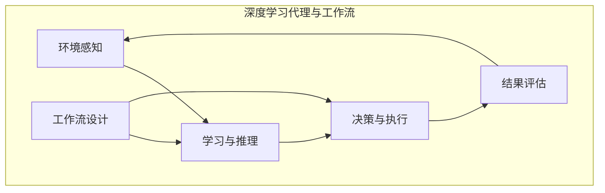

# AI人工智能深度学习算法：面向未来的深度学习代理与工作流研究方向

## 1.背景介绍

在过去的几年里,人工智能(AI)和深度学习技术取得了令人瞩目的进步。从计算机视觉、自然语言处理到推理和决策系统,深度学习模型展现出了超乎想象的能力,在许多领域超越了人类水平。然而,当前的深度学习系统仍然存在一些重大挑战和局限性,例如缺乏泛化能力、可解释性差、训练数据偏差等。为了推动人工智能技术向前迈进,我们需要探索新的范式和架构,以克服这些挑战。

深度学习代理(Deep Learning Agents)和工作流(Workflow)是一种新兴的研究方向,旨在构建更加智能、灵活和可解释的人工智能系统。深度学习代理是一种具有自主性的智能体,能够根据环境的变化进行学习、推理和决策。工作流则是一种描述任务执行过程的形式化模型,可以将复杂任务分解为一系列可组合的子任务。将深度学习代理与工作流相结合,可以创建出更加灵活、可解释和可控制的人工智能系统。

### Mermaid 流程图

## 2.核心概念与联系

### 2.1 深度学习代理

深度学习代理是一种具有自主性的智能体,能够通过与环境的交互来学习和决策。它由以下几个关键组件组成:

1. **感知模块**: 用于从环境中获取信息,例如视觉、语音或其他传感器数据。
2. **学习模块**: 基于从环境获取的数据,使用深度学习算法进行模型训练和知识表示。
3. **推理模块**: 根据学习到的知识,对当前状态进行推理和规划。
4. **决策模块**: 根据推理结果,选择最优的行动方案。
5. **执行模块**: 将决策转化为具体的行动,并将行动施加到环境中。

深度学习代理可以被视为一个闭环系统,它不断地从环境中获取信息、学习新知识、进行推理和决策,并将决策执行到环境中,从而实现持续的自我改进和适应。

### 2.2 工作流

工作流(Workflow)是一种描述任务执行过程的形式化模型。它将复杂的任务分解为一系列可组合的子任务,并定义了这些子任务之间的依赖关系和执行顺序。工作流可以被视为一种抽象层,它将任务的逻辑流程与具体的执行细节分离开来,从而提高了系统的可维护性和可扩展性。

在深度学习代理与工作流的结合中,工作流扮演了一个关键角色。它为深度学习代理提供了一种结构化的方式来组织和管理复杂的任务,同时也为代理的决策过程提供了指导和约束。通过工作流,我们可以更好地控制和解释深度学习代理的行为,从而提高其可解释性和可控制性。

### 2.3 深度学习代理与工作流的联系

深度学习代理和工作流之间存在着紧密的联系和互补性。工作流为深度学习代理提供了一种结构化的任务表示方式,而深度学习代理则为工作流带来了智能化的执行能力。

具体而言,工作流可以为深度学习代理提供以下支持:

1. **任务分解**: 将复杂的任务分解为一系列可组合的子任务,使得深度学习代理能够更好地理解和处理任务。
2. **约束和指导**: 通过定义子任务之间的依赖关系和执行顺序,为深度学习代理的决策过程提供约束和指导。
3. **可解释性**: 工作流的形式化表示有助于解释深度学习代理的行为,从而提高其可解释性。

相应地,深度学习代理也为工作流带来了以下优势:

1. **智能化执行**: 深度学习代理可以根据环境的变化,动态地调整和优化工作流的执行过程。
2. **自适应性**: 通过持续的学习和推理,深度学习代理可以不断地适应新的情况和需求,从而提高工作流的灵活性。
3. **决策支持**: 深度学习代理的推理和决策能力可以为工作流的执行提供智能化的支持和优化。

总的来说,深度学习代理和工作流的结合旨在创建出更加智能、灵活和可解释的人工智能系统。这种结合不仅可以提高系统的性能和适应性,同时也有助于提高其可解释性和可控制性,从而更好地满足未来人工智能系统的需求。

## 3.核心算法原理具体操作步骤

### 3.1 深度学习代理的训练

深度学习代理的训练过程通常采用强化学习(Reinforcement Learning)或者模仿学习(Imitation Learning)等方法。以强化学习为例,其核心思想是通过与环境的交互,让代理不断尝试不同的行动,并根据获得的奖励信号来调整其策略,最终学习到一个能够最大化期望累积奖励的最优策略。

具体的训练步骤如下:

1. **初始化**: 初始化代理的策略网络(Policy Network)和值函数网络(Value Network),这两个网络通常采用深度神经网络的结构。
2. **环境交互**: 代理与环境进行交互,根据当前状态和策略网络的输出,选择一个行动执行。环境会根据代理的行动转移到新的状态,并返回一个奖励信号。
3. **经验存储**: 将代理与环境的交互过程中产生的状态、行动、奖励等经验数据存储到经验回放池(Experience Replay Buffer)中。
4. **网络更新**: 从经验回放池中采样一批经验数据,并利用这些数据更新策略网络和值函数网络的参数,使得代理能够学习到一个更好的策略。更新过程通常采用策略梯度(Policy Gradient)或者深度Q学习(Deep Q-Learning)等算法。
5. **迭代训练**: 重复步骤2-4,直到代理的策略收敛或者达到预期的性能水平。

在训练过程中,还可以引入一些技术来提高训练效率和策略的稳定性,例如优先经验回放(Prioritized Experience Replay)、目标网络(Target Network)、熵正则化(Entropy Regularization)等。

### 3.2 工作流设计与优化

工作流的设计和优化是一个关键的环节,它直接影响到深度学习代理的性能和可解释性。一个好的工作流设计应该满足以下几个原则:

1. **任务分解**: 将复杂的任务合理地分解为一系列可组合的子任务,并明确定义每个子任务的输入、输出和执行条件。
2. **依赖关系**: 准确地捕获子任务之间的依赖关系,确保工作流的正确性和一致性。
3. **可扩展性**: 设计一个可扩展的工作流结构,便于将来的修改和扩展。
4. **可解释性**: 工作流应该具有良好的可解释性,使得深度学习代理的行为可以被人类理解和解释。

工作流的优化则是一个持续的过程,它需要根据深度学习代理的实际表现和环境的变化,不断地调整和改进工作流的设计。优化过程可以采用以下几种策略:

1. **人工优化**: 由人工专家根据经验和直觉,对工作流进行手动优化和调整。
2. **自动优化**: 利用机器学习和优化算法,自动搜索和优化工作流的结构和参数。
3. **在线优化**: 在深度学习代理与环境交互的过程中,实时地收集反馈信息,并根据这些信息动态地调整和优化工作流。
4. **迁移学习**: 利用在其他领域或任务中学习到的工作流知识,加速当前任务的工作流优化过程。

无论采用何种优化策略,都应该确保工作流的正确性和一致性,同时也要平衡工作流的性能和可解释性之间的权衡。

## 4.数学模型和公式详细讲解举例说明

在深度学习代理与工作流的研究中,数学模型和公式扮演着重要的角色。它们不仅为算法和系统提供了理论基础,同时也为分析和优化过程提供了量化工具。

### 4.1 马尔可夫决策过程(MDP)

马尔可夫决策过程(Markov Decision Process, MDP)是强化学习的基础数学模型。它用于描述一个智能体(代理)在一个由状态、行动和奖励组成的环境中进行决策和学习的过程。

一个MDP可以用一个五元组 $\langle S, A, P, R, \gamma \rangle$ 来表示,其中:

- $S$ 是状态空间,表示环境可能的状态集合。
- $A$ 是行动空间,表示代理可以执行的行动集合。
- $P(s' \mid s, a)$ 是状态转移概率,表示在状态 $s$ 下执行行动 $a$ 后,转移到状态 $s'$ 的概率。
- $R(s, a, s')$ 是奖励函数,表示在状态 $s$ 下执行行动 $a$ 并转移到状态 $s'$ 时获得的即时奖励。
- $\gamma \in [0, 1)$ 是折现因子,用于权衡即时奖励和未来奖励的重要性。

在MDP中,代理的目标是学习一个策略 $\pi: S \rightarrow A$,使得在遵循该策略时,能够最大化期望的累积折现奖励:

$$
J(\pi) = \mathbb{E}_{\pi}\left[ \sum_{t=0}^{\infty} \gamma^t R(s_t, a_t, s_{t+1}) \right]
$$

其中 $s_t$ 和 $a_t$ 分别表示第 $t$ 个时间步的状态和行动。

强化学习算法,如策略梯度(Policy Gradient)和深度Q学习(Deep Q-Learning),就是基于MDP模型,通过与环境的交互来学习最优策略的方法。

### 4.2 工作流建模

工作流可以用一种形式化的模型来表示,例如有限状态机(Finite State Machine, FSM)或者Petri网(Petri Net)。这些模型不仅能够清晰地描述工作流的结构和执行逻辑,同时也为工作流的分析和优化提供了数学基础。

以Petri网为例,一个工作流可以用一个四元组 $\langle P, T, F, M_0 \rangle$ 来表示,其中:

- $P$ 是有限的位置集合,表示工作流中的状态或条件。
- $T$ 是有限的转移集合,表示工作流中的任务或活动。
- $F \subseteq (P \times T) \cup (T \times P)$ 是流关系,描述了位置和转移之间的关系。
- $M_0: P \rightarrow \mathbb{N}$ 是初始标识,表示工作流的初始状态。

在Petri网模型中,工作流的执行过程可以用标识(Token)在网络中的流动来表示。当一个转移的所有输入位置都有标识时,该转移就可以被触发,并从输入位置中消耗掉标识,同时在输出位置产生新的标识。通过分析标识的流动,我们可以检查工作流的性质,如可达性、活性和有界性等。

此外,基于Petri网模型,我们还可以进行工作流的形式化验证、性能分析和优化,例如使用模型检查(Model Checking)技术来验证工作流的正确性,或者使用仿真和优化算法来优化工作流的性能和资源利用率。

### 4.3 深度学习代理与工作流的集成

将深度学习代理与工作流集成,需要建立一个数学模型来描述它们之间的交互和协作关系。一种可能的方法是将工作流视为一个受约束的MDP,其中工作流的结构和逻辑为代理的决策过程提供了约束和指导。

具体来说,我们可以定义一个扩展的MDP模型 $\langle S, A, P, R, \gamma