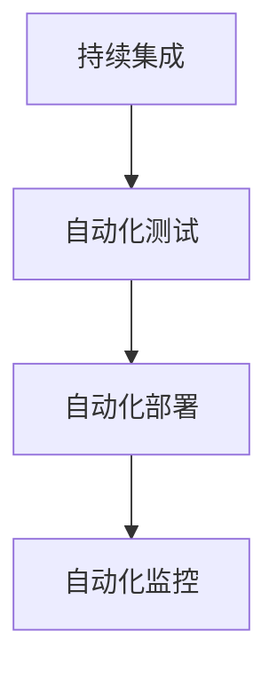

## 背景介绍

持续部署（Continuous Deployment）是指在持续集成（Continuous Integration）之后，再进行自动化地部署应用程序。持续部署的目标是让应用程序更快、更频繁地发布到生产环境，降低人工部署的风险，提高系统的稳定性和可用性。

持续部署在企业中广泛应用，包括互联网大厂和传统企业。持续部署可以帮助企业更快地响应市场变化，减少业务损失，提高客户满意度。持续部署需要构建自动化的部署流程，实现自动化测试、自动化部署、自动化监控等功能。

## 核心概念与联系

持续部署的核心概念包括：

1. **持续集成（Continuous Integration）：** 持续集成是持续部署的前提，持续集成的目标是让开发人员频繁地集成代码到主干，减少冲突和错误，提高代码质量。

2. **自动化部署（Automated Deployment）：** 自动化部署是持续部署的核心，自动化部署可以自动地将新版本的应用程序部署到生产环境，降低人工部署的风险。

3. **自动化测试（Automated Testing）：** 自动化测试是持续部署的基础，自动化测试可以确保新版本的应用程序不会破坏现有的功能，提高系统的稳定性和可用性。

4. **自动化监控（Automated Monitoring）：** 自动化监控是持续部署的重要组成部分，自动化监控可以实时地监控系统的性能和稳定性，及时发现问题并解决。

持续部署的流程图如下：



## 核心算法原理具体操作步骤

持续部署的具体操作步骤包括：

1. **代码提交：** 开发人员将代码提交到版本控制系统，例如 Git。

2. **构建：** 构建系统将代码编译成可执行文件。

3. **自动化测试：** 测试系统将新版本的应用程序进行自动化测试，确保新版本不会破坏现有的功能。

4. **部署：** 部署系统将新版本的应用程序自动部署到生产环境。

5. **自动化监控：** 监控系统实时地监控系统的性能和稳定性，及时发现问题并解决。

## 数学模型和公式详细讲解举例说明

持续部署的数学模型和公式主要涉及到版本控制、自动化测试和自动化监控等方面。

举例说明：

1. **版本控制：** Git 是一种广泛使用的版本控制系统，它使用 Git 的 SHA-1 哈希算法来跟踪文件的变更。

2. **自动化测试：** 自动化测试可以使用各种测试框架，例如 JUnit（Java）、NUnit（.NET）、pytest（Python）等。

3. **自动化监控：** 自动化监控可以使用各种监控工具，例如 Nagios、Zabbix、Prometheus 等。

## 项目实践：代码实例和详细解释说明

持续部署的项目实践主要涉及到构建、测试、部署和监控等方面。以下是一个简化的持续部署流程的代码实例：

```bash
# 构建
mvn clean install

# 自动化测试
mvn test

# 部署
mvn spring-boot:run

# 自动化监控
tail -f application.log
```

## 实际应用场景

持续部署在各种应用场景中都有广泛的应用，包括：

1. **金融行业：** 金融行业需要快速响应市场变化，持续部署可以帮助金融企业更快地更新系统，减少业务损失。

2. **电商行业：** 电商行业需要快速响应消费者需求，持续部署可以帮助电商企业更快地更新系统，提高客户满意度。

3. **医疗行业：** 医疗行业需要快速响应医疗需求，持续部署可以帮助医疗企业更快地更新系统，提高病患的治疗质量。

## 工具和资源推荐

持续部署需要各种工具和资源，以下是一些推荐：

1. **版本控制：** Git（[GitHub](https://github.com/））

2. **构建：** Maven、Gradle（[Official Website](https://gradle.org/)）

3. **自动化测试：** JUnit（[Official Website](https://junit.org/)）、NUnit（[Official Website](https://nunit.org/)）、pytest（[Official Website](https://docs.pytest.org/en/latest/)）

4. **部署：** Jenkins（[Official Website](https://www.jenkins.io/)）、Ansible（[Official Website](https://www.ansible.com/)）

5. **自动化监控：** Nagios（[Official Website](https://www.nagios.com/)）、Zabbix（[Official Website](https://www.zabbix.com/)）、Prometheus（[Official Website](https://prometheus.io/)）

## 总结：未来发展趋势与挑战

持续部署在未来会越来越重要，以下是一些未来发展趋势和挑战：

1. **DevOps：** DevOps 是持续部署的核心理念之一，未来 DevOps 会越来越受欢迎，持续部署将与 DevOps 更紧密地结合。

2. **云原生技术：** 云原生技术将持续部署与容器化和微服务等技术结合，实现更快速、更高效的部署。

3. **人工智能和机器学习：** 人工智能和机器学习将在持续部署中发挥越来越重要的作用，实现更智能、更高效的部署。

4. **安全性：** 安全性将成为持续部署的一个重要挑战，需要开发人员和运维人员共同努力，确保新版本的应用程序的安全性。

## 附录：常见问题与解答

Q1: **持续部署与持续集成的区别？**

A: 持续集成（Continuous Integration）是指开发人员频繁地将代码集成到主干，实现自动化的构建和测试。持续部署（Continuous Deployment）是指在持续集成之后，再进行自动化地部署应用程序。持续部署的目标是让应用程序更快、更频繁地发布到生产环境，降低人工部署的风险，提高系统的稳定性和可用性。

Q2: **持续部署的优缺点？**

A: 持续部署的优点是可以让应用程序更快、更频繁地发布到生产环境，降低人工部署的风险，提高系统的稳定性和可用性。持续部署的缺点是需要构建自动化的部署流程，实现自动化测试、自动化部署、自动化监控等功能，需要一定的技术投入和维护成本。

Q3: **持续部署的关键技术点？**

A: 持续部署的关键技术点包括持续集成、自动化部署、自动化测试、自动化监控等。持续集成可以确保代码的质量，自动化部署可以降低人工部署的风险，自动化测试可以提高系统的稳定性和可用性，自动化监控可以实时地监控系统的性能和稳定性，及时发现问题并解决。