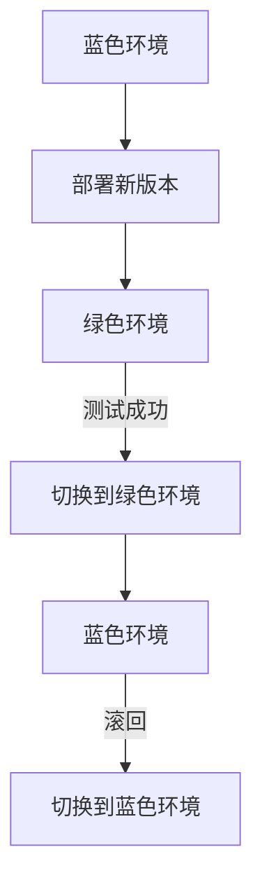

## 背景介绍

在现代软件开发领域，持续集成和持续部署（CI/CD）已经成为一种普遍的实践。CI/CD的核心思想是通过自动化构建、测试和部署流程，使得开发人员能够快速地将代码推送到生产环境中。为了实现CI/CD，开发人员需要选择合适的部署策略，以确保系统的稳定性和可靠性。其中，蓝绿部署（Blue-Green Deployment）和金丝雀部署（Canary Deployment）是两种常见的部署策略。

本文将详细介绍蓝绿部署的原理和实施方法，并以一个实际的案例进行代码实战讲解。

## 核心概念与联系

蓝绿部署（Blue-Green Deployment）是一种部署策略，它要求有两个完全相同的生产环境，一个用于运行当前版本的应用（蓝色，Blue），另一个用于新版本的应用（绿色，Green）。在进行部署时，旧版本的应用会被立即替换为新版本的应用。这种部署策略的优势是可以快速地进行滚回，避免了在部署过程中产生的服务中断。

下面是一个简化的Mermaid流程图，展示了蓝绿部署的过程：

## 核心算法原理具体操作步骤

要实施蓝绿部署，我们需要将应用部署在两个不同的环境中，并确保这两个环境之间的数据一致性。以下是实施蓝绿部署的具体步骤：

1. **准备两个相同的生产环境**：在一个可扩展的云平台上，例如AWS、Google Cloud或Azure，我们需要创建两个完全相同的生产环境。每个环境都运行着相同的应用程序和数据库。
2. **在蓝色环境中部署新版本**：我们将新版本的应用程序部署到蓝色环境中。这时，绿色环境仍然运行着旧版本的应用程序。
3. **在绿色环境中部署新版本**：在蓝色环境中的新版本已经过测试，我们将其部署到绿色环境中。这样，两个环境都运行着相同的新版本。
4. **测试绿色环境**：在绿色环境中进行性能测试和功能测试，确保新版本的应用程序正常运行。
5. **将流量切换到绿色环境**：在测试成功后，我们将所有的用户流量切换到绿色环境。蓝色环境中的旧版本将被停止。
6. **滚回蓝色环境**：如果在绿色环境中发现问题，我们可以快速地将流量切回蓝色环境，并将问题修复。然后，我们将新版本部署到蓝色环境中，重复上述过程。

## 数学模型和公式详细讲解举例说明

在蓝绿部署中，我们需要考虑到数据一致性问题。在新版本发布时，我们需要确保两个环境中的数据是一致的。为了实现这一目标，我们可以使用数据库的多主复制技术。在这种技术中，数据库有多个独立的主节点，每个节点都具有相同的数据。这样，我们可以在两个生产环境中创建一个多主复制集，以确保它们之间的数据一致性。

## 项目实践：代码实例和详细解释说明

为了实现蓝绿部署，我们需要使用一个CI/CD工具，如Jenkins或GitLab CI。我们还需要一个服务 meshes（例如Istio）来管理流量切换。以下是一个简单的示例，展示了如何在Istio中配置蓝绿部署。

1. **创建两个生产环境**：在Istio中，我们需要创建两个不同的服务入口，一个用于蓝色环境，另一个用于绿色环境。
2. **配置流量路由**：我们需要配置Istio的虚拟服务（VirtualService），以便在新版本发布时，流量可以从蓝色环境切换到绿色环境。

## 实际应用场景

蓝绿部署适用于那些需要快速滚回的场景，例如金融应用、电子商务平台等。这种部署策略可以确保在部署新版本时，用户不会遇到服务中断，从而提高了用户体验。

## 工具和资源推荐

- **Istio**：一个开源的服务网格，用于管理流量路由和服务之间的通信。
- **Jenkins** 或 **GitLab CI**：用于自动化构建和部署的CI/CD工具。
- **多主复制数据库**：用于保持两个生产环境之间的数据一致性。

## 总结：未来发展趋势与挑战

蓝绿部署在现代软件开发中已经成为一种主流的部署策略。随着技术的不断发展，我们将看到更多的自动化和智能化的部署方法。同时，我们也需要考虑到数据一致性、安全性和性能等问题，以确保系统的稳定性和可靠性。

## 附录：常见问题与解答

1. **如何选择蓝绿部署还是金丝雀部署？**

选择部署策略取决于您的具体需求。蓝绿部署适用于需要快速滚回的场景，而金丝雀部署适用于需要逐步扩大部署范围的场景。

2. **蓝绿部署需要多少个生产环境？**

理论上，只需要两个生产环境即可。实际上，这些环境可以通过虚拟化技术或容器技术实现，以节省成本。

3. **蓝绿部署是否适用于微服务架构？**

是的，蓝绿部署适用于微服务架构，因为这种部署策略可以独立地部署和滚回每个微服务。

作者：禅与计算机程序设计艺术 / Zen and the Art of Computer Programming