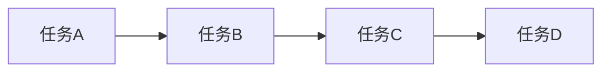

## 1.背景介绍

随着AI技术的不断发展，AI项目的规模和复杂性不断增加。项目管理和团队协作的重要性也逐渐凸显。因此，本文旨在探讨AI项目管理与团队协作的原理，结合实际案例进行代码实战讲解。

## 2.核心概念与联系

AI项目管理与团队协作涉及多个方面，包括项目计划、资源分配、团队沟通、绩效评估等。为了实现高效协作，项目经理需要具备以下几个核心能力：

1. **项目规划与管理**:制定项目计划，分配资源，确保项目按时完成。
2. **团队协调与沟通**:鼓励团队成员分享想法，解决问题，提高团队效率。
3. **绩效评估与优化**:定期评估团队绩效，提出改进建议，提升团队能力。

## 3.核心算法原理具体操作步骤

在AI项目管理中，算法原理主要体现在项目计划、资源分配等方面。以下是一个简单的项目计划算法原理及其操作步骤：

1. **项目需求分析**:收集项目需求，明确项目目标。
2. **任务划分**:根据项目需求，将项目划分为若干任务。
3. **任务优先级排序**:根据任务重要性、紧急程度等因素，排序。
4. **资源分配**:根据任务优先级，分配资源，确保项目按时完成。

## 4.数学模型和公式详细讲解举例说明

在项目管理中，Gantt图是常用的项目计划工具。以下是一个简单的Gantt图示例：



## 5.项目实践：代码实例和详细解释说明

以下是一个简单的项目实践代码示例，使用Python语言实现项目计划功能：

```python
import datetime

class Task:
    def __init__(self, name, start_date, end_date):
        self.name = name
        self.start_date = start_date
        self.end_date = end_date

    def __str__(self):
        return f"{self.name} ({self.start_date} - {self.end_date})"

class Project:
    def __init__(self, name):
        self.name = name
        self.tasks = []

    def add_task(self, task):
        self.tasks.append(task)

    def print_plan(self):
        for task in self.tasks:
            print(task)

project = Project("AI项目")
task_a = Task("任务A", datetime.date(2021, 1, 1), datetime.date(2021, 1, 10))
task_b = Task("任务B", datetime.date(2021, 1, 11), datetime.date(2021, 1, 20))
task_c = Task("任务C", datetime.date(2021, 1, 21), datetime.date(2021, 1, 30))

project.add_task(task_a)
project.add_task(task_b)
project.add_task(task_c)

project.print_plan()
```

## 6.实际应用场景

AI项目管理与团队协作的实际应用场景包括以下几个方面：

1. **智能推荐系统**:根据用户行为数据，实现智能推荐功能。
2. **自然语言处理**:利用NLP技术，实现文本分类、情感分析等功能。
3. **自动驾驶**:利用计算机视觉、深度学习等技术，实现自动驾驶功能。

## 7.工具和资源推荐

在AI项目管理与团队协作中，以下是一些建议的工具和资源：

1. **项目管理工具**:如Trello、Asana等，用于制定项目计划、分配资源、跟踪进度。
2. **代码版本管理**:如Git、GitHub等，用于协同开发、代码管理。
3. **AI技术学习资源**:如Coursera、edX等，提供大量AI技术课程和学习资源。

## 8.总结：未来发展趋势与挑战

AI项目管理与团队协作的未来发展趋势将越来越多地依赖于AI技术本身。随着AI技术的不断进步，项目管理将更加智能化、自动化，提高效率。同时，AI项目管理面临诸多挑战，包括数据安全、人才短缺等。

## 9.附录：常见问题与解答

1. **Q: 如何选择合适的AI技术？**
A: 根据项目需求和目标，选择适合的AI技术。可以参考AI技术的应用场景、成熟度等因素。

2. **Q: 如何提高团队沟通效果？**
A: 建立清晰的沟通渠道，定期召开团队会议，鼓励团队成员分享想法和经验。同时，采用有效的沟通技巧，如尊重他人意见、倾听等。

以上就是我们关于AI项目管理与团队协作的原理与代码实战案例讲解。希望对您有所帮助。感谢您的阅读！

作者：禅与计算机程序设计艺术 / Zen and the Art of Computer Programming