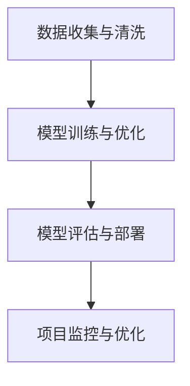

## 背景介绍

人工智能（Artificial Intelligence，AI）技术的迅猛发展为各种行业带来了巨大的变革和机遇。然而，人工智能项目的管理也面临着独特的挑战。为了让读者更好地了解AI项目管理的原理和实践，我们将从以下几个方面进行讲解：

## 核心概念与联系

在讨论AI项目管理之前，我们需要先明确一些基本概念。人工智能项目通常包括以下几个关键环节：

1. 数据收集与清洗：AI模型需要大量的数据作为训练数据。数据收集和清洗是构建高质量AI模型的第一步。
2. 模型训练与优化：通过对训练数据进行处理，AI模型可以学习到特定的规律并进行预测或决策。
3. 模型评估与部署：训练完成后，模型需要进行评估，以确保其准确性和稳定性。然后，将模型部署到生产环境中，提供实际应用。
4. 项目监控与优化：AI项目在运行过程中可能会遇到各种问题，需要进行监控和优化，以确保项目的顺利进行。

## 核心算法原理具体操作步骤

为了更好地理解AI项目管理，我们需要深入了解其核心算法原理。下面是一个典型的AI项目管理流程图：



## 数学模型和公式详细讲解举例说明

在讨论AI项目管理时，我们需要关注数学模型和公式，以确保我们的分析具有数学基础和可验证性。以下是一个简单的AI模型评估公式：

$$
Accuracy = \frac{TP + TN}{TP + TN + FP + FN}
$$

其中，TP表示真阳性，TN表示真阴性，FP表示假阳性，FN表示假阴性。

## 项目实践：代码实例和详细解释说明

为了帮助读者更好地理解AI项目管理，我们将提供一个实际的代码示例。以下是一个简化的Python代码，用于实现AI模型的训练和评估：

```python
import numpy as np
from sklearn.model_selection import train_test_split
from sklearn.metrics import accuracy_score

# 数据收集与清洗
data = ...
X_train, X_test, y_train, y_test = train_test_split(data, test_size=0.2)

# 模型训练与优化
model = ...
model.fit(X_train, y_train)

# 模型评估与部署
predictions = model.predict(X_test)
accuracy = accuracy_score(y_test, predictions)
print("Accuracy:", accuracy)
```

## 实际应用场景

AI项目管理的实际应用场景非常广泛，可以涉及到医疗诊断、金融风险控制、自动驾驶等多个领域。以下是一个实际应用场景的例子：

### 医疗诊断

在医疗诊断领域，AI可以帮助医生快速识别疾病并制定治疗方案。为了实现这一目标，医生需要收集大量的医疗数据并进行分析。以下是一个简化的AI项目管理流程图：


## 工具和资源推荐

为了更好地进行AI项目管理，我们需要使用一些工具和资源。以下是一些推荐的工具和资源：

1. 数据收集与清洗：Pandas、NumPy
2. 模型训练与优化：TensorFlow、PyTorch、Scikit-Learn
3. 模型评估与部署：TensorBoard、MLflow
4. 项目监控与优化：Jira、Trello

## 总结：未来发展趋势与挑战

AI项目管理的未来发展趋势和挑战非常复杂。随着AI技术的不断发展，AI项目将面临越来越多的创新和应用场景。因此，AI项目管理需要不断创新和优化，以应对这一挑战。

## 附录：常见问题与解答

在AI项目管理过程中，读者可能会遇到一些常见的问题。以下是一些常见问题的解答：

1. 如何选择合适的AI算法？选择合适的AI算法需要根据项目需求和数据特点进行综合考虑。可以参考相关文献和在线资源，了解不同算法的优缺点。
2. 如何评估AI模型的性能？AI模型的性能可以通过各种评估指标进行评估，如准确率、召回率、F1分数等。这些指标可以帮助我们了解模型的性能，并进行优化。
3. 如何确保AI模型的可解释性？为了确保AI模型的可解释性，我们可以使用一些可解释性技术，如LIME、SHAP等。这些技术可以帮助我们了解模型的决策过程，并提高模型的可解释性。