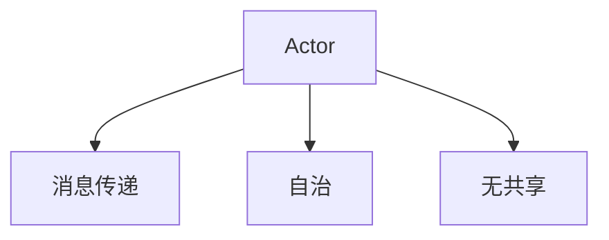

## 背景介绍

Actor Model（演员模型）是由Carl Hewitt于1973年提出的并发计算模型。它是一种基于对象的并发模型，允许程序员将程序分为多个独立的、自治的actor（演员）。每个actor都有自己的状态、行为和消息处理器，通过消息传递进行通信和协作。Actor Model在并发计算、分布式计算和人工智能等领域得到了广泛的应用。

## 核心概念与联系

Actor Model的核心概念包括以下几个方面：

1. **Actor**: 一个actor是并发计算中的基本单元，它具有唯一的身份标识符，拥有自己的状态和行为，通过消息来与其他actor进行通信。
2. **消息传递**: Actor之间的通信是通过消息传递进行的。一个actor可以向另一个actor发送消息，而接收方actor则可以选择如何处理这些消息。
3. **自治**: 每个actor都是自治的，它可以独立地执行自己的行为，并决定是否处理来自其他actor的消息。
4. **无共享**: Actor Model中的actor之间是无共享的，这意味着它们之间不能直接访问彼此的状态。相反，它们通过消息进行通信和协作。

Actor Model的核心概念与联系可以简单地用以下流程图表示：



## 核心算法原理具体操作步骤

Actor Model的核心算法原理可以分为以下几个步骤：

1. **创建actor**: 首先，需要创建actor，它可以通过调用actor创建函数来实现。每个actor都有自己的状态和行为。
2. **发送消息**: 当一个actor需要与其他actor进行通信时，它可以通过发送消息来实现。这可以通过调用actor发送消息函数来完成。
3. **处理消息**: 当接收到消息时，actor可以选择性地处理这些消息。处理消息可以通过实现actor的行为来完成。
4. **actor生命周期**: 每个actor都有自己的生命周期，它可以创建、发送消息、处理消息和终止等操作。

## 数学模型和公式详细讲解举例说明

Actor Model的数学模型通常涉及到状态转移、消息传递和actor之间的协作。以下是一个简单的数学模型示例：

1. **状态转移**: actor的状态可以通过状态转移矩阵来表示。每个状态转移表示actor在接收到特定消息后如何变化。
2. **消息传递**: actor之间的消息传递可以通过消息传递矩阵来表示。每个元素表示actor之间发送消息的概率。
3. **actor之间的协作**: actor之间的协作可以通过协作矩阵来表示。每个元素表示actor之间的协作关系。

## 项目实践：代码实例和详细解释说明

以下是一个简单的Actor Model的代码示例，使用Python的Akka库来实现：

```python
from akka.actor import Actor, ActorSystem, actor_method
from random import random

class ActorA(Actor):
    def __init__(self):
        super().__init__()

    @actor_method
    def receive(self, msg):
        print(f"ActorA received message: {msg}")
        if random() > 0.5:
            ActorB.send(self, "Hello from ActorA")

class ActorB(Actor):
    def __init__(self):
        super().__init__()

    @actor_method
    def receive(self, msg):
        print(f"ActorB received message: {msg}")

system = ActorSystem("my_system")
actor_a = ActorA()
actor_a.start()
actor_b = ActorB()
actor_b.start()

actor_a.send("Hello from ActorA", actor_b)
```

在这个例子中，我们定义了两个actor：ActorA和ActorB。ActorA向ActorB发送消息，并且ActorB接收到消息后会打印出来。

## 实际应用场景

Actor Model的实际应用场景包括：

1. **并发计算**: Actor Model可以用于实现高性能的并发计算系统，例如大数据处理、机器学习等。
2. **分布式系统**: Actor Model可以用于实现分布式系统，例如分布式文件系统、分布式数据库等。
3. **人工智能**: Actor Model可以用于实现人工智能系统，例如智能家居、智能城市等。

## 工具和资源推荐

以下是一些建议的工具和资源，帮助您更好地了解Actor Model：

1. **Akka**: Akka是一个开源的Java和Scala的Actor库，它提供了Actor Model的实现和工具。
2. **Clojure**: Clojure是一个基于Lisp的Java语言，它提供了Actor Model的实现和工具。
3. **Haskell**: Haskell是一个函数式编程语言，它提供了Actor Model的实现和工具。

## 总结：未来发展趋势与挑战

Actor Model在并发计算、分布式计算和人工智能等领域得到了广泛的应用，但它仍然面临着一些挑战：

1. **性能**: Actor Model的性能可能受到消息传递和actor调度器的影响，需要进一步优化。
2. **可扩展性**: Actor Model需要考虑分布式系统的可扩展性，需要进一步研究如何实现高效的actor调度器。
3. **安全性**: Actor Model需要考虑分布式系统的安全性，需要进一步研究如何实现安全的actor通信。

## 附录：常见问题与解答

以下是一些建议的常见问题和解答，帮助您更好地了解Actor Model：

1. **Q**: 什么是Actor Model？
A: Actor Model是一种基于对象的并发模型，它允许程序员将程序分为多个独立的、自治的actor。每个actor都有自己的状态、行为和消息处理器，通过消息传递进行通信和协作。
2. **Q**: Actor Model的主要优势是什么？
A: Actor Model的主要优势包括无共享、自治和消息传递，这些特性使得Actor Model能够实现高性能的并发计算和分布式系统。