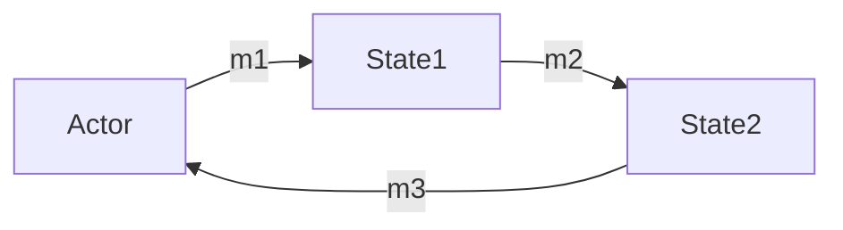
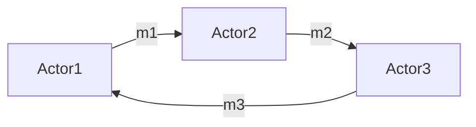
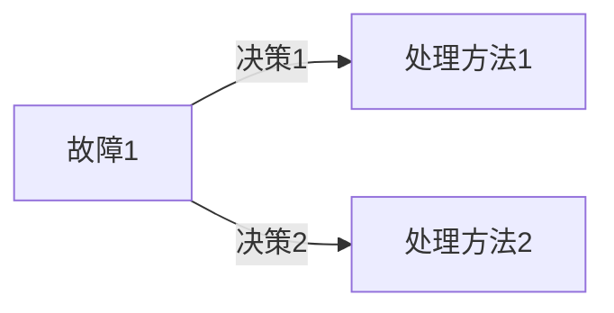

## 背景介绍
Akka 是一个用于创建高性能和可扩展分布式系统的开源框架。它的设计和实现都遵循了函数式编程的原则，使其成为一个非常强大和灵活的选择。Akka 使用 Actor 模型来表示系统中的对象，这些对象可以独立地运行，并且可以在分布式环境中进行通信。这种模式使得 Akka 可以在多个节点上进行并发处理，而不用担心同步问题。以下是 Akka 的一些核心概念和特点。
## 核心概念与联系
Akka 的核心概念有以下几个：

1. Actor：Actor 是 Akka 中的基本组成单位，它们可以独立地运行，并且可以通过消息进行通信。Actor 是无状态的，意味着它们的状态是由其接收到的消息来决定的。这使得 Actor 可以在分布式环境中进行并发处理，而不用担心同步问题。
2. Message：Message 是 Actor 之间进行通信的基本单位。它可以携带数据，也可以携带 Actor 之间的控制信息，例如创建或删除 Actor。
3. Actor System：Actor System 是 Akka 中的一个或多个 Actor 的集合，它可以在分布式环境中进行协同工作。Actor System 提供了一种方式来管理和协调 Actor。
4. Supervision：Supervision 是 Akka 中的一个重要概念，它指的是如何处理 Actor 之间的错误和故障。Akka 使用一种称为“监督策略”的机制来确定如何处理故障。

这些概念之间的联系是紧密的。Actor 是 Akka 的基本组成单位，而 Message 是 Actor 之间进行通信的方式。Actor System 是 Akka 中的 Actor 的集合，而 Supervision 是 Akka 中处理故障的机制。这些概念的联系使得 Akka 可以在分布式环境中进行高性能和可扩展的并发处理。
## 核心算法原理具体操作步骤
Akka 的核心算法原理是基于 Actor 模型的。下面是 Akka 的核心算法原理及其具体操作步骤：

1. Actor 的创建：首先，我们需要创建一个 Actor。创建 Actor 的过程很简单，只需要定义一个类，并实现一个接口。
```java
public class MyActor extends UntypedActor {
    @Override
    public void onReceive(Object message) throws Throwable {
        // TODO Auto-generated method stub
    }
}
```
1. Actor 之间的通信：Actor 之间的通信是通过发送 Message 来实现的。我们可以使用 Akka 的发送消息 API 来实现 Actor 之间的通信。例如，我们可以使用 `tell` 方法来发送消息。
```java
ActorRef actor = ...;
actor.tell(new MyMessage(), getSelf());
```
1. Actor 的调度：Akka 使用一种称为“调度策略”的机制来决定 Actor 之间的调度。调度策略决定了如何处理 Actor 之间的消息，以及如何处理 Actor 之间的故障。例如，我们可以使用 RoundRobinPool 调度策略来实现 Actor 之间的调度。
```java
ActorRef actor = ...;
Props props = Props.create(MyActor.class);
ActorSystem system = ActorSystem.create("system", props, new RoundRobinPool(5));
```
1. Actor 的故障处理：Akka 使用一种称为“监督策略”的机制来处理 Actor 之间的故障。监督策略决定了如何处理故障。例如，我们可以使用 OneForOneStrategy 来实现 Actor 之间的故障处理。
```java
ActorRef actor = ...;
Props props = Props.create(MyActor.class);
ActorSystem system = ActorSystem.create("system", props, new OneForOneStrategy(3) {
    @Override
    public DirectorStrategy decide() {
        // TODO Auto-generated method stub
    }
});
```
Akka 的核心算法原理及其具体操作步骤使得 Akka 可以在分布式环境中进行高性能和可扩展的并发处理。通过以上步骤，我们可以实现一个简单的 Akka 应用。
## 数学模型和公式详细讲解举例说明
Akka 的核心概念和原理可以用数学模型和公式来描述。以下是 Akka 的数学模型和公式详细讲解举例说明：

1. Actor 的状态转移：Actor 的状态可以用一个状态转移函数来表示。这个函数描述了 Actor 在接收到消息后如何变化。例如，我们可以使用一个状态转移图来表示 Actor 的状态转移。

1. Actor 之间的通信：Actor 之间的通信可以用一个图来表示。这个图描述了 Actor 之间的消息传递关系。例如，我们可以使用一个有向图来表示 Actor 之间的通信关系。

1. Actor 的故障处理：Actor 的故障处理可以用一个监督策略来表示。这个策略描述了如何处理故障。例如，我们可以使用一个决策树来表示监督策略。

通过数学模型和公式，我们可以更深入地理解 Akka 的核心概念和原理。
## 项目实践：代码实例和详细解释说明
下面是一个简单的 Akka 项目实践的代码实例及其详细解释说明。

1. 创建一个 Akka 项目：首先，我们需要创建一个 Akka 项目。在项目中，我们需要添加 Akka 的依赖。以下是一个简单的 Akka 项目的 pom.xml 文件。
```xml
<project xmlns="http://maven.apache.org/POM/4.0.0"
         xmlns:xsi="http://www.w3.org/2001/XMLSchema-instance"
         xsi:schemaLocation="http://maven.apache.org/POM/4.0.0
                             http://maven.apache.org/xsd/maven-4.0.0.xsd">
    <modelVersion>4.0.0</modelVersion>
    <groupId>com.example</groupId>
    <artifactId>akka-example</artifactId>
    <version>1.0.0-SNAPSHOT</version>

    <dependencies>
        <dependency>
            <groupId>com.typesafe.akka</groupId>
            <artifactId>akka-actor</artifactId>
            <version>2.6.17</version>
        </dependency>
    </dependencies>
</project>
```
1. 创建一个简单的 Akka 应用：接下来，我们需要创建一个简单的 Akka 应用。在项目中，我们创建了一个简单的 Akka 应用，包括一个 Actor 和一个 ActorSystem。
```java
import akka.actor.ActorRef;
import akka.actor.ActorSystem;
import akka.actor.Props;
import akka.actor.UntypedActor;

public class AkkaExample {
    public static void main(String[] args) {
        ActorSystem system = ActorSystem.create("system");
        ActorRef actor = system.actorOf(Props.create(MyActor.class));
        actor.tell("Hello, Akka!", ActorRef.noSender());
    }
}

public class MyActor extends UntypedActor {
    @Override
    public void onReceive(Object message) throws Throwable {
        if (message instanceof String) {
            System.out.println("Received message: " + message);
        } else {
            unhandled(message);
        }
    }
}
```
这个简单的 Akka 应用创建了一个 ActorSystem 和一个 Actor。ActorSystem 负责管理 Actor，Actor 负责处理接收到的消息。我们发送一个字符串消息到 Actor，它会在控制台打印这个消息。
## 实际应用场景
Akka 的实际应用场景有以下几个方面：

1. 分布式系统：Akka 可以在分布式系统中进行高性能和可扩展的并发处理。它的 Actor 模型使得 Actor 可以独立地运行，并且可以在分布式环境中进行通信。这使得 Akka 可以在分布式系统中进行高性能和可扩展的并发处理。
2. 高性能计算：Akka 可以在高性能计算中进行并发处理。它的 Actor 模型使得 Actor 可以独立地运行，并且可以在分布式环境中进行通信。这使得 Akka 可以在高性能计算中进行并发处理。
3. 实时数据处理：Akka 可以在实时数据处理中进行高性能和可扩展的并发处理。它的 Actor 模型使得 Actor 可以独立地运行，并且可以在分布式环境中进行通信。这使得 Akka 可以在实时数据处理中进行高性能和可扩展的并发处理。
## 工具和资源推荐
Akka 的相关工具和资源有以下几个方面：

1. 官方文档：Akka 的官方文档是学习 Akka 的最佳资源。官方文档详细介绍了 Akka 的核心概念和原理，提供了许多实例和代码示例。官方文档地址：[https://akka.io/docs/](https://akka.io/docs/)
2. 教程：Akka 有许多教程，例如，[https://www.tutorialspoint.com/akka/](https://www.tutorialspoint.com/akka/)，提供了许多实例和代码示例，帮助学习 Akka。
3. 社区论坛：Akka 的社区论坛是一个很好的交流和学习资源。社区论坛上有许多 Akka 的相关讨论和问题解答。社区论坛地址：[https://discuss.akka.io/](https://discuss.akka.io/)
4. GitHub：GitHub 上有许多 Akka 的开源项目，例如，[https://github.com/akka/akka](https://github.com/akka/akka)。这些开源项目可以帮助学习 Akka 的最佳实践和技巧。
## 总结：未来发展趋势与挑战
Akka 作为一个强大的分布式系统框架，在未来将会继续发展。未来，Akka 可能会发展出新的功能和特性，例如，支持更多的编程语言，支持更多的操作系统，支持更多的分布式系统架构。同时，Akka 也面临着一些挑战，例如，如何提高 Akka 的性能，如何提高 Akka 的易用性，如何提高 Akka 的可扩展性等。只有不断地创新和努力，Akka 才能在未来继续保持其领先的地位。
## 附录：常见问题与解答
以下是关于 Akka 的一些常见问题及其解答：

1. Q：Akka 是什么？
A：Akka 是一个用于创建高性能和可扩展分布式系统的开源框架。它的设计和实现都遵循了函数式编程的原则，使其成为一个非常强大和灵活的选择。
2. Q：Akka 的 Actor 模型是什么？
A：Actor 模型是一个对象模型，表示系统中的对象可以独立地运行，并且可以通过消息进行通信。这种模式使得 Akka 可以在多个节点上进行并发处理，而不用担心同步问题。
3. Q：Akka 的数学模型和公式是什么？
A：Akka 的数学模型和公式可以用来描述 Actor 的状态转移、Actor 之间的通信、Actor 的故障处理等。通过数学模型和公式，我们可以更深入地理解 Akka 的核心概念和原理。
4. Q：Akka 的实际应用场景有哪些？
A：Akka 的实际应用场景有分布式系统、高性能计算、实时数据处理等。它可以在这些领域进行高性能和可扩展的并发处理。
5. Q：Akka 的工具和资源有哪些？
A：Akka 的相关工具和资源有官方文档、教程、社区论坛、GitHub 等。这些资源可以帮助学习 Akka 的最佳实践和技巧。