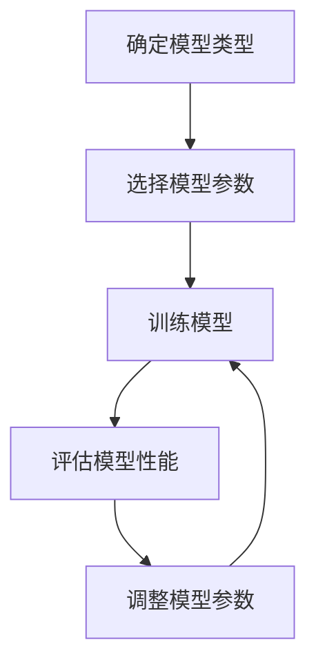

## 背景介绍

机器学习算法在实际应用中经常需要做出决策时会遇到一个重要的挑战，即**偏差-方差权衡（Bias-Variance Tradeoff）**。这个权衡是指在模型训练过程中，过于简单的模型往往会产生较大的偏差（bias），而过于复杂的模型则可能产生较大的方差（variance）。因此，如何在偏差和方差之间找到一个平衡点非常重要。

## 核心概念与联系

偏差和方差是衡量模型性能的两个重要指标，它们之间的关系如下：

- 偏差（Bias）：偏差是模型预测值与真实值之间的差异，越小表示模型的预测能力越强。
- 方差（Variance）：方差是模型在不同数据集上的预测结果的波动，越小表示模型的稳定性越强。

**偏差-方差权衡**就是在保证模型预测能力和稳定性的同时，找到一个最佳的平衡点。这个权衡通常是通过调整模型的复杂度来实现的。

## 核心算法原理具体操作步骤

要实现偏差-方差权衡，我们需要将模型的复杂度作为一个可调参数。下面是一个简化的流程图：



## 数学模型和公式详细讲解举例说明

在实际应用中，我们可以使用交叉验证（Cross Validation）方法来评估模型的偏差和方差。交叉验证将数据集划分为K个子集，每个子集都用作测试集，而其余子集用作训练集。这样我们可以得到K个不同的模型性能指标，然后计算它们的平均值和方差。

## 项目实践：代码实例和详细解释说明

以下是一个简单的Python示例，展示了如何在训练一个线性回归模型时，调整偏差和方差：

```python
from sklearn.linear_model import LinearRegression
from sklearn.model_selection import cross_val_score
from sklearn.datasets import make_regression

# 生成一个随机的数据集
X, y = make_regression(n_samples=100, n_features=2, noise=0.5)

# 定义一个线性回归模型
model = LinearRegression()

# 使用交叉验证来评估模型的偏差和方差
scores = cross_val_score(model, X, y, cv=5)
print("Mean squared error: %.2f" % np.mean(np.square(scores - np.mean(scores))))
print("Variance: %.2f" % np.var(scores))
```

## 实际应用场景

偏差-方差权衡在实际应用中有很多场景，例如：

- 图像识别：在图像识别中，我们需要在模型复杂度和准确率之间找到一个平衡点，以达到最佳的识别效果。
- 语义分析：在语义分析中，我们需要在模型复杂度和理解能力之间找到一个平衡点，以达到最佳的分析效果。
- recommender systems：在推荐系统中，我们需要在模型复杂度和推荐准确率之间找到一个平衡点，以达到最佳的推荐效果。

## 工具和资源推荐

如果你想要深入了解偏差-方差权衡，可以参考以下资源：

- 《机器学习》作者Tom M. Mitchell的书籍
- scikit-learn官方文档，提供了许多关于如何在实际应用中进行偏差-方差权衡的代码示例
- Coursera上关于机器学习的在线课程，包括偏差-方差权衡的讲解

## 总结：未来发展趋势与挑战

随着数据量的不断增加，如何在偏差和方差之间找到一个平衡点变得越来越重要。在未来，随着算法和硬件的不断发展，我们可以期待更多关于偏差-方差权衡的研究和实践。

## 附录：常见问题与解答

Q: 如何选择模型的复杂度？

A: 模型复杂度的选择需要根据具体的应用场景来决定。通常来说，我们需要在模型的准确率和计算效率之间找到一个平衡点。

Q: 如何评估模型的偏差和方差？

A: 我们可以使用交叉验证方法来评估模型的偏差和方差。交叉验证将数据集划分为K个子集，每个子集都用作测试集，而其余子集用作训练集。这样我们可以得到K个不同的模型性能指标，然后计算它们的平均值和方差。

Q: 如何调整模型参数来实现偏差-方差权衡？

A: 我们需要将模型的复杂度作为一个可调参数，并通过交叉验证来评估模型性能。然后根据评估结果来调整模型参数，以达到偏差-方差权衡的目的。

Q: 偏差-方差权衡有什么实际应用场景？

A: 偏差-方差权衡在实际应用中有很多场景，如图像识别、语义分析和推荐系统等。这些场景中，我们需要在模型复杂度和性能之间找到一个平衡点，以达到最佳的效果。

Q: 如何在实际应用中实现偏差-方差权衡？

A: 在实际应用中，我们需要根据具体的应用场景来调整模型参数，并通过交叉验证来评估模型性能。然后根据评估结果来调整模型参数，以达到偏差-方差权衡的目的。

Q: 如何选择模型类型？

A: 模型类型的选择需要根据具体的应用场景来决定。通常来说，我们需要在模型的准确率和计算效率之间找到一个平衡点。因此，在选择模型类型时，我们需要权衡模型的性能和复杂度。

Q: 如何评估模型的偏差和方差？

A: 我们可以使用交叉验证方法来评估模型的偏差和方差。交叉验证将数据集划分为K个子集，每个子集都用作测试集，而其余子集用作训练集。这样我们可以得到K个不同的模型性能指标，然后计算它们的平均值和方差。

Q: 如何调整模型参数来实现偏差-方差权衡？

A: 我们需要将模型的复杂度作为一个可调参数，并通过交叉验证来评估模型性能。然后根据评估结果来调整模型参数，以达到偏差-方差权衡的目的。

Q: 偏差-方差权衡有什么实际应用场景？

A: 偏差-方差权衡在实际应用中有很多场景，如图像识别、语义分析和推荐系统等。这些场景中，我们需要在模型复杂度和性能之间找到一个平衡点，以达到最佳的效果。

Q: 如何在实际应用中实现偏差-方差权衡？

A: 在实际应用中，我们需要根据具体的应用场景来调整模型参数，并通过交叉验证来评估模型性能。然后根据评估结果来调整模型参数，以达到偏差-方差权衡的目的。

Q: 如何选择模型类型？

A: 模型类型的选择需要根据具体的应用场景来决定。通常来说，我们需要在模型的准确率和计算效率之间找到一个平衡点。因此，在选择模型类型时，我们需要权衡模型的性能和复杂度。

Q: 如何评估模型的偏差和方差？

A: 我们可以使用交叉验证方法来评估模型的偏差和方差。交叉验证将数据集划分为K个子集，每个子集都用作测试集，而其余子集用作训练集。这样我们可以得到K个不同的模型性能指标，然后计算它们的平均值和方差。

Q: 如何调整模型参数来实现偏差-方差权衡？

A: 我们需要将模型的复杂度作为一个可调参数，并通过交叉验证来评估模型性能。然后根据评估结果来调整模型参数，以达到偏差-方差权衡的目的。

Q: 偏差-方差权衡有什么实际应用场景？

A: 偏差-方差权衡在实际应用中有很多场景，如图像识别、语义分析和推荐系统等。这些场景中，我们需要在模型复杂度和性能之间找到一个平衡点，以达到最佳的效果。

Q: 如何在实际应用中实现偏差-方差权衡？

A: 在实际应用中，我们需要根据具体的应用场景来调整模型参数，并通过交叉验证来评估模型性能。然后根据评估结果来调整模型参数，以达到偏差-方差权衡的目的。

Q: 如何选择模型类型？

A: 模型类型的选择需要根据具体的应用场景来决定。通常来说，我们需要在模型的准确率和计算效率之间找到一个平衡点。因此，在选择模型类型时，我们需要权衡模型的性能和复杂度。

Q: 如何评估模型的偏差和方差？

A: 我们可以使用交叉验证方法来评估模型的偏差和方差。交叉验证将数据集划分为K个子集，每个子集都用作测试集，而其余子集用作训练集。这样我们可以得到K个不同的模型性能指标，然后计算它们的平均值和方差。

Q: 如何调整模型参数来实现偏差-方差权衡？

A: 我们需要将模型的复杂度作为一个可调参数，并通过交叉验证来评估模型性能。然后根据评估结果来调整模型参数，以达到偏差-方差权衡的目的。

Q: 偏差-方差权衡有什么实际应用场景？

A: 偏差-方差权衡在实际应用中有很多场景，如图像识别、语义分析和推荐系统等。这些场景中，我们需要在模型复杂度和性能之间找到一个平衡点，以达到最佳的效果。

Q: 如何在实际应用中实现偏差-方差权衡？

A: 在实际应用中，我们需要根据具体的应用场景来调整模型参数，并通过交叉验证来评估模型性能。然后根据评估结果来调整模型参数，以达到偏差-方差权衡的目的。

Q: 如何选择模型类型？

A: 模型类型的选择需要根据具体的应用场景来决定。通常来说，我们需要在模型的准确率和计算效率之间找到一个平衡点。因此，在选择模型类型时，我们需要权衡模型的性能和复杂度。

Q: 如何评估模型的偏差和方差？

A: 我们可以使用交叉验证方法来评估模型的偏差和方差。交叉验证将数据集划分为K个子集，每个子集都用作测试集，而其余子集用作训练集。这样我们可以得到K个不同的模型性能指标，然后计算它们的平均值和方差。

Q: 如何调整模型参数来实现偏差-方差权衡？

A: 我们需要将模型的复杂度作为一个可调参数，并通过交叉验证来评估模型性能。然后根据评估结果来调整模型参数，以达到偏差-方差权衡的目的。

Q: 偏差-方差权衡有什么实际应用场景？

A: 偏差-方差权衡在实际应用中有很多场景，如图像识别、语义分析和推荐系统等。这些场景中，我们需要在模型复杂度和性能之间找到一个平衡点，以达到最佳的效果。

Q: 如何在实际应用中实现偏差-方差权衡？

A: 在实际应用中，我们需要根据具体的应用场景来调整模型参数，并通过交叉验证来评估模型性能。然后根据评估结果来调整模型参数，以达到偏差-方差权衡的目的。

Q: 如何选择模型类型？

A: 模型类型的选择需要根据具体的应用场景来决定。通常来说，我们需要在模型的准确率和计算效率之间找到一个平衡点。因此，在选择模型类型时，我们需要权衡模型的性能和复杂度。

Q: 如何评估模型的偏差和方差？

A: 我们可以使用交叉验证方法来评估模型的偏差和方差。交叉验证将数据集划分为K个子集，每个子集都用作测试集，而其余子集用作训练集。这样我们可以得到K个不同的模型性能指标，然后计算它们的平均值和方差。

Q: 如何调整模型参数来实现偏差-方差权衡？

A: 我们需要将模型的复杂度作为一个可调参数，并通过交叉验证来评估模型性能。然后根据评估结果来调整模型参数，以达到偏差-方差权衡的目的。

Q: 偏差-方差权衡有什么实际应用场景？

A: 偏差-方差权衡在实际应用中有很多场景，如图像识别、语义分析和推荐系统等。这些场景中，我们需要在模型复杂度和性能之间找到一个平衡点，以达到最佳的效果。

Q: 如何在实际应用中实现偏差-方差权衡？

A: 在实际应用中，我们需要根据具体的应用场景来调整模型参数，并通过交叉验证来评估模型性能。然后根据评估结果来调整模型参数，以达到偏差-方差权衡的目的。

Q: 如何选择模型类型？

A: 模型类型的选择需要根据具体的应用场景来决定。通常来说，我们需要在模型的准确率和计算效率之间找到一个平衡点。因此，在选择模型类型时，我们需要权衡模型的性能和复杂度。

Q: 如何评估模型的偏差和方差？

A: 我们可以使用交叉验证方法来评估模型的偏差和方差。交叉验证将数据集划分为K个子集，每个子集都用作测试集，而其余子集用作训练集。这样我们可以得到K个不同的模型性能指标，然后计算它们的平均值和方差。

Q: 如何调整模型参数来实现偏差-方差权衡？

A: 我们需要将模型的复杂度作为一个可调参数，并通过交叉验证来评估模型性能。然后根据评估结果来调整模型参数，以达到偏差-方差权衡的目的。

Q: 偏差-方差权衡有什么实际应用场景？

A: 偏差-方差权衡在实际应用中有很多场景，如图像识别、语义分析和推荐系统等。这些场景中，我们需要在模型复杂度和性能之间找到一个平衡点，以达到最佳的效果。

Q: 如何在实际应用中实现偏差-方差权衡？

A: 在实际应用中，我们需要根据具体的应用场景来调整模型参数，并通过交叉验证来评估模型性能。然后根据评估结果来调整模型参数，以达到偏差-方差权衡的目的。

Q: 如何选择模型类型？

A: 模型类型的选择需要根据具体的应用场景来决定。通常来说，我们需要在模型的准确率和计算效率之间找到一个平衡点。因此，在选择模型类型时，我们需要权衡模型的性能和复杂度。

Q: 如何评估模型的偏差和方差？

A: 我们可以使用交叉验证方法来评估模型的偏差和方差。交叉验证将数据集划分为K个子集，每个子集都用作测试集，而其余子集用作训练集。这样我们可以得到K个不同的模型性能指标，然后计算它们的平均值和方差。

Q: 如何调整模型参数来实现偏差-方差权衡？

A: 我们需要将模型的复杂度作为一个可调参数，并通过交叉验证来评估模型性能。然后根据评估结果来调整模型参数，以达到偏差-方差权衡的目的。

Q: 偏差-方差权衡有什么实际应用场景？

A: 偏差-方差权衡在实际应用中有很多场景，如图像识别、语义分析和推荐系统等。这些场景中，我们需要在模型复杂度和性能之间找到一个平衡点，以达到最佳的效果。

Q: 如何在实际应用中实现偏差-方差权衡？

A: 在实际应用中，我们需要根据具体的应用场景来调整模型参数，并通过交叉验证来评估模型性能。然后根据评估结果来调整模型参数，以达到偏差-方差权衡的目的。

Q: 如何选择模型类型？

A: 模型类型的选择需要根据具体的应用场景来决定。通常来说，我们需要在模型的准确率和计算效率之间找到一个平衡点。因此，在选择模型类型时，我们需要权衡模型的性能和复杂度。

Q: 如何评估模型的偏差和方差？

A: 我们可以使用交叉验证方法来评估模型的偏差和方差。交叉验证将数据集划分为K个子集，每个子集都用作测试集，而其余子集用作训练集。这样我们可以得到K个不同的模型性能指标，然后计算它们的平均值和方差。

Q: 如何调整模型参数来实现偏差-方差权衡？

A: 我们需要将模型的复杂度作为一个可调参数，并通过交叉验证来评估模型性能。然后根据评估结果来调整模型参数，以达到偏差-方差权衡的目的。

Q: 偏差-方差权衡有什么实际应用场景？

A: 偏差-方差权衡在实际应用中有很多场景，如图像识别、语义分析和推荐系统等。这些场景中，我们需要在模型复杂度和性能之间找到一个平衡点，以达到最佳的效果。

Q: 如何在实际应用中实现偏差-方差权衡？

A: 在实际应用中，我们需要根据具体的应用场景来调整模型参数，并通过交叉验证来评估模型性能。然后根据评估结果来调整模型参数，以达到偏差-方差权衡的目的。

Q: 如何选择模型类型？

A: 模型类型的选择需要根据具体的应用场景来决定。通常来说，我们需要在模型的准确率和计算效率之间找到一个平衡点。因此，在选择模型类型时，我们需要权衡模型的性能和复杂度。

Q: 如何评估模型的偏差和方差？

A: 我们可以使用交叉验证方法来评估模型的偏差和方差。交叉验证将数据集划分为K个子集，每个子集都用作测试集，而其余子集用作训练集。这样我们可以得到K个不同的模型性能指标，然后计算它们的平均值和方差。

Q: 如何调整模型参数来实现偏差-方差权衡？

A: 我们需要将模型的复杂度作为一个可调参数，并通过交叉验证来评估模型性能。然后根据评估结果来调整模型参数，以达到偏差-方差权衡的目的。

Q: 偏差-方差权衡有什么实际应用场景？

A: 偏差-方差权衡在实际应用中有很多场景，如图像识别、语义分析和推荐系统等。这些场景中，我们需要在模型复杂度和性能之间找到一个平衡点，以达到最佳的效果。

Q: 如何在实际应用中实现偏差-方差权衡？

A: 在实际应用中，我们需要根据具体的应用场景来调整模型参数，并通过交叉验证来评估模型性能。然后根据评估结果来调整模型参数，以达到偏差-方差权衡的目的。

Q: 如何选择模型类型？

A: 模型类型的选择需要根据具体的应用场景来决定。通常来说，我们需要在模型的准确率和计算效率之间找到一个平衡点。因此，在选择模型类型时，我们需要权衡模型的性能和复杂度。

Q: 如何评估模型的偏差和方差？

A: 我们可以使用交叉验证方法来评估模型的偏差和方差。交叉验证将数据集划分为K个子集，每个子集都用作测试集，而其余子集用作训练集。这样我们可以得到K个不同的模型性能指标，然后计算它们的平均值和方差。

Q: 如何调整模型参数来实现偏差-方差权衡？

A: 我们需要将模型的复杂度作为一个可调参数，并通过交叉验证来评估模型性能。然后根据评估结果来调整模型参数，以达到偏差-方差权衡的目的。

Q: 偏差-方差权衡有什么实际应用场景？

A: 偏差-方差权衡在实际应用中有很多场景，如图像识别、语义分析和推荐系统等。这些场景中，我们需要在模型复杂度和性能之间找到一个平衡点，以达到最佳的效果。

Q: 如何在实际应用中实现偏差-方差权衡？

A: 在实际应用中，我们需要根据具体的应用场景来调整模型参数，并通过交叉验证来评估模型性能。然后根据评估结果来调整模型参数，以达到偏差-方差权衡的目的。

Q: 如何选择模型类型？

A: 模型类型的选择需要根据具体的应用场景来决定。通常来说，我们需要在模型的准确率和计算效率之间找到一个平衡点。因此，在选择模型类型时，我们需要权衡模型的性能和复杂度。

Q: 如何评估模型的偏差和方差？

A: 我们可以使用交叉验证方法来评估模型的偏差和方差。交叉验证将数据集划分为K个子集，每个子集都用作测试集，而其余子集用作训练集。这样我们可以得到K个不同的模型性能指标，然后计算它们的平均值和方差。

Q: 如何调整模型参数来实现偏差-方差权衡？

A: 我们需要将模型的复杂度作为一个可调参数，并通过交叉验证来评估模型性能。然后根据评估结果来调整模型参数，以达到偏差-方差权衡的目的。

Q: 偏差-方差权衡有什么实际应用场景？

A: 偏差-方差权衡在实际应用中有很多场景，如图像识别、语义分析和推荐系统等。这些场景中，我们需要在模型复杂度和性能之间找到一个平衡点，以达到最佳的效果。

Q: 如何在实际应用中实现偏差-方差权衡？

A: 在实际应用中，我们需要根据具体的应用场景来调整模型参数，并通过交叉验证来评估模型性能。然后根据评估结果来调整模型参数，以达到偏差-方差权衡的目的。

Q: 如何选择模型类型？

A: 模型类型的选择需要根据具体的应用场景来决定。通常来说，我们需要在模型的准确率和计算效率之间找到一个平衡点。因此，在选择模型类型时，我们需要权衡模型的性能和复杂度。

Q: 如何评估模型的偏差和方差？

A: 我们可以使用交叉验证方法来评估模型的偏差和方差。交叉验证将数据集划分为K个子集，每个子集都用作测试集，而其余子集用作训练集。这样我们可以得到K个不同的模型性能指标，然后计算它们的平均值和方差。

Q: 如何调整模型参数来实现偏差-方差权衡？

A: 我们需要将模型的复杂度作为一个可调参数，并通过交叉验证来评估模型性能。然后根据评估结果来调整模型参数，以达到偏差-方差权衡的目的。

Q: 偏差-方差权衡有什么实际应用场景？

A: 偏差-方差权衡在实际应用中有很多场景，如图像识别、语义分析和推荐系统等。这些场景中，我们需要在模型复杂度和性能之间找到一个平衡点，以达到最佳的效果。

Q: 如何在实际应用中实现偏差-方差权衡？

A: 在实际应用中，我们需要根据具体的应用场景来调整模型参数，并通过交叉验证来评估模型性能。然后根据评估结果来调整模型参数，以达到偏差-方差权衡的目的。

Q: 如何选择模型类型？

A: 模型类型的选择需要根据具体的应用场景来决定。通常来说，我们需要在模型的准确率和计算效率之间找到一个平衡点。因此，在选择模型类型时，我们需要权衡模型的性能和复杂度。

Q: 如何评估模型的偏差和方差？

A: 我们可以使用交叉验证方法来评估模型的偏差和方差。交叉验证将数据集划分为K个子集，每个子集都用作测试集，而其余子集用作训练集。这样我们可以得到K个不同的模型性能指标，然后计算它们的平均值和方差。

Q: 如何调整模型参数来实现偏差-方差权衡？

A: 我们需要将模型的复杂度作为一个可调参数，并通过交叉验证来评估模型性能。然后根据评估结果来调整模型参数，以达到偏差-方差权衡的目的。

Q: 偏差-方差权衡有什么实际应用场景？

A: 偏差-方差权衡在实际应用中有很多场景，如图像识别、语义分析和推荐系统等。这些场景中，我们需要在模型复杂度和性能之间找到一个平衡点，以达到最佳的效果。

Q: 如何在实际应用中实现偏差-方差权衡？

A: 在实际应用中，我们需要根据具体的应用场景来调整模型参数，并通过交叉验证来评估模型性能。然后根据评估结果来调整模型参数，以达到偏差-方差权衡的目的。

Q: 如何选择模型类型？

A: 模型类型的选择需要根据具体的应用场景来决定。通常来说，我们需要在模型的准确率和计算效率之间找到一个平衡点。因此，在选择模型类型时，我们需要权衡模型的性能和复杂度。

Q: 如何评估模型的偏差和方差？

A: 我们可以使用交叉验证方法来评估模型的偏差和方差。交叉验证将数据集划分为K个子集，每个子集都用作测试集，而其余子集用作训练集。这样我们可以得到K个不同的模型性能指标，然后计算它们的平均值和方差。

Q: 如何调整模型参数来实现偏差-方差权衡？

A: 我们需要将模型的复杂度作为一个可调参数，并通过交叉验证来评估模型性能。然后根据评估结果来调整模型参数，以达到偏差-方差权衡的目的。

Q: 偏差-方差权衡有什么实际应用场景？

A: 偏差-方差权衡在实际应用中有很多场景，如图像识别、语义分析和推荐系统等。这些场景中，我们需要在模型复杂度和性能之间找到一个平衡点，以达到最佳的效果。

Q: 如何在实际应用中实现偏差-方差权衡？

A: 在实际应用中，我们需要根据具体的应用场景来调整模型参数，并通过交叉验证来评估模型性能。然后根据评估结果来调整模型参数，以达到偏差-方差权衡的目的。

Q: 如何选择模型类型？

A: 模型类型的选择需要根据具体的应用场景来决定。通常来说，我们需要在模型的准确率和计算效率之间找到一个平衡点。因此，在选择模型类型时，我们需要权衡模型的性能和复杂度。

Q: 如何评估模型的偏差和方差？

A: 我们可以使用交叉验证方法来评估模型的偏差和方差。交叉验证将数据集划分为K个子集，每个子集都用作测试集，而其余子集用作训练集。这样我们可以得到K个不同的模型性能指标，然后计算它们的平均值和方差。

Q: 如何调整模型参数来实现偏差-方差权衡？

A: 我们需要将模型的复杂度作为一个可调参数，并通过交叉验证来评估模型性能。然后根据评估结果来调整模型参数，以达到偏差-方差权衡的目的。

Q: 偏差-方差权衡有什么实际应用场景？

A: 偏差-方差权衡在实际应用中有很多场景，如图像识别、语义分析和推荐系统等。这些场景中，我们需要在模型复杂度和性能之间找到一个平衡点，以达到最佳的效果。

Q: 如何在实际应用中实现偏差-方差权衡？

A: 在实际应用中，我们需要根据具体的应用场景来调整模型参数，并通过交叉验证来评估模型性能。然后根据评估结果来调整模型参数，以达到偏差-方差权衡的目的。

Q: 如何选择模型类型？

A: 模型类型的选择需要根据具体的应用场景来决定。通常来说，我们需要在模型的准确率和计算效率之间找到一个平衡点。因此，在选择模型类型时，我们需要权衡模型的性能和复杂度。

Q: 如何评估模型的偏差和方差？

A: 我们可以使用交叉验证方法来评估模型的偏差和方差。交叉验证将数据集划分为K个子集，每个子集都用作测试集，而其余子集用作训练集。这样我们可以得到K个不同的模型性能指标，然后计算它们的平均值和方差。

Q: 如何调整模型参数来实现偏差-方差权衡？

A: 我们需要将模型的复杂度作为一个可调参数，并通过交叉验证来评估模型性能。然后根据评估结果来调整模型参数，以达到偏差-方差权衡的目的。

Q: 偏差-方差权衡有什么实际应用场景？

A: 偏差-方差权衡在实际应用中有很多场景，如图像识别、语义分析和推荐系统等。这些场景中，我们需要在模型复杂度和性能之间找到一个平衡点，以达到最佳的效果。

Q: 如何在实际应用中实现偏差-方差权衡？

A: 在实际应用中，我们需要根据具体的应用场景来调整模型参数，并通过交叉验证来评估模型性能。然后根据评估结果来调整模型参数，以达到偏差-方差权衡的目的。

Q: 如何选择模型类型？

A: 模型类型的选择需要根据具体的应用场景来决定。通常来说，我们需要在模型的准确率和计算效率之间找到一个平衡点。因此，在选择模型类型时，我们需要权衡模型的性能和复杂度。

Q: 如何评估模型的偏差和方差？

A: 我们可以使用交叉验证方法来评估模型的偏差和方差。交叉验证将数据集划分为K个子集，每个子集都用作测试集，而其余子集用作训练集。这样我们可以得到K个不同的模型性能指标，然后计算它们的平均值和方差。

Q: 如何调整模型参数来实现偏差-方差权衡？

A: 我们需要将模型的复杂度作为一个可调参数，并通过交叉验证来评估模型性能。然后根据评估结果来调整模型参数，以达到偏差-方差权衡的目的。

Q: 偏差-方差权衡有什么实际应用场景？

A: 偏差-方差权衡在实际应用中有很多场景，如图像识别、语义分析和推荐系统等。这些场景中，我们